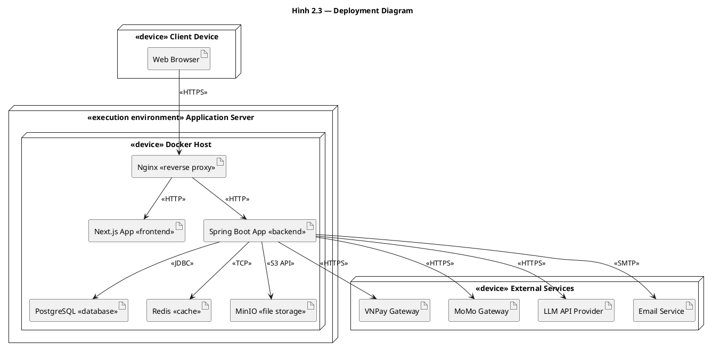
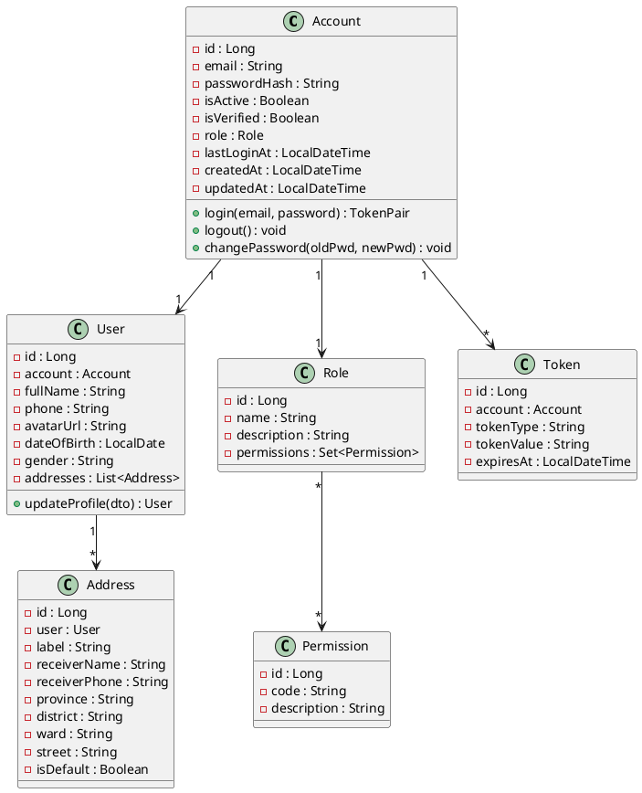
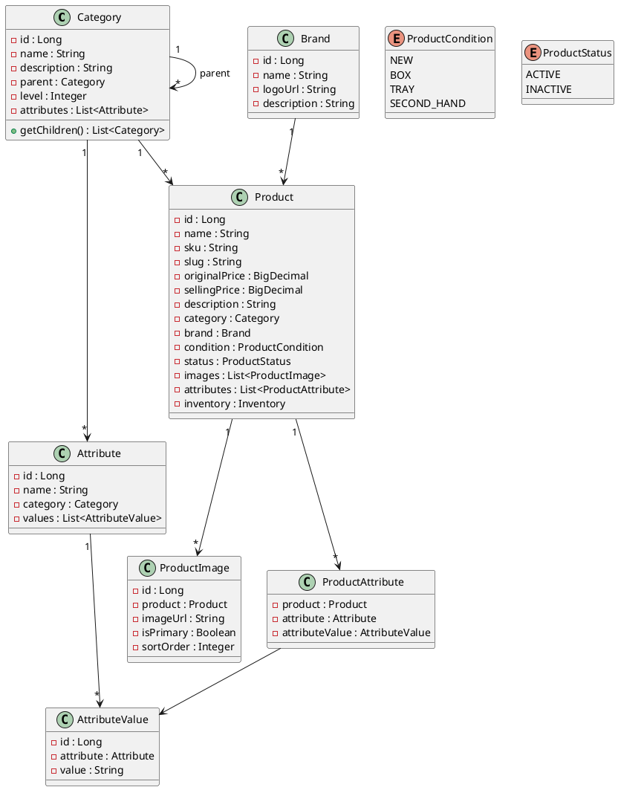
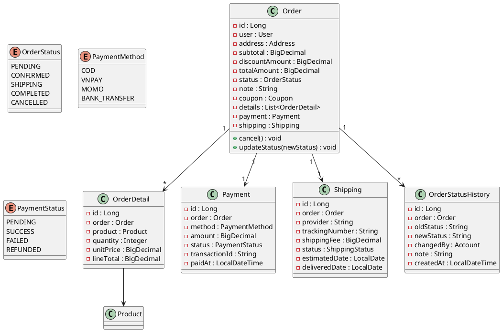

# TÀI LIỆU MÔ TẢ THIẾT KẾ PHẦN MỀM
## (Software Design Description – SDD)

**Dự án:** Hệ thống Website Thương mại Điện tử Phân phối Linh kiện Máy tính  
**Phiên bản:** 1.1  
**Ngày tạo:** 2026-03-25  
**Cập nhật lần cuối:** 2026-04-12  
**Trạng thái:** Hoàn thiện (Final Draft)  

---

## Lịch sử thay đổi tài liệu

| Phiên bản | Ngày | Tác giả | Mô tả thay đổi |
|:----------|:-----|:--------|:----------------|
| 1.0 | 2026-03-25 | — | Tạo mới tài liệu |
| 1.1 | 2026-04-12 | — | Bổ sung Component Diagram, Deployment Diagram, ERD, Test Cases |

---

## Mục lục

1. [Giới thiệu](#1-giới-thiệu)
   - 1.1 [Mục đích tài liệu](#11-mục-đích-tài-liệu)
   - 1.2 [Phạm vi hệ thống](#12-phạm-vi-hệ-thống)
   - 1.3 [Thuật ngữ & Viết tắt](#13-thuật-ngữ--viết-tắt)
   - 1.4 [Tài liệu tham chiếu](#14-tài-liệu-tham-chiếu)
2. [Kiến trúc tổng thể (Architectural Design)](#2-kiến-trúc-tổng-thể-architectural-design)
   - 2.1 [Lựa chọn kiến trúc](#21-lựa-chọn-kiến-trúc)
   - 2.2 [Component / Package Diagram](#22-component--package-diagram)
   - 2.3 [Deployment Diagram](#23-deployment-diagram)
3. [Thiết kế chi tiết (Detailed Design)](#3-thiết-kế-chi-tiết-detailed-design)
   - 3.1 [Biểu đồ lớp chi tiết (Detailed Class Diagram)](#31-biểu-đồ-lớp-chi-tiết-detailed-class-diagram)
   - 3.2 [Biểu đồ tuần tự chi tiết (Detailed Sequence Diagram)](#32-biểu-đồ-tuần-tự-chi-tiết-detailed-sequence-diagram)
   - 3.3 [Sơ đồ quan hệ thực thể (ERD)](#33-sơ-đồ-quan-hệ-thực-thể-erd)
   - 3.4 [Test Case](#34-test-case)

---

## Danh mục hình ảnh & biểu đồ

| STT | Mã hình | Tên biểu đồ | Loại | Phần |
|:----|:--------|:-------------|:-----|:-----|
| 1 | Hình 2.1 | Sơ đồ kiến trúc tổng quan (High-Level Architecture) | Architecture | 2.1 |
| 2 | Hình 2.2 | Component / Package Diagram | UML Component | 2.2 |
| 3 | Hình 2.3 | Deployment Diagram | UML Deployment | 2.3 |
| 4 | Hình 3.1 | Class Diagram — Module Authentication & Authorization | UML Class | 3.1.1 |
| 5 | Hình 3.2 | Class Diagram — Module Product Catalog | UML Class | 3.1.2 |
| 6 | Hình 3.3 | Class Diagram — Module Order & Payment | UML Class | 3.1.3 |
| 7 | Hình 3.4 | Sequence Diagram — Đăng ký tài khoản | UML Sequence | 3.2.1 |
| 8 | Hình 3.5 | Sequence Diagram — Đăng nhập & Merge giỏ hàng | UML Sequence | 3.2.2 |
| 9 | Hình 3.6 | Sequence Diagram — Đăng xuất & Refresh Token | UML Sequence | 3.2.3 |
| 10 | Hình 3.7 | Sequence Diagram — Thay đổi mật khẩu | UML Sequence | 3.2.4 |
| 11 | Hình 3.8 | Sequence Diagram — Quên & Thiết lập lại mật khẩu | UML Sequence | 3.2.5 |
| 12 | Hình 3.9 | Sequence Diagram — Cập nhật thông tin cá nhân | UML Sequence | 3.2.6 |
| 13 | Hình 3.10 | Sequence Diagram — Duyệt, Tìm kiếm & Lọc sản phẩm | UML Sequence | 3.2.7 |
| 14 | Hình 3.11 | Sequence Diagram — Xem chi tiết sản phẩm | UML Sequence | 3.2.8 |
| 15 | Hình 3.12 | Sequence Diagram — Quản lý giỏ hàng (Guest & Customer) | UML Sequence | 3.2.9 |
| 16 | Hình 3.13 | Sequence Diagram — Checkout & Tạo đơn hàng | UML Sequence | 3.2.10 |
| 17 | Hình 3.14 | Sequence Diagram — Thanh toán Online Callback | UML Sequence | 3.2.11 |
| 18 | Hình 3.15 | Sequence Diagram — Xem lịch sử & Chi tiết đơn hàng | UML Sequence | 3.2.12 |
| 19 | Hình 3.16 | Sequence Diagram — Hủy đơn hàng | UML Sequence | 3.2.13 |
| 20 | Hình 3.17 | Sequence Diagram — Đổi trả & Hoàn tiền | UML Sequence | 3.2.14 |
| 21 | Hình 3.18 | Sequence Diagram — Gửi yêu cầu bảo hành | UML Sequence | 3.2.15 |
| 22 | Hình 3.19 | Sequence Diagram — Đánh giá sản phẩm | UML Sequence | 3.2.16 |
| 23 | Hình 3.20 | Sequence Diagram — Quản lý Wishlist | UML Sequence | 3.2.17 |
| 24 | Hình 3.21 | Sequence Diagram — Build PC + Kiểm tra tương thích AI | UML Sequence | 3.2.18 |
| 25 | Hình 3.22 | Sequence Diagram — Admin quản lý sản phẩm | UML Sequence | 3.2.19 |
| 26 | Hình 3.23 | Sequence Diagram — Admin quản lý danh mục | UML Sequence | 3.2.20 |
| 27 | Hình 3.24 | Sequence Diagram — Admin quản lý tồn kho | UML Sequence | 3.2.21 |
| 28 | Hình 3.25 | Sequence Diagram — Admin cập nhật trạng thái đơn hàng | UML Sequence | 3.2.22 |
| 29 | Hình 3.26 | Sequence Diagram — Admin quản lý người dùng | UML Sequence | 3.2.23 |
| 30 | Hình 3.27 | Sequence Diagram — Admin quản lý mã giảm giá | UML Sequence | 3.2.24 |
| 31 | Hình 3.28 | Sequence Diagram — Gửi thông báo | UML Sequence | 3.2.25 |
| 32 | Hình 3.29 | ERD — Nhóm Phân quyền (Auth & User) | ER Diagram | 3.3.1 |
| 33 | Hình 3.30 | ERD — Nhóm Sản phẩm (Product Catalog) | ER Diagram | 3.3.2 |
| 34 | Hình 3.31 | ERD — Nhóm Mua sắm & Đơn hàng (Shopping & Order) | ER Diagram | 3.3.3 |
| 35 | Hình 3.32 | ERD — Nhóm Tương tác & Bảo hành (Interaction & Warranty) | ER Diagram | 3.3.4 |
| 36 | Hình 3.33 | ERD — Nhóm Thông báo (Notification) | ER Diagram | 3.3.5 |

---

## 1 Giới thiệu

### 1.1 Mục đích tài liệu

Tài liệu thiết kế phần mềm (SDD) này mô tả kiến trúc, thiết kế chi tiết và các quyết định kỹ thuật cho **Hệ thống Website Thương mại Điện tử Phân phối Linh kiện Máy tính, PC Lắp ráp và Thiết bị Công nghệ**. Tài liệu được xây dựng dựa trên tài liệu phân tích yêu cầu (SRS) đã được phê duyệt, nhằm cung cấp cái nhìn tổng quan và chi tiết về cách hệ thống sẽ được triển khai.

**Đối tượng đọc:** Đội ngũ phát triển (Developer), Kiến trúc sư phần mềm (Architect), Quản lý dự án (PM), Đội ngũ kiểm thử (QA/QC), và các bên liên quan kỹ thuật.

### 1.2 Phạm vi hệ thống

Hệ thống bao gồm các module chức năng chính sau:

| STT | Module | Mô tả ngắn |
|:----|:-------|:------------|
| M01 | Xác thực & Phân quyền | Đăng ký, Đăng nhập, RBAC (Role-Based Access Control) |
| M02 | Quản lý Sản phẩm | CRUD Product, Category, Brand, Attribute, Product\_Image |
| M03 | Trải nghiệm Mua sắm | Tìm kiếm/Lọc, Giỏ hàng (Guest + Customer), Wishlist |
| M04 | Đơn hàng & Thanh toán | Checkout, Payment (COD/VNPay/MoMo/CK), Shipping |
| M05 | Xây dựng Cấu hình PC | Build PC, AI (LLM) kiểm tra tương thích |
| M06 | Quản lý Kho hàng | Inventory, Inventory\_Log, Supplier |
| M07 | Khuyến mãi | Coupon, Coupon\_Usage |
| M08 | Tương tác Người dùng | Review, Review\_Image |
| M09 | Bảo hành & Đổi trả | Warranty\_Policy, Warranty\_Ticket, Return/Refund |
| M10 | Quản trị Hệ thống | Quản lý tài khoản, Thống kê doanh thu |

### 1.3 Thuật ngữ & Viết tắt

| Thuật ngữ | Định nghĩa |
|:----------|:-----------|
| SDD | Software Design Document — Tài liệu thiết kế phần mềm |
| SRS | Software Requirements Specification — Đặc tả yêu cầu phần mềm |
| RBAC | Role-Based Access Control — Phân quyền dựa trên vai trò |
| API | Application Programming Interface — Giao diện lập trình ứng dụng |
| REST | Representational State Transfer — Kiến trúc API phổ biến |
| JWT | JSON Web Token — Chuẩn token xác thực |
| LLM | Large Language Model — Mô hình ngôn ngữ lớn (AI) |
| CRUD | Create, Read, Update, Delete — Các thao tác cơ bản |
| SKU | Stock Keeping Unit — Mã quản lý kho |
| COD | Cash On Delivery — Thanh toán khi nhận hàng |
| ER / ERD | Entity-Relationship (Diagram) — Sơ đồ quan hệ thực thể |
| DTO | Data Transfer Object — Đối tượng truyền dữ liệu |
| UML | Unified Modeling Language — Ngôn ngữ mô hình hóa |
| MVC | Model-View-Controller — Mẫu kiến trúc phân tách trách nhiệm |

### 1.4 Tài liệu tham chiếu

| Mã tài liệu | Tên tài liệu | Phiên bản |
|:-------------|:--------------|:----------|
| SRS-v1.0 | Tài liệu Phân tích Yêu cầu (requirement\_analysis.md) | 1.0 |
| IEEE 1016-2009 | IEEE Standard for Information Technology — Software Design Descriptions | — |
| UML-diagrams | The Unified Modeling Language, https://www.uml-diagrams.org/ | — |
| VP-Component | What is Component Diagram, https://www.visual-paradigm.com/guide/uml-unified-modeling-language/what-is-component-diagram/ | — |
| VP-Deployment | What is Deployment Diagram, https://www.visual-paradigm.com/guide/uml-unified-modeling-language/what-is-deployment-diagram/ | — |

---

## 2 Kiến trúc tổng thể (Architectural Design)

### 2.1 Lựa chọn kiến trúc

Hệ thống được thiết kế theo kiến trúc **Monolithic phân lớp (Layered Monolithic Architecture)**, tuân theo mô hình **MVC mở rộng (Model-View-Controller)** áp dụng vào bối cảnh ứng dụng web hiện đại.

#### Ánh xạ mô hình MVC

| Thành phần MVC | Ánh xạ trong hệ thống | Công nghệ |
|:---------------|:-----------------------|:----------|
| **View** | Frontend — Giao diện người dùng, hiển thị dữ liệu, tương tác | Next.js (App Router) + TypeScript |
| **Controller** | Backend — Nhận request, điều phối logic, trả response (REST API) | Spring Boot REST Controllers |
| **Model** | Backend — Entity/ORM + Database, xử lý business logic | Spring Data JPA + PostgreSQL |

Backend được tách thêm thành các tầng nội bộ (Controller → Service → Repository) theo nguyên tắc **Separation of Concerns**, giúp code dễ bảo trì và test hơn so với MVC truyền thống.

#### Lý do lựa chọn

| Tiêu chí | Layered Monolith (đã chọn) | Microservices | Serverless |
|:---------|:---------------------------|:--------------|:-----------|
| Độ phức tạp vận hành | Thấp — 1 backend duy nhất | Cao — nhiều service, cần orchestration | Trung bình — phụ thuộc cloud vendor |
| Phù hợp team nhỏ | Rất phù hợp | Không phù hợp | Phù hợp nhưng hạn chế |
| Chi phí infrastructure | Thấp | Cao | Biến động |
| Khả năng mở rộng | Ngang (stateless) + tách module sau | Tốt nhất | Tự động |
| Tốc độ phát triển ban đầu | Nhanh | Chậm (setup overhead) | Trung bình |
| Debug & Testing | Dễ | Khó (distributed tracing) | Khó (cold start, vendor lock-in) |

**Kết luận:** Với quy mô đội ngũ nhỏ/vừa và giai đoạn MVP, kiến trúc Layered Monolith giúp giảm complexity vận hành, vẫn đảm bảo tính module hóa, và dễ dàng migrate sang Microservices trong tương lai nhờ thiết kế module rõ ràng.

#### Sơ đồ kiến trúc tổng quan

> **Hình 2.1** — Sơ đồ kiến trúc tổng quan

```
┌──────────────────────────────────────────────────────────────────┐
│                     CLIENT LAYER (View — MVC)                     │
│  ┌─────────────────────┐     ┌──────────────────────────────┐   │
│  │  Customer Web App   │     │  Admin CMS Web App           │   │
│  │  (Next.js App Router)│     │  (Next.js App Router)        │   │
│  └────────┬────────────┘     └──────────────┬───────────────┘   │
│           │            HTTPS / REST API       │                  │
└───────────┼──────────────────────────────────┼──────────────────┘
            │                                  │
┌───────────┼──────────────────────────────────┼──────────────────┐
│           ▼          API GATEWAY              ▼                  │
│  ┌──────────────────────────────────────────────────────────┐   │
│  │  Nginx — Routing, Rate Limiting, CORS, SSL Termination   │   │
│  └──────────────────────┬───────────────────────────────────┘   │
└─────────────────────────┼──────────────────────────────────────┘
                          │
┌─────────────────────────┼──────────────────────────────────────┐
│                         ▼                                       │
│         APPLICATION LAYER (Controller + Service — MVC)           │
│  ┌──────────────────────────────────────────────────────────┐   │
│  │  Spring Boot Backend                                      │   │
│  │  ┌──────────┐ ┌──────────┐ ┌──────────┐ ┌──────────┐   │   │
│  │  │Controller│ │Controller│ │Controller│ │Controller│   │   │
│  │  │  Auth    │ │ Product  │ │  Order   │ │ Inventory│   │   │
│  │  └────┬─────┘ └────┬─────┘ └────┬─────┘ └────┬─────┘   │   │
│  │  ┌────┴─────────────┴────────────┴─────────────┴─────┐   │   │
│  │  │              SERVICE LAYER (Business Logic)       │   │   │
│  │  └────────────────────────┬──────────────────────────┘   │   │
│  │  ┌────────────────────────┴──────────────────────────┐   │   │
│  │  │          REPOSITORY LAYER (Data Access)           │   │   │
│  │  └────────────────────────┬──────────────────────────┘   │   │
│  └───────────────────────────┼──────────────────────────────┘   │
└──────────────────────────────┼──────────────────────────────────┘
                               │
┌──────────────────────────────┼──────────────────────────────────┐
│                    DATA LAYER (Model — MVC)                       │
│   ┌──────────────┐   ┌──────────────┐   ┌──────────────┐       │
│   │  PostgreSQL   │   │    Redis     │   │    MinIO     │       │
│   │ (Primary DB)  │   │ (Cache/Session)│  │ (File Storage)│      │
│   └──────────────┘   └──────────────┘   └──────────────┘       │
└─────────────────────────────────────────────────────────────────┘
                               │
┌──────────────────────────────┼──────────────────────────────────┐
│              EXTERNAL SERVICES (Dịch vụ bên ngoài)               │
│   ┌──────────────┐   ┌──────────────┐   ┌──────────────┐       │
│   │ VNPay / MoMo │   │  LLM API     │   │ Email (SMTP) │       │
│   └──────────────┘   └──────────────┘   └──────────────┘       │
└─────────────────────────────────────────────────────────────────┘
```

### 2.2 Component / Package Diagram

> **Hình 2.2** — Component / Package Diagram
>
> Source: [`diagrams/component_diagram.puml`](diagrams/component_diagram.puml) | Image: [`diagrams/images/component_diagram.png`](diagrams/images/component_diagram.png)

Sơ đồ thành phần (UML Component Diagram) mô tả các **component** chức năng chính của hệ thống backend, các **interface** mà chúng cung cấp (provided) và yêu cầu (required), cùng các **dependency** giữa chúng.

> **Ghi chú:** Sơ đồ này chỉ tập trung vào các thành phần phần mềm và mối quan hệ giữa chúng. Chi tiết về lớp (class) được mô tả trong mục 3.1. Hạ tầng triển khai (database, cache, file storage) được mô tả trong Deployment Diagram (mục 2.3).

```plantuml
@startuml component_diagram
title Hình 2.2 — Component / Package Diagram

skinparam componentStyle uml2

package "<<subsystem>> PC Parts E-Commerce Backend" {
    package "Foundation Layer" {
        [M01: Auth & RBAC] as M01
    }
    package "Core Commerce Layer" {
        [M02: Product Catalog] as M02
        [M03: Shopping] as M03
        [M06: Inventory] as M06
    }
    package "Transaction Layer" {
        [M04: Order & Payment] as M04
        [M07: Coupon] as M07
    }
    package "Feature Layer" {
        [M05: Build PC] as M05
        [M08: Review] as M08
        [M09: Warranty & Return] as M09
    }
    package "Administration Layer" {
        [M10: Admin & Report] as M10
    }
}

package "<<subsystem>> External Services" {
    [VNPay Gateway] as VNPay
    [MoMo Gateway] as MoMo
    [LLM API] as LLM
    [Email Service] as SMTP
}

' Provided Interfaces
interface "IAuthentication" as IAuth
interface "IProductCatalog" as IProd
interface "ICart" as ICart
interface "IOrder" as IOrder
interface "IInventory" as IInv
interface "ICoupon" as ICoupon

M01 -- IAuth
M02 -- IProd
M03 -- ICart
M04 -- IOrder
M06 -- IInv
M07 -- ICoupon

' Required Interfaces (External)
interface "IPayment" as IPay
interface "ICompatibility" as ICompat
interface "INotification" as INotif

VNPay -- IPay
LLM -- ICompat
SMTP -- INotif

' Dependencies
M03 ..> IAuth : <<use>>
M04 ..> IAuth : <<use>>
M05 ..> IAuth : <<use>>
M08 ..> IAuth : <<use>>
M09 ..> IAuth : <<use>>
M10 ..> IAuth : <<use>>

M03 ..> IProd : <<use>>
M04 ..> IProd : <<use>>
M05 ..> IProd : <<use>>

M04 ..> ICart : <<use>>
M04 ..> IInv : <<use>>
M04 ..> ICoupon : <<use>>

M09 ..> IOrder : <<use>>
M09 ..> IInv : <<use>>

M04 ..> IPay : <<use>>
M04 ..> INotif : <<use>>
M05 ..> ICompat : <<use>>
@enduml
```



**Provided Interface (interface mà component cung cấp):**

| Component | Provided Interface | Mô tả |
|:----------|:-------------------|:------|
| M01: Auth & RBAC | `IAuthentication` | Xác thực, phân quyền, quản lý JWT token |
| M02: Product Catalog | `IProductCatalog` | Truy vấn sản phẩm, danh mục, thuộc tính |
| M03: Shopping | `ICart` | Quản lý giỏ hàng (thêm, xóa, lấy danh sách) |
| M04: Order & Payment | `IOrder` | Tạo đơn, tra cứu đơn hàng, cập nhật trạng thái |
| M06: Inventory | `IInventory` | Kiểm tra tồn kho, trừ kho, hoàn kho |
| M07: Coupon | `ICoupon` | Validate và áp dụng mã giảm giá |

**Required Interface (interface mà component yêu cầu từ bên ngoài):**

| Component | Required Interface | Nhà cung cấp |
|:----------|:-------------------|:-------------|
| M04: Order & Payment | `IPayment` | VNPay Gateway, MoMo Gateway |
| M04: Order & Payment | `INotification` | Email Service (SMTP) |
| M05: Build PC | `ICompatibility` | LLM API (AI kiểm tra tương thích) |

**Dependency chính giữa các component:**

| Dependency | Mô tả |
|:-----------|:------|
| M03 → M01 | Shopping cần xác thực để phân biệt Guest vs Customer |
| M04 → M03 | Order lấy danh sách Cart\_Item từ Shopping để tạo đơn |
| M04 → M06 | Order trừ kho khi checkout thành công |
| M04 → M07 | Order validate và áp dụng Coupon trước khi tính tổng |
| M05 → M02 | Build PC truy vấn Product + Attribute để hiển thị slot |
| M09 → M04 | Bảo hành/Đổi trả cần thông tin Order gốc |
| M09 → M06 | Đổi trả hoàn lại kho hàng khi duyệt |

### 2.3 Deployment Diagram

> **Hình 2.3** — Deployment Diagram
>
> Source: [`diagrams/deployment_diagram.puml`](diagrams/deployment_diagram.puml) | Image: [`diagrams/images/deployment_diagram.png`](diagrams/images/deployment_diagram.png)

Sơ đồ triển khai (UML Deployment Diagram) mô tả cấu hình các **node** vật lý/ảo trong hệ thống và các **artifact** được deploy trên từng node, cùng đường kết nối giữa chúng.



**Giải thích các node:**

| Node | Loại | Mô tả |
|:-----|:-----|:------|
| Client Device | `<<device>>` | Thiết bị người dùng (Desktop / Mobile) chạy Web Browser |
| Application Server | `<<execution environment>>` | Máy chủ chạy Docker, host toàn bộ ứng dụng |
| Docker Host | `<<device>>` | Môi trường Docker chứa các container |
| External Services | `<<device>>` | Các dịch vụ bên thứ ba (thanh toán, AI, email) |

**Giao thức kết nối:**

| Kết nối | Giao thức | Mô tả |
|:--------|:----------|:------|
| Browser → Nginx | HTTPS | Truy cập từ người dùng qua SSL |
| Nginx → Frontend | HTTP | Proxy nội bộ đến Next.js SSR |
| Nginx → Backend | HTTP | Proxy nội bộ đến REST API |
| Backend → PostgreSQL | JDBC | Kết nối database chính |
| Backend → Redis | TCP | Cache và session management |
| Backend → MinIO | S3 API | Lưu trữ file (ảnh sản phẩm, tài liệu) |
| Backend → VNPay/MoMo | HTTPS | Tích hợp cổng thanh toán |
| Backend → LLM API | HTTPS | Kiểm tra tương thích linh kiện (AI) |
| Backend → Email | SMTP | Gửi thông báo email |

---

## 3 Thiết kế chi tiết (Detailed Design)

### 3.1 Biểu đồ lớp chi tiết (Detailed Class Diagram)

#### 3.1.1 Module Authentication & Authorization

> **Hình 3.1** — Class Diagram — Module Authentication & Authorization
>
> Source: [`diagrams/class_auth.puml`](diagrams/class_auth.puml) | Image: [`diagrams/images/class_auth.png`](diagrams/images/class_auth.png)



#### 3.1.2 Module Product Catalog

> **Hình 3.2** — Class Diagram — Module Product Catalog
>
> Source: [`diagrams/class_product.puml`](diagrams/class_product.puml) | Image: [`diagrams/images/class_product.png`](diagrams/images/class_product.png)



#### 3.1.3 Module Order & Payment

> **Hình 3.3** — Class Diagram — Module Order & Payment
>
> Source: [`diagrams/class_order.puml`](diagrams/class_order.puml) | Image: [`diagrams/images/class_order.png`](diagrams/images/class_order.png)



### 3.2 Biểu đồ tuần tự chi tiết (Detailed Sequence Diagram)

> **Ghi chú chung:** Tất cả file PlantUML source nằm trong thư mục `diagrams/`. Hình ảnh PNG đã được generate trong `diagrams/images/`. Bạn có thể import trực tiếp file `.puml` vào Visual Paradigm hoặc dùng làm tham chiếu để vẽ lại.

#### 3.2.1 Luồng Đăng ký tài khoản

> **Hình 3.4** — Source: [`diagrams/seq_register.puml`](diagrams/seq_register.puml) | Image: [`diagrams/images/seq_register.png`](diagrams/images/seq_register.png)

#### 3.2.2 Luồng Đăng nhập & Merge giỏ hàng

> **Hình 3.5** — Source: [`diagrams/seq_login.puml`](diagrams/seq_login.puml) | Image: [`diagrams/images/seq_login.png`](diagrams/images/seq_login.png)

#### 3.2.3 Luồng Đăng xuất & Refresh Token

> **Hình 3.6** — Source: [`diagrams/seq_logout_refresh.puml`](diagrams/seq_logout_refresh.puml) | Image: [`diagrams/images/seq_logout_refresh.png`](diagrams/images/seq_logout_refresh.png)

#### 3.2.4 Luồng Thay đổi mật khẩu

> **Hình 3.7** — Source: [`diagrams/seq_change_password.puml`](diagrams/seq_change_password.puml) | Image: [`diagrams/images/seq_change_password.png`](diagrams/images/seq_change_password.png)

#### 3.2.5 Luồng Quên & Thiết lập lại mật khẩu

> **Hình 3.8** — Source: [`diagrams/seq_forgot_password.puml`](diagrams/seq_forgot_password.puml) | Image: [`diagrams/images/seq_forgot_password.png`](diagrams/images/seq_forgot_password.png)

#### 3.2.6 Luồng Cập nhật thông tin cá nhân

> **Hình 3.9** — Source: [`diagrams/seq_update_profile.puml`](diagrams/seq_update_profile.puml) | Image: [`diagrams/images/seq_update_profile.png`](diagrams/images/seq_update_profile.png)

#### 3.2.7 Luồng Duyệt, Tìm kiếm & Lọc sản phẩm

> **Hình 3.10** — Source: [`diagrams/seq_search_filter.puml`](diagrams/seq_search_filter.puml) | Image: [`diagrams/images/seq_search_filter.png`](diagrams/images/seq_search_filter.png)

#### 3.2.8 Luồng Xem chi tiết sản phẩm

> **Hình 3.11** — Source: [`diagrams/seq_product_detail.puml`](diagrams/seq_product_detail.puml) | Image: [`diagrams/images/seq_product_detail.png`](diagrams/images/seq_product_detail.png)

#### 3.2.9 Luồng Quản lý giỏ hàng (Thêm / Sửa / Xóa)

> **Hình 3.12** — Source: [`diagrams/seq_cart.puml`](diagrams/seq_cart.puml) | Image: [`diagrams/images/seq_cart.png`](diagrams/images/seq_cart.png)

#### 3.2.10 Luồng Checkout & Tạo đơn hàng

> **Hình 3.13** — Source: [`diagrams/seq_checkout.puml`](diagrams/seq_checkout.puml) | Image: [`diagrams/images/seq_checkout.png`](diagrams/images/seq_checkout.png)

#### 3.2.11 Luồng Thanh toán Online — Callback VNPay/MoMo

> **Hình 3.14** — Source: [`diagrams/seq_payment_callback.puml`](diagrams/seq_payment_callback.puml) | Image: [`diagrams/images/seq_payment_callback.png`](diagrams/images/seq_payment_callback.png)

#### 3.2.12 Luồng Xem lịch sử & Chi tiết đơn hàng

> **Hình 3.15** — Source: [`diagrams/seq_order_history.puml`](diagrams/seq_order_history.puml) | Image: [`diagrams/images/seq_order_history.png`](diagrams/images/seq_order_history.png)

#### 3.2.13 Luồng Hủy đơn hàng

> **Hình 3.16** — Source: [`diagrams/seq_cancel_order.puml`](diagrams/seq_cancel_order.puml) | Image: [`diagrams/images/seq_cancel_order.png`](diagrams/images/seq_cancel_order.png)

#### 3.2.14 Luồng Đổi trả & Hoàn tiền

> **Hình 3.17** — Source: [`diagrams/seq_return_refund.puml`](diagrams/seq_return_refund.puml) | Image: [`diagrams/images/seq_return_refund.png`](diagrams/images/seq_return_refund.png)

#### 3.2.15 Luồng Gửi yêu cầu bảo hành

> **Hình 3.18** — Source: [`diagrams/seq_warranty.puml`](diagrams/seq_warranty.puml) | Image: [`diagrams/images/seq_warranty.png`](diagrams/images/seq_warranty.png)

#### 3.2.16 Luồng Đánh giá sản phẩm (Viết / Sửa / Xóa)

> **Hình 3.19** — Source: [`diagrams/seq_review.puml`](diagrams/seq_review.puml) | Image: [`diagrams/images/seq_review.png`](diagrams/images/seq_review.png)

#### 3.2.17 Luồng Quản lý Wishlist

> **Hình 3.20** — Source: [`diagrams/seq_wishlist.puml`](diagrams/seq_wishlist.puml) | Image: [`diagrams/images/seq_wishlist.png`](diagrams/images/seq_wishlist.png)

#### 3.2.18 Luồng Build PC + Kiểm tra tương thích AI

> **Hình 3.21** — Source: [`diagrams/seq_build_pc.puml`](diagrams/seq_build_pc.puml) | Image: [`diagrams/images/seq_build_pc.png`](diagrams/images/seq_build_pc.png)

#### 3.2.19 Luồng Admin — Quản lý sản phẩm (CRUD)

> **Hình 3.22** — Source: [`diagrams/seq_admin_product.puml`](diagrams/seq_admin_product.puml) | Image: [`diagrams/images/seq_admin_product.png`](diagrams/images/seq_admin_product.png)

#### 3.2.20 Luồng Admin — Quản lý danh mục sản phẩm

> **Hình 3.23** — Source: [`diagrams/seq_admin_category.puml`](diagrams/seq_admin_category.puml) | Image: [`diagrams/images/seq_admin_category.png`](diagrams/images/seq_admin_category.png)

#### 3.2.21 Luồng Admin — Quản lý tồn kho

> **Hình 3.24** — Source: [`diagrams/seq_admin_inventory.puml`](diagrams/seq_admin_inventory.puml) | Image: [`diagrams/images/seq_admin_inventory.png`](diagrams/images/seq_admin_inventory.png)

#### 3.2.22 Luồng Admin — Cập nhật trạng thái đơn hàng

> **Hình 3.25** — Source: [`diagrams/seq_admin_order_status.puml`](diagrams/seq_admin_order_status.puml) | Image: [`diagrams/images/seq_admin_order_status.png`](diagrams/images/seq_admin_order_status.png)

#### 3.2.23 Luồng Admin — Quản lý người dùng

> **Hình 3.26** — Source: [`diagrams/seq_admin_users.puml`](diagrams/seq_admin_users.puml) | Image: [`diagrams/images/seq_admin_users.png`](diagrams/images/seq_admin_users.png)

#### 3.2.24 Luồng Admin — Quản lý mã giảm giá

> **Hình 3.27** — Source: [`diagrams/seq_admin_coupon.puml`](diagrams/seq_admin_coupon.puml) | Image: [`diagrams/images/seq_admin_coupon.png`](diagrams/images/seq_admin_coupon.png)

#### 3.2.25 Luồng Gửi thông báo (Email & In-app)

> **Hình 3.28** — Source: [`diagrams/seq_notification.puml`](diagrams/seq_notification.puml) | Image: [`diagrams/images/seq_notification.png`](diagrams/images/seq_notification.png)

### 3.3 Sơ đồ quan hệ thực thể (ERD)

Hệ thống quản lý **33 thực thể** chính, được chia thành 5 nhóm nghiệp vụ.

#### 3.3.1 ERD — Nhóm Phân quyền (Auth & User)

> **Hình 3.29** — Source: [`diagrams/erd_auth.puml`](diagrams/erd_auth.puml) | Image: [`diagrams/images/erd_auth.png`](diagrams/images/erd_auth.png)

#### 3.3.2 ERD — Nhóm Sản phẩm (Product Catalog)

> **Hình 3.30** — Source: [`diagrams/erd_product.puml`](diagrams/erd_product.puml) | Image: [`diagrams/images/erd_product.png`](diagrams/images/erd_product.png)

#### 3.3.3 ERD — Nhóm Mua sắm & Đơn hàng (Shopping & Order)

> **Hình 3.31** — Source: [`diagrams/erd_shopping_order.puml`](diagrams/erd_shopping_order.puml) | Image: [`diagrams/images/erd_shopping_order.png`](diagrams/images/erd_shopping_order.png)

#### 3.3.4 ERD — Nhóm Tương tác & Bảo hành (Interaction & Warranty)

> **Hình 3.32** — Source: [`diagrams/erd_interaction_warranty.puml`](diagrams/erd_interaction_warranty.puml) | Image: [`diagrams/images/erd_interaction_warranty.png`](diagrams/images/erd_interaction_warranty.png)

#### 3.3.5 ERD — Nhóm Thông báo (Notification)

> **Hình 3.33** — Source: [`diagrams/erd_notification.puml`](diagrams/erd_notification.puml) | Image: [`diagrams/images/erd_notification.png`](diagrams/images/erd_notification.png)

### 3.4 Test Case

Các kịch bản kiểm thử được thiết kế dựa trên yêu cầu chức năng trong tài liệu SRS (requirement\_analysis.md).

**Quy ước:**
- **P (Positive):** Luồng đúng, dữ liệu hợp lệ.
- **N (Negative):** Luồng sai, dữ liệu không hợp lệ, trường hợp biên.

#### 3.4.1 Module Xác thực (M01)

| TC-ID | Tên test case | Điều kiện tiên quyết | Các bước thực hiện | Kết quả mong đợi | Loại |
|:------|:-------------|:---------------------|:-------------------|:-----------------|:-----|
| TC-AUTH-01 | Đăng ký thành công | Chưa có tài khoản với email test | 1. Nhập email, password, fullName, phone hợp lệ 2. Nhấn "Đăng ký" | Trả 201, tạo Account (role=CUSTOMER) + User | P |
| TC-AUTH-02 | Đăng ký email đã tồn tại | Đã có tài khoản `a@test.com` | 1. Nhập email `a@test.com` 2. Nhấn "Đăng ký" | Trả 409, message "Email đã được sử dụng" | N |
| TC-AUTH-03 | Đăng ký thiếu trường bắt buộc | — | 1. Để trống trường `fullName` 2. Nhấn "Đăng ký" | Trả 400, errors chỉ rõ field thiếu | N |
| TC-AUTH-04 | Đăng ký password yếu | — | 1. Nhập password "123" 2. Nhấn "Đăng ký" | Trả 400, yêu cầu password mạnh hơn | N |
| TC-AUTH-05 | Đăng nhập thành công | Tài khoản đã đăng ký, is\_active=true | 1. Nhập email, password đúng 2. Nhấn "Đăng nhập" | Trả 200, nhận accessToken + refreshToken | P |
| TC-AUTH-06 | Đăng nhập sai mật khẩu | Tài khoản tồn tại | 1. Nhập email đúng, password sai | Trả 401, message "Email hoặc mật khẩu không đúng" | N |
| TC-AUTH-07 | Đăng nhập tài khoản bị khóa | is\_active=false | 1. Nhập email, password đúng | Trả 403, message "Tài khoản đã bị khóa" | N |
| TC-AUTH-08 | Refresh Token | Có refresh token hợp lệ | 1. Gọi POST /auth/refresh-token | Trả 200, nhận accessToken mới | P |
| TC-AUTH-09 | Merge giỏ hàng khi đăng nhập | Guest có 2 SP trong Redis | 1. Đăng nhập thành công 2. Kiểm tra giỏ | Giỏ DB chứa SP từ Redis. Redis cart bị xóa | P |
| TC-AUTH-10 | Truy cập API không có quyền | Role = CUSTOMER | 1. Gọi GET /admin/products | Trả 403 Forbidden | N |

#### 3.4.2 Module Sản phẩm (M02)

| TC-ID | Tên test case | Điều kiện tiên quyết | Các bước thực hiện | Kết quả mong đợi | Loại |
|:------|:-------------|:---------------------|:-------------------|:-----------------|:-----|
| TC-PROD-01 | Xem danh sách sản phẩm | DB có ≥ 5 SP ACTIVE | 1. Gọi GET /products?page=1&size=20 | Trả 200, danh sách có pagination, chỉ SP ACTIVE | P |
| TC-PROD-02 | Tìm kiếm theo tên | DB có SP "Intel Core i7-14700K" | 1. Gọi GET /products?search=i7-14700K | Trả 200, kết quả chứa SP phù hợp | P |
| TC-PROD-03 | Lọc theo danh mục | Category "CPU" id=1, có ≥ 3 SP | 1. Gọi GET /products?category=1 | Trả 200, chỉ SP thuộc category\_id=1 | P |
| TC-PROD-04 | Lọc theo khoảng giá | DB có SP giá từ 1tr-50tr | 1. Gọi GET /products?minPrice=5000000&maxPrice=10000000 | Trả 200, chỉ SP trong khoảng giá | P |
| TC-PROD-05 | Xem chi tiết SP | SP slug "intel-core-i7" tồn tại | 1. Gọi GET /products/intel-core-i7 | Trả 200, đầy đủ: tên, giá, ảnh, thông số, tồn kho | P |
| TC-PROD-06 | Xem SP không tồn tại | Slug không có trong DB | 1. Gọi GET /products/abc-xyz-999 | Trả 404 Not Found | N |
| TC-PROD-07 | Admin tạo SP mới | Đăng nhập ADMIN, có category + brand | 1. Gọi POST /admin/products với đầy đủ info | Trả 201, SP mới tạo thành công | P |
| TC-PROD-08 | Admin cập nhật SP | SP id=1 tồn tại | 1. Gọi PUT /admin/products/1 với giá mới | Trả 200, giá được cập nhật | P |
| TC-PROD-09 | Admin ngưng bán SP | SP id=1 tồn tại | 1. Gọi DELETE /admin/products/1 | Trả 200, Product.status = 'INACTIVE' | P |
| TC-PROD-10 | Lọc thuộc tính động | Category "CPU" có attribute "Socket" | 1. Gọi GET /products?category=1&attr\_socket=LGA1700 | Trả 200, chỉ CPU có Socket LGA 1700 | P |

#### 3.4.3 Module Mua sắm (M03)

| TC-ID | Tên test case | Điều kiện tiên quyết | Các bước thực hiện | Kết quả mong đợi | Loại |
|:------|:-------------|:---------------------|:-------------------|:-----------------|:-----|
| TC-SHOP-01 | Guest thêm SP vào giỏ | SP còn hàng (quantity ≥ 1) | 1. Không đăng nhập 2. POST /cart/items | Trả 200, item lưu vào Redis | P |
| TC-SHOP-02 | Customer thêm SP vào giỏ | Đăng nhập, SP còn hàng | 1. POST /cart/items | Trả 200, Cart\_Item tạo trong DB | P |
| TC-SHOP-03 | Thêm SP hết hàng | inventory.quantity=0 | 1. POST /cart/items | Trả 409, message "Sản phẩm đã hết hàng" | N |
| TC-SHOP-04 | Sửa số lượng trong giỏ | Cart có item, Inventory.quantity=5 | 1. PATCH /cart/items/1 với quantity=3 | Trả 200, quantity cập nhật thành 3 | P |
| TC-SHOP-05 | Sửa số lượng vượt tồn kho | Inventory.quantity=2 | 1. PATCH /cart/items/1 với quantity=10 | Trả 200, quantity giới hạn ở 2 + cảnh báo | N |
| TC-SHOP-06 | Xóa SP khỏi giỏ | Cart có ≥ 1 item | 1. DELETE /cart/items/1 | Trả 204, item bị xóa | P |
| TC-SHOP-07 | Merge giỏ khi đăng nhập | Guest có 2 item Redis, Customer có 1 item trùng trong DB | 1. Đăng nhập 2. Kiểm tra giỏ | Item trùng: cộng dồn. Item mới: thêm. Redis xóa | P |
| TC-SHOP-08 | Thêm SP vào Wishlist | SP chưa có trong wishlist | 1. POST /wishlist với product\_id | Trả 201, SP trong danh sách yêu thích | P |
| TC-SHOP-09 | Toggle Wishlist (xóa) | SP đã có trong wishlist | 1. POST /wishlist với product\_id (lần 2) | Trả 200, SP bị xóa khỏi wishlist | P |

#### 3.4.4 Module Đơn hàng & Thanh toán (M04)

| TC-ID | Tên test case | Điều kiện tiên quyết | Các bước thực hiện | Kết quả mong đợi | Loại |
|:------|:-------------|:---------------------|:-------------------|:-----------------|:-----|
| TC-ORD-01 | Checkout COD thành công | Giỏ có ≥ 1 item, có address, SP còn hàng | 1. POST /orders với paymentMethod=COD | Trả 201. Order, OrderDetail, Payment, Shipping tạo. Inventory trừ. Cart xóa | P |
| TC-ORD-02 | Checkout VNPay thành công | Tương tự TC-ORD-01 | 1. POST /orders với paymentMethod=VNPAY | Trả 201 + paymentUrl. Sau callback: Payment.status=SUCCESS | P |
| TC-ORD-03 | Checkout khi SP hết hàng | Inventory.quantity=0 | 1. POST /orders | Trả 409, liệt kê SP hết hàng. Order không tạo | N |
| TC-ORD-04 | Áp dụng Coupon hợp lệ | Coupon còn hạn, chưa max\_uses | 1. POST /orders với couponCode | discount\_amount tính đúng. Coupon\_Usage tạo | P |
| TC-ORD-05 | Áp dụng Coupon hết hạn | end\_date < NOW() | 1. POST /orders với couponCode | Trả 400, message "Mã giảm giá đã hết hạn" | N |
| TC-ORD-06 | Áp dụng Coupon đã dùng | Coupon\_Usage đã có record | 1. POST /orders với couponCode | Trả 400, message "Bạn đã sử dụng mã này" | N |
| TC-ORD-07 | Hủy đơn hàng | Order status=PENDING | 1. Hủy đơn hàng | Status → CANCELLED. Inventory hoàn lại. Coupon hoàn | P |
| TC-ORD-08 | Sales cập nhật trạng thái | Role SALES, Order PENDING | 1. PATCH /admin/orders/1/status CONFIRMED 2. PATCH /admin/orders/1/status SHIPPING | Trả 200, status cập nhật. History ghi nhận | P |
| TC-ORD-09 | Xem lịch sử đơn hàng | Customer có ≥ 3 đơn | 1. GET /orders | Trả 200, chỉ đơn của user. Có pagination | P |
| TC-ORD-10 | VNPay callback thất bại | Order chờ thanh toán | 1. VNPay callback status=FAILED | Payment.status=FAILED. Order vẫn PENDING | N |

#### 3.4.5 Module Build PC (M05)

| TC-ID | Tên test case | Điều kiện tiên quyết | Các bước thực hiện | Kết quả mong đợi | Loại |
|:------|:-------------|:---------------------|:-------------------|:-----------------|:-----|
| TC-BPC-01 | Xem danh sách slot | DB có categories cho CPU, Main, RAM, GPU, SSD, Case, PSU | 1. Truy cập /build-pc | Hiển thị slot đánh số, nút [+ Chọn], tổng giá = 0đ | P |
| TC-BPC-02 | Chọn linh kiện | Slot CPU, DB có ≥ 3 CPU ACTIVE | 1. Nhấn [+ Chọn] CPU 2. Chọn SP | SP hiển thị tại slot, tổng giá cập nhật | P |
| TC-BPC-03 | Xuất báo giá PDF (Guest) | Chọn ≥ 2 linh kiện, chưa đăng nhập | 1. Nhấn "Xuất báo giá" | PDF download, chứa danh sách + tổng giá. Không cần login | P |
| TC-BPC-04 | Kiểm tra tương thích AI | Đã đăng nhập, chọn CPU Intel + Main AMD | 1. Nhấn "Kiểm tra tương thích" | compatible=false, analysis mô tả lỗi socket, suggestions gợi ý | P |
| TC-BPC-05 | Kiểm tra tương thích chưa đăng nhập | Chưa đăng nhập, đã chọn linh kiện | 1. Nhấn "Kiểm tra tương thích" | Lưu cấu hình Redis. Redirect đăng nhập. Sau login: khôi phục | N |
| TC-BPC-06 | Thêm cấu hình vào giỏ | Đã đăng nhập, 5 linh kiện, tất cả còn hàng | 1. Nhấn "Thêm vào giỏ hàng" | 5 Cart\_Item riêng lẻ tạo trong DB | P |
| TC-BPC-07 | Chọn linh kiện hết hàng | inventory.quantity=0 | 1. Chọn SP hết hàng | Hiển thị badge "Hết hàng", không cho chọn | N |

#### 3.4.6 Module Kho hàng (M06)

| TC-ID | Tên test case | Điều kiện tiên quyết | Các bước thực hiện | Kết quả mong đợi | Loại |
|:------|:-------------|:---------------------|:-------------------|:-----------------|:-----|
| TC-INV-01 | Xem danh sách tồn kho | Role WAREHOUSE, DB có ≥ 10 SP | 1. GET /admin/inventory | Trả 200, danh sách SP với quantity, threshold | P |
| TC-INV-02 | Nhập hàng từ NCC | Role WAREHOUSE | 1. POST /admin/inventory/import product\_id=1, qty=100 | Inventory.quantity += 100. Inventory\_Log (IMPORT, +100) | P |
| TC-INV-03 | Kiểm kê / Điều chỉnh | Quantity hiện tại = 50 | 1. POST /admin/inventory/adjust new\_quantity=45 | Inventory.quantity=45. Inventory\_Log (ADJUSTMENT, -5) | P |
| TC-INV-04 | Cảnh báo sắp hết hàng | quantity=3, threshold=5 | 1. Xem danh sách inventory | SP highlight "Sắp hết hàng" | P |
| TC-INV-05 | Điều chỉnh tồn kho dưới 0 | quantity=2 | 1. Adjust giảm 3 | Yêu cầu confirmation flag. Không có → trả 400 | N |
| TC-INV-06 | Customer truy cập trang kho | Role = CUSTOMER | 1. GET /admin/inventory | Trả 403 Forbidden | N |

#### 3.4.7 Module Bảo hành & Đổi trả (M09)

| TC-ID | Tên test case | Điều kiện tiên quyết | Các bước thực hiện | Kết quả mong đợi | Loại |
|:------|:-------------|:---------------------|:-------------------|:-----------------|:-----|
| TC-WAR-01 | Tạo phiếu BH thành công | Order COMPLETED, BH 12 tháng, còn hạn | 1. POST /warranty-tickets | Trả 201, Warranty\_Ticket (status=RECEIVED) | P |
| TC-WAR-02 | Tạo phiếu BH hết hạn | Order > 12 tháng trước | 1. POST /warranty-tickets | Trả 400, "Sản phẩm đã hết hạn bảo hành" | N |
| TC-WAR-03 | BH cho SP không thuộc đơn | product\_id không có trong order | 1. POST /warranty-tickets | Trả 400, "SP không thuộc đơn hàng này" | N |
| TC-WAR-04 | Sales xử lý phiếu BH | Ticket status=RECEIVED | 1. PATCH status=PROCESSING 2. PATCH status=REPAIRED | Trạng thái cập nhật tuần tự. Resolution ghi nhận | P |
| TC-WAR-05 | Yêu cầu đổi trả (Refund) | Order COMPLETED, trong thời gian cho phép | 1. POST /returns type=REFUND | Trả 201, Return (PENDING\_APPROVAL) | P |
| TC-WAR-06 | Duyệt đổi trả (Refund) | Return PENDING\_APPROVAL, type=REFUND | 1. PATCH status=APPROVED | Payment REFUNDED. Inventory hoàn. Inventory\_Log RETURN | P |
| TC-WAR-07 | Duyệt đổi trả (Exchange) | type=EXCHANGE | 1. PATCH status=APPROVED | SP cũ hoàn kho. Order mới tạo cho SP thay thế | P |
| TC-WAR-08 | Từ chối đổi trả | Return PENDING\_APPROVAL | 1. PATCH status=REJECTED, note="Lý do" | REJECTED. Lý do lưu. Không hoàn kho/tiền | N |
| TC-WAR-09 | Đổi trả khi đơn chưa hoàn thành | Order status=SHIPPING | 1. POST /returns | Trả 400, "Chỉ đổi trả đơn đã hoàn thành" | N |

---

*Hết tài liệu — Software Design Description v1.1*
