# TÀI LIỆU MÔ TẢ THIẾT KẾ PHẦN MỀM
## (Software Design Description – SDD)

**Dự án:** Hệ thống Website Thương mại Điện tử Phân phối Linh kiện Máy tính  
**Phiên bản:** 1.1  
**Ngày tạo:** 2026-03-25  
**Cập nhật lần cuối:** 2026-04-12  
**Trạng thái:** Hoàn thiện (Final Draft)  

---

## Lịch sử thay đổi tài liệu

| Phiên bản | Ngày | Tác giả | Mô tả thay đổi |
|:----------|:-----|:--------|:----------------|
| 1.0 | 2026-03-25 | — | Tạo mới tài liệu |
| 1.1 | 2026-04-12 | — | Bổ sung Component Diagram, Deployment Diagram, ERD, Test Cases |

---

## Mục lục

1. [Giới thiệu](#1-giới-thiệu)
   - 1.1 [Mục đích tài liệu](#11-mục-đích-tài-liệu)
   - 1.2 [Phạm vi hệ thống](#12-phạm-vi-hệ-thống)
   - 1.3 [Thuật ngữ & Viết tắt](#13-thuật-ngữ--viết-tắt)
   - 1.4 [Tài liệu tham chiếu](#14-tài-liệu-tham-chiếu)
2. [Kiến trúc tổng thể (Architectural Design)](#2-kiến-trúc-tổng-thể-architectural-design)
   - 2.1 [Lựa chọn kiến trúc](#21-lựa-chọn-kiến-trúc)
   - 2.2 [Component / Package Diagram](#22-component--package-diagram)
   - 2.3 [Deployment Diagram](#23-deployment-diagram)
3. [Thiết kế chi tiết (Detailed Design)](#3-thiết-kế-chi-tiết-detailed-design)
   - 3.1 [Biểu đồ lớp chi tiết (Detailed Class Diagram)](#31-biểu-đồ-lớp-chi-tiết-detailed-class-diagram)
   - 3.2 [Biểu đồ tuần tự chi tiết (Detailed Sequence Diagram)](#32-biểu-đồ-tuần-tự-chi-tiết-detailed-sequence-diagram)
   - 3.3 [Sơ đồ quan hệ thực thể (ERD)](#33-sơ-đồ-quan-hệ-thực-thể-erd)
   - 3.4 [Test Case](#34-test-case)

---

## Danh mục hình ảnh & biểu đồ

| STT | Mã hình | Tên biểu đồ | Loại | Phần |
|:----|:--------|:-------------|:-----|:-----|
| 1 | Hình 2.1 | Sơ đồ kiến trúc tổng quan (High-Level Architecture) | Architecture | 2.1 |
| 2 | Hình 2.2 | Component / Package Diagram | UML Component | 2.2 |
| 3 | Hình 2.3 | Deployment Diagram | UML Deployment | 2.3 |
| 4 | Hình 3.1 | Class Diagram — Module Authentication & Authorization | UML Class | 3.1.1 |
| 5 | Hình 3.2 | Class Diagram — Module Product Catalog | UML Class | 3.1.2 |
| 6 | Hình 3.3 | Class Diagram — Module Order & Payment | UML Class | 3.1.3 |
| 7 | Hình 3.4 | Sequence Diagram — Đăng ký tài khoản | UML Sequence | 3.2.1 |
| 8 | Hình 3.5 | Sequence Diagram — Đăng nhập & Merge giỏ hàng | UML Sequence | 3.2.2 |
| 9 | Hình 3.6 | Sequence Diagram — Đăng xuất & Refresh Token | UML Sequence | 3.2.3 |
| 10 | Hình 3.7 | Sequence Diagram — Thay đổi mật khẩu | UML Sequence | 3.2.4 |
| 11 | Hình 3.8 | Sequence Diagram — Quên & Thiết lập lại mật khẩu | UML Sequence | 3.2.5 |
| 12 | Hình 3.9 | Sequence Diagram — Cập nhật thông tin cá nhân | UML Sequence | 3.2.6 |
| 13 | Hình 3.10 | Sequence Diagram — Duyệt, Tìm kiếm & Lọc sản phẩm | UML Sequence | 3.2.7 |
| 14 | Hình 3.11 | Sequence Diagram — Xem chi tiết sản phẩm | UML Sequence | 3.2.8 |
| 15 | Hình 3.12 | Sequence Diagram — Quản lý giỏ hàng (Guest & Customer) | UML Sequence | 3.2.9 |
| 16 | Hình 3.13 | Sequence Diagram — Checkout & Tạo đơn hàng | UML Sequence | 3.2.10 |
| 17 | Hình 3.14 | Sequence Diagram — Thanh toán Online Callback | UML Sequence | 3.2.11 |
| 18 | Hình 3.15 | Sequence Diagram — Xem lịch sử & Chi tiết đơn hàng | UML Sequence | 3.2.12 |
| 19 | Hình 3.16 | Sequence Diagram — Hủy đơn hàng | UML Sequence | 3.2.13 |
| 20 | Hình 3.17 | Sequence Diagram — Đổi trả & Hoàn tiền | UML Sequence | 3.2.14 |
| 21 | Hình 3.18 | Sequence Diagram — Gửi yêu cầu bảo hành | UML Sequence | 3.2.15 |
| 22 | Hình 3.19 | Sequence Diagram — Đánh giá sản phẩm | UML Sequence | 3.2.16 |
| 23 | Hình 3.20 | Sequence Diagram — Quản lý Wishlist | UML Sequence | 3.2.17 |
| 24 | Hình 3.21 | Sequence Diagram — Build PC + Kiểm tra tương thích AI | UML Sequence | 3.2.18 |
| 25 | Hình 3.22 | Sequence Diagram — Admin quản lý sản phẩm | UML Sequence | 3.2.19 |
| 26 | Hình 3.23 | Sequence Diagram — Admin quản lý danh mục | UML Sequence | 3.2.20 |
| 27 | Hình 3.24 | Sequence Diagram — Admin quản lý tồn kho | UML Sequence | 3.2.21 |
| 28 | Hình 3.25 | Sequence Diagram — Admin cập nhật trạng thái đơn hàng | UML Sequence | 3.2.22 |
| 29 | Hình 3.26 | Sequence Diagram — Admin quản lý người dùng | UML Sequence | 3.2.23 |
| 30 | Hình 3.27 | Sequence Diagram — Admin quản lý mã giảm giá | UML Sequence | 3.2.24 |
| 31 | Hình 3.28 | Sequence Diagram — Gửi thông báo | UML Sequence | 3.2.25 |
| 32 | Hình 3.29 | ERD — Nhóm Phân quyền (Auth & User) | ER Diagram | 3.3.1 |
| 33 | Hình 3.30 | ERD — Nhóm Sản phẩm (Product Catalog) | ER Diagram | 3.3.2 |
| 34 | Hình 3.31 | ERD — Nhóm Mua sắm & Đơn hàng (Shopping & Order) | ER Diagram | 3.3.3 |
| 35 | Hình 3.32 | ERD — Nhóm Tương tác & Bảo hành (Interaction & Warranty) | ER Diagram | 3.3.4 |
| 36 | Hình 3.33 | ERD — Nhóm Thông báo (Notification) | ER Diagram | 3.3.5 |

---

## 1 Giới thiệu

### 1.1 Mục đích tài liệu

Tài liệu thiết kế phần mềm (SDD) này mô tả kiến trúc, thiết kế chi tiết và các quyết định kỹ thuật cho **Hệ thống Website Thương mại Điện tử Phân phối Linh kiện Máy tính, PC Lắp ráp và Thiết bị Công nghệ**. Tài liệu được xây dựng dựa trên tài liệu phân tích yêu cầu (SRS) đã được phê duyệt, nhằm cung cấp cái nhìn tổng quan và chi tiết về cách hệ thống sẽ được triển khai.

**Đối tượng đọc:** Đội ngũ phát triển (Developer), Kiến trúc sư phần mềm (Architect), Quản lý dự án (PM), Đội ngũ kiểm thử (QA/QC), và các bên liên quan kỹ thuật.

### 1.2 Phạm vi hệ thống

Hệ thống bao gồm các module chức năng chính sau:

| STT | Module | Mô tả ngắn |
|:----|:-------|:------------|
| M01 | Xác thực & Phân quyền | Đăng ký, Đăng nhập, RBAC (Role-Based Access Control) |
| M02 | Quản lý Sản phẩm | CRUD Product, Category, Brand, Attribute, Product\_Image |
| M03 | Trải nghiệm Mua sắm | Tìm kiếm/Lọc, Giỏ hàng (Guest + Customer), Wishlist |
| M04 | Đơn hàng & Thanh toán | Checkout, Payment (COD/VNPay/MoMo/CK), Shipping |
| M05 | Xây dựng Cấu hình PC | Build PC, AI (LLM) kiểm tra tương thích |
| M06 | Quản lý Kho hàng | Inventory, Inventory\_Log, Supplier |
| M07 | Khuyến mãi | Coupon, Coupon\_Usage |
| M08 | Tương tác Người dùng | Review, Review\_Image |
| M09 | Bảo hành & Đổi trả | Warranty\_Policy, Warranty\_Ticket, Return/Refund |
| M10 | Quản trị Hệ thống | Quản lý tài khoản, Thống kê doanh thu |

### 1.3 Thuật ngữ & Viết tắt

| Thuật ngữ | Định nghĩa |
|:----------|:-----------|
| SDD | Software Design Document — Tài liệu thiết kế phần mềm |
| SRS | Software Requirements Specification — Đặc tả yêu cầu phần mềm |
| RBAC | Role-Based Access Control — Phân quyền dựa trên vai trò |
| API | Application Programming Interface — Giao diện lập trình ứng dụng |
| REST | Representational State Transfer — Kiến trúc API phổ biến |
| JWT | JSON Web Token — Chuẩn token xác thực |
| LLM | Large Language Model — Mô hình ngôn ngữ lớn (AI) |
| CRUD | Create, Read, Update, Delete — Các thao tác cơ bản |
| SKU | Stock Keeping Unit — Mã quản lý kho |
| COD | Cash On Delivery — Thanh toán khi nhận hàng |
| ER / ERD | Entity-Relationship (Diagram) — Sơ đồ quan hệ thực thể |
| DTO | Data Transfer Object — Đối tượng truyền dữ liệu |
| UML | Unified Modeling Language — Ngôn ngữ mô hình hóa |
| MVC | Model-View-Controller — Mẫu kiến trúc phân tách trách nhiệm |

### 1.4 Tài liệu tham chiếu

| Mã tài liệu | Tên tài liệu | Phiên bản |
|:-------------|:--------------|:----------|
| SRS-v1.0 | Tài liệu Phân tích Yêu cầu (requirement\_analysis.md) | 1.0 |
| IEEE 1016-2009 | IEEE Standard for Information Technology — Software Design Descriptions | — |
| UML-diagrams | The Unified Modeling Language, https://www.uml-diagrams.org/ | — |
| VP-Component | What is Component Diagram, https://www.visual-paradigm.com/guide/uml-unified-modeling-language/what-is-component-diagram/ | — |
| VP-Deployment | What is Deployment Diagram, https://www.visual-paradigm.com/guide/uml-unified-modeling-language/what-is-deployment-diagram/ | — |

---

## 2 Kiến trúc tổng thể (Architectural Design)

### 2.1 Lựa chọn kiến trúc

Hệ thống được thiết kế theo kiến trúc **Monolithic phân lớp (Layered Monolithic Architecture)**, tuân theo mô hình **MVC mở rộng (Model-View-Controller)** áp dụng vào bối cảnh ứng dụng web hiện đại.

#### Ánh xạ mô hình MVC

| Thành phần MVC | Ánh xạ trong hệ thống | Công nghệ |
|:---------------|:-----------------------|:----------|
| **View** | Frontend — Giao diện người dùng, hiển thị dữ liệu, tương tác | Next.js (App Router) + TypeScript |
| **Controller** | Backend — Nhận request, điều phối logic, trả response (REST API) | Spring Boot REST Controllers |
| **Model** | Backend — Entity/ORM + Database, xử lý business logic | Spring Data JPA + PostgreSQL |

Backend được tách thêm thành các tầng nội bộ (Controller → Service → Repository) theo nguyên tắc **Separation of Concerns**, giúp code dễ bảo trì và test hơn so với MVC truyền thống.

#### Lý do lựa chọn

| Tiêu chí | Layered Monolith (đã chọn) | Microservices | Serverless |
|:---------|:---------------------------|:--------------|:-----------|
| Độ phức tạp vận hành | Thấp — 1 backend duy nhất | Cao — nhiều service, cần orchestration | Trung bình — phụ thuộc cloud vendor |
| Phù hợp team nhỏ | Rất phù hợp | Không phù hợp | Phù hợp nhưng hạn chế |
| Chi phí infrastructure | Thấp | Cao | Biến động |
| Khả năng mở rộng | Ngang (stateless) + tách module sau | Tốt nhất | Tự động |
| Tốc độ phát triển ban đầu | Nhanh | Chậm (setup overhead) | Trung bình |
| Debug & Testing | Dễ | Khó (distributed tracing) | Khó (cold start, vendor lock-in) |

**Kết luận:** Với quy mô đội ngũ nhỏ/vừa và giai đoạn MVP, kiến trúc Layered Monolith giúp giảm complexity vận hành, vẫn đảm bảo tính module hóa, và dễ dàng migrate sang Microservices trong tương lai nhờ thiết kế module rõ ràng.

#### Sơ đồ kiến trúc tổng quan

> **Hình 2.1** — Sơ đồ kiến trúc tổng quan

```
┌──────────────────────────────────────────────────────────────────┐
│                     CLIENT LAYER (View — MVC)                     │
│  ┌─────────────────────┐     ┌──────────────────────────────┐   │
│  │  Customer Web App   │     │  Admin CMS Web App           │   │
│  │  (Next.js App Router)│     │  (Next.js App Router)        │   │
│  └────────┬────────────┘     └──────────────┬───────────────┘   │
│           │            HTTPS / REST API       │                  │
└───────────┼──────────────────────────────────┼──────────────────┘
            │                                  │
┌───────────┼──────────────────────────────────┼──────────────────┐
│           ▼          API GATEWAY              ▼                  │
│  ┌──────────────────────────────────────────────────────────┐   │
│  │  Nginx — Routing, Rate Limiting, CORS, SSL Termination   │   │
│  └──────────────────────┬───────────────────────────────────┘   │
└─────────────────────────┼──────────────────────────────────────┘
                          │
┌─────────────────────────┼──────────────────────────────────────┐
│                         ▼                                       │
│         APPLICATION LAYER (Controller + Service — MVC)           │
│  ┌──────────────────────────────────────────────────────────┐   │
│  │  Spring Boot Backend                                      │   │
│  │  ┌──────────┐ ┌──────────┐ ┌──────────┐ ┌──────────┐   │   │
│  │  │Controller│ │Controller│ │Controller│ │Controller│   │   │
│  │  │  Auth    │ │ Product  │ │  Order   │ │ Inventory│   │   │
│  │  └────┬─────┘ └────┬─────┘ └────┬─────┘ └────┬─────┘   │   │
│  │  ┌────┴─────────────┴────────────┴─────────────┴─────┐   │   │
│  │  │              SERVICE LAYER (Business Logic)       │   │   │
│  │  └────────────────────────┬──────────────────────────┘   │   │
│  │  ┌────────────────────────┴──────────────────────────┐   │   │
│  │  │          REPOSITORY LAYER (Data Access)           │   │   │
│  │  └────────────────────────┬──────────────────────────┘   │   │
│  └───────────────────────────┼──────────────────────────────┘   │
└──────────────────────────────┼──────────────────────────────────┘
                               │
┌──────────────────────────────┼──────────────────────────────────┐
│                    DATA LAYER (Model — MVC)                       │
│   ┌──────────────┐   ┌──────────────┐   ┌──────────────┐       │
│   │  PostgreSQL   │   │    Redis     │   │    MinIO     │       │
│   │ (Primary DB)  │   │ (Cache/Session)│  │ (File Storage)│      │
│   └──────────────┘   └──────────────┘   └──────────────┘       │
└─────────────────────────────────────────────────────────────────┘
                               │
┌──────────────────────────────┼──────────────────────────────────┐
│              EXTERNAL SERVICES (Dịch vụ bên ngoài)               │
│   ┌──────────────┐   ┌──────────────┐   ┌──────────────┐       │
│   │ VNPay / MoMo │   │  LLM API     │   │ Email (SMTP) │       │
│   └──────────────┘   └──────────────┘   └──────────────┘       │
└─────────────────────────────────────────────────────────────────┘
```

### 2.2 Component / Package Diagram

> **Hình 2.2** — Component / Package Diagram

Sơ đồ mô tả 10 module chức năng (M01–M10) và các phụ thuộc giữa chúng, cùng với các hệ thống bên ngoài.

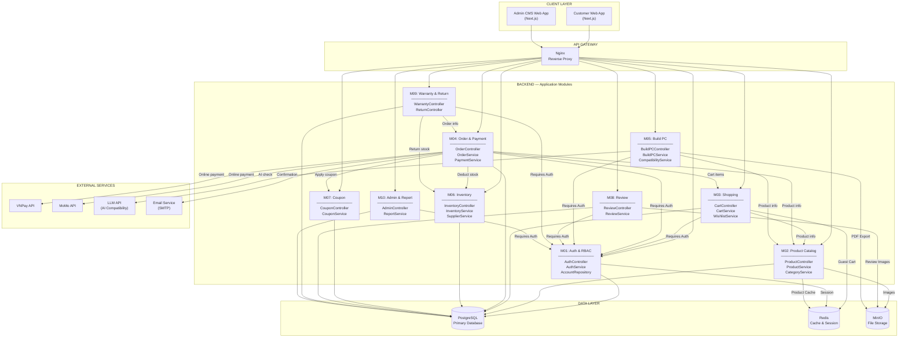
```mermaid
graph TB
    subgraph "CLIENT LAYER"
        FE_Customer["Customer Web App<br/>(Next.js)"]
        FE_Admin["Admin CMS Web App<br/>(Next.js)"]
    end

    subgraph "API GATEWAY"
        Nginx["Nginx<br/>Reverse Proxy"]
    end

    subgraph "BACKEND — Application Modules"
        M01["M01: Auth & RBAC<br/>──────────────<br/>AuthController<br/>AuthService<br/>AccountRepository"]
        M02["M02: Product Catalog<br/>──────────────<br/>ProductController<br/>ProductService<br/>CategoryService"]
        M03["M03: Shopping<br/>──────────────<br/>CartController<br/>CartService<br/>WishlistService"]
        M04["M04: Order & Payment<br/>──────────────<br/>OrderController<br/>OrderService<br/>PaymentService"]
        M05["M05: Build PC<br/>──────────────<br/>BuildPCController<br/>BuildPCService<br/>CompatibilityService"]
        M06["M06: Inventory<br/>──────────────<br/>InventoryController<br/>InventoryService<br/>SupplierService"]
        M07["M07: Coupon<br/>──────────────<br/>CouponController<br/>CouponService"]
        M08["M08: Review<br/>──────────────<br/>ReviewController<br/>ReviewService"]
        M09["M09: Warranty & Return<br/>──────────────<br/>WarrantyController<br/>ReturnController"]
        M10["M10: Admin & Report<br/>──────────────<br/>AdminController<br/>ReportService"]
    end

    subgraph "DATA LAYER"
        PostgreSQL[("PostgreSQL<br/>Primary Database")]
        Redis[("Redis<br/>Cache & Session")]
        MinIO[("MinIO<br/>File Storage")]
    end

    subgraph "EXTERNAL SERVICES"
        VNPay["VNPay API"]
        MoMo["MoMo API"]
        LLM["LLM API<br/>(AI Compatibility)"]
        SMTP["Email Service<br/>(SMTP)"]
    end

    FE_Customer --> Nginx
    FE_Admin --> Nginx
    Nginx --> M01
    Nginx --> M02
    Nginx --> M03
    Nginx --> M04
    Nginx --> M05
    Nginx --> M06
    Nginx --> M07
    Nginx --> M08
    Nginx --> M09
    Nginx --> M10

    M03 -->|"Requires Auth"| M01
    M04 -->|"Requires Auth"| M01
    M05 -->|"Requires Auth"| M01
    M08 -->|"Requires Auth"| M01
    M09 -->|"Requires Auth"| M01
    M10 -->|"Requires Auth"| M01

    M03 -->|"Product info"| M02
    M04 -->|"Product info"| M02
    M05 -->|"Product info"| M02

    M04 -->|"Cart items"| M03
    M04 -->|"Deduct stock"| M06
    M04 -->|"Apply coupon"| M07
    M09 -->|"Return stock"| M06
    M09 -->|"Order info"| M04

    M05 -->|"AI check"| LLM
    M04 -->|"Online payment"| VNPay
    M04 -->|"Online payment"| MoMo
    M04 -->|"Confirmation"| SMTP

    M01 --> PostgreSQL
    M02 --> PostgreSQL
    M03 --> PostgreSQL
    M04 --> PostgreSQL
    M06 --> PostgreSQL
    M07 --> PostgreSQL
    M08 --> PostgreSQL
    M09 --> PostgreSQL
    M10 --> PostgreSQL

    M03 -->|"Guest Cart"| Redis
    M01 -->|"Session"| Redis
    M02 -->|"Product Cache"| Redis

    M02 -->|"Images"| MinIO
    M08 -->|"Review Images"| MinIO
    M05 -->|"PDF Export"| MinIO
```

**Quan hệ chính giữa các module:**

| Quan hệ | Mô tả |
|:---------|:------|
| M03 → M01 | Shopping cần xác thực để phân biệt Guest vs Customer |
| M04 → M03 | Order lấy danh sách Cart\_Item từ Shopping để tạo đơn |
| M04 → M06 | Order trừ kho khi checkout |
| M04 → M07 | Order validate và áp dụng Coupon |
| M05 → M02 | Build PC truy vấn Product + Attribute để hiển thị slot |
| M05 → LLM | Build PC gọi LLM API kiểm tra tương thích AI |
| M09 → M04 | Bảo hành/Đổi trả cần thông tin Order gốc |
| M09 → M06 | Đổi trả hoàn lại kho hàng khi duyệt |

### 2.3 Deployment Diagram

> **Hình 2.3** — Deployment Diagram

Sơ đồ triển khai mô tả cách các thành phần được đặt trên các node vật lý/ảo và kết nối với nhau.

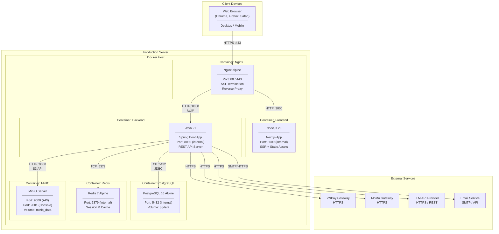
```mermaid
graph TB
    subgraph "Client Devices"
        Browser["Web Browser<br/>(Chrome, Firefox, Safari)<br/>──────────────<br/>Desktop / Mobile"]
    end

    subgraph "Production Server"
        subgraph "Docker Host"
            subgraph "Container: Nginx"
                NginxC["Nginx:alpine<br/>──────────────<br/>Port: 80 / 443<br/>SSL Termination<br/>Reverse Proxy"]
            end

            subgraph "Container: Frontend"
                FrontendC["Node.js 20<br/>──────────────<br/>Next.js App<br/>Port: 3000 (internal)<br/>SSR + Static Assets"]
            end

            subgraph "Container: Backend"
                BackendC["Java 21<br/>──────────────<br/>Spring Boot App<br/>Port: 8080 (internal)<br/>REST API Server"]
            end

            subgraph "Container: PostgreSQL"
                PostgreSQLC["PostgreSQL 16 Alpine<br/>──────────────<br/>Port: 5432 (internal)<br/>Volume: pgdata"]
            end

            subgraph "Container: Redis"
                RedisC["Redis 7 Alpine<br/>──────────────<br/>Port: 6379 (internal)<br/>Session & Cache"]
            end

            subgraph "Container: MinIO"
                MinIOC["MinIO Server<br/>──────────────<br/>Port: 9000 (API)<br/>Port: 9001 (Console)<br/>Volume: minio_data"]
            end
        end
    end

    subgraph "External Services"
        VNPayS["VNPay Gateway<br/>HTTPS"]
        MoMoS["MoMo Gateway<br/>HTTPS"]
        LLMS["LLM API Provider<br/>HTTPS / REST"]
        SMTPS["Email Service<br/>SMTP / API"]
    end

    Browser -->|"HTTPS :443"| NginxC
    NginxC -->|"HTTP :3000"| FrontendC
    NginxC -->|"HTTP :8080<br/>/api/*"| BackendC

    BackendC -->|"TCP :5432<br/>JDBC"| PostgreSQLC
    BackendC -->|"TCP :6379"| RedisC
    BackendC -->|"HTTP :9000<br/>S3 API"| MinIOC

    BackendC -->|"HTTPS"| VNPayS
    BackendC -->|"HTTPS"| MoMoS
    BackendC -->|"HTTPS"| LLMS
    BackendC -->|"SMTP/HTTPS"| SMTPS
```

**Thông số triển khai:**

| Thành phần | Image | Port | Volume | Ghi chú |
|:-----------|:------|:-----|:-------|:--------|
| Nginx | `nginx:alpine` | 80, 443 | `./nginx/conf.d` | SSL cert mount |
| Frontend | Custom Dockerfile | 3000 (internal) | — | Chỉ expose qua Nginx |
| Backend | Custom Dockerfile | 8080 (internal) | — | Health check: `/actuator/health` |
| PostgreSQL | `postgres:16-alpine` | 5432 (internal) | `pgdata` | Flyway auto-migrate |
| Redis | `redis:7-alpine` | 6379 (internal) | `redis_data` | Password protected |
| MinIO | `minio/minio` | 9000, 9001 | `minio_data` | Console trên :9001 |

---

## 3 Thiết kế chi tiết (Detailed Design)

### 3.1 Biểu đồ lớp chi tiết (Detailed Class Diagram)

#### 3.1.1 Module Authentication & Authorization

> **Hình 3.1** — Class Diagram — Module Authentication & Authorization

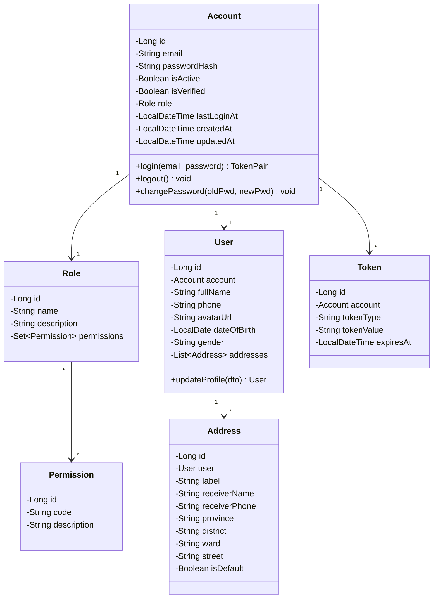
```mermaid
classDiagram
    class Account {
        -Long id
        -String email
        -String passwordHash
        -Boolean isActive
        -Boolean isVerified
        -Role role
        -LocalDateTime lastLoginAt
        -LocalDateTime createdAt
        -LocalDateTime updatedAt
        +login(email, password) TokenPair
        +logout() void
        +changePassword(oldPwd, newPwd) void
    }

    class User {
        -Long id
        -Account account
        -String fullName
        -String phone
        -String avatarUrl
        -LocalDate dateOfBirth
        -String gender
        -List~Address~ addresses
        +updateProfile(dto) User
    }

    class Address {
        -Long id
        -User user
        -String label
        -String receiverName
        -String receiverPhone
        -String province
        -String district
        -String ward
        -String street
        -Boolean isDefault
    }

    class Role {
        -Long id
        -String name
        -String description
        -Set~Permission~ permissions
    }

    class Permission {
        -Long id
        -String code
        -String description
    }

    class Token {
        -Long id
        -Account account
        -String tokenType
        -String tokenValue
        -LocalDateTime expiresAt
    }

    Account "1" --> "1" Role
    Account "1" --> "1" User
    Account "1" --> "*" Token
    User "1" --> "*" Address
    Role "*" --> "*" Permission
```

#### 3.1.2 Module Product Catalog

> **Hình 3.2** — Class Diagram — Module Product Catalog

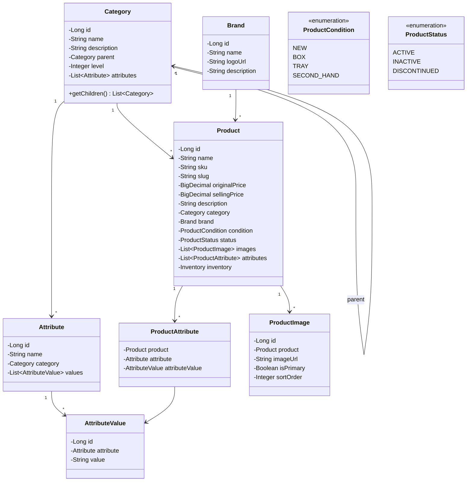
```mermaid
classDiagram
    class Category {
        -Long id
        -String name
        -String description
        -Category parent
        -Integer level
        -List~Attribute~ attributes
        +getChildren() List~Category~
    }

    class Brand {
        -Long id
        -String name
        -String logoUrl
        -String description
    }

    class Product {
        -Long id
        -String name
        -String sku
        -String slug
        -BigDecimal originalPrice
        -BigDecimal sellingPrice
        -String description
        -Category category
        -Brand brand
        -ProductCondition condition
        -ProductStatus status
        -List~ProductImage~ images
        -List~ProductAttribute~ attributes
        -Inventory inventory
    }

    class Attribute {
        -Long id
        -String name
        -Category category
        -List~AttributeValue~ values
    }

    class AttributeValue {
        -Long id
        -Attribute attribute
        -String value
    }

    class ProductAttribute {
        -Product product
        -Attribute attribute
        -AttributeValue attributeValue
    }

    class ProductImage {
        -Long id
        -Product product
        -String imageUrl
        -Boolean isPrimary
        -Integer sortOrder
    }

    class ProductCondition {
        <<enumeration>>
        NEW
        BOX
        TRAY
        SECOND_HAND
    }

    class ProductStatus {
        <<enumeration>>
        ACTIVE
        INACTIVE
        DISCONTINUED
    }

    Category "1" --> "*" Category : parent
    Category "1" --> "*" Product
    Category "1" --> "*" Attribute
    Brand "1" --> "*" Product
    Attribute "1" --> "*" AttributeValue
    Product "1" --> "*" ProductAttribute
    Product "1" --> "*" ProductImage
    ProductAttribute --> AttributeValue
```

#### 3.1.3 Module Order & Payment

> **Hình 3.3** — Class Diagram — Module Order & Payment

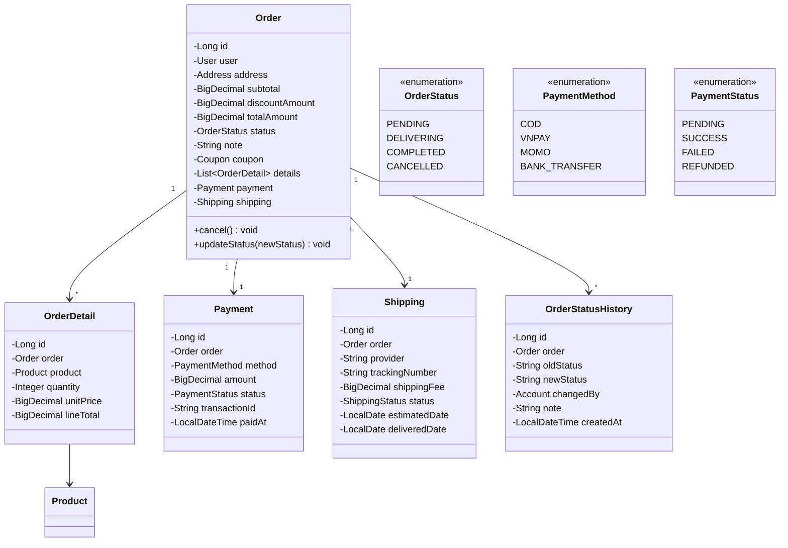
```mermaid
classDiagram
    class Order {
        -Long id
        -User user
        -Address address
        -BigDecimal subtotal
        -BigDecimal discountAmount
        -BigDecimal totalAmount
        -OrderStatus status
        -String note
        -Coupon coupon
        -List~OrderDetail~ details
        -Payment payment
        -Shipping shipping
        +cancel() void
        +updateStatus(newStatus) void
    }

    class OrderDetail {
        -Long id
        -Order order
        -Product product
        -Integer quantity
        -BigDecimal unitPrice
        -BigDecimal lineTotal
    }

    class Payment {
        -Long id
        -Order order
        -PaymentMethod method
        -BigDecimal amount
        -PaymentStatus status
        -String transactionId
        -LocalDateTime paidAt
    }

    class Shipping {
        -Long id
        -Order order
        -String provider
        -String trackingNumber
        -BigDecimal shippingFee
        -ShippingStatus status
        -LocalDate estimatedDate
        -LocalDate deliveredDate
    }

    class OrderStatusHistory {
        -Long id
        -Order order
        -String oldStatus
        -String newStatus
        -Account changedBy
        -String note
        -LocalDateTime createdAt
    }

    class OrderStatus {
        <<enumeration>>
        PENDING
        DELIVERING
        COMPLETED
        CANCELLED
    }

    class PaymentMethod {
        <<enumeration>>
        COD
        VNPAY
        MOMO
        BANK_TRANSFER
    }

    class PaymentStatus {
        <<enumeration>>
        PENDING
        SUCCESS
        FAILED
        REFUNDED
    }

    Order "1" --> "*" OrderDetail
    Order "1" --> "1" Payment
    Order "1" --> "1" Shipping
    Order "1" --> "*" OrderStatusHistory
    OrderDetail --> Product
```

### 3.2 Biểu đồ tuần tự chi tiết (Detailed Sequence Diagram)

#### 3.2.1 Luồng Đăng ký tài khoản

> **Hình 3.4** — Sequence Diagram — Đăng ký tài khoản

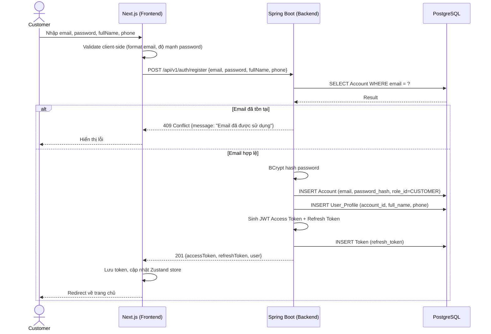
```mermaid
sequenceDiagram
    actor Customer
    participant FE as Next.js (Frontend)
    participant BE as Spring Boot (Backend)
    participant DB as PostgreSQL

    Customer->>FE: Nhập email, password, fullName, phone
    FE->>FE: Validate client-side (format email, độ mạnh password)
    FE->>BE: POST /api/v1/auth/register {email, password, fullName, phone}

    BE->>DB: SELECT Account WHERE email = ?
    DB-->>BE: Result

    alt Email đã tồn tại
        BE-->>FE: 409 Conflict {message: "Email đã được sử dụng"}
        FE-->>Customer: Hiển thị lỗi
    else Email hợp lệ
        BE->>BE: BCrypt hash password
        BE->>DB: INSERT Account (email, password_hash, role_id=CUSTOMER)
        BE->>DB: INSERT User_Profile (account_id, full_name, phone)
        BE->>BE: Sinh JWT Access Token + Refresh Token
        BE->>DB: INSERT Token (refresh_token)
        BE-->>FE: 201 {accessToken, refreshToken, user}
        FE->>FE: Lưu token, cập nhật Zustand store
        FE-->>Customer: Redirect về trang chủ
    end
```

#### 3.2.2 Luồng Đăng nhập & Merge giỏ hàng

> **Hình 3.5** — Sequence Diagram — Đăng nhập & Merge giỏ hàng

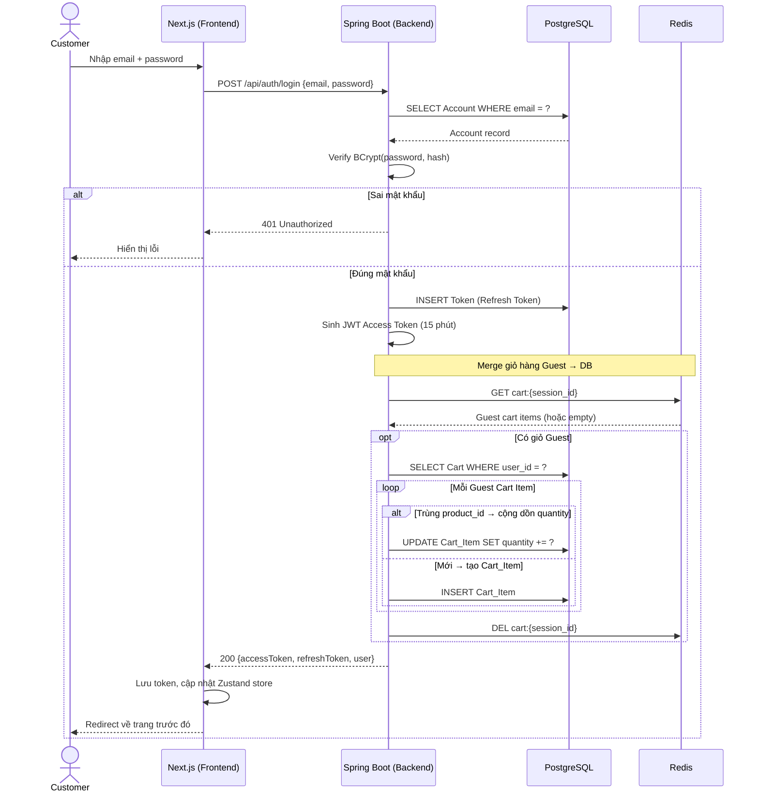
```mermaid
sequenceDiagram
    actor Customer
    participant FE as Next.js (Frontend)
    participant BE as Spring Boot (Backend)
    participant DB as PostgreSQL
    participant Cache as Redis

    Customer->>FE: Nhập email + password
    FE->>BE: POST /api/auth/login {email, password}
    BE->>DB: SELECT Account WHERE email = ?
    DB-->>BE: Account record
    BE->>BE: Verify BCrypt(password, hash)

    alt Sai mật khẩu
        BE-->>FE: 401 Unauthorized
        FE-->>Customer: Hiển thị lỗi
    else Đúng mật khẩu
        BE->>DB: INSERT Token (Refresh Token)
        BE->>BE: Sinh JWT Access Token (15 phút)

        Note over BE,Cache: Merge giỏ hàng Guest → DB
        BE->>Cache: GET cart:{session_id}
        Cache-->>BE: Guest cart items (hoặc empty)

        opt Có giỏ Guest
            BE->>DB: SELECT Cart WHERE user_id = ?
            loop Mỗi Guest Cart Item
                alt Trùng product_id → cộng dồn quantity
                    BE->>DB: UPDATE Cart_Item SET quantity += ?
                else Mới → tạo Cart_Item
                    BE->>DB: INSERT Cart_Item
                end
            end
            BE->>Cache: DEL cart:{session_id}
        end

        BE-->>FE: 200 {accessToken, refreshToken, user}
        FE->>FE: Lưu token, cập nhật Zustand store
        FE-->>Customer: Redirect về trang trước đó
    end
```

#### 3.2.3 Luồng Đăng xuất & Refresh Token

> **Hình 3.6** — Sequence Diagram — Đăng xuất & Refresh Token

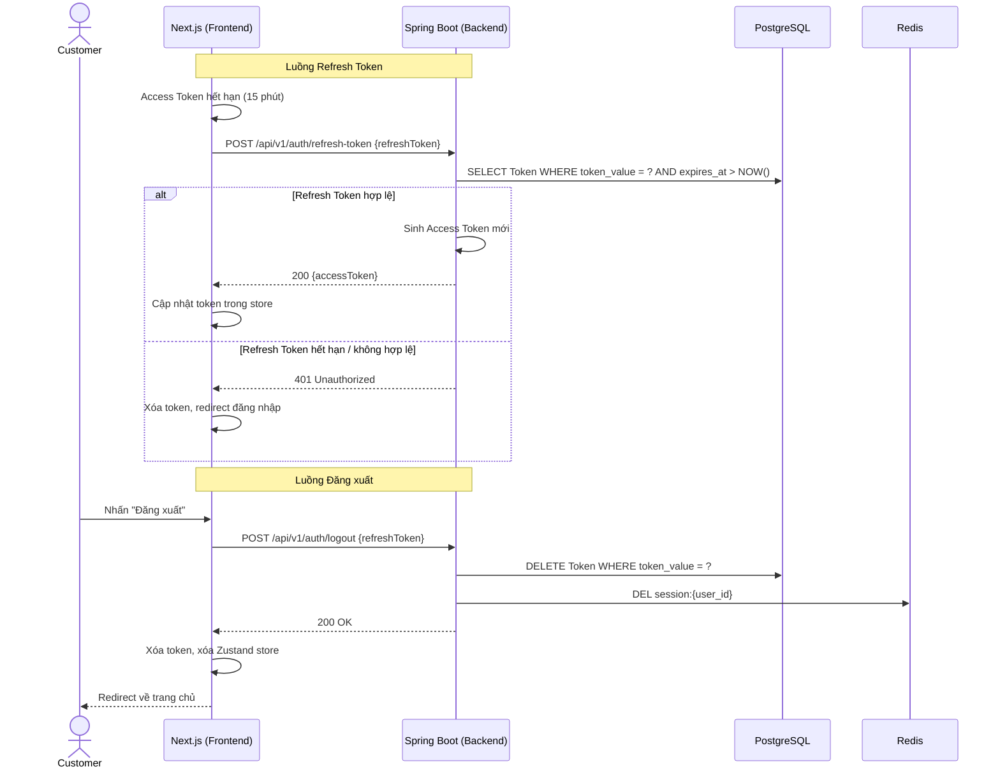
```mermaid
sequenceDiagram
    actor Customer
    participant FE as Next.js (Frontend)
    participant BE as Spring Boot (Backend)
    participant DB as PostgreSQL
    participant Cache as Redis

    Note over FE,BE: Luồng Refresh Token
    FE->>FE: Access Token hết hạn (15 phút)
    FE->>BE: POST /api/v1/auth/refresh-token {refreshToken}
    BE->>DB: SELECT Token WHERE token_value = ? AND expires_at > NOW()

    alt Refresh Token hợp lệ
        BE->>BE: Sinh Access Token mới
        BE-->>FE: 200 {accessToken}
        FE->>FE: Cập nhật token trong store
    else Refresh Token hết hạn / không hợp lệ
        BE-->>FE: 401 Unauthorized
        FE->>FE: Xóa token, redirect đăng nhập
    end

    Note over FE,BE: Luồng Đăng xuất
    Customer->>FE: Nhấn "Đăng xuất"
    FE->>BE: POST /api/v1/auth/logout {refreshToken}
    BE->>DB: DELETE Token WHERE token_value = ?
    BE->>Cache: DEL session:{user_id}
    BE-->>FE: 200 OK
    FE->>FE: Xóa token, xóa Zustand store
    FE-->>Customer: Redirect về trang chủ
```

#### 3.2.4 Luồng Thay đổi mật khẩu

> **Hình 3.7** — Sequence Diagram — Thay đổi mật khẩu

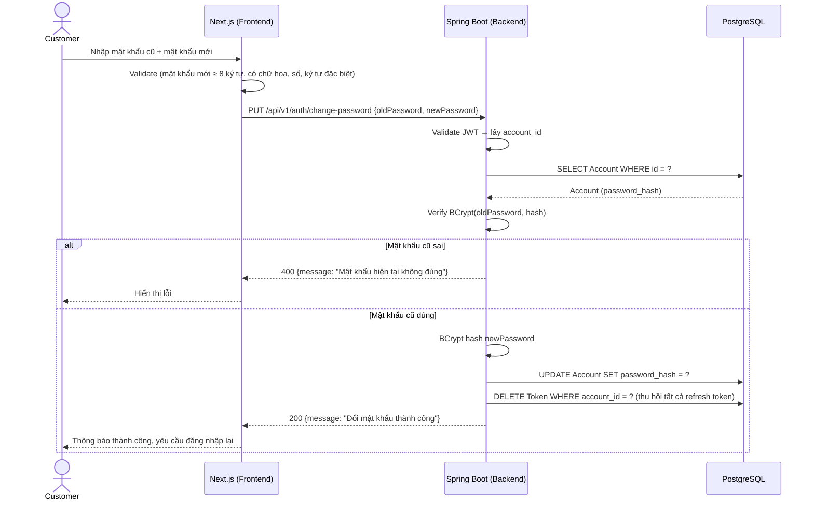
```mermaid
sequenceDiagram
    actor Customer
    participant FE as Next.js (Frontend)
    participant BE as Spring Boot (Backend)
    participant DB as PostgreSQL

    Customer->>FE: Nhập mật khẩu cũ + mật khẩu mới
    FE->>FE: Validate (mật khẩu mới ≥ 8 ký tự, có chữ hoa, số, ký tự đặc biệt)
    FE->>BE: PUT /api/v1/auth/change-password {oldPassword, newPassword}
    BE->>BE: Validate JWT → lấy account_id

    BE->>DB: SELECT Account WHERE id = ?
    DB-->>BE: Account (password_hash)
    BE->>BE: Verify BCrypt(oldPassword, hash)

    alt Mật khẩu cũ sai
        BE-->>FE: 400 {message: "Mật khẩu hiện tại không đúng"}
        FE-->>Customer: Hiển thị lỗi
    else Mật khẩu cũ đúng
        BE->>BE: BCrypt hash newPassword
        BE->>DB: UPDATE Account SET password_hash = ?
        BE->>DB: DELETE Token WHERE account_id = ? (thu hồi tất cả refresh token)
        BE-->>FE: 200 {message: "Đổi mật khẩu thành công"}
        FE-->>Customer: Thông báo thành công, yêu cầu đăng nhập lại
    end
```

#### 3.2.5 Luồng Quên & Thiết lập lại mật khẩu

> **Hình 3.8** — Sequence Diagram — Quên & Thiết lập lại mật khẩu

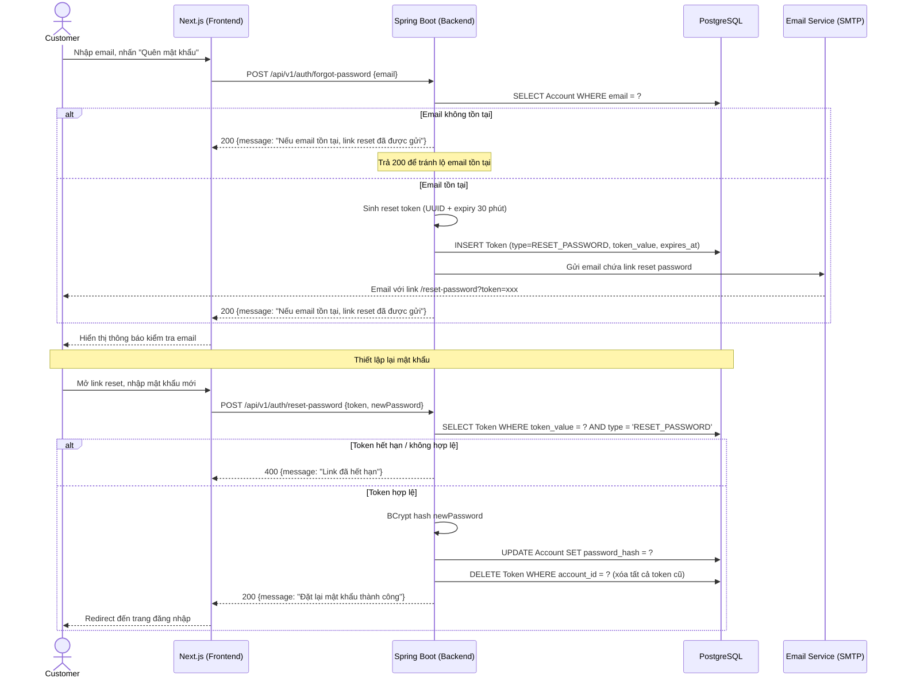
```mermaid
sequenceDiagram
    actor Customer
    participant FE as Next.js (Frontend)
    participant BE as Spring Boot (Backend)
    participant DB as PostgreSQL
    participant Email as Email Service (SMTP)

    Customer->>FE: Nhập email, nhấn "Quên mật khẩu"
    FE->>BE: POST /api/v1/auth/forgot-password {email}
    BE->>DB: SELECT Account WHERE email = ?

    alt Email không tồn tại
        BE-->>FE: 200 {message: "Nếu email tồn tại, link reset đã được gửi"}
        Note over BE: Trả 200 để tránh lộ email tồn tại
    else Email tồn tại
        BE->>BE: Sinh reset token (UUID + expiry 30 phút)
        BE->>DB: INSERT Token (type=RESET_PASSWORD, token_value, expires_at)
        BE->>Email: Gửi email chứa link reset password
        Email-->>Customer: Email với link /reset-password?token=xxx
        BE-->>FE: 200 {message: "Nếu email tồn tại, link reset đã được gửi"}
    end

    FE-->>Customer: Hiển thị thông báo kiểm tra email

    Note over Customer,DB: Thiết lập lại mật khẩu
    Customer->>FE: Mở link reset, nhập mật khẩu mới
    FE->>BE: POST /api/v1/auth/reset-password {token, newPassword}
    BE->>DB: SELECT Token WHERE token_value = ? AND type = 'RESET_PASSWORD'

    alt Token hết hạn / không hợp lệ
        BE-->>FE: 400 {message: "Link đã hết hạn"}
    else Token hợp lệ
        BE->>BE: BCrypt hash newPassword
        BE->>DB: UPDATE Account SET password_hash = ?
        BE->>DB: DELETE Token WHERE account_id = ? (xóa tất cả token cũ)
        BE-->>FE: 200 {message: "Đặt lại mật khẩu thành công"}
        FE-->>Customer: Redirect đến trang đăng nhập
    end
```

#### 3.2.6 Luồng Cập nhật thông tin cá nhân

> **Hình 3.9** — Sequence Diagram — Cập nhật thông tin cá nhân

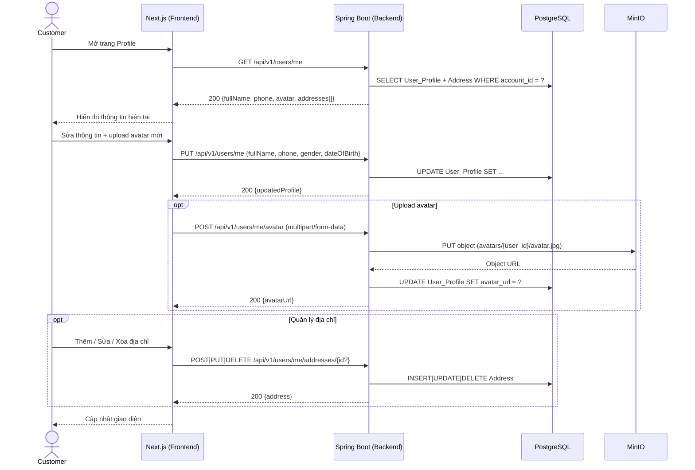
```mermaid
sequenceDiagram
    actor Customer
    participant FE as Next.js (Frontend)
    participant BE as Spring Boot (Backend)
    participant DB as PostgreSQL
    participant Storage as MinIO

    Customer->>FE: Mở trang Profile
    FE->>BE: GET /api/v1/users/me
    BE->>DB: SELECT User_Profile + Address WHERE account_id = ?
    BE-->>FE: 200 {fullName, phone, avatar, addresses[]}
    FE-->>Customer: Hiển thị thông tin hiện tại

    Customer->>FE: Sửa thông tin + upload avatar mới
    FE->>BE: PUT /api/v1/users/me {fullName, phone, gender, dateOfBirth}
    BE->>DB: UPDATE User_Profile SET ...
    BE-->>FE: 200 {updatedProfile}

    opt Upload avatar
        FE->>BE: POST /api/v1/users/me/avatar (multipart/form-data)
        BE->>Storage: PUT object (avatars/{user_id}/avatar.jpg)
        Storage-->>BE: Object URL
        BE->>DB: UPDATE User_Profile SET avatar_url = ?
        BE-->>FE: 200 {avatarUrl}
    end

    opt Quản lý địa chỉ
        Customer->>FE: Thêm / Sửa / Xóa địa chỉ
        FE->>BE: POST|PUT|DELETE /api/v1/users/me/addresses/{id?}
        BE->>DB: INSERT|UPDATE|DELETE Address
        BE-->>FE: 200 {address}
    end

    FE-->>Customer: Cập nhật giao diện
```

#### 3.2.7 Luồng Duyệt, Tìm kiếm & Lọc sản phẩm

> **Hình 3.10** — Sequence Diagram — Duyệt, Tìm kiếm & Lọc sản phẩm

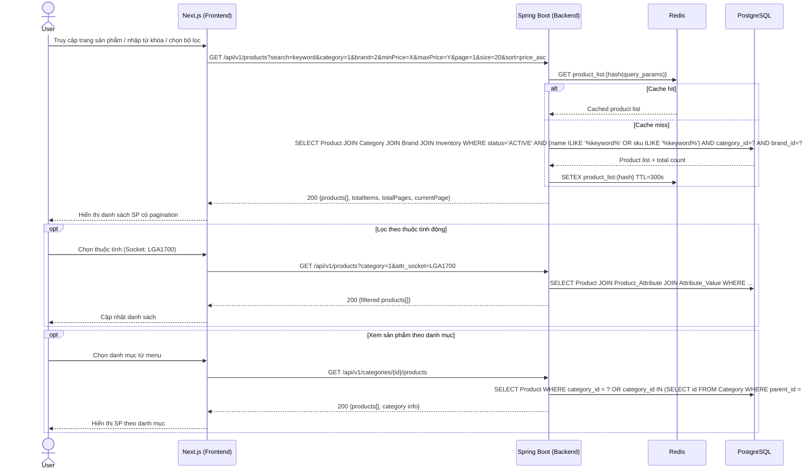
```mermaid
sequenceDiagram
    actor User
    participant FE as Next.js (Frontend)
    participant BE as Spring Boot (Backend)
    participant Cache as Redis
    participant DB as PostgreSQL

    User->>FE: Truy cập trang sản phẩm / nhập từ khóa / chọn bộ lọc
    FE->>BE: GET /api/v1/products?search=keyword&category=1&brand=2&minPrice=X&maxPrice=Y&page=1&size=20&sort=price_asc

    BE->>Cache: GET product_list:{hash(query_params)}
    alt Cache hit
        Cache-->>BE: Cached product list
    else Cache miss
        BE->>DB: SELECT Product JOIN Category JOIN Brand JOIN Inventory WHERE status='ACTIVE' AND (name ILIKE '%keyword%' OR sku ILIKE '%keyword%') AND category_id=? AND brand_id=? AND selling_price BETWEEN ? AND ? ORDER BY ... LIMIT 20 OFFSET 0
        DB-->>BE: Product list + total count
        BE->>Cache: SETEX product_list:{hash} TTL=300s
    end

    BE-->>FE: 200 {products[], totalItems, totalPages, currentPage}
    FE-->>User: Hiển thị danh sách SP có pagination

    opt Lọc theo thuộc tính động
        User->>FE: Chọn thuộc tính (Socket: LGA1700)
        FE->>BE: GET /api/v1/products?category=1&attr_socket=LGA1700
        BE->>DB: SELECT Product JOIN Product_Attribute JOIN Attribute_Value WHERE ...
        BE-->>FE: 200 {filtered products[]}
        FE-->>User: Cập nhật danh sách
    end

    opt Xem sản phẩm theo danh mục
        User->>FE: Chọn danh mục từ menu
        FE->>BE: GET /api/v1/categories/{id}/products
        BE->>DB: SELECT Product WHERE category_id = ? OR category_id IN (SELECT id FROM Category WHERE parent_id = ?)
        BE-->>FE: 200 {products[], category info}
        FE-->>User: Hiển thị SP theo danh mục
    end
```

#### 3.2.8 Luồng Xem chi tiết sản phẩm

> **Hình 3.11** — Sequence Diagram — Xem chi tiết sản phẩm

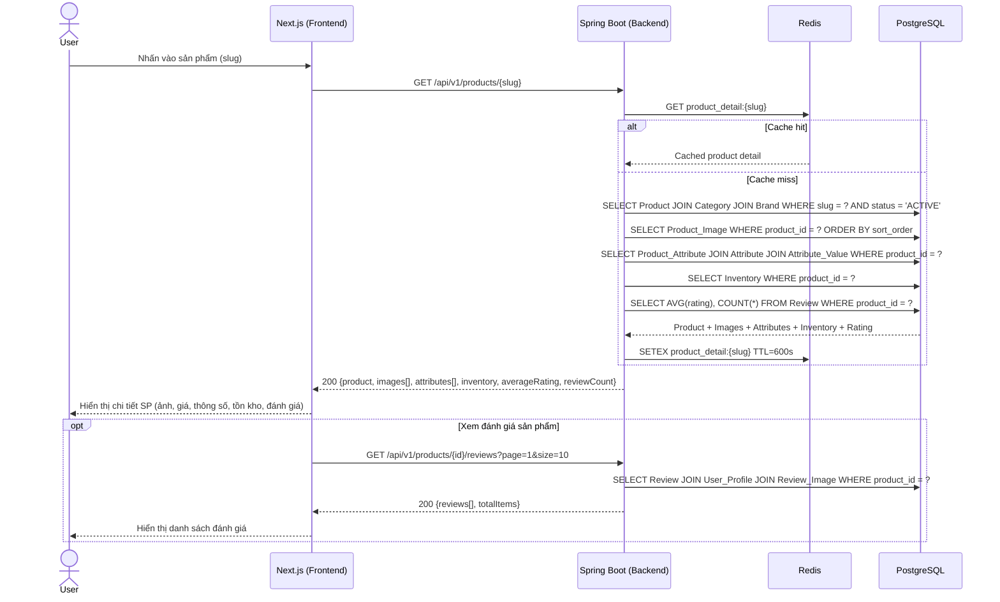
```mermaid
sequenceDiagram
    actor User
    participant FE as Next.js (Frontend)
    participant BE as Spring Boot (Backend)
    participant Cache as Redis
    participant DB as PostgreSQL

    User->>FE: Nhấn vào sản phẩm (slug)
    FE->>BE: GET /api/v1/products/{slug}

    BE->>Cache: GET product_detail:{slug}
    alt Cache hit
        Cache-->>BE: Cached product detail
    else Cache miss
        BE->>DB: SELECT Product JOIN Category JOIN Brand WHERE slug = ? AND status = 'ACTIVE'
        BE->>DB: SELECT Product_Image WHERE product_id = ? ORDER BY sort_order
        BE->>DB: SELECT Product_Attribute JOIN Attribute JOIN Attribute_Value WHERE product_id = ?
        BE->>DB: SELECT Inventory WHERE product_id = ?
        BE->>DB: SELECT AVG(rating), COUNT(*) FROM Review WHERE product_id = ?
        DB-->>BE: Product + Images + Attributes + Inventory + Rating
        BE->>Cache: SETEX product_detail:{slug} TTL=600s
    end

    BE-->>FE: 200 {product, images[], attributes[], inventory, averageRating, reviewCount}
    FE-->>User: Hiển thị chi tiết SP (ảnh, giá, thông số, tồn kho, đánh giá)

    opt Xem đánh giá sản phẩm
        FE->>BE: GET /api/v1/products/{id}/reviews?page=1&size=10
        BE->>DB: SELECT Review JOIN User_Profile JOIN Review_Image WHERE product_id = ?
        BE-->>FE: 200 {reviews[], totalItems}
        FE-->>User: Hiển thị danh sách đánh giá
    end
```

#### 3.2.9 Luồng Quản lý giỏ hàng (Thêm / Sửa / Xóa)

> **Hình 3.12** — Sequence Diagram — Quản lý giỏ hàng (Guest & Customer)

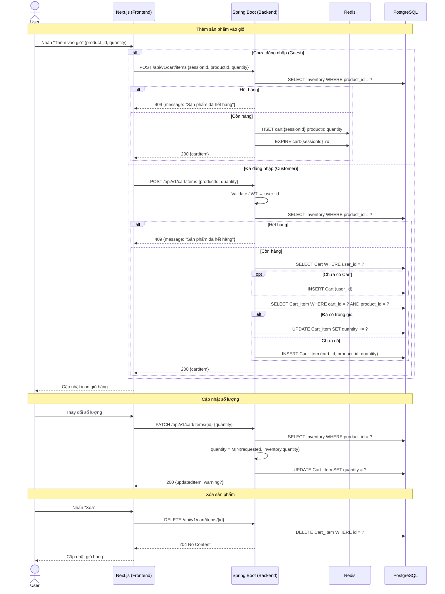
```mermaid
sequenceDiagram
    actor User
    participant FE as Next.js (Frontend)
    participant BE as Spring Boot (Backend)
    participant Cache as Redis
    participant DB as PostgreSQL

    Note over User,DB: Thêm sản phẩm vào giỏ
    User->>FE: Nhấn "Thêm vào giỏ" (product_id, quantity)

    alt Chưa đăng nhập (Guest)
        FE->>BE: POST /api/v1/cart/items {sessionId, productId, quantity}
        BE->>DB: SELECT Inventory WHERE product_id = ?
        alt Hết hàng
            BE-->>FE: 409 {message: "Sản phẩm đã hết hàng"}
        else Còn hàng
            BE->>Cache: HSET cart:{sessionId} productId quantity
            BE->>Cache: EXPIRE cart:{sessionId} 7d
            BE-->>FE: 200 {cartItem}
        end
    else Đã đăng nhập (Customer)
        FE->>BE: POST /api/v1/cart/items {productId, quantity}
        BE->>BE: Validate JWT → user_id
        BE->>DB: SELECT Inventory WHERE product_id = ?
        alt Hết hàng
            BE-->>FE: 409 {message: "Sản phẩm đã hết hàng"}
        else Còn hàng
            BE->>DB: SELECT Cart WHERE user_id = ?
            opt Chưa có Cart
                BE->>DB: INSERT Cart (user_id)
            end
            BE->>DB: SELECT Cart_Item WHERE cart_id = ? AND product_id = ?
            alt Đã có trong giỏ
                BE->>DB: UPDATE Cart_Item SET quantity += ?
            else Chưa có
                BE->>DB: INSERT Cart_Item (cart_id, product_id, quantity)
            end
            BE-->>FE: 200 {cartItem}
        end
    end

    FE-->>User: Cập nhật icon giỏ hàng

    Note over User,DB: Cập nhật số lượng
    User->>FE: Thay đổi số lượng
    FE->>BE: PATCH /api/v1/cart/items/{id} {quantity}
    BE->>DB: SELECT Inventory WHERE product_id = ?
    BE->>BE: quantity = MIN(requested, inventory.quantity)
    BE->>DB: UPDATE Cart_Item SET quantity = ?
    BE-->>FE: 200 {updatedItem, warning?}

    Note over User,DB: Xóa sản phẩm
    User->>FE: Nhấn "Xóa"
    FE->>BE: DELETE /api/v1/cart/items/{id}
    BE->>DB: DELETE Cart_Item WHERE id = ?
    BE-->>FE: 204 No Content
    FE-->>User: Cập nhật giỏ hàng
```

#### 3.2.10 Luồng Checkout & Tạo đơn hàng

> **Hình 3.13** — Sequence Diagram — Checkout & Tạo đơn hàng

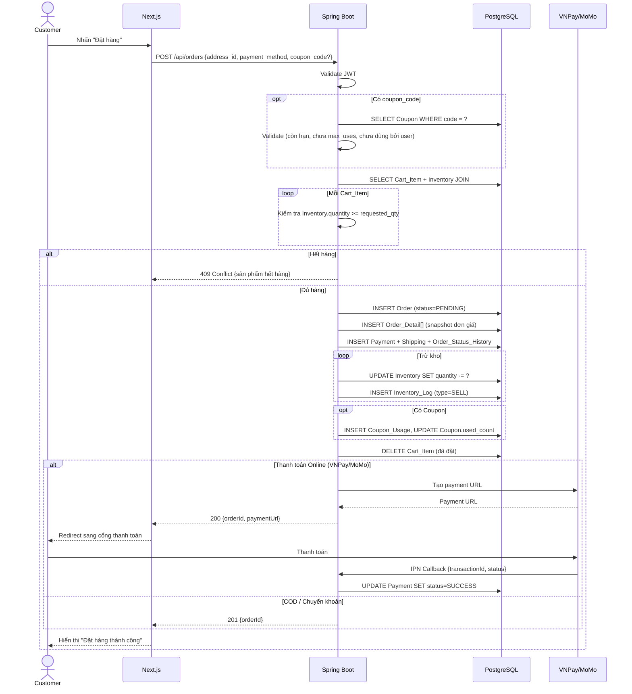
```mermaid
sequenceDiagram
    actor Customer
    participant FE as Next.js
    participant BE as Spring Boot
    participant DB as PostgreSQL
    participant Pay as VNPay/MoMo

    Customer->>FE: Nhấn "Đặt hàng"
    FE->>BE: POST /api/orders {address_id, payment_method, coupon_code?}
    BE->>BE: Validate JWT

    opt Có coupon_code
        BE->>DB: SELECT Coupon WHERE code = ?
        BE->>BE: Validate (còn hạn, chưa max_uses, chưa dùng bởi user)
    end

    BE->>DB: SELECT Cart_Item + Inventory JOIN
    loop Mỗi Cart_Item
        BE->>BE: Kiểm tra Inventory.quantity >= requested_qty
    end

    alt Hết hàng
        BE-->>FE: 409 Conflict {sản phẩm hết hàng}
    else Đủ hàng
        BE->>DB: INSERT Order (status=PENDING)
        BE->>DB: INSERT Order_Detail[] (snapshot đơn giá)
        BE->>DB: INSERT Payment + Shipping + Order_Status_History

        loop Trừ kho
            BE->>DB: UPDATE Inventory SET quantity -= ?
            BE->>DB: INSERT Inventory_Log (type=SELL)
        end

        opt Có Coupon
            BE->>DB: INSERT Coupon_Usage, UPDATE Coupon.used_count
        end

        BE->>DB: DELETE Cart_Item (đã đặt)

        alt Thanh toán Online (VNPay/MoMo)
            BE->>Pay: Tạo payment URL
            Pay-->>BE: Payment URL
            BE-->>FE: 200 {orderId, paymentUrl}
            FE-->>Customer: Redirect sang cổng thanh toán
            Customer->>Pay: Thanh toán
            Pay->>BE: IPN Callback {transactionId, status}
            BE->>DB: UPDATE Payment SET status=SUCCESS
        else COD / Chuyển khoản
            BE-->>FE: 201 {orderId}
        end

        FE-->>Customer: Hiển thị "Đặt hàng thành công"
    end
```

#### 3.2.11 Luồng Thanh toán Online — Callback VNPay/MoMo

> **Hình 3.14** — Sequence Diagram — Thanh toán Online Callback

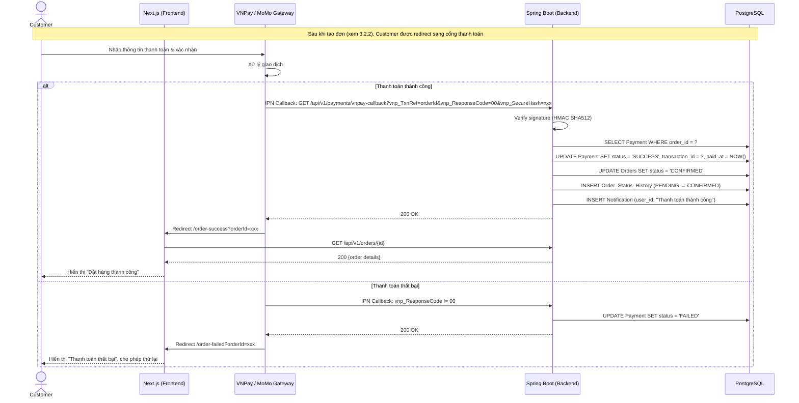
```mermaid
sequenceDiagram
    actor Customer
    participant FE as Next.js (Frontend)
    participant Pay as VNPay / MoMo Gateway
    participant BE as Spring Boot (Backend)
    participant DB as PostgreSQL

    Note over Customer,DB: Sau khi tạo đơn (xem 3.2.2), Customer được redirect sang cổng thanh toán

    Customer->>Pay: Nhập thông tin thanh toán & xác nhận
    Pay->>Pay: Xử lý giao dịch

    alt Thanh toán thành công
        Pay->>BE: IPN Callback: GET /api/v1/payments/vnpay-callback?vnp_TxnRef=orderId&vnp_ResponseCode=00&vnp_SecureHash=xxx
        BE->>BE: Verify signature (HMAC SHA512)
        BE->>DB: SELECT Payment WHERE order_id = ?
        BE->>DB: UPDATE Payment SET status = 'SUCCESS', transaction_id = ?, paid_at = NOW()
        BE->>DB: UPDATE Orders SET status = 'CONFIRMED'
        BE->>DB: INSERT Order_Status_History (PENDING → CONFIRMED)
        BE->>DB: INSERT Notification (user_id, "Thanh toán thành công")
        BE-->>Pay: 200 OK

        Pay->>FE: Redirect /order-success?orderId=xxx
        FE->>BE: GET /api/v1/orders/{id}
        BE-->>FE: 200 {order details}
        FE-->>Customer: Hiển thị "Đặt hàng thành công"

    else Thanh toán thất bại
        Pay->>BE: IPN Callback: vnp_ResponseCode != 00
        BE->>DB: UPDATE Payment SET status = 'FAILED'
        BE-->>Pay: 200 OK

        Pay->>FE: Redirect /order-failed?orderId=xxx
        FE-->>Customer: Hiển thị "Thanh toán thất bại", cho phép thử lại
    end
```

#### 3.2.12 Luồng Xem lịch sử & Chi tiết đơn hàng

> **Hình 3.15** — Sequence Diagram — Xem lịch sử & Chi tiết đơn hàng

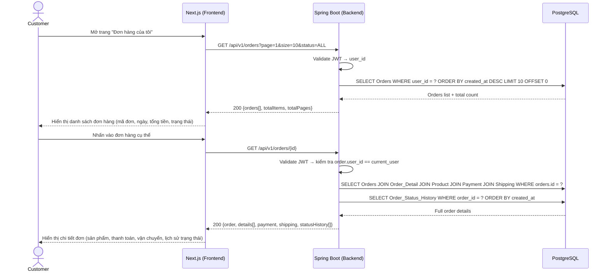
```mermaid
sequenceDiagram
    actor Customer
    participant FE as Next.js (Frontend)
    participant BE as Spring Boot (Backend)
    participant DB as PostgreSQL

    Customer->>FE: Mở trang "Đơn hàng của tôi"
    FE->>BE: GET /api/v1/orders?page=1&size=10&status=ALL
    BE->>BE: Validate JWT → user_id
    BE->>DB: SELECT Orders WHERE user_id = ? ORDER BY created_at DESC LIMIT 10 OFFSET 0
    DB-->>BE: Orders list + total count
    BE-->>FE: 200 {orders[], totalItems, totalPages}
    FE-->>Customer: Hiển thị danh sách đơn hàng (mã đơn, ngày, tổng tiền, trạng thái)

    Customer->>FE: Nhấn vào đơn hàng cụ thể
    FE->>BE: GET /api/v1/orders/{id}
    BE->>BE: Validate JWT → kiểm tra order.user_id == current_user
    BE->>DB: SELECT Orders JOIN Order_Detail JOIN Product JOIN Payment JOIN Shipping WHERE orders.id = ?
    BE->>DB: SELECT Order_Status_History WHERE order_id = ? ORDER BY created_at
    DB-->>BE: Full order details
    BE-->>FE: 200 {order, details[], payment, shipping, statusHistory[]}
    FE-->>Customer: Hiển thị chi tiết đơn (sản phẩm, thanh toán, vận chuyển, lịch sử trạng thái)
```

#### 3.2.13 Luồng Hủy đơn hàng

> **Hình 3.16** — Sequence Diagram — Hủy đơn hàng

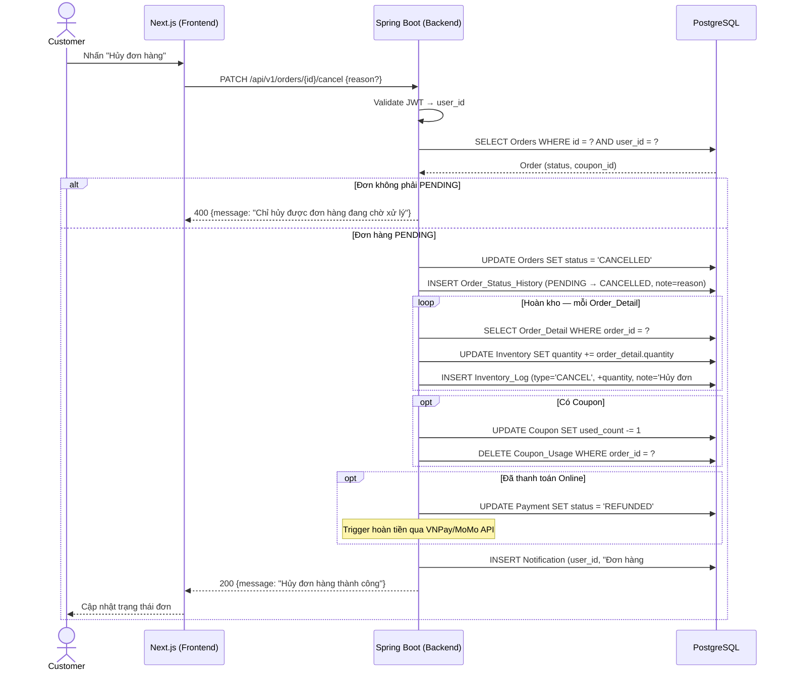
```mermaid
sequenceDiagram
    actor Customer
    participant FE as Next.js (Frontend)
    participant BE as Spring Boot (Backend)
    participant DB as PostgreSQL

    Customer->>FE: Nhấn "Hủy đơn hàng"
    FE->>BE: PATCH /api/v1/orders/{id}/cancel {reason?}
    BE->>BE: Validate JWT → user_id

    BE->>DB: SELECT Orders WHERE id = ? AND user_id = ?
    DB-->>BE: Order (status, coupon_id)

    alt Đơn không phải PENDING
        BE-->>FE: 400 {message: "Chỉ hủy được đơn hàng đang chờ xử lý"}
    else Đơn hàng PENDING
        BE->>DB: UPDATE Orders SET status = 'CANCELLED'
        BE->>DB: INSERT Order_Status_History (PENDING → CANCELLED, note=reason)

        loop Hoàn kho — mỗi Order_Detail
            BE->>DB: SELECT Order_Detail WHERE order_id = ?
            BE->>DB: UPDATE Inventory SET quantity += order_detail.quantity
            BE->>DB: INSERT Inventory_Log (type='CANCEL', +quantity, note='Hủy đơn #id')
        end

        opt Có Coupon
            BE->>DB: UPDATE Coupon SET used_count -= 1
            BE->>DB: DELETE Coupon_Usage WHERE order_id = ?
        end

        opt Đã thanh toán Online
            BE->>DB: UPDATE Payment SET status = 'REFUNDED'
            Note over BE: Trigger hoàn tiền qua VNPay/MoMo API
        end

        BE->>DB: INSERT Notification (user_id, "Đơn hàng #id đã được hủy")
        BE-->>FE: 200 {message: "Hủy đơn hàng thành công"}
        FE-->>Customer: Cập nhật trạng thái đơn
    end
```

#### 3.2.14 Luồng Đổi trả & Hoàn tiền

> **Hình 3.17** — Sequence Diagram — Đổi trả & Hoàn tiền

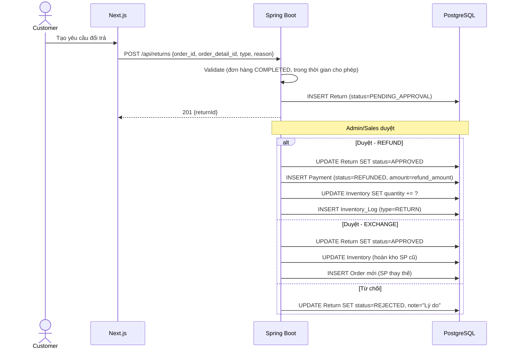
```mermaid
sequenceDiagram
    actor Customer
    participant FE as Next.js
    participant BE as Spring Boot
    participant DB as PostgreSQL

    Customer->>FE: Tạo yêu cầu đổi trả
    FE->>BE: POST /api/returns {order_id, order_detail_id, type, reason}
    BE->>BE: Validate (đơn hàng COMPLETED, trong thời gian cho phép)
    BE->>DB: INSERT Return (status=PENDING_APPROVAL)
    BE-->>FE: 201 {returnId}

    Note over BE,DB: Admin/Sales duyệt

    alt Duyệt - REFUND
        BE->>DB: UPDATE Return SET status=APPROVED
        BE->>DB: INSERT Payment (status=REFUNDED, amount=refund_amount)
        BE->>DB: UPDATE Inventory SET quantity += ?
        BE->>DB: INSERT Inventory_Log (type=RETURN)
    else Duyệt - EXCHANGE
        BE->>DB: UPDATE Return SET status=APPROVED
        BE->>DB: UPDATE Inventory (hoàn kho SP cũ)
        BE->>DB: INSERT Order mới (SP thay thế)
    else Từ chối
        BE->>DB: UPDATE Return SET status=REJECTED, note="Lý do"
    end
```

#### 3.2.15 Luồng Gửi yêu cầu bảo hành

> **Hình 3.18** — Sequence Diagram — Gửi yêu cầu bảo hành

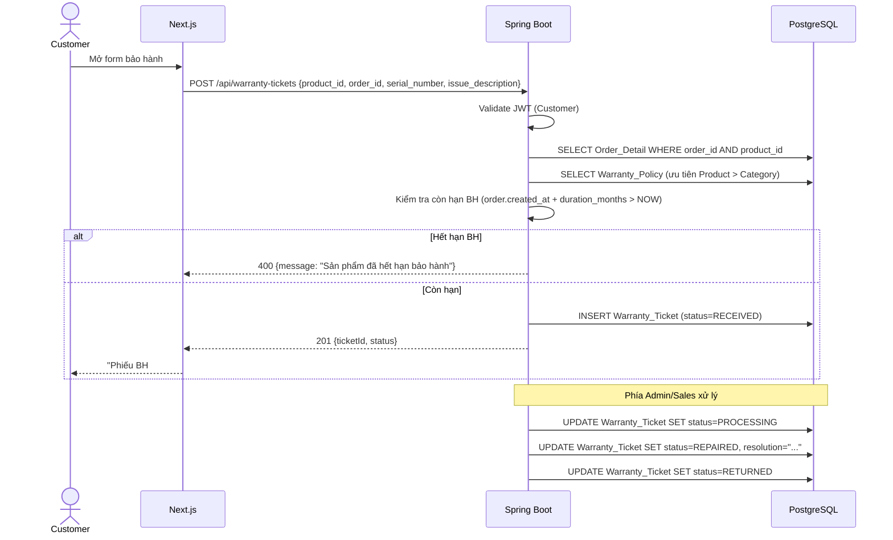
```mermaid
sequenceDiagram
    actor Customer
    participant FE as Next.js
    participant BE as Spring Boot
    participant DB as PostgreSQL

    Customer->>FE: Mở form bảo hành
    FE->>BE: POST /api/warranty-tickets {product_id, order_id, serial_number, issue_description}
    BE->>BE: Validate JWT (Customer)
    BE->>DB: SELECT Order_Detail WHERE order_id AND product_id
    BE->>DB: SELECT Warranty_Policy (ưu tiên Product > Category)
    BE->>BE: Kiểm tra còn hạn BH (order.created_at + duration_months > NOW)

    alt Hết hạn BH
        BE-->>FE: 400 {message: "Sản phẩm đã hết hạn bảo hành"}
    else Còn hạn
        BE->>DB: INSERT Warranty_Ticket (status=RECEIVED)
        BE-->>FE: 201 {ticketId, status}
        FE-->>Customer: "Phiếu BH #xxx đã tạo thành công"
    end

    Note over BE,DB: Phía Admin/Sales xử lý
    BE->>DB: UPDATE Warranty_Ticket SET status=PROCESSING
    BE->>DB: UPDATE Warranty_Ticket SET status=REPAIRED, resolution="..."
    BE->>DB: UPDATE Warranty_Ticket SET status=RETURNED
```

#### 3.2.16 Luồng Đánh giá sản phẩm (Viết / Sửa / Xóa)

> **Hình 3.19** — Sequence Diagram — Đánh giá sản phẩm

```mermaid
sequenceDiagram
    actor Customer
    participant FE as Next.js (Frontend)
    participant BE as Spring Boot (Backend)
    participant DB as PostgreSQL
    participant Storage as MinIO

    Note over Customer,DB: Viết đánh giá
    Customer->>FE: Nhập rating (1-5), nội dung, upload ảnh
    FE->>BE: POST /api/v1/reviews {productId, orderId, rating, content}
    BE->>BE: Validate JWT → user_id

    BE->>DB: SELECT Order_Detail WHERE order_id = ? AND product_id = ? AND order.user_id = ?
    alt Chưa mua sản phẩm này
        BE-->>FE: 400 {message: "Bạn chưa mua sản phẩm này"}
    else Đã mua
        BE->>DB: SELECT Review WHERE user_id = ? AND product_id = ? AND order_id = ?
        alt Đã đánh giá rồi
            BE-->>FE: 409 {message: "Bạn đã đánh giá sản phẩm này cho đơn hàng này"}
        else Chưa đánh giá
            BE->>DB: INSERT Review (user_id, product_id, order_id, rating, content)
            DB-->>BE: review_id

            opt Có ảnh đánh giá
                loop Mỗi ảnh
                    FE->>BE: POST /api/v1/reviews/{id}/images (multipart)
                    BE->>Storage: PUT object (reviews/{review_id}/img_n.jpg)
                    BE->>DB: INSERT Review_Image (review_id, image_url)
                end
            end

            BE-->>FE: 201 {review}
            FE-->>Customer: Hiển thị đánh giá vừa tạo
        end
    end

    Note over Customer,DB: Chỉnh sửa đánh giá
    Customer->>FE: Sửa nội dung / rating
    FE->>BE: PUT /api/v1/reviews/{id} {rating, content}
    BE->>BE: Validate owner (review.user_id == current_user)
    BE->>DB: UPDATE Review SET rating = ?, content = ?
    BE-->>FE: 200 {updatedReview}

    Note over Customer,DB: Xóa đánh giá
    Customer->>FE: Nhấn "Xóa đánh giá"
    FE->>BE: DELETE /api/v1/reviews/{id}
    BE->>BE: Validate owner
    BE->>DB: DELETE Review WHERE id = ? (CASCADE xóa Review_Image)
    BE-->>FE: 204 No Content
```

#### 3.2.17 Luồng Quản lý Wishlist

> **Hình 3.20** — Sequence Diagram — Quản lý Wishlist

```mermaid
sequenceDiagram
    actor Customer
    participant FE as Next.js (Frontend)
    participant BE as Spring Boot (Backend)
    participant DB as PostgreSQL

    Note over Customer,DB: Thêm vào Wishlist
    Customer->>FE: Nhấn icon ♡ trên sản phẩm
    FE->>BE: POST /api/v1/wishlist {productId}
    BE->>BE: Validate JWT → user_id

    BE->>DB: SELECT Wishlist WHERE user_id = ? AND product_id = ?
    alt Đã có trong Wishlist (toggle off)
        BE->>DB: DELETE Wishlist WHERE user_id = ? AND product_id = ?
        BE-->>FE: 200 {action: "REMOVED"}
        FE-->>Customer: Icon ♡ chuyển về trắng
    else Chưa có (toggle on)
        BE->>DB: INSERT Wishlist (user_id, product_id)
        BE-->>FE: 201 {action: "ADDED"}
        FE-->>Customer: Icon ♥ chuyển sang đỏ
    end

    Note over Customer,DB: Xem danh sách Wishlist
    Customer->>FE: Mở trang Wishlist
    FE->>BE: GET /api/v1/wishlist?page=1&size=20
    BE->>DB: SELECT Wishlist JOIN Product JOIN Product_Image JOIN Inventory WHERE user_id = ?
    BE-->>FE: 200 {wishlistItems[], totalItems}
    FE-->>Customer: Hiển thị danh sách SP yêu thích (tên, ảnh, giá, tình trạng kho)
```

#### 3.2.18 Luồng Build PC + Kiểm tra tương thích AI

> **Hình 3.21** — Sequence Diagram — Build PC + Kiểm tra tương thích AI

```mermaid
sequenceDiagram
    actor User
    participant FE as Next.js
    participant BE as Spring Boot
    participant DB as PostgreSQL
    participant Cache as Redis
    participant LLM as LLM API

    User->>FE: Mở trang Build PC
    FE->>BE: GET /api/build-pc/categories
    BE-->>FE: Danh sách slot (CPU, Main, RAM, ...)

    loop Chọn linh kiện cho mỗi slot
        User->>FE: Chọn danh mục slot
        FE->>BE: GET /api/build-pc/products?category={id}
        BE->>DB: SELECT Product + Inventory WHERE ...
        BE-->>FE: Danh sách SP (có tồn kho)
        User->>FE: Chọn sản phẩm
        FE->>FE: Cập nhật cấu hình, tính tổng giá
    end

    alt Chưa đăng nhập → Xuất báo giá
        User->>FE: Nhấn "Xuất báo giá PDF"
        FE->>BE: POST /api/build-pc/export-quote {items[]}
        BE->>BE: Generate PDF
        BE-->>FE: PDF file
        FE-->>User: Download PDF
    else Đã đăng nhập → Kiểm tra AI
        User->>FE: Nhấn "Kiểm tra tương thích"
        FE->>BE: POST /api/build-pc/check-compatibility {items[]}
        BE->>DB: SELECT Product_Attribute cho mỗi SP
        BE->>BE: Build prompt với thông số kỹ thuật
        BE->>LLM: Gửi prompt kiểm tra tương thích
        LLM-->>BE: Kết quả phân tích + gợi ý
        BE-->>FE: {compatible: true/false, analysis, suggestions[]}
        FE-->>User: Hiển thị kết quả AI

        opt Thêm vào giỏ
            User->>FE: Nhấn "Thêm vào giỏ"
            FE->>BE: POST /api/build-pc/add-to-cart {items[]}
            loop Mỗi linh kiện
                BE->>DB: INSERT Cart_Item
            end
            BE-->>FE: 200 OK
        end
    else Chưa đăng nhập → Nhấn nút cần auth
        User->>FE: Nhấn "Kiểm tra tương thích" / "Thêm giỏ"
        FE->>Cache: Lưu cấu hình tạm {session_id}
        FE-->>User: Redirect đăng nhập
        User->>FE: Đăng nhập thành công
        FE->>Cache: GET cấu hình tạm
        FE-->>User: Khôi phục cấu hình Build PC
    end
```

#### 3.2.19 Luồng Admin — Quản lý sản phẩm (CRUD)

> **Hình 3.22** — Sequence Diagram — Admin quản lý sản phẩm

```mermaid
sequenceDiagram
    actor Admin
    participant FE as Next.js (Admin CMS)
    participant BE as Spring Boot (Backend)
    participant DB as PostgreSQL
    participant Storage as MinIO

    Note over Admin,DB: Thêm sản phẩm mới
    Admin->>FE: Nhập thông tin SP + upload ảnh
    FE->>BE: POST /api/v1/admin/products {name, sku, slug, originalPrice, sellingPrice, description, categoryId, brandId, condition, attributes[]}
    BE->>BE: Validate JWT + Role (ADMIN)
    BE->>DB: SELECT Product WHERE sku = ? OR slug = ?
    alt SKU/Slug trùng
        BE-->>FE: 409 {message: "SKU hoặc Slug đã tồn tại"}
    else Hợp lệ
        BE->>DB: INSERT Product (...)
        DB-->>BE: product_id
        loop Mỗi thuộc tính
            BE->>DB: INSERT Product_Attribute (product_id, attribute_id, attribute_value_id)
        end
        BE->>DB: INSERT Inventory (product_id, quantity=0, supplier_id)
        loop Upload ảnh
            FE->>BE: POST /api/v1/admin/products/{id}/images (multipart)
            BE->>Storage: PUT object (products/{product_id}/img_n.jpg)
            Storage-->>BE: Object URL
            BE->>DB: INSERT Product_Image (product_id, image_url, is_primary, sort_order)
        end
        BE-->>FE: 201 {product}
        FE-->>Admin: Hiển thị SP vừa tạo
    end

    Note over Admin,DB: Cập nhật sản phẩm
    Admin->>FE: Sửa thông tin SP
    FE->>BE: PUT /api/v1/admin/products/{id} {name, sellingPrice, ...}
    BE->>DB: UPDATE Product SET ...
    BE-->>FE: 200 {updatedProduct}

    Note over Admin,DB: Xóa sản phẩm (soft delete)
    Admin->>FE: Nhấn "Ngừng bán"
    FE->>BE: DELETE /api/v1/admin/products/{id}
    BE->>DB: SELECT Order_Detail WHERE product_id = ?
    alt Có trong đơn hàng → soft delete
        BE->>DB: UPDATE Product SET status = 'DISCONTINUED'
        BE-->>FE: 200 {message: "Sản phẩm đã ngừng bán"}
    else Không có đơn → có thể hard delete
        BE->>DB: DELETE Product WHERE id = ? (CASCADE)
        BE-->>FE: 204 No Content
    end
```

#### 3.2.20 Luồng Admin — Quản lý danh mục sản phẩm

> **Hình 3.23** — Sequence Diagram — Admin quản lý danh mục

```mermaid
sequenceDiagram
    actor Admin
    participant FE as Next.js (Admin CMS)
    participant BE as Spring Boot (Backend)
    participant DB as PostgreSQL

    Note over Admin,DB: Xem cây danh mục
    Admin->>FE: Mở trang quản lý danh mục
    FE->>BE: GET /api/v1/admin/categories?tree=true
    BE->>DB: SELECT Category ORDER BY level, name
    BE->>BE: Build tree structure (parent-child)
    BE-->>FE: 200 {categories[{id, name, children[]}]}
    FE-->>Admin: Hiển thị cây danh mục

    Note over Admin,DB: Thêm danh mục
    Admin->>FE: Nhập tên, mô tả, chọn danh mục cha
    FE->>BE: POST /api/v1/admin/categories {name, description, parentId}
    BE->>DB: SELECT Category WHERE parent_id = ? → tính level
    BE->>DB: INSERT Category (name, description, parent_id, level)
    BE-->>FE: 201 {category}

    Note over Admin,DB: Quản lý thuộc tính (Attribute) theo danh mục
    Admin->>FE: Thêm thuộc tính cho danh mục "CPU"
    FE->>BE: POST /api/v1/admin/categories/{id}/attributes {name: "Socket"}
    BE->>DB: INSERT Attribute (name, category_id)
    FE->>BE: POST /api/v1/admin/attributes/{id}/values {value: "LGA1700"}
    BE->>DB: INSERT Attribute_Value (attribute_id, value)
    BE-->>FE: 201 {attribute, values[]}

    Note over Admin,DB: Cập nhật / Xóa danh mục
    Admin->>FE: Sửa hoặc xóa danh mục
    FE->>BE: PUT|DELETE /api/v1/admin/categories/{id}
    BE->>DB: SELECT Product WHERE category_id = ?
    alt Có sản phẩm → không cho xóa
        BE-->>FE: 409 {message: "Danh mục đang có sản phẩm, không thể xóa"}
    else Không có sản phẩm
        BE->>DB: DELETE Category WHERE id = ?
        BE-->>FE: 204 No Content
    end
```

#### 3.2.21 Luồng Admin — Quản lý tồn kho

> **Hình 3.24** — Sequence Diagram — Admin quản lý tồn kho

```mermaid
sequenceDiagram
    actor Warehouse as Warehouse Staff
    participant FE as Next.js (Admin CMS)
    participant BE as Spring Boot (Backend)
    participant DB as PostgreSQL

    Note over Warehouse,DB: Xem danh sách tồn kho
    Warehouse->>FE: Mở trang quản lý kho
    FE->>BE: GET /api/v1/admin/inventory?page=1&size=20&lowStock=false
    BE->>BE: Validate JWT + Role (WAREHOUSE)
    BE->>DB: SELECT Inventory JOIN Product JOIN Supplier ORDER BY quantity ASC
    BE-->>FE: 200 {inventoryItems[], totalItems}
    FE-->>Warehouse: Hiển thị danh sách (tên SP, tồn kho, ngưỡng cảnh báo, NCC)

    Note over Warehouse,DB: Nhập hàng từ NCC
    Warehouse->>FE: Chọn SP, nhập số lượng nhập
    FE->>BE: POST /api/v1/admin/inventory/import {productId, quantity, supplierId, note}
    BE->>DB: UPDATE Inventory SET quantity += ?, supplier_id = ?
    BE->>DB: INSERT Inventory_Log (product_id, type='IMPORT', quantity_change=+?, performed_by, note)
    BE-->>FE: 200 {updatedInventory}
    FE-->>Warehouse: Cập nhật số lượng tồn kho

    Note over Warehouse,DB: Kiểm kê / Điều chỉnh kho
    Warehouse->>FE: Nhập số lượng thực tế sau kiểm kê
    FE->>BE: POST /api/v1/admin/inventory/adjust {productId, newQuantity, note}
    BE->>DB: SELECT Inventory WHERE product_id = ?
    DB-->>BE: Current quantity
    BE->>BE: diff = newQuantity - currentQuantity

    alt diff < 0 AND newQuantity < 0
        BE-->>FE: 400 {message: "Số lượng không thể âm"}
    else Hợp lệ
        BE->>DB: UPDATE Inventory SET quantity = ?
        BE->>DB: INSERT Inventory_Log (type='ADJUSTMENT', quantity_change=diff, performed_by, note)
        BE-->>FE: 200 {updatedInventory, adjustedBy: diff}
    end
```

#### 3.2.22 Luồng Admin — Cập nhật trạng thái đơn hàng

> **Hình 3.25** — Sequence Diagram — Admin cập nhật trạng thái đơn hàng

```mermaid
sequenceDiagram
    actor Sales as Sales Staff
    participant FE as Next.js (Admin CMS)
    participant BE as Spring Boot (Backend)
    participant DB as PostgreSQL

    Note over Sales,DB: Xem danh sách đơn hàng
    Sales->>FE: Mở trang quản lý đơn hàng
    FE->>BE: GET /api/v1/admin/orders?page=1&size=20&status=PENDING
    BE->>BE: Validate JWT + Role (SALES | ADMIN)
    BE->>DB: SELECT Orders JOIN User_Profile JOIN Payment WHERE status = ? ORDER BY created_at DESC
    BE-->>FE: 200 {orders[], totalItems}
    FE-->>Sales: Hiển thị danh sách đơn

    Note over Sales,DB: Xác nhận đơn hàng
    Sales->>FE: Nhấn "Xác nhận" đơn hàng PENDING
    FE->>BE: PATCH /api/v1/admin/orders/{id}/status {newStatus: "CONFIRMED", note?}
    BE->>DB: SELECT Orders WHERE id = ?
    BE->>BE: Validate transition (PENDING → CONFIRMED ✓)
    BE->>DB: UPDATE Orders SET status = 'CONFIRMED'
    BE->>DB: INSERT Order_Status_History (old='PENDING', new='CONFIRMED', changed_by, note)
    BE->>DB: INSERT Notification (user_id, "Đơn hàng #id đã được xác nhận")
    BE-->>FE: 200 {updatedOrder}

    Note over Sales,DB: Chuyển trạng thái giao hàng
    Sales->>FE: Cập nhật tracking, chuyển DELIVERING
    FE->>BE: PATCH /api/v1/admin/orders/{id}/status {newStatus: "DELIVERING"}
    BE->>DB: UPDATE Orders SET status = 'DELIVERING'
    BE->>DB: UPDATE Shipping SET status = 'IN_TRANSIT', tracking_number = ?
    BE->>DB: INSERT Order_Status_History (CONFIRMED → DELIVERING)
    BE->>DB: INSERT Notification (user_id, "Đơn hàng #id đang được giao")
    BE-->>FE: 200 {updatedOrder}

    Note over Sales,DB: Hoàn thành đơn
    Sales->>FE: Xác nhận đã giao thành công
    FE->>BE: PATCH /api/v1/admin/orders/{id}/status {newStatus: "COMPLETED"}
    BE->>DB: UPDATE Orders SET status = 'COMPLETED'
    BE->>DB: UPDATE Shipping SET status = 'DELIVERED', delivered_date = NOW()
    BE->>DB: INSERT Order_Status_History (DELIVERING → COMPLETED)
    BE->>DB: INSERT Notification (user_id, "Đơn hàng #id đã giao thành công")
    BE-->>FE: 200 {updatedOrder}
```

#### 3.2.23 Luồng Admin — Quản lý người dùng

> **Hình 3.26** — Sequence Diagram — Admin quản lý người dùng

```mermaid
sequenceDiagram
    actor Admin
    participant FE as Next.js (Admin CMS)
    participant BE as Spring Boot (Backend)
    participant DB as PostgreSQL

    Note over Admin,DB: Xem danh sách người dùng
    Admin->>FE: Mở trang quản lý người dùng
    FE->>BE: GET /api/v1/admin/users?page=1&size=20&search=keyword
    BE->>BE: Validate JWT + Role (ADMIN)
    BE->>DB: SELECT Account JOIN User_Profile JOIN Role WHERE (email ILIKE ? OR full_name ILIKE ?)
    BE-->>FE: 200 {users[], totalItems}
    FE-->>Admin: Hiển thị danh sách (email, tên, role, trạng thái)

    Note over Admin,DB: Khóa / Mở khóa tài khoản
    Admin->>FE: Nhấn "Khóa tài khoản"
    FE->>BE: PATCH /api/v1/admin/users/{id}/status {isActive: false}
    BE->>DB: UPDATE Account SET is_active = false WHERE id = ?
    BE->>DB: DELETE Token WHERE account_id = ? (thu hồi tất cả session)
    BE-->>FE: 200 {message: "Tài khoản đã bị khóa"}
    FE-->>Admin: Cập nhật trạng thái

    Admin->>FE: Nhấn "Mở khóa tài khoản"
    FE->>BE: PATCH /api/v1/admin/users/{id}/status {isActive: true}
    BE->>DB: UPDATE Account SET is_active = true WHERE id = ?
    BE-->>FE: 200 {message: "Tài khoản đã mở khóa"}

    Note over Admin,DB: Phân quyền người dùng
    Admin->>FE: Thay đổi role của user
    FE->>BE: PATCH /api/v1/admin/users/{id}/role {roleId: 2}
    BE->>DB: SELECT Role WHERE id = ?
    BE->>DB: UPDATE Account SET role_id = ? WHERE id = ?
    BE->>DB: DELETE Token WHERE account_id = ? (buộc đăng nhập lại với quyền mới)
    BE-->>FE: 200 {updatedUser}
    FE-->>Admin: Cập nhật role hiển thị
```

#### 3.2.24 Luồng Admin — Quản lý mã giảm giá

> **Hình 3.27** — Sequence Diagram — Admin quản lý mã giảm giá

```mermaid
sequenceDiagram
    actor Admin
    participant FE as Next.js (Admin CMS)
    participant BE as Spring Boot (Backend)
    participant DB as PostgreSQL

    Note over Admin,DB: Tạo mã giảm giá
    Admin->>FE: Nhập thông tin coupon
    FE->>BE: POST /api/v1/admin/coupons {code, discountType, discountValue, minOrderValue, maxDiscount, maxUses, startDate, endDate}
    BE->>BE: Validate JWT + Role (ADMIN)
    BE->>DB: SELECT Coupon WHERE code = ?
    alt Mã đã tồn tại
        BE-->>FE: 409 {message: "Mã giảm giá đã tồn tại"}
    else Hợp lệ
        BE->>DB: INSERT Coupon (code, discount_type, discount_value, min_order_value, max_discount, max_uses, start_date, end_date)
        BE-->>FE: 201 {coupon}
        FE-->>Admin: Hiển thị coupon vừa tạo
    end

    Note over Admin,DB: Cập nhật mã giảm giá
    Admin->>FE: Sửa thông tin coupon
    FE->>BE: PUT /api/v1/admin/coupons/{id} {discountValue, endDate, maxUses, ...}
    BE->>DB: SELECT Coupon WHERE id = ?
    BE->>DB: UPDATE Coupon SET ...
    BE-->>FE: 200 {updatedCoupon}

    Note over Admin,DB: Xem danh sách & thống kê
    Admin->>FE: Mở trang quản lý coupon
    FE->>BE: GET /api/v1/admin/coupons?page=1&size=20&status=active
    BE->>DB: SELECT Coupon LEFT JOIN (SELECT coupon_id, COUNT(*) FROM Coupon_Usage GROUP BY coupon_id)
    BE-->>FE: 200 {coupons[], totalItems}
    FE-->>Admin: Hiển thị danh sách (mã, loại, giá trị, đã dùng/tối đa, thời hạn)

    Note over Admin,DB: Xóa mã giảm giá
    Admin->>FE: Nhấn "Xóa"
    FE->>BE: DELETE /api/v1/admin/coupons/{id}
    BE->>DB: SELECT Coupon_Usage WHERE coupon_id = ?
    alt Đã có người sử dụng
        BE-->>FE: 409 {message: "Không thể xóa mã đã được sử dụng"}
    else Chưa ai sử dụng
        BE->>DB: DELETE Coupon WHERE id = ?
        BE-->>FE: 204 No Content
    end
```

#### 3.2.25 Luồng Gửi thông báo (Email & In-app)

> **Hình 3.28** — Sequence Diagram — Gửi thông báo

```mermaid
sequenceDiagram
    participant BE as Spring Boot (Backend)
    participant DB as PostgreSQL
    participant Email as Email Service (SMTP)
    participant FE as Next.js (Frontend)
    actor Customer

    Note over BE,Email: Trigger: Đơn hàng được tạo thành công
    BE->>DB: INSERT Notification (user_id, title="Đơn hàng mới", message="Đơn #id đã tạo", type='ORDER')
    BE->>DB: SELECT Account JOIN User_Profile WHERE id = user_id
    BE->>Email: Gửi email xác nhận đơn hàng (template: order_confirmation)
    Email-->>Customer: Email: "Xác nhận đơn hàng #id"

    Note over BE,Email: Trigger: Trạng thái đơn thay đổi
    BE->>DB: INSERT Notification (user_id, title="Cập nhật đơn hàng", message="Đơn #id đang giao", type='ORDER')
    BE->>Email: Gửi email cập nhật trạng thái
    Email-->>Customer: Email: "Đơn hàng #id đang được giao"

    Note over FE,DB: Customer xem thông báo
    Customer->>FE: Nhấn icon 🔔
    FE->>BE: GET /api/v1/notifications?page=1&size=20
    BE->>DB: SELECT Notification WHERE user_id = ? ORDER BY created_at DESC
    BE-->>FE: 200 {notifications[], unreadCount}
    FE-->>Customer: Hiển thị danh sách thông báo (badge số chưa đọc)

    Customer->>FE: Nhấn vào thông báo
    FE->>BE: PATCH /api/v1/notifications/{id}/read
    BE->>DB: UPDATE Notification SET is_read = true WHERE id = ?
    BE-->>FE: 200 OK
    FE-->>Customer: Đánh dấu đã đọc, redirect đến link liên quan
```

### 3.3 Sơ đồ quan hệ thực thể (ERD)

Hệ thống quản lý **33 thực thể** chính, được chia thành 5 nhóm nghiệp vụ.

#### 3.3.1 ERD — Nhóm Phân quyền (Auth & User)

> **Hình 3.29** — ERD — Nhóm Phân quyền (Auth & User)

```mermaid
erDiagram
    ACCOUNT {
        bigint id PK
        varchar email UK
        varchar password_hash
        boolean is_active
        boolean is_verified
        bigint role_id FK
        timestamp last_login_at
        timestamp created_at
        timestamp updated_at
    }

    USER_PROFILE {
        bigint id PK
        bigint account_id FK
        varchar full_name
        varchar phone UK
        varchar avatar_url
        date date_of_birth
        varchar gender
        timestamp created_at
        timestamp updated_at
    }

    ADDRESS {
        bigint id PK
        bigint user_id FK
        varchar label
        varchar receiver_name
        varchar receiver_phone
        varchar province
        varchar district
        varchar ward
        varchar street
        boolean is_default
        timestamp created_at
        timestamp updated_at
    }

    ROLE {
        bigint id PK
        varchar name UK
        varchar description
    }

    PERMISSION {
        bigint id PK
        varchar code UK
        varchar description
    }

    ROLE_PERMISSION {
        bigint role_id PK
        bigint permission_id PK
    }

    TOKEN {
        bigint id PK
        bigint account_id FK
        varchar token_type
        varchar token_value
        timestamp expires_at
        timestamp created_at
    }

    ROLE ||--o{ ACCOUNT : "has many"
    ACCOUNT ||--|| USER_PROFILE : "has one"
    ACCOUNT ||--o{ TOKEN : "has many"
    USER_PROFILE ||--o{ ADDRESS : "has many"
    ROLE ||--o{ ROLE_PERMISSION : "has many"
    PERMISSION ||--o{ ROLE_PERMISSION : "has many"
```

#### 3.3.2 ERD — Nhóm Sản phẩm (Product Catalog)

> **Hình 3.30** — ERD — Nhóm Sản phẩm (Product Catalog)

```mermaid
erDiagram
    CATEGORY {
        bigint id PK
        varchar name UK
        text description
        bigint parent_id FK
        int level
        timestamp created_at
        timestamp updated_at
    }

    BRAND {
        bigint id PK
        varchar name UK
        varchar logo_url
        text description
    }

    PRODUCT {
        bigint id PK
        varchar name
        varchar sku UK
        varchar slug UK
        decimal original_price
        decimal selling_price
        text description
        bigint category_id FK
        bigint brand_id FK
        varchar condition
        varchar status
        timestamp created_at
        timestamp updated_at
    }

    ATTRIBUTE {
        bigint id PK
        varchar name
        bigint category_id FK
    }

    ATTRIBUTE_VALUE {
        bigint id PK
        bigint attribute_id FK
        varchar value
    }

    PRODUCT_ATTRIBUTE {
        bigint product_id PK
        bigint attribute_id PK
        bigint attribute_value_id FK
    }

    PRODUCT_IMAGE {
        bigint id PK
        bigint product_id FK
        varchar image_url
        boolean is_primary
        int sort_order
    }

    CATEGORY ||--o{ CATEGORY : "parent"
    CATEGORY ||--o{ PRODUCT : "contains"
    CATEGORY ||--o{ ATTRIBUTE : "defines"
    BRAND ||--o{ PRODUCT : "produces"
    ATTRIBUTE ||--o{ ATTRIBUTE_VALUE : "has values"
    PRODUCT ||--o{ PRODUCT_ATTRIBUTE : "has attributes"
    PRODUCT ||--o{ PRODUCT_IMAGE : "has images"
    ATTRIBUTE ||--o{ PRODUCT_ATTRIBUTE : "referenced by"
    ATTRIBUTE_VALUE ||--o{ PRODUCT_ATTRIBUTE : "referenced by"
```

#### 3.3.3 ERD — Nhóm Mua sắm & Đơn hàng (Shopping & Order)

> **Hình 3.31** — ERD — Nhóm Mua sắm & Đơn hàng (Shopping & Order)

```mermaid
erDiagram
    CART {
        bigint id PK
        bigint user_id FK
        varchar session_id
        timestamp created_at
        timestamp updated_at
    }

    CART_ITEM {
        bigint id PK
        bigint cart_id FK
        bigint product_id FK
        int quantity
    }

    WISHLIST {
        bigint id PK
        bigint user_id FK
        bigint product_id FK
        timestamp created_at
    }

    COUPON {
        bigint id PK
        varchar code UK
        varchar discount_type
        decimal discount_value
        decimal min_order_value
        decimal max_discount
        int max_uses
        int used_count
        timestamp start_date
        timestamp end_date
        timestamp created_at
    }

    ORDERS {
        bigint id PK
        bigint user_id FK
        bigint address_id FK
        decimal subtotal
        decimal discount_amount
        decimal total_amount
        varchar status
        text note
        bigint coupon_id FK
        timestamp created_at
        timestamp updated_at
    }

    ORDER_DETAIL {
        bigint id PK
        bigint order_id FK
        bigint product_id FK
        int quantity
        decimal unit_price
        decimal line_total
    }

    PAYMENT {
        bigint id PK
        bigint order_id FK
        varchar method
        decimal amount
        varchar status
        varchar transaction_id
        timestamp paid_at
        timestamp created_at
    }

    SHIPPING {
        bigint id PK
        bigint order_id FK
        varchar provider
        varchar tracking_number
        decimal shipping_fee
        varchar status
        date estimated_date
        date delivered_date
        timestamp created_at
        timestamp updated_at
    }

    COUPON_USAGE {
        bigint id PK
        bigint coupon_id FK
        bigint user_id FK
        bigint order_id FK
        timestamp used_at
    }

    ORDER_STATUS_HISTORY {
        bigint id PK
        bigint order_id FK
        varchar old_status
        varchar new_status
        bigint changed_by FK
        text note
        timestamp created_at
    }

    SUPPLIER {
        bigint id PK
        varchar name
        varchar contact_person
        varchar phone
        varchar email
        text address
    }

    INVENTORY {
        bigint id PK
        bigint product_id FK
        int quantity
        int low_stock_threshold
        bigint supplier_id FK
        timestamp updated_at
    }

    INVENTORY_LOG {
        bigint id PK
        bigint product_id FK
        varchar type
        int quantity_change
        bigint performed_by FK
        text note
        timestamp created_at
    }

    CART ||--o{ CART_ITEM : "contains"
    ORDERS ||--o{ ORDER_DETAIL : "contains"
    ORDERS ||--o{ PAYMENT : "has"
    ORDERS ||--|| SHIPPING : "has one"
    ORDERS ||--o{ ORDER_STATUS_HISTORY : "has history"
    COUPON ||--o{ COUPON_USAGE : "tracked by"
    COUPON ||--o{ ORDERS : "applied to"
    SUPPLIER ||--o{ INVENTORY : "supplies"
```

#### 3.3.4 ERD — Nhóm Tương tác & Bảo hành (Interaction & Warranty)

> **Hình 3.32** — ERD — Nhóm Tương tác & Bảo hành (Interaction & Warranty)

```mermaid
erDiagram
    REVIEW {
        bigint id PK
        bigint user_id FK
        bigint product_id FK
        bigint order_id FK
        int rating
        text content
        timestamp created_at
    }

    REVIEW_IMAGE {
        bigint id PK
        bigint review_id FK
        varchar image_url
    }

    WARRANTY_POLICY {
        bigint id PK
        bigint category_id FK
        bigint product_id FK
        int duration_months
        text conditions
        text description
    }

    WARRANTY_TICKET {
        bigint id PK
        bigint user_id FK
        bigint product_id FK
        bigint order_id FK
        varchar serial_number
        text issue_description
        varchar status
        text resolution
        timestamp resolved_at
        timestamp created_at
        timestamp updated_at
    }

    RETURN_REQUEST {
        bigint id PK
        bigint user_id FK
        bigint order_id FK
        bigint order_detail_id FK
        varchar type
        text reason
        varchar status
        decimal refund_amount
        timestamp resolved_at
        timestamp created_at
        timestamp updated_at
    }

    REVIEW ||--o{ REVIEW_IMAGE : "has images"
    WARRANTY_POLICY ||--o{ WARRANTY_TICKET : "governs"
```

#### 3.3.5 ERD — Nhóm Thông báo (Notification)

> **Hình 3.33** — ERD — Nhóm Thông báo (Notification)

```mermaid
erDiagram
    NOTIFICATION {
        bigint id PK
        bigint user_id FK
        varchar title
        text message
        varchar type
        boolean is_read
        timestamp created_at
    }
```

### 3.4 Test Case

Các kịch bản kiểm thử được thiết kế dựa trên yêu cầu chức năng trong tài liệu SRS (requirement\_analysis.md).

**Quy ước:**
- **P (Positive):** Luồng đúng, dữ liệu hợp lệ.
- **N (Negative):** Luồng sai, dữ liệu không hợp lệ, trường hợp biên.

#### 3.4.1 Module Xác thực (M01)

| TC-ID | Tên test case | Điều kiện tiên quyết | Các bước thực hiện | Kết quả mong đợi | Loại |
|:------|:-------------|:---------------------|:-------------------|:-----------------|:-----|
| TC-AUTH-01 | Đăng ký thành công | Chưa có tài khoản với email test | 1. Nhập email, password, fullName, phone hợp lệ 2. Nhấn "Đăng ký" | Trả 201, tạo Account (role=CUSTOMER) + User | P |
| TC-AUTH-02 | Đăng ký email đã tồn tại | Đã có tài khoản `a@test.com` | 1. Nhập email `a@test.com` 2. Nhấn "Đăng ký" | Trả 409, message "Email đã được sử dụng" | N |
| TC-AUTH-03 | Đăng ký thiếu trường bắt buộc | — | 1. Để trống trường `fullName` 2. Nhấn "Đăng ký" | Trả 400, errors chỉ rõ field thiếu | N |
| TC-AUTH-04 | Đăng ký password yếu | — | 1. Nhập password "123" 2. Nhấn "Đăng ký" | Trả 400, yêu cầu password mạnh hơn | N |
| TC-AUTH-05 | Đăng nhập thành công | Tài khoản đã đăng ký, is\_active=true | 1. Nhập email, password đúng 2. Nhấn "Đăng nhập" | Trả 200, nhận accessToken + refreshToken | P |
| TC-AUTH-06 | Đăng nhập sai mật khẩu | Tài khoản tồn tại | 1. Nhập email đúng, password sai | Trả 401, message "Email hoặc mật khẩu không đúng" | N |
| TC-AUTH-07 | Đăng nhập tài khoản bị khóa | is\_active=false | 1. Nhập email, password đúng | Trả 403, message "Tài khoản đã bị khóa" | N |
| TC-AUTH-08 | Refresh Token | Có refresh token hợp lệ | 1. Gọi POST /auth/refresh-token | Trả 200, nhận accessToken mới | P |
| TC-AUTH-09 | Merge giỏ hàng khi đăng nhập | Guest có 2 SP trong Redis | 1. Đăng nhập thành công 2. Kiểm tra giỏ | Giỏ DB chứa SP từ Redis. Redis cart bị xóa | P |
| TC-AUTH-10 | Truy cập API không có quyền | Role = CUSTOMER | 1. Gọi GET /admin/products | Trả 403 Forbidden | N |

#### 3.4.2 Module Sản phẩm (M02)

| TC-ID | Tên test case | Điều kiện tiên quyết | Các bước thực hiện | Kết quả mong đợi | Loại |
|:------|:-------------|:---------------------|:-------------------|:-----------------|:-----|
| TC-PROD-01 | Xem danh sách sản phẩm | DB có ≥ 5 SP ACTIVE | 1. Gọi GET /products?page=1&size=20 | Trả 200, danh sách có pagination, chỉ SP ACTIVE | P |
| TC-PROD-02 | Tìm kiếm theo tên | DB có SP "Intel Core i7-14700K" | 1. Gọi GET /products?search=i7-14700K | Trả 200, kết quả chứa SP phù hợp | P |
| TC-PROD-03 | Lọc theo danh mục | Category "CPU" id=1, có ≥ 3 SP | 1. Gọi GET /products?category=1 | Trả 200, chỉ SP thuộc category\_id=1 | P |
| TC-PROD-04 | Lọc theo khoảng giá | DB có SP giá từ 1tr-50tr | 1. Gọi GET /products?minPrice=5000000&maxPrice=10000000 | Trả 200, chỉ SP trong khoảng giá | P |
| TC-PROD-05 | Xem chi tiết SP | SP slug "intel-core-i7" tồn tại | 1. Gọi GET /products/intel-core-i7 | Trả 200, đầy đủ: tên, giá, ảnh, thông số, tồn kho | P |
| TC-PROD-06 | Xem SP không tồn tại | Slug không có trong DB | 1. Gọi GET /products/abc-xyz-999 | Trả 404 Not Found | N |
| TC-PROD-07 | Admin tạo SP mới | Đăng nhập ADMIN, có category + brand | 1. Gọi POST /admin/products với đầy đủ info | Trả 201, SP mới tạo thành công | P |
| TC-PROD-08 | Admin cập nhật SP | SP id=1 tồn tại | 1. Gọi PUT /admin/products/1 với giá mới | Trả 200, giá được cập nhật | P |
| TC-PROD-09 | Admin xóa SP đang có đơn hàng | SP id=1 có trong Order\_Detail | 1. Gọi DELETE /admin/products/1 | Trả 409 hoặc soft-delete (DISCONTINUED) | N |
| TC-PROD-10 | Lọc thuộc tính động | Category "CPU" có attribute "Socket" | 1. Gọi GET /products?category=1&attr\_socket=LGA1700 | Trả 200, chỉ CPU có Socket LGA 1700 | P |

#### 3.4.3 Module Mua sắm (M03)

| TC-ID | Tên test case | Điều kiện tiên quyết | Các bước thực hiện | Kết quả mong đợi | Loại |
|:------|:-------------|:---------------------|:-------------------|:-----------------|:-----|
| TC-SHOP-01 | Guest thêm SP vào giỏ | SP còn hàng (quantity ≥ 1) | 1. Không đăng nhập 2. POST /cart/items | Trả 200, item lưu vào Redis | P |
| TC-SHOP-02 | Customer thêm SP vào giỏ | Đăng nhập, SP còn hàng | 1. POST /cart/items | Trả 200, Cart\_Item tạo trong DB | P |
| TC-SHOP-03 | Thêm SP hết hàng | inventory.quantity=0 | 1. POST /cart/items | Trả 409, message "Sản phẩm đã hết hàng" | N |
| TC-SHOP-04 | Sửa số lượng trong giỏ | Cart có item, Inventory.quantity=5 | 1. PATCH /cart/items/1 với quantity=3 | Trả 200, quantity cập nhật thành 3 | P |
| TC-SHOP-05 | Sửa số lượng vượt tồn kho | Inventory.quantity=2 | 1. PATCH /cart/items/1 với quantity=10 | Trả 200, quantity giới hạn ở 2 + cảnh báo | N |
| TC-SHOP-06 | Xóa SP khỏi giỏ | Cart có ≥ 1 item | 1. DELETE /cart/items/1 | Trả 204, item bị xóa | P |
| TC-SHOP-07 | Merge giỏ khi đăng nhập | Guest có 2 item Redis, Customer có 1 item trùng trong DB | 1. Đăng nhập 2. Kiểm tra giỏ | Item trùng: cộng dồn. Item mới: thêm. Redis xóa | P |
| TC-SHOP-08 | Thêm SP vào Wishlist | SP chưa có trong wishlist | 1. POST /wishlist với product\_id | Trả 201, SP trong danh sách yêu thích | P |
| TC-SHOP-09 | Toggle Wishlist (xóa) | SP đã có trong wishlist | 1. POST /wishlist với product\_id (lần 2) | Trả 200, SP bị xóa khỏi wishlist | P |

#### 3.4.4 Module Đơn hàng & Thanh toán (M04)

| TC-ID | Tên test case | Điều kiện tiên quyết | Các bước thực hiện | Kết quả mong đợi | Loại |
|:------|:-------------|:---------------------|:-------------------|:-----------------|:-----|
| TC-ORD-01 | Checkout COD thành công | Giỏ có ≥ 1 item, có address, SP còn hàng | 1. POST /orders với paymentMethod=COD | Trả 201. Order, OrderDetail, Payment, Shipping tạo. Inventory trừ. Cart xóa | P |
| TC-ORD-02 | Checkout VNPay thành công | Tương tự TC-ORD-01 | 1. POST /orders với paymentMethod=VNPAY | Trả 201 + paymentUrl. Sau callback: Payment.status=SUCCESS | P |
| TC-ORD-03 | Checkout khi SP hết hàng | Inventory.quantity=0 | 1. POST /orders | Trả 409, liệt kê SP hết hàng. Order không tạo | N |
| TC-ORD-04 | Áp dụng Coupon hợp lệ | Coupon còn hạn, chưa max\_uses | 1. POST /orders với couponCode | discount\_amount tính đúng. Coupon\_Usage tạo | P |
| TC-ORD-05 | Áp dụng Coupon hết hạn | end\_date < NOW() | 1. POST /orders với couponCode | Trả 400, message "Mã giảm giá đã hết hạn" | N |
| TC-ORD-06 | Áp dụng Coupon đã dùng | Coupon\_Usage đã có record | 1. POST /orders với couponCode | Trả 400, message "Bạn đã sử dụng mã này" | N |
| TC-ORD-07 | Hủy đơn hàng | Order status=PENDING | 1. Hủy đơn hàng | Status → CANCELLED. Inventory hoàn lại. Coupon hoàn | P |
| TC-ORD-08 | Sales cập nhật trạng thái | Role SALES, Order PENDING | 1. PATCH /admin/orders/1/status DELIVERING | Trả 200, status cập nhật. History ghi nhận | P |
| TC-ORD-09 | Xem lịch sử đơn hàng | Customer có ≥ 3 đơn | 1. GET /orders | Trả 200, chỉ đơn của user. Có pagination | P |
| TC-ORD-10 | VNPay callback thất bại | Order chờ thanh toán | 1. VNPay callback status=FAILED | Payment.status=FAILED. Order vẫn PENDING | N |

#### 3.4.5 Module Build PC (M05)

| TC-ID | Tên test case | Điều kiện tiên quyết | Các bước thực hiện | Kết quả mong đợi | Loại |
|:------|:-------------|:---------------------|:-------------------|:-----------------|:-----|
| TC-BPC-01 | Xem danh sách slot | DB có categories cho CPU, Main, RAM, GPU, SSD, Case, PSU | 1. Truy cập /build-pc | Hiển thị slot đánh số, nút [+ Chọn], tổng giá = 0đ | P |
| TC-BPC-02 | Chọn linh kiện | Slot CPU, DB có ≥ 3 CPU ACTIVE | 1. Nhấn [+ Chọn] CPU 2. Chọn SP | SP hiển thị tại slot, tổng giá cập nhật | P |
| TC-BPC-03 | Xuất báo giá PDF (Guest) | Chọn ≥ 2 linh kiện, chưa đăng nhập | 1. Nhấn "Xuất báo giá" | PDF download, chứa danh sách + tổng giá. Không cần login | P |
| TC-BPC-04 | Kiểm tra tương thích AI | Đã đăng nhập, chọn CPU Intel + Main AMD | 1. Nhấn "Kiểm tra tương thích" | compatible=false, analysis mô tả lỗi socket, suggestions gợi ý | P |
| TC-BPC-05 | Kiểm tra tương thích chưa đăng nhập | Chưa đăng nhập, đã chọn linh kiện | 1. Nhấn "Kiểm tra tương thích" | Lưu cấu hình Redis. Redirect đăng nhập. Sau login: khôi phục | N |
| TC-BPC-06 | Thêm cấu hình vào giỏ | Đã đăng nhập, 5 linh kiện, tất cả còn hàng | 1. Nhấn "Thêm vào giỏ hàng" | 5 Cart\_Item riêng lẻ tạo trong DB | P |
| TC-BPC-07 | Chọn linh kiện hết hàng | inventory.quantity=0 | 1. Chọn SP hết hàng | Hiển thị badge "Hết hàng", không cho chọn | N |

#### 3.4.6 Module Kho hàng (M06)

| TC-ID | Tên test case | Điều kiện tiên quyết | Các bước thực hiện | Kết quả mong đợi | Loại |
|:------|:-------------|:---------------------|:-------------------|:-----------------|:-----|
| TC-INV-01 | Xem danh sách tồn kho | Role WAREHOUSE, DB có ≥ 10 SP | 1. GET /admin/inventory | Trả 200, danh sách SP với quantity, threshold | P |
| TC-INV-02 | Nhập hàng từ NCC | Role WAREHOUSE | 1. POST /admin/inventory/import product\_id=1, qty=100 | Inventory.quantity += 100. Inventory\_Log (IMPORT, +100) | P |
| TC-INV-03 | Kiểm kê / Điều chỉnh | Quantity hiện tại = 50 | 1. POST /admin/inventory/adjust new\_quantity=45 | Inventory.quantity=45. Inventory\_Log (ADJUSTMENT, -5) | P |
| TC-INV-04 | Cảnh báo sắp hết hàng | quantity=3, threshold=5 | 1. Xem danh sách inventory | SP highlight "Sắp hết hàng" | P |
| TC-INV-05 | Điều chỉnh tồn kho dưới 0 | quantity=2 | 1. Adjust giảm 3 | Yêu cầu confirmation flag. Không có → trả 400 | N |
| TC-INV-06 | Customer truy cập trang kho | Role = CUSTOMER | 1. GET /admin/inventory | Trả 403 Forbidden | N |

#### 3.4.7 Module Bảo hành & Đổi trả (M09)

| TC-ID | Tên test case | Điều kiện tiên quyết | Các bước thực hiện | Kết quả mong đợi | Loại |
|:------|:-------------|:---------------------|:-------------------|:-----------------|:-----|
| TC-WAR-01 | Tạo phiếu BH thành công | Order COMPLETED, BH 12 tháng, còn hạn | 1. POST /warranty-tickets | Trả 201, Warranty\_Ticket (status=RECEIVED) | P |
| TC-WAR-02 | Tạo phiếu BH hết hạn | Order > 12 tháng trước | 1. POST /warranty-tickets | Trả 400, "Sản phẩm đã hết hạn bảo hành" | N |
| TC-WAR-03 | BH cho SP không thuộc đơn | product\_id không có trong order | 1. POST /warranty-tickets | Trả 400, "SP không thuộc đơn hàng này" | N |
| TC-WAR-04 | Sales xử lý phiếu BH | Ticket status=RECEIVED | 1. PATCH status=PROCESSING 2. PATCH status=REPAIRED | Trạng thái cập nhật tuần tự. Resolution ghi nhận | P |
| TC-WAR-05 | Yêu cầu đổi trả (Refund) | Order COMPLETED, trong thời gian cho phép | 1. POST /returns type=REFUND | Trả 201, Return (PENDING\_APPROVAL) | P |
| TC-WAR-06 | Duyệt đổi trả (Refund) | Return PENDING\_APPROVAL, type=REFUND | 1. PATCH status=APPROVED | Payment REFUNDED. Inventory hoàn. Inventory\_Log RETURN | P |
| TC-WAR-07 | Duyệt đổi trả (Exchange) | type=EXCHANGE | 1. PATCH status=APPROVED | SP cũ hoàn kho. Order mới tạo cho SP thay thế | P |
| TC-WAR-08 | Từ chối đổi trả | Return PENDING\_APPROVAL | 1. PATCH status=REJECTED, note="Lý do" | REJECTED. Lý do lưu. Không hoàn kho/tiền | N |
| TC-WAR-09 | Đổi trả khi đơn chưa hoàn thành | Order status=DELIVERING | 1. POST /returns | Trả 400, "Chỉ đổi trả đơn đã hoàn thành" | N |

---

*Hết tài liệu — Software Design Description v1.1*
