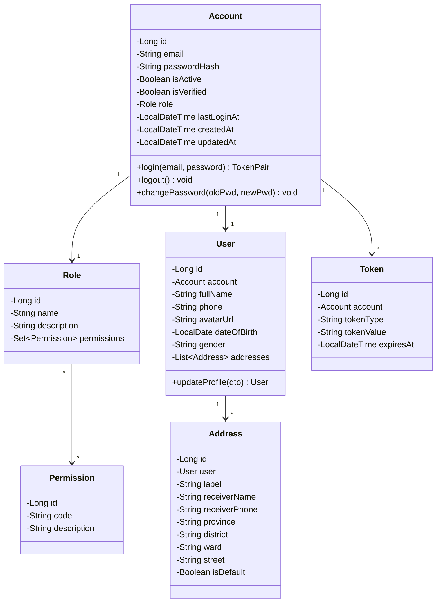
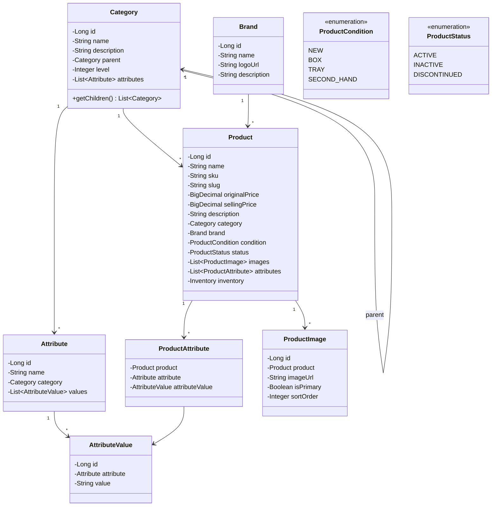
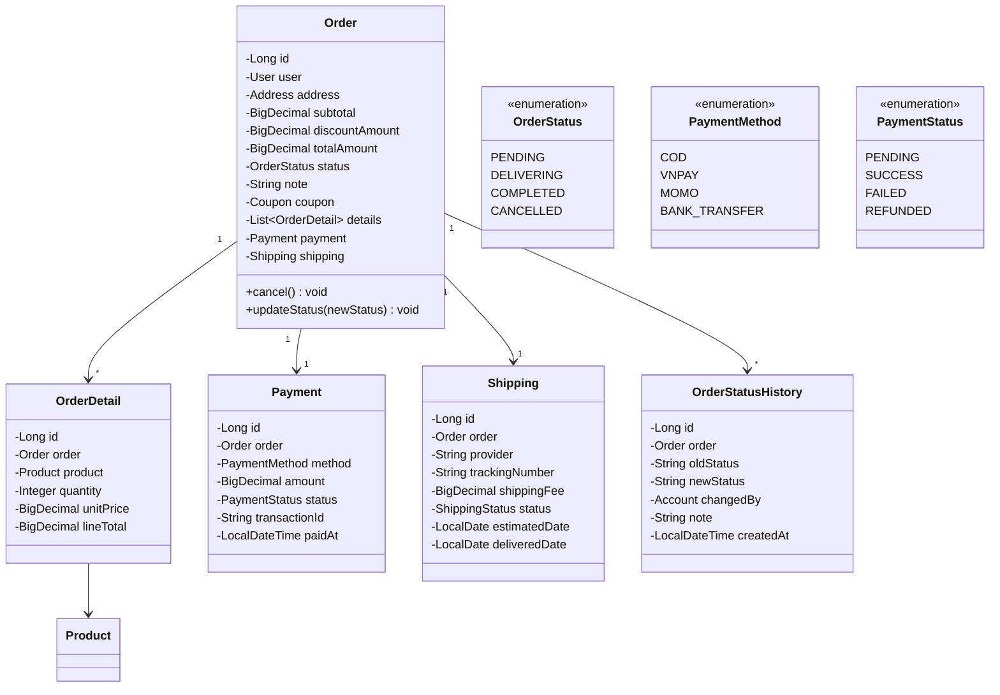
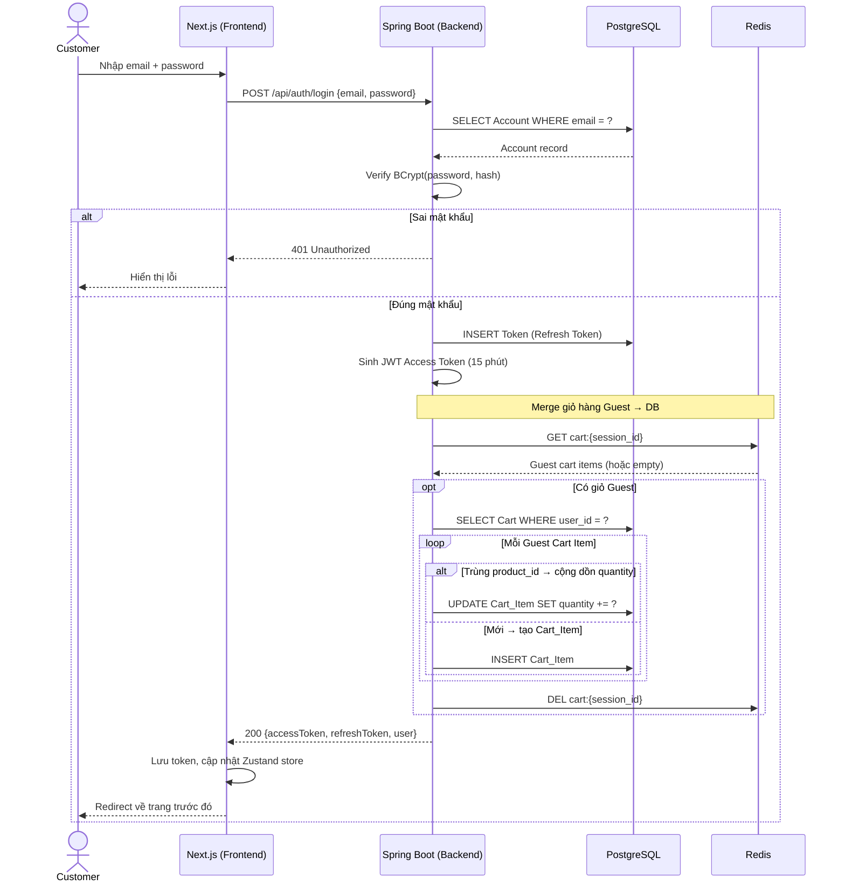
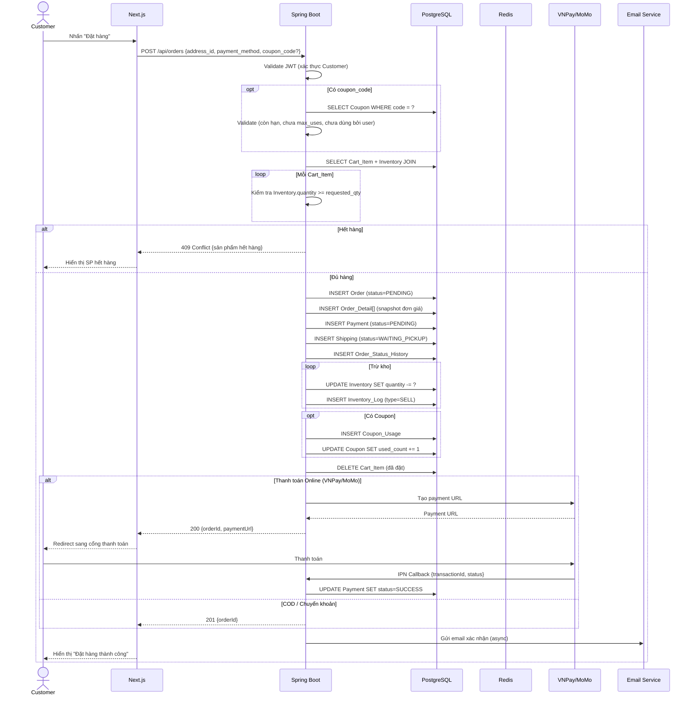
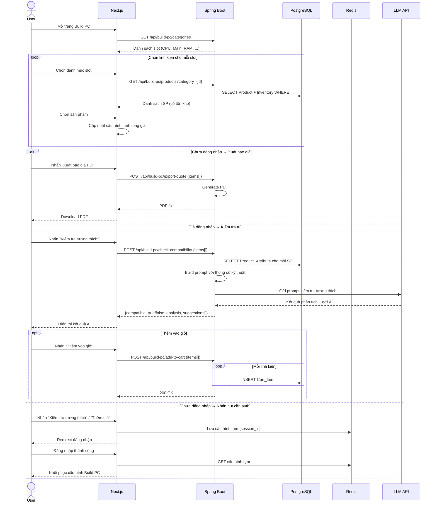
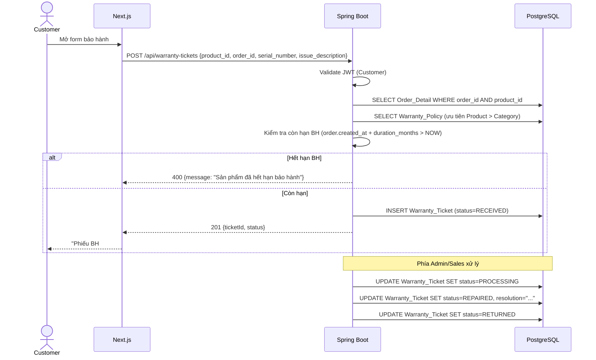
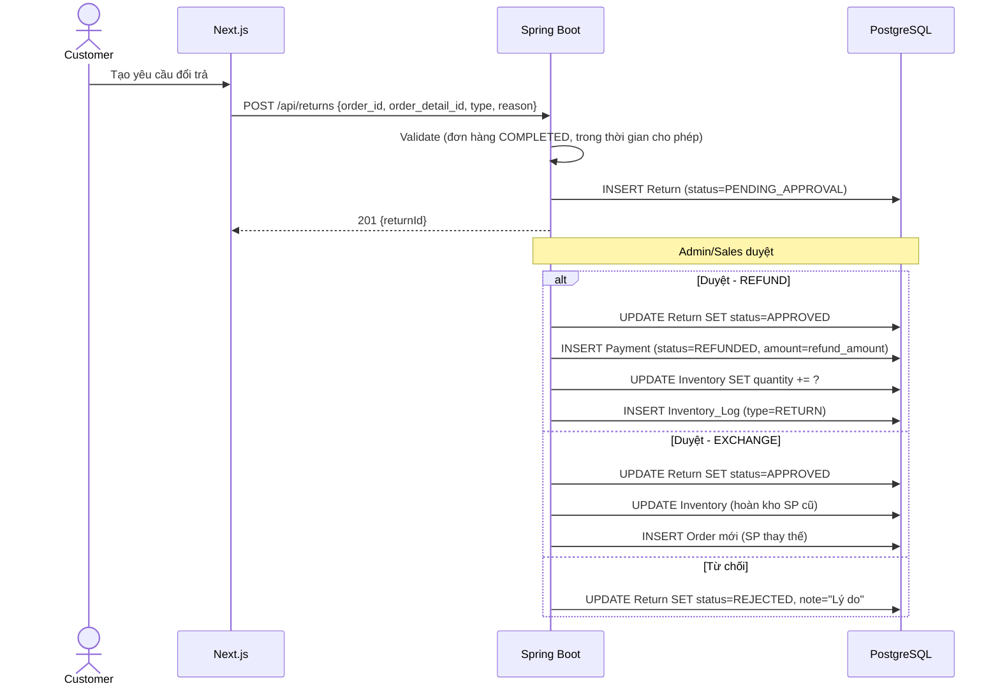
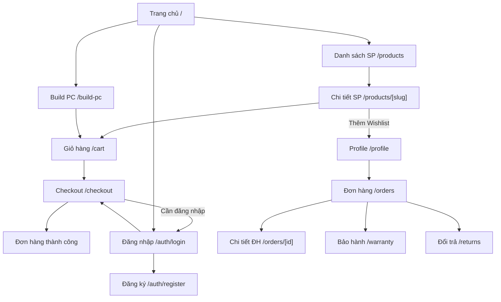

# TÀI LIỆU MÔ TẢ THIẾT KẾ PHẦN MỀM
## (Software Design Description – SDD)

**Dự án:** Hệ thống Website Thương mại Điện tử Phân phối Linh kiện Máy tính  
**Phiên bản:** 1.0  
**Ngày tạo:** 2026-03-25  
**Trạng thái:** Bản nháp (Draft)  

---

## Lịch sử thay đổi tài liệu

| Phiên bản | Ngày | Tác giả | Mô tả thay đổi |
|:----------|:-----|:--------|:----------------|
| 1.0 | 2026-03-25 | — | Tạo mới tài liệu |

---

## Mục lục

1. [Giới thiệu](#1-giới-thiệu)
   - 1.1 [Mục đích](#11-mục-đích-tài-liệu-purpose)
   - 1.2 [Phạm vi](#12-phạm-vi-hệ-thống-scope)
   - 1.3 [Từ điển thuật ngữ](#13-thuật-ngữ--viết-tắt-glossary)
   - 1.4 [Tài liệu tham khảo](#14-tài-liệu-tham-chiếu-references)
   - 1.5 [Tổng quát](#15-tổng-quát)
2. [Mô hình hóa cấu trúc](#2-mô-hình-hóa-cấu-trúc)
3. [Mô hình hóa sự tương tác](#3-mô-hình-hóa-sự-tương-tác)
4. [Kiến trúc tổng thể của hệ thống](#4-kiến-trúc-tổng-thể-của-hệ-thống)
5. [Thiết kế chi tiết lớp](#5-thiết-kế-chi-tiết-lớp)
6. [Thiết kế giao diện](#6-thiết-kế-giao-diện)
7. [Thiết kế dữ liệu](#7-thiết-kế-dữ-liệu)

---

## 1 Giới thiệu

### 1.1 Mục đích tài liệu (Purpose)

Tài liệu thiết kế phần mềm (SDD) này mô tả kiến trúc, thiết kế chi tiết và các quyết định kỹ thuật cho **Hệ thống Website Thương mại Điện tử Phân phối Linh kiện Máy tính, PC Lắp ráp và Thiết bị Công nghệ**. Tài liệu được xây dựng dựa trên tài liệu phân tích yêu cầu (SRS) đã được phê duyệt, nhằm cung cấp cái nhìn tổng quan và chi tiết về cách hệ thống sẽ được triển khai.

**Đối tượng đọc:** Đội ngũ phát triển (Developer), Kiến trúc sư phần mềm (Architect), Quản lý dự án (PM), Đội ngũ kiểm thử (QA/QC), và các bên liên quan kỹ thuật.

### 1.2 Phạm vi hệ thống (Scope)

Hệ thống bao gồm các module chức năng chính sau:

| STT | Module | Mô tả ngắn |
|:----|:-------|:------------|
| M01 | Xác thực & Phân quyền | Đăng ký, Đăng nhập, RBAC (Role-Based Access Control) |
| M02 | Quản lý Sản phẩm | CRUD Product, Category, Brand, Attribute, Product\_Image |
| M03 | Trải nghiệm Mua sắm | Tìm kiếm/Lọc, Giỏ hàng (Guest + Customer), Wishlist |
| M04 | Đơn hàng & Thanh toán | Checkout, Payment (COD/VNPay/MoMo/CK), Shipping |
| M05 | Xây dựng Cấu hình PC | Build PC, AI (LLM) kiểm tra tương thích |
| M06 | Quản lý Kho hàng | Inventory, Inventory\_Log, Supplier |
| M07 | Khuyến mãi | Coupon, Coupon\_Usage |
| M08 | Tương tác Người dùng | Review, Review\_Image |
| M09 | Bảo hành & Đổi trả | Warranty\_Policy, Warranty\_Ticket, Return/Refund |
| M10 | Quản trị Hệ thống | Quản lý tài khoản, Thống kê doanh thu |

Tài liệu này bao gồm cả thiết kế kỹ thuật (backend, database, API) và thiết kế giao diện người dùng (UI/UX), được tích hợp trong các phần tương ứng.

### 1.3 Thuật ngữ & Viết tắt (Glossary)

| Thuật ngữ | Định nghĩa |
|:----------|:-----------|
| SDD | Software Design Document — Tài liệu thiết kế phần mềm |
| SRS | Software Requirements Specification — Đặc tả yêu cầu phần mềm |
| RBAC | Role-Based Access Control — Phân quyền dựa trên vai trò |
| API | Application Programming Interface — Giao diện lập trình ứng dụng |
| REST | Representational State Transfer — Kiến trúc API phổ biến |
| JWT | JSON Web Token — Chuẩn token xác thực |
| LLM | Large Language Model — Mô hình ngôn ngữ lớn (AI) |
| CRUD | Create, Read, Update, Delete — Các thao tác cơ bản |
| SKU | Stock Keeping Unit — Mã quản lý kho |
| COD | Cash On Delivery — Thanh toán khi nhận hàng |
| CMS | Content Management System — Hệ quản trị nội dung |
| ER / ERD | Entity-Relationship (Diagram) — Sơ đồ quan hệ thực thể |
| DTO | Data Transfer Object — Đối tượng truyền dữ liệu |
| UML | Unified Modeling Language — Ngôn ngữ mô hình hóa |

### 1.4 Tài liệu tham chiếu (References)

| Mã tài liệu | Tên tài liệu | Phiên bản |
|:-------------|:--------------|:----------|
| SRS-v1.0 | Tài liệu Phân tích Yêu cầu (requirement\_analysis.md) | 1.0 |
| IEEE 1016-2009 | IEEE Standard for Information Technology — Software Design Descriptions | — |
| UML-diagrams | The Unified Modeling Language, https://www.uml-diagrams.org/ | — |

### 1.5 Tổng quát

Tài liệu này được viết dựa theo chuẩn IEEE 1016-2009 (Software Design Descriptions), với cấu trúc được chia làm bảy phần:

1. **Phần 1:** Cung cấp cái nhìn tổng quan về các thành phần của SDD, phạm vi hệ thống và thuật ngữ.
2. **Phần 2:** Mô hình hóa cấu trúc các ca sử dụng — biểu đồ lớp cho từng module.
3. **Phần 3:** Mô hình hóa sự tương tác — biểu đồ tuần tự (Sequence Diagram) cho các luồng nghiệp vụ chính.
4. **Phần 4:** Kiến trúc tổng thể hệ thống — kiến trúc phân lớp, nguyên tắc thiết kế, Design System UI/UX.
5. **Phần 5:** Thiết kế chi tiết lớp — thiết kế thành phần (Component Design) cho các Service, bảo mật, yêu cầu phi chức năng.
6. **Phần 6:** Thiết kế giao diện hệ thống — API Design, Wireframes, Responsive Design, Component States.
7. **Phần 7:** Thiết kế mô hình dữ liệu — ERD, schema chi tiết, quan hệ giữa các thực thể.

---

## 2 Mô hình hóa cấu trúc

### 2.1 Biểu đồ lớp — Module Authentication & Authorization



### 2.2 Biểu đồ lớp — Module Product Catalog



### 2.3 Biểu đồ lớp — Module Order & Payment



---

## 3 Mô hình hóa sự tương tác

### 3.1 Luồng Đăng nhập & Merge giỏ hàng



### 3.2 Luồng Checkout & Tạo đơn hàng



### 3.3 Luồng Build PC + Kiểm tra tương thích AI



### 3.4 Luồng Gửi yêu cầu bảo hành



### 3.5 Luồng Đổi trả & Hoàn tiền



---

## 4 Kiến trúc tổng thể của hệ thống

### 4.1 Kiểu kiến trúc (Architectural Style)

Hệ thống được thiết kế theo kiến trúc **Monolithic phân lớp (Layered Monolithic Architecture)** với khả năng mở rộng theo hướng **Modular Monolith**, giúp dễ dàng tách module thành microservice khi cần thiết trong tương lai.

**Lý do lựa chọn:**
- Phù hợp với quy mô đội ngũ phát triển nhỏ/vừa.
- Giảm complexity về vận hành (deployment, monitoring) so với microservice.
- Vẫn đảm bảo tính module hóa, dễ bảo trì, dễ test.

### 4.2 Sơ đồ kiến trúc tổng quan (High-Level Architecture Diagram)

```
┌──────────────────────────────────────────────────────────────────┐
│                     CLIENT LAYER (Lớp Trình bày)                 │
│  ┌─────────────────────┐     ┌──────────────────────────────┐   │
│  │  Customer Web App   │     │  Admin CMS Web App           │   │
│  │  (Next.js App Router)│     │  (Next.js App Router)        │   │
│  │  - Hiển thị SP      │     │  - Quản lý SP, Đơn hàng     │   │
│  │  - Giỏ hàng Guest   │     │  - Quản lý Kho, Tài khoản   │   │
│  │  - Build PC         │     │  - Thống kê Doanh thu        │   │
│  │  - Checkout         │     │  - Bảo hành, Đổi trả        │   │
│  └────────┬────────────┘     └──────────────┬───────────────┘   │
│           │            HTTPS / REST API       │                  │
└───────────┼──────────────────────────────────┼──────────────────┘
            │                                  │
┌───────────┼──────────────────────────────────┼──────────────────┐
│           ▼          API GATEWAY LAYER        ▼                  │
│  ┌──────────────────────────────────────────────────────────┐   │
│  │  API Gateway / Reverse Proxy (Nginx)                     │   │
│  │  - Routing, Rate Limiting, CORS, SSL Termination         │   │
│  └──────────────────────┬───────────────────────────────────┘   │
└─────────────────────────┼──────────────────────────────────────┘
                          │
┌─────────────────────────┼──────────────────────────────────────┐
│                         ▼                                       │
│              APPLICATION LAYER (Lớp Ứng dụng)                   │
│  ┌──────────────────────────────────────────────────────────┐   │
│  │  Backend Application Server                              │   │
│  │                                                          │   │
│  │  ┌──────────┐ ┌──────────┐ ┌──────────┐ ┌──────────┐   │   │
│  │  │Controller│ │Controller│ │Controller│ │Controller│   │   │
│  │  │  Auth    │ │ Product  │ │  Order   │ │Notification│  │   │
│  │  └────┬─────┘ └────┬─────┘ └────┬─────┘ └────┬─────┘   │   │
│  │       │             │            │             │         │   │
│  │  ┌────┴─────────────┴────────────┴─────────────┴─────┐   │   │
│  │  │              SERVICE LAYER (Business Logic)       │   │   │
│  │  │  AuthService, ProductService, OrderService,       │   │   │
│  │  │  CartService, NotificationService, InventoryService,│   │   │
│  │  │  CouponService, ReviewService, WarrantyService,   │   │   │
│  │  │  ShippingService, PaymentService, ReportService   │   │   │
│  │  └────────────────────────┬──────────────────────────┘   │   │
│  │                           │                              │   │
│  │  ┌────────────────────────┴──────────────────────────┐   │   │
│  │  │          REPOSITORY / DATA ACCESS LAYER           │   │   │
│  │  │  AccountRepo, ProductRepo, OrderRepo, CartRepo,  │   │   │
│  │  │  InventoryRepo, CouponRepo, ReviewRepo, ...      │   │   │
│  │  └────────────────────────┬──────────────────────────┘   │   │
│  └───────────────────────────┼──────────────────────────────┘   │
└──────────────────────────────┼──────────────────────────────────┘
                               │
┌──────────────────────────────┼──────────────────────────────────┐
│                              ▼                                   │
│                    DATA LAYER (Lớp Dữ liệu)                     │
│   ┌──────────────┐   ┌──────────────┐   ┌──────────────┐       │
│   │  PostgreSQL   │   │    Redis     │   │    MinIO     │       │
│   │ (Primary DB)  │   │  (Cache &    │   │  (Images,    │       │
│   │               │   │   Session)   │   │   PDF, ...)  │       │
│   └──────────────┘   └──────────────┘   └──────────────┘       │
└─────────────────────────────────────────────────────────────────┘
                               │
┌──────────────────────────────┼──────────────────────────────────┐
│              EXTERNAL SERVICES (Dịch vụ bên ngoài)               │
│   ┌──────────────┐   ┌──────────────┐   ┌──────────────┐       │
│   │  VNPay /     │   │  LLM API     │   │  Email       │       │
│   │  MoMo API    │   │  (AI tương   │   │  Service     │       │
│   │  (Thanh toán)│   │   thích)     │   │  (SMTP)      │       │
│   └──────────────┘   └──────────────┘   └──────────────┘       │
└─────────────────────────────────────────────────────────────────┘
```

### 4.3 Phân lớp kiến trúc (Architectural Layers)

| Lớp | Trách nhiệm | Công nghệ đề xuất |
|:----|:-------------|:-------------------|
| **Presentation Layer** | Giao diện người dùng (Customer, Admin/Sales/Warehouse) | Next.js (App Router) + TypeScript + Tailwind CSS + shadcn/ui |
| **API Gateway** | Routing, Rate Limiting, CORS, SSL, Load Balancing | Nginx / Spring Cloud Gateway |
| **Controller Layer** | Nhận request, validate input, trả response (REST API) | Spring Boot (REST Controller) |
| **Service Layer** | Business Logic, Transaction Management | Spring Service + @Transactional |
| **Repository Layer** | Truy xuất dữ liệu, DAO Pattern | Spring Data JPA / Hibernate |
| **Data Layer** | Lưu trữ dữ liệu chính | PostgreSQL |
| **Cache Layer** | Session (Guest Cart), Caching dữ liệu hot | Redis |
| **File Storage** | Hình ảnh sản phẩm, Review, PDF báo giá | MinIO |
| **External Integration** | Cổng thanh toán, AI (LLM), Email | VNPay/MoMo SDK, LLM API, SMTP |

### 4.4 Nguyên tắc thiết kế (Design Principles)

1. **Separation of Concerns (SoC):** Mỗi lớp chỉ đảm nhận một trách nhiệm duy nhất.
2. **Dependency Inversion:** Các lớp trên phụ thuộc abstraction (interface), không phụ thuộc implementation.
3. **Single Responsibility Principle:** Mỗi Service/Repository xử lý một nhóm nghiệp vụ cụ thể.
4. **DRY (Don't Repeat Yourself):** Tái sử dụng logic chung qua base class hoặc utility.
5. **Fail-Fast:** Validate input sớm ở Controller, trả lỗi rõ ràng.
6. **Stateless API:** Backend không lưu trạng thái phiên (session) — sử dụng JWT + Redis.

### 4.5 Design System (UI/UX)

#### 4.5.1 Triết lý thiết kế

> **Phong cách tổng thể:** Lấy cảm hứng từ An Phát PC — NỀN SÁNG (trắng/xám nhạt), header xanh đậm, giá sale đỏ, typography đậm rõ ràng. **KHÔNG HỖ TRỢ DARK MODE.**

| # | Nguyên tắc | Mô tả |
|:--|:-----------|:------|
| DP-01 | **Sáng & Chuyên nghiệp** | Nền trắng sạch, header xanh đậm nổi bật, giá đỏ bắt mắt. |
| DP-02 | **Consistency** | Đồng nhất style, spacing, typography, color trên toàn bộ ứng dụng. |
| DP-03 | **Performance First** | Skeleton loading, lazy load images, pagination thay vì infinite scroll. |
| DP-04 | **Mobile Responsive** | Thiết kế mobile-first, breakpoints rõ ràng. |
| DP-05 | **Accessibility** | WCAG 2.1 AA — contrast đủ, keyboard navigation, alt text. |
| DP-06 | **Trust & Credibility** | Giá rõ ràng, BH rõ ràng, hotline nổi bật, badge "còn hàng" xanh lá. |
| DP-07 | **Tươi sáng & Tràn đầy năng lượng** | Dùng màu sắc tươi cho banner/CTA. Tránh giao diện nhạt nhẽo. |

#### 4.5.2 User Personas tham chiếu

| Persona | Mục tiêu chính | Pain Points |
|:--------|:---------------|:------------|
| **Khách hàng cá nhân** (18-35) | Mua linh kiện đúng, giá tốt, BH rõ ràng | Sợ mua nhầm linh kiện không tương thích |
| **Game thủ** (16-30) | Build PC Gaming, so sánh cấu hình | Muốn tool Build PC nhanh, trực quan |
| **Khách doanh nghiệp** *(Giai đoạn 2)* | Mua số lượng lớn, xuất hóa đơn | Cần báo giá PDF, liên hệ nhanh |
| **Admin/Sales** | Quản lý đơn hàng, kho hàng | Cần dashboard rõ ràng, thao tác nhanh |

#### 4.5.3 Color Palette

> **CHỈ HỖ TRỢ LIGHT MODE.** Không có Dark mode toggle.

**Màu chủ đạo:**

| Token | Hex | Tailwind | Mục đích sử dụng |
|:------|:----|:---------|:-----------------|
| `--header-bg` | `#1A4B9C` | `bg-[#1A4B9C]` | Header chính, nền navigation bar |
| `--header-top` | `#0D2B5E` | `bg-[#0D2B5E]` | Thanh thông tin trên cùng |
| `--primary` | `#2563EB` (Blue 600) | `bg-blue-600` | CTA phụ, link, active state |
| `--primary-hover` | `#1D4ED8` (Blue 700) | `bg-blue-700` | Hover state |

**Màu accent (Sale, CTA):**

| Token | Hex | Tailwind | Mục đích sử dụng |
|:------|:----|:---------|:-----------------|
| `--sale-price` | `#E31837` | `text-[#E31837]` | **Giá bán** (luôn dùng màu đỏ đậm cho giá) |
| `--sale-badge` | `#EF4444` (Red 500) | `bg-red-500` | Badge giảm giá, flash sale |
| `--cta-buy` | `#E31837` | `bg-[#E31837]` | Button "ĐẶT MUA NGAY" |
| `--cta-cart` | `#2563EB` | `bg-blue-600` | Button "CHO VÀO GIỎ" |
| `--highlight` | `#FBBF24` (Amber 400) | `bg-amber-400` | Banner highlight, flash sale accent |

**Màu nền & Text:**

| Token | Hex | Tailwind | Mục đích sử dụng |
|:------|:----|:---------|:-----------------|
| `--background` | `#FFFFFF` | `bg-white` | Nền chính trang |
| `--background-alt` | `#F3F4F6` (Gray 100) | `bg-gray-100` | Nền phụ (section, page background) |
| `--card` | `#FFFFFF` | `bg-white` | Nền card sản phẩm |
| `--text-primary` | `#111827` (Gray 900) | `text-gray-900` | Text chính |
| `--text-secondary` | `#6B7280` (Gray 500) | `text-gray-500` | Text phụ, caption |
| `--text-muted` | `#9CA3AF` (Gray 400) | `text-gray-400` | Text rất nhạt (giá gốc gạch ngang) |

**Màu trạng thái:**

| Token | Hex | Tailwind | Mục đích sử dụng |
|:------|:----|:---------|:-----------------|
| `--success` | `#22C55E` (Green 500) | `bg-green-500` | Còn hàng, thành công |
| `--warning` | `#F59E0B` (Amber 500) | `bg-amber-500` | Cảnh báo, sắp hết hàng |
| `--destructive` | `#EF4444` (Red 500) | `bg-red-500` | Lỗi, xóa, hết hàng |
| `--border` | `#E5E7EB` (Gray 200) | `border-gray-200` | Border, divider |
| `--footer-bg` | `#1E293B` (Slate 800) | `bg-slate-800` | Nền footer xanh đậm tối |

#### 4.5.4 Typography

| Token | Font | Size | Weight | Use case |
|:------|:-----|:-----|:-------|:---------|
| `h1` | Inter | 30px / 1.875rem | 700 (Bold) | Tiêu đề trang |
| `h2` | Inter | 24px / 1.5rem | 600 (SemiBold) | Tiêu đề section |
| `h3` | Inter | 20px / 1.25rem | 600 | Tiêu đề card, sub-section |
| `body` | Inter | 16px / 1rem | 400 (Regular) | Nội dung chính |
| `body-sm` | Inter | 14px / 0.875rem | 400 | Mô tả phụ, caption |
| `caption` | Inter | 12px / 0.75rem | 400 | Label, badge, hint |
| `price` | Inter | 20px / 1.25rem | 700 | Giá bán |
| `price-original` | Inter | 14px / 0.875rem | 400 + line-through | Giá gốc (khi giảm) |

> **Font loading:** Google Fonts — `Inter` qua `next/font/google` (tự host, không request external).

#### 4.5.5 Spacing & Grid

| Token | Value | Sử dụng |
|:------|:------|:--------|
| `--space-xs` | 4px | Khoảng cách giữa icon-text |
| `--space-sm` | 8px | Padding nhỏ, gap grid |
| `--space-md` | 16px | Padding card, gap giữa items |
| `--space-lg` | 24px | Section spacing |
| `--space-xl` | 32px | Page section gap |
| `--space-2xl` | 48px | Header/Footer margin |
| `--radius-sm` | 6px | Input, small button |
| `--radius-md` | 8px | Card |
| `--radius-lg` | 12px | Modal, dialog |
| **Grid** | 12 columns | Container max-width: 1280px, gap: 16px |

#### 4.5.6 Component Library (shadcn/ui)

| Component | Biến thể | Sử dụng trong |
|:----------|:---------|:--------------|
| `Button` | default, destructive, outline, ghost, link | CTA, form submit, actions |
| `Input` | text, password, search | Form fields |
| `Select` | single, searchable | Filter, dropdown |
| `Card` | default | Product card, order card |
| `Dialog` | default | Confirm delete, preview ảnh |
| `Sheet` | side (right) | Mobile menu, cart sidebar |
| `Table` | default + pagination | Admin data tables |
| `Badge` | default, destructive, outline | Status tags, sale badge |
| `Avatar` | default | User avatar |
| `Skeleton` | default | Loading states |
| `Toast` | success, error, warning | Notification messages |
| `Tabs` | default | Product tabs (Mô tả, Thông số, Đánh giá) |
| `Breadcrumb` | default | Navigation hierarchy |
| `Pagination` | default | Product listing, order list |
| `DropdownMenu` | default | User menu, action menu |
| `Accordion` | default | FAQ, filter sidebar (mobile) |
| `Separator` | horizontal | Section divider |

#### 4.5.7 Icons (Lucide Icons)

| Icon | Sử dụng |
|:-----|:--------|
| `ShoppingCart` | Giỏ hàng |
| `Heart` | Wishlist |
| `Search` | Tìm kiếm |
| `User` | Tài khoản |
| `Package` | Đơn hàng |
| `Monitor` | Build PC |
| `Star` | Đánh giá |
| `Shield` | Bảo hành |
| `RotateCcw` | Đổi trả |
| `Phone` | Hotline (header top bar) |
| `MapPin` | Showroom (header top bar) |
| `ChevronRight` | Breadcrumb, navigation |
| `Filter` | Mở panel bộ lọc |
| `Truck` | Vận chuyển |
| `CreditCard` | Thanh toán |
| `Cpu` | Logo / PC Parts brand icon |

---

## 5 Thiết kế chi tiết lớp

### 5.1 AuthService — Xác thực & Phân quyền

**Trách nhiệm:** Đăng ký, đăng nhập, đăng xuất, quản lý JWT Token, RBAC.

**Luồng xử lý chính:**

- **Đăng ký:** Validate input → Kiểm tra trùng email/SĐT → Hash password (BCrypt) → Tạo Account (Role=Customer) + User → Trả 201 Created.
- **Đăng nhập:** Validate email/password → Kiểm tra is\_active → Sinh Access Token (JWT, 15 phút) + Refresh Token (30 ngày, lưu DB) → Merge giỏ hàng Session vào Cart DB → Trả token.
- **Đăng xuất:** Xóa Refresh Token trong DB → Xóa giỏ hàng Session (Redis) → Client xóa Access Token. *(Lưu ý: Cart DB được giữ nguyên cho lần đăng nhập sau, chỉ xóa giỏ tạm Session — xem thêm CartService mục 5.2)*
- **Authorization:** Middleware/Filter kiểm tra JWT → Trích xuất Role → Kiểm tra Permission qua Role\_Permission → Cho phép hoặc từ chối (403).

### 5.2 CartService — Giỏ hàng

**Trách nhiệm:** Quản lý giỏ hàng Guest (Session/Redis) và Customer (Database).

**Quy tắc nghiệp vụ quan trọng:**

1. **Guest thêm SP:** Lưu vào Redis với key = session\_id. Kiểm tra `Inventory.quantity` trước khi thêm.
2. **Đăng nhập (Merge):** Đọc giỏ từ Redis (session\_id) → Với mỗi item: nếu trùng product\_id trong Cart DB thì cộng dồn quantity; nếu mới thì tạo Cart\_Item → Xóa giỏ Redis.
3. **Đăng xuất:** Xóa giỏ Session (Redis). Cart DB được giữ nguyên cho lần đăng nhập sau.
4. **Sửa số lượng:** Kiểm tra `quantity ≤ Inventory.quantity`. Nếu vượt → giới hạn ở mức tối đa và trả thông báo.

### 5.3 OrderService — Đơn hàng & Checkout

**Trách nhiệm:** Xử lý checkout, tạo Order, tích hợp Payment, quản lý trạng thái.

**Luồng Checkout:**

1. Nhận request: danh sách Cart\_Item, address\_id, payment\_method, coupon\_code (opt).
2. Validate Coupon (nếu có): code đúng, còn hạn, chưa vượt max\_uses, chưa sử dụng bởi user (Coupon\_Usage).
3. Kiểm tra tồn kho: với mỗi Cart\_Item, kiểm tra `Inventory.quantity ≥ requested_qty`. Nếu không đủ → trả lỗi chỉ rõ SP hết hàng.
4. Tạo Order (status=PENDING) + Order\_Detail (snapshot đơn giá) + Payment (status=PENDING) + Shipping (status=WAITING\_PICKUP) + Order\_Status\_History.
5. Trừ kho: `Inventory.quantity -= qty`, tạo Inventory\_Log (type=SELL).
6. Nếu có Coupon: tạo Coupon\_Usage, tăng Coupon.used\_count.
7. Xóa Cart\_Item đã thanh toán.
8. Nếu online payment (VNPay/MoMo): redirect sang cổng → callback cập nhật Payment.status + transaction\_id.
9. Gửi email xác nhận.

**State Machine — Trạng thái đơn hàng:**

```
  PENDING ────────────► DELIVERING ────────────► COMPLETED
     │                       │                        
     │                       │                        
     └───────────────────────┴─────────► CANCELLED    
```

**Quy tắc chuyển trạng thái:**
- `PENDING → DELIVERING`: Sales/Admin xác nhận giao cho vận chuyển.
- `DELIVERING → COMPLETED`: Shipping.status = DELIVERED → tự động chuyển.
- `Any → CANCELLED`: Hoàn kho (Inventory\_Log type=RETURN), hoàn Coupon (giảm used\_count, xóa Coupon\_Usage).

### 5.4 BuildPCService — Xây dựng cấu hình PC

**Trách nhiệm:** Hiển thị slot linh kiện, tính tổng giá, xuất báo giá PDF, kiểm tra tương thích AI.

**Quy tắc quan trọng:**

- **Không cần đăng nhập:** Chọn linh kiện, xem tổng giá, xuất báo giá PDF.
- **Cần đăng nhập:** Kiểm tra tương thích AI, thêm vào giỏ hàng, tạo đơn hàng.
- **Khi chưa đăng nhập nhấn nút cần đăng nhập:** Lưu cấu hình vào Session (Redis) → Redirect đăng nhập → Sau đăng nhập, khôi phục cấu hình từ Session.
- **AI Compatibility Check:** Gửi thông số kỹ thuật (Attribute\_Value) của các linh kiện đã chọn tới LLM API → Nhận phân tích + gợi ý thay thế → Trả cho user.
- **Thêm vào giỏ:** Mỗi linh kiện trong cấu hình → tạo 1 Cart\_Item riêng lẻ trong Cart.

### 5.5 InventoryService — Quản lý kho

**Trách nhiệm:** Theo dõi tồn kho, nhập hàng, kiểm kê, cảnh báo hết hàng.

**Quy tắc:**
- Mỗi thao tác thay đổi Inventory.quantity **bắt buộc** phải tạo Inventory\_Log tương ứng (audit trail).
- Cảnh báo khi `Inventory.quantity ≤ Inventory.low_stock_threshold`.
- Điều chỉnh âm dẫn đến tồn kho < 0 → yêu cầu xác nhận (confirmation flag trong request).

### 5.6 WarrantyService & ReturnService — Bảo hành & Đổi trả

**Trách nhiệm:** Quản lý chính sách bảo hành, phiếu bảo hành, yêu cầu đổi trả.

**Quy tắc bảo hành:**
- Kiểm tra Warranty\_Policy: ưu tiên Product > Category.
- Kiểm tra thời hạn: `Order.created_at + duration_months > NOW()`.
- State Machine phiếu BH: `RECEIVED → PROCESSING → REPAIRED/REJECTED → RETURNED`.

**Quy tắc đổi trả:**
- Duyệt + Hoàn tiền: Tạo Payment (status=REFUNDED), Inventory\_Log (type=RETURN).
- Duyệt + Đổi hàng: Hoàn kho SP cũ, tạo Order mới cho SP thay thế.
- Từ chối: Bắt buộc nhập lý do.

### 5.7 Thiết kế bảo mật (Security Design)

#### 5.7.1 Xác thực (Authentication)

| Thành phần | Chi tiết |
|:-----------|:---------|
| Giao thức | HTTPS (TLS 1.3) cho mọi kết nối |
| Mã hóa mật khẩu | BCrypt (cost factor ≥ 12) |
| Token xác thực | JWT (Access Token: 15 phút, Refresh Token: 30 ngày lưu DB) |
| Truyền token | Header `Authorization: Bearer <token>` |
| Refresh flow | Client dùng Refresh Token để lấy Access Token mới khi hết hạn |

#### 5.7.2 Phân quyền (Authorization — RBAC)

| Role | Quyền truy cập |
|:-----|:---------------|
| **Guest** | Xem/tìm SP, Giỏ hàng tạm (Session), Build PC (chọn + xuất báo giá), Đăng ký |
| **Customer** | Tất cả Guest + Checkout, Order, Review, Wishlist, Warranty, Return, Build PC (AI + Cart) |
| **Sales** | Quản lý Order, Shipping, Coupon, Thống kê, Xử lý BH & Đổi trả |
| **Warehouse** | Quản lý Inventory (Nhập/Kiểm kê), xem tồn kho |
| **Admin** | Tất cả Sales + Warehouse + CRUD Category/Product/Brand/Supplier/Account/Warranty\_Policy |

**Cơ chế kiểm tra:**
- Middleware (Spring Security Filter) giải mã JWT → lấy `role_id` → truy vấn Role\_Permission → kiểm tra `permission.code` khớp với endpoint yêu cầu.
- Nếu không có quyền → trả HTTP 403 Forbidden.

#### 5.7.3 Bảo mật dữ liệu

| Mối quan tâm | Giải pháp |
|:-------------|:----------|
| SQL Injection | Sử dụng Parameterized Queries / ORM (JPA) |
| XSS | Escape output, Content-Security-Policy header |
| CSRF | SameSite Cookie, CSRF Token cho form-based |
| Rate Limiting | Giới hạn requests/phút tại API Gateway (Nginx) |
| Input Validation | Validate tại Controller (Bean Validation / @Valid) |
| Sensitive Data | Không trả password\_hash trong response; Mask thông tin thanh toán |
| File Upload | Validate file type, kích thước; lưu ngoài web root |
| CORS | Chỉ cho phép origin của frontend |

### 5.8 Yêu cầu phi chức năng (Non-Functional Requirements)

#### 5.8.1 Hiệu năng (Performance)

| Chỉ số | Mục tiêu |
|:-------|:---------|
| Thời gian phản hồi API (P95) | ≤ 500ms cho GET, ≤ 1000ms cho POST/PUT |
| Thời gian tải trang (Frontend) | ≤ 3 giây (First Contentful Paint) |
| Throughput | ≥ 100 requests/giây (concurrent) |
| Database query | ≤ 200ms cho các truy vấn phức tạp |

#### 5.8.2 Khả năng mở rộng (Scalability)

| Chiến lược | Mô tả |
|:-----------|:------|
| Horizontal Scaling | Backend stateless → mở rộng ngang bằng Load Balancer |
| Database Read Replica | PostgreSQL Streaming Replication cho read-heavy queries |
| Caching | Redis cho Session, Product Listing cache, Category tree |
| CDN | Sử dụng CDN cho static assets (ảnh SP, JS, CSS) |

#### 5.8.3 Khả dụng (Availability)

| Chỉ số | Mục tiêu |
|:-------|:---------|
| Uptime | ≥ 99.5% (tương đương ≤ 1.83 ngày downtime/năm) |
| Backup | Database backup hàng ngày, retention 30 ngày |
| Disaster Recovery | RTO ≤ 4 giờ, RPO ≤ 1 giờ |

#### 5.8.4 Khả năng bảo trì (Maintainability)

| Yêu cầu | Mô tả |
|:---------|:------|
| Code Convention | Tuân thủ coding standard của ngôn ngữ/framework |
| Documentation | API Documentation tự động (Swagger/OpenAPI) |
| Logging | Structured logging (JSON format), tập trung qua ELK/Grafana |
| Monitoring | Health check endpoint, metrics (Prometheus + Grafana) |
| Testing | Unit Test coverage ≥ 70%, Integration Test cho các flow chính |
| CI/CD | Tự động build, test, deploy qua pipeline (GitHub Actions) |

### 5.9 Ma trận truy xuất yêu cầu (Requirements Traceability Matrix)

| ID Yêu cầu | Tên yêu cầu | Module | Use Case | Thực thể chính |
|:------------|:-------------|:-------|:---------|:---------------|
| UR-AUTH-01 | Đăng ký & Đăng nhập | M01 | UC-CUS-04, UC-CUS-05, UC-CUS-06 | Account, User, Token, Cart |
| UR-AUTH-02 | Phân quyền RBAC | M01 | — | Role, Permission, Role\_Permission |
| UR-PROF-01 | Quản lý thông tin cá nhân | M10 | UC-CUS-14 | User, Account |
| UR-ADDR-01 | Quản lý địa chỉ | M10 | UC-CUS-12 | Address |
| UR-CAT-01 | Quản lý danh mục | M02 | UC-AD-01 | Category, Attribute, Attribute\_Value |
| UR-PROD-01 | Quản lý sản phẩm | M02 | UC-AD-02 | Product, Product\_Attribute, Product\_Image, Inventory |
| UR-BRAND-01 | Quản lý thương hiệu | M02 | UC-AD-02 | Brand |
| UR-SHOP-01 | Lọc sản phẩm thông minh | M03 | UC-CUS-01 | Product, Product\_Attribute, Attribute, Inventory |
| UR-SHOP-02 | Quản lý giỏ hàng | M03 | UC-CUS-03 | Cart, Cart\_Item |
| UR-WISH-01 | Danh sách yêu thích | M03 | UC-CUS-09 | Wishlist |
| UR-ORD-01 | Tạo đơn hàng (Checkout) | M04 | UC-CUS-02 | Order, Order\_Detail, Payment, Shipping, Inventory, Inventory\_Log |
| UR-PAY-01 | Thanh toán đa phương thức | M04 | UC-CUS-02 | Payment |
| UR-ORD-02 | Xử lý trạng thái đơn hàng | M04 | UC-AD-03 | Order, Order\_Status\_History |
| UR-ORD-03 | Xem lịch sử đơn hàng | M04 | UC-CUS-13 | Order, Order\_Detail, Payment, Shipping |
| UR-SHIP-01 | Quản lý vận chuyển | M04 | UC-AD-08 | Shipping |
| UR-CPN-01 | Mã giảm giá | M07 | UC-AD-07 | Coupon, Coupon\_Usage |
| UR-INV-01 | Tồn kho & Lịch sử | M06 | UC-AD-04 | Inventory, Inventory\_Log |
| UR-INV-02 | Nhập hàng & Kiểm kê | M06 | UC-AD-04 | Inventory, Inventory\_Log |
| UR-SUP-01 | Quản lý nhà cung cấp | M06 | UC-AD-04 | Supplier |
| UR-REV-01 | Đánh giá sản phẩm | M08 | UC-CUS-07 | Review, Review\_Image |
| UR-BLD-01 | Build PC | M05 | UC-CUS-08 | Product, Cart, Cart\_Item, Order, Order\_Detail |
| UR-AI-01 | Đánh giá tương thích LLM | M05 | UC-CUS-08 | Product\_Attribute (external: LLM API) |
| UR-USR-01 | Quản lý tài khoản | M10 | UC-AD-06 | Account, User, Role, Permission |
| UR-WARPOL-01 | Chính sách bảo hành | M09 | UC-AD-09 | Warranty\_Policy |
| UR-WAR-01 | Bảo hành | M09 | UC-CUS-10, UC-AD-09 | Warranty\_Ticket |
| UR-RET-01 | Đổi trả & Hoàn tiền | M09 | UC-CUS-11, UC-AD-10 | Return, Payment, Inventory\_Log |
| UR-AD-05 | Thống kê doanh thu | M10 | UC-AD-05 | Order, Order\_Detail, Product, Category |

---

## 6 Thiết kế giao diện

### 6.1 API Design Convention

Hệ thống sử dụng **RESTful API** với các quy ước sau:

| Quy ước | Chi tiết |
|:--------|:---------|
| Base URL | `https://api.domain.com/v1` |
| Format | JSON |
| Authentication | Bearer Token (JWT) trong Header `Authorization` |
| Versioning | URL Path versioning (`/v1/`, `/v2/`) |
| Naming | Sử dụng danh từ số nhiều cho resource: `/products`, `/orders` |
| HTTP Methods | GET (đọc), POST (tạo), PUT (cập nhật toàn bộ), PATCH (cập nhật 1 phần), DELETE (xóa) |
| Error Format | `{ "status": 400, "error": "BAD_REQUEST", "message": "..." }` |
| Pagination | `?page=1&size=20&sort=createdAt,desc` |
| Status Codes | 200 OK, 201 Created, 204 No Content, 400 Bad Request, 401 Unauthorized, 403 Forbidden, 404 Not Found, 409 Conflict, 500 Internal Server Error |

### 6.2 Bảng tổng hợp API Endpoints

#### 6.2.1 Module Xác thực (M01 - Auth)

| Method | Endpoint | Mô tả | Actor |
|:-------|:---------|:------|:------|
| POST | `/auth/register` | Đăng ký tài khoản | Guest |
| POST | `/auth/login` | Đăng nhập, sinh JWT, merge giỏ hàng | Guest |
| POST | `/auth/logout` | Đăng xuất, xóa Token | All authenticated |
| POST | `/auth/refresh-token` | Làm mới Access Token | All authenticated |
| POST | `/auth/forgot-password` | Yêu cầu đặt lại mật khẩu | Guest |
| POST | `/auth/reset-password` | Đặt lại mật khẩu bằng token | Guest |

#### 6.2.2 Module Sản phẩm (M02 - Product)

| Method | Endpoint | Mô tả | Actor |
|:-------|:---------|:------|:------|
| GET | `/products` | Danh sách SP (có filter, pagination) | Public |
| GET | `/products/{slug}` | Chi tiết sản phẩm | Public |
| POST | `/admin/products` | Tạo sản phẩm | Admin |
| PUT | `/admin/products/{id}` | Cập nhật sản phẩm | Admin |
| DELETE | `/admin/products/{id}` | Xóa sản phẩm | Admin |
| GET | `/categories` | Danh sách danh mục (phân cấp) | Public |
| POST | `/admin/categories` | Tạo danh mục | Admin |
| PUT | `/admin/categories/{id}` | Cập nhật danh mục | Admin |
| DELETE | `/admin/categories/{id}` | Xóa danh mục | Admin |
| GET | `/brands` | Danh sách thương hiệu | Public |
| POST | `/admin/brands` | Tạo thương hiệu | Admin |
| PUT | `/admin/brands/{id}` | Cập nhật thương hiệu | Admin |
| DELETE | `/admin/brands/{id}` | Xóa thương hiệu | Admin |

#### 6.2.3 Module Mua sắm (M03 - Shopping)

| Method | Endpoint | Mô tả | Actor |
|:-------|:---------|:------|:------|
| GET | `/cart` | Xem giỏ hàng | Guest/Customer |
| POST | `/cart/items` | Thêm sản phẩm vào giỏ | Guest/Customer |
| PATCH | `/cart/items/{id}` | Sửa số lượng | Guest/Customer |
| DELETE | `/cart/items/{id}` | Xóa sản phẩm khỏi giỏ | Guest/Customer |
| GET | `/wishlist` | Danh sách yêu thích | Customer |
| POST | `/wishlist` | Thêm/xóa yêu thích (toggle) | Customer |

#### 6.2.4 Module Đơn hàng & Thanh toán (M04 - Order)

| Method | Endpoint | Mô tả | Actor |
|:-------|:---------|:------|:------|
| POST | `/orders` | Tạo đơn hàng (Checkout) | Customer |
| GET | `/orders` | Danh sách đơn hàng người dùng | Customer |
| GET | `/orders/{id}` | Chi tiết đơn hàng | Customer |
| GET | `/admin/orders` | Danh sách đơn hàng (Admin/Sales) | Admin/Sales |
| PATCH | `/admin/orders/{id}/status` | Cập nhật trạng thái đơn hàng | Admin/Sales |
| POST | `/payments/callback` | Callback từ cổng thanh toán | System |
| GET | `/admin/orders/{id}/shipping` | Xem thông tin shipping | Admin/Sales |
| PUT | `/admin/orders/{id}/shipping` | Cập nhật shipping | Admin/Sales |

#### 6.2.5 Module Build PC (M05)

| Method | Endpoint | Mô tả | Actor |
|:-------|:---------|:------|:------|
| POST | `/products/check-compatibility` | Kiểm tra tương thích AI (LLM) | Customer |

#### 6.2.6 Module Kho hàng (M06 - Inventory)

| Method | Endpoint | Mô tả | Actor |
|:-------|:---------|:------|:------|
| GET | `/admin/inventory` | Danh sách tồn kho | Admin/Warehouse |
| POST | `/admin/inventory/import` | Nhập hàng | Admin/Warehouse |
| POST | `/admin/inventory/adjust` | Kiểm kê / điều chỉnh | Admin/Warehouse |
| GET | `/admin/suppliers` | Danh sách NCC | Admin |
| POST | `/admin/suppliers` | Tạo NCC | Admin |
| PUT | `/admin/suppliers/{id}` | Cập nhật NCC | Admin |
| DELETE | `/admin/suppliers/{id}` | Xóa NCC | Admin |

#### 6.2.7 Module Khuyến mãi (M07 - Coupon)

| Method | Endpoint | Mô tả | Actor |
|:-------|:---------|:------|:------|
| GET | `/admin/coupons` | Danh sách mã giảm giá | Admin/Sales |
| POST | `/admin/coupons` | Tạo mã giảm giá | Admin/Sales |
| PUT | `/admin/coupons/{id}` | Cập nhật | Admin/Sales |
| DELETE | `/admin/coupons/{id}` | Xóa | Admin/Sales |
| POST | `/coupons/validate` | Kiểm tra hợp lệ (khi Checkout) | Customer |

#### 6.2.8 Module Đánh giá (M08 - Review)

| Method | Endpoint | Mô tả | Actor |
|:-------|:---------|:------|:------|
| GET | `/products/{id}/reviews` | Danh sách đánh giá sản phẩm | Public |
| POST | `/products/{id}/reviews` | Gửi đánh giá | Customer |

#### 6.2.9 Module Bảo hành & Đổi trả (M09)

| Method | Endpoint | Mô tả | Actor |
|:-------|:---------|:------|:------|
| POST | `/warranty-tickets` | Tạo phiếu bảo hành | Customer |
| GET | `/warranty-tickets` | Danh sách phiếu BH của user | Customer |
| GET | `/admin/warranty-tickets` | Quản lý phiếu BH | Admin/Sales |
| PATCH | `/admin/warranty-tickets/{id}` | Xử lý phiếu BH | Admin/Sales |
| GET | `/admin/warranty-policies` | Danh sách chính sách BH | Admin |
| POST | `/admin/warranty-policies` | Tạo chính sách BH | Admin |
| PUT | `/admin/warranty-policies/{id}` | Cập nhật chính sách BH | Admin |
| DELETE | `/admin/warranty-policies/{id}` | Xóa chính sách BH | Admin |
| POST | `/returns` | Tạo yêu cầu đổi trả | Customer |
| GET | `/returns` | Danh sách yêu cầu đổi trả (user) | Customer |
| GET | `/admin/returns` | Quản lý đổi trả | Admin/Sales |
| PATCH | `/admin/returns/{id}` | Duyệt/từ chối đổi trả | Admin/Sales |

#### 6.2.10 Module Quản trị (M10 - Admin)

| Method | Endpoint | Mô tả | Actor |
|:-------|:---------|:------|:------|
| GET | `/admin/accounts` | Danh sách tài khoản | Admin |
| POST | `/admin/accounts` | Tạo tài khoản nội bộ | Admin |
| PATCH | `/admin/accounts/{id}/status` | Khóa/mở khóa | Admin |
| PATCH | `/admin/accounts/{id}/role` | Gán Role | Admin |
| GET | `/admin/reports/revenue` | Thống kê doanh thu | Admin/Sales |
| GET | `/users/profile` | Xem thông tin cá nhân | Customer |
| PUT | `/users/profile` | Cập nhật thông tin cá nhân | Customer |
| PUT | `/users/password` | Đổi mật khẩu | Customer |
| GET | `/users/addresses` | Danh sách địa chỉ | Customer |
| POST | `/users/addresses` | Thêm địa chỉ | Customer |
| PUT | `/users/addresses/{id}` | Sửa địa chỉ | Customer |
| DELETE | `/users/addresses/{id}` | Xóa địa chỉ | Customer |

### 6.3 Giao diện tích hợp bên ngoài (External Integration Interfaces)

| Hệ thống bên ngoài | Giao thức | Mục đích | Ghi chú |
|:--------------------|:----------|:---------|:--------|
| VNPay | HTTPS / Redirect | Thanh toán trực tuyến | Sử dụng VNPay SDK, callback URL |
| MoMo | HTTPS / Redirect | Thanh toán trực tuyến | Sử dụng MoMo SDK, IPN callback |
| LLM API | HTTPS / REST | Đánh giá tương thích linh kiện PC | Thiết kế qua abstraction layer |
| Email Service | SMTP | Gửi email xác nhận đơn, thông báo | Có thể dùng SendGrid, SES |

### 6.4 API Contracts chi tiết (Request / Response)

#### 6.4.1 POST `/api/auth/register`

**Request Body:**
```json
{
  "email": "user@example.com",
  "password": "StrongP@ss123",
  "fullName": "Nguyễn Văn A",
  "phone": "0901234567"
}
```

**Response 201:**
```json
{
  "status": 201,
  "message": "Đăng ký thành công",
  "data": {
    "id": 1,
    "email": "user@example.com",
    "fullName": "Nguyễn Văn A"
  }
}
```

#### 6.4.2 POST `/api/auth/login`

**Request Body:**
```json
{
  "email": "user@example.com",
  "password": "StrongP@ss123",
  "sessionId": "guest-session-uuid-xxx"
}
```

**Response 200:**
```json
{
  "status": 200,
  "data": {
    "accessToken": "eyJhbGciOi...",
    "refreshToken": "eyJhbGciOi...",
    "expiresIn": 900,
    "user": {
      "id": 1,
      "email": "user@example.com",
      "fullName": "Nguyễn Văn A",
      "role": "CUSTOMER",
      "avatarUrl": null
    },
    "cartMerged": true,
    "cartItemCount": 3
  }
}
```

#### 6.4.3 POST `/api/orders`

**Request Body:**
```json
{
  "addressId": 3,
  "paymentMethod": "VNPAY",
  "couponCode": "SALE2026",
  "note": "Giao giờ hành chính"
}
```

**Response 201 (Online Payment):**
```json
{
  "status": 201,
  "message": "Đơn hàng đã tạo, vui lòng thanh toán",
  "data": {
    "orderId": 1001,
    "subtotal": 25970000,
    "discountAmount": 500000,
    "shippingFee": 30000,
    "totalAmount": 25500000,
    "paymentMethod": "VNPAY",
    "paymentUrl": "https://sandbox.vnpayment.vn/paymentv2/vpcpay.html?vnp_Amount=...",
    "status": "PENDING"
  }
}
```

#### 6.4.4 Error Response (chuẩn chung)

```json
{
  "status": 400,
  "error": "BAD_REQUEST",
  "message": "Mô tả lỗi chi tiết",
  "traceId": "550e8400-e29b-41d4-a716-446655440000",
  "timestamp": "2026-03-25T11:00:00+07:00",
  "errors": [
    {
      "field": "email",
      "message": "Email không hợp lệ"
    }
  ]
}
```

### 6.5 Layout & Navigation — Customer

```
┌─────────────────────────────────────────────────────────────┐
│  TOP BAR (bg: #0D2B5E, text: trắng nhỏ)                     │
│  📞 1900.XXXX  |  📍 Hệ thống Showroom  |  🎁 Khuyến mãi   │
├─────────────────────────────────────────────────────────────┤
│  HEADER CHÍNH (Sticky, bg: #1A4B9C, text: trắng)            │
│  ┌───────┐  ┌──────────────────────────┐  ┌──┐ ┌──┐ ┌──┐  │
│  │ LOGO  │  │  🔍 Tìm kiếm sản phẩm...│  │🖥│ │❤️│ │🛒│  │
│  │PC PARTS│  │  (nền trắng, viền xám)  │  │PC│ │  │ │3 │  │
│  └───────┘  └──────────────────────────┘  └──┘ └──┘ └──┘  │
│  ┌──────────────────────────────────────────────────────┐   │
│  │  NAV: Trang chủ | Sản phẩm ▼ | Build PC | Khuyến mãi│   │
│  │  (text trắng trên nền xanh, hover: vàng #FBBF24)    │   │
│  └──────────────────────────────────────────────────────┘   │
├─────────────────────────────────────────────────────────────┤
│                                                             │
│                 PAGE CONTENT (bg: #F3F4F6)                  │
│                                                             │
├─────────────────────────────────────────────────────────────┤
│  FOOTER (bg: #1E293B, text: trắng/xám nhạt)                 │
│  © 2026 PC Parts Store. Hotline: 1900.XXXX                  │
└─────────────────────────────────────────────────────────────┘
```

### 6.6 Layout & Navigation — Admin

```
┌──────────┬──────────────────────────────────────────────────┐
│ SIDEBAR  │  TOP BAR         🔍 Tìm kiếm    🔔   Admin ▼   │
│          ├──────────────────────────────────────────────────┤
│ Dashboard│                                                  │
│ Sản phẩm │               MAIN CONTENT                      │
│ Danh mục │            (Bảng, form, thống kê)                │
│ Đơn hàng │                                                  │
│ Kho hàng │                                                  │
│ NCC      │                                                  │
│ Mã giảm  │                                                  │
│ Bảo hành │                                                  │
│ Đổi trả  │                                                  │
│ Tài khoản│                                                  │
│ Thống kê │                                                  │
└──────────┴──────────────────────────────────────────────────┘
```

**Sidebar:** Collapsible (thu gọn thành icon trên mobile/tablet). Active item highlight.

### 6.7 Navigation Flow



### 6.8 Wireframes mô tả — Customer

#### 6.8.1 Trang chủ (`/`)

- **Hero Banner / Carousel** (2/3 chiều rộng) + 2 Promo Cards nhỏ bên phải
- **Danh mục nổi bật:** CPU, Main, RAM, GPU, SSD (icon grid)
- **Brand Logos Bar:** Intel, AMD, ASUS, Lenovo, GIGABYTE, MSI, ... (grayscale)
- **Promo Banners:** 3 cards ngang (TBVP, Màn hình, Gear — nhiều màu)
- **Top Sản phẩm Bán chạy:** Tabs (Bán chạy, PC Gaming, Laptop, Màn hình Gaming) + Grid Product Cards
- **Product Card (Light theme):** Nền trắng, viền xám nhạt, shadow nhẹ, ảnh 1:1 lazy load, badge NEW/giảm giá, tên SP (max 2 dòng), giá gốc gạch ngang, **giá bán đỏ đậm (#E31837)**, nút giỏ hàng, badge "Còn hàng" xanh lá

#### 6.8.2 Danh sách sản phẩm (`/products?category=cpu`)

- **Sidebar bộ lọc:** Brand (checkbox), Khoảng giá (range), Attribute động (socket, bus RAM), Tình trạng, Tồn kho
- **Grid sản phẩm:** 4 cột desktop, pagination
- **Mobile:** Bộ lọc thu vào `Sheet` (slide from left)

#### 6.8.3 Chi tiết sản phẩm (`/products/[slug]`)

- **Bố cục 3 cột:** Image gallery (40%) | Thông tin SP + giá + CTA (35%) | Sidebar hotline/showroom (25%)
- **Layout giá:** Giá gốc (xám, gạch ngang) → Giá sale (**đỏ đậm #E31837**, bold, 24px+) → Button "ĐẶT MUA NGAY" (đỏ, full width) → "MUA TRẢ GÓP" + "CHO VÀO GIỎ"
- **Tabs:** Thông số (zebra stripes), Đánh giá
- **Sản phẩm liên quan:** Grid 4-5 cards

#### 6.8.4 Build PC (`/build-pc`)

- Danh sách slot linh kiện đánh số, nút `[+ Chọn]` xanh
- **Cost bar đỏ** sticky, tổng chi phí dự tính
- 6 nút hành động (Lưu, Tải ảnh, Chia sẻ, Tải Excel, Xem & In)
- Nút "THÊM VÀO GIỎ HÀNG" lớn
- Kết quả AI kiểm tra tương thích

#### 6.8.5 Giỏ hàng (`/cart`)

- Danh sách SP: ảnh, tên, mã SP, BH, khuyến mãi, `[- 1 +]`, giá đỏ đậm
- Tổng kết: phí VC, tổng, giảm, **Thanh toán** (đỏ đậm lớn nhất)
- 2 nút: "ĐẶT HÀNG" (xanh đậm) + "MUA TRẢ GÓP" (đỏ/cam)

#### 6.8.6 Checkout (`/checkout`)

- Chọn địa chỉ → Phương thức thanh toán (COD/VNPay/MoMo/CK) → Ghi chú → Tóm tắt + Đặt hàng

### 6.9 Wireframes mô tả — Admin/CMS

#### 6.9.1 Dashboard (`/admin`)

- 4 card: Doanh thu hôm nay, Đơn hàng mới, SP hết hàng, Khách mới
- Biểu đồ doanh thu 7 ngày (Line Chart)
- Bảng đơn hàng mới nhất

#### 6.9.2 Quản lý sản phẩm (`/admin/products`)

- Bảng: checkbox, SP, SKU, Giá bán, Kho, Actions (Sửa/Xem/Xóa)
- Tìm kiếm + Filter + "Thêm SP" + Pagination

#### 6.9.3 Quản lý đơn hàng (`/admin/orders`)

- Tabs: Tất cả, Chờ xử lý, Đang giao, Hoàn thành
- Bảng: #ID, Khách, Tổng, Trạng thái (badge 🟡🔵🟢🔴), Ngày

| Ký hiệu | Backend Enum | Màu Badge | Ý nghĩa |
|:---------|:-------------|:----------|:--------|
| 🟡 | `PENDING` | Yellow | Chờ xử lý |
| 🔵 | `DELIVERING` | Blue | Đang giao |
| 🟢 | `COMPLETED` | Green | Hoàn thành |
| 🔴 | `CANCELLED` | Red | Đã hủy |

### 6.10 Responsive Design

| Breakpoint | Tailwind | Chiều rộng | Mô tả |
|:-----------|:---------|:----------|:------|
| Mobile | `sm` | < 640px | 1 cột product, hamburger menu |
| Tablet | `md` | 640-1023px | 2-3 cột product, sidebar collapsed |
| Desktop | `lg` | 1024-1279px | 3-4 cột product, sidebar mở |
| Large Desktop | `xl` | ≥ 1280px | Full layout, 4 cột product |

| Thành phần | Mobile | Desktop |
|:-----------|:-------|:-------|
| Header Nav | Hamburger menu (Sheet) | Inline navigation |
| Search | Icon → expand fullscreen | Inline search bar |
| Product Grid | 1-2 cột | 3-4 cột |
| Product Detail | Stack (image trên, info dưới) | Side-by-side |
| Filter | Sheet (slide from left) | Sidebar cố định |
| Build PC | Scroll vertical | Table layout |
| Admin Sidebar | Hidden (hamburger) | Cố định (collapsible) |

### 6.11 Trạng thái & Loading Patterns

#### 6.11.1 Skeleton Loading

| Thành phần | Skeleton Pattern |
|:-----------|:----------------|
| Product Card | Gray rectangle (image) + 3 gray lines |
| Product List | Grid of 8-12 Skeleton cards |
| Product Detail | Large image skeleton + text skeletons |
| Table (Admin) | 5 rows of horizontal bars |
| Dashboard Stats | 4 rectangular blocks |

#### 6.11.2 Empty States

| Trang | Empty State |
|:------|:-----------|
| Giỏ hàng trống | Icon `ShoppingCart` + "Giỏ hàng trống" + [Mua sắm ngay] |
| Wishlist trống | Icon `Heart` + "Chưa có sản phẩm yêu thích" |
| Chưa có đơn hàng | Icon `Package` + "Chưa có đơn hàng nào" |
| Không tìm thấy SP | Icon `Search` + "Không tìm thấy sản phẩm" + gợi ý sửa filter |

#### 6.11.3 Error States

| Tình huống | Hiển thị |
|:-----------|:---------|
| API Error (5xx) | Toast destructive: "Có lỗi xảy ra, vui lòng thử lại" |
| Validation Error (4xx) | Inline error dưới field |
| Network Error | Banner: "Mất kết nối mạng" + retry button |
| 404 Page | Illustration + "Trang không tồn tại" + [Về trang chủ] |

### 6.12 Accessibility

| Tiêu chí | Yêu cầu |
|:---------|:---------|
| Contrast Ratio | WCAG AA — tối thiểu 4.5:1 cho text, 3:1 cho large text |
| Keyboard Navigation | Tab order hợp lý, focus ring visible |
| Screen Reader | `aria-label` cho icon buttons; `alt` cho images |
| Focus Management | Trap focus trong Dialog/Modal; restore focus khi đóng |
| Form Labels | Mọi input có `<label>` hoặc `aria-label` |
| Skip Navigation | Link "Skip to content" ẩn, hiện khi Tab |
| Motion | `prefers-reduced-motion` — tắt animation |

### 6.13 Component States (Acceptance Criteria)

| Component | Default | Hover | Focus | Disabled | Loading |
|:----------|:--------|:------|:------|:---------|:--------|
| `Button` (CTA mua) | bg-[#E31837], text-white | bg-red-700 | ring-2 ring-red-500 | opacity-50 | Spinner |
| `Button` (cart) | bg-blue-600, text-white | bg-blue-700 | ring-2 ring-blue-500 | opacity-50 | Spinner |
| `Button` (outline) | bg-white, border-gray-300 | bg-gray-50 | ring-2 ring-blue-500 | opacity-50 | Spinner |
| `Input` | bg-white, border-gray-300 | — | ring-2 ring-blue-500 | bg-gray-100 | — |
| `Card` (Product) | bg-white, shadow-sm | shadow-md, translate-y-[-2px] | ring-2 ring-blue-500 | — | Skeleton |
| `Badge` (sale) | bg-red-500, text-white | — | — | — | — |
| `Badge` (stock) | bg-green-500, text-white | — | — | — | — |
| **Giá bán** | text-[#E31837], font-bold | — | — | — | — |
| **Giá gốc** | text-gray-400, line-through | — | — | — | — |

---

## 7 Thiết kế dữ liệu

### 7.1 Tổng quan mô hình dữ liệu

Hệ thống quản lý **32 thực thể (Entity)** chính, được nhóm thành **7 nhóm nghiệp vụ**. Dưới đây là thiết kế lược đồ cơ sở dữ liệu chi tiết cho từng nhóm.

### 7.2 Nhóm Phân quyền (Authentication & Authorization)

#### 7.2.1 Account (Tài khoản)

| Cột | Kiểu dữ liệu | Ràng buộc | Mô tả |
|:----|:--------------|:----------|:------|
| id | BIGINT | PK, AUTO\_INCREMENT | Khóa chính |
| email | VARCHAR(255) | UNIQUE, NOT NULL | Email đăng nhập |
| password\_hash | VARCHAR(255) | NOT NULL | Mật khẩu mã hóa (BCrypt) |
| is\_active | BOOLEAN | DEFAULT TRUE | Trạng thái hoạt động |
| is\_verified | BOOLEAN | DEFAULT FALSE | Trạng thái xác minh email |
| role\_id | BIGINT | FK → Role(id), NOT NULL | Vai trò |
| last\_login\_at | TIMESTAMP | NULLABLE | Lần đăng nhập cuối |
| created\_at | TIMESTAMP | DEFAULT NOW() | Ngày tạo |
| updated\_at | TIMESTAMP | DEFAULT NOW() | Ngày cập nhật |

#### 7.2.2 User / Profile (Thông tin cá nhân)

| Cột | Kiểu dữ liệu | Ràng buộc | Mô tả |
|:----|:--------------|:----------|:------|
| id | BIGINT | PK, AUTO\_INCREMENT | Khóa chính |
| account\_id | BIGINT | FK → Account(id), UNIQUE, NOT NULL | Liên kết 1-1 với Account |
| full\_name | VARCHAR(255) | NOT NULL | Họ và tên |
| phone | VARCHAR(20) | UNIQUE, NOT NULL | Số điện thoại |
| avatar\_url | VARCHAR(500) | NULLABLE | URL ảnh đại diện |
| date\_of\_birth | DATE | NULLABLE | Ngày sinh |
| gender | VARCHAR(10) | NULLABLE | Giới tính |
| created\_at | TIMESTAMP | DEFAULT NOW() | Ngày tạo |
| updated\_at | TIMESTAMP | DEFAULT NOW() | Ngày cập nhật |

#### 7.2.3 Address (Địa chỉ giao hàng)

| Cột | Kiểu dữ liệu | Ràng buộc | Mô tả |
|:----|:--------------|:----------|:------|
| id | BIGINT | PK, AUTO\_INCREMENT | Khóa chính |
| user\_id | BIGINT | FK → User(id), NOT NULL | Người dùng sở hữu |
| label | VARCHAR(50) | NULLABLE | Nhãn (Nhà, Cơ quan, ...) |
| receiver\_name | VARCHAR(255) | NOT NULL | Tên người nhận |
| receiver\_phone | VARCHAR(20) | NOT NULL | SĐT người nhận |
| province | VARCHAR(100) | NOT NULL | Tỉnh/Thành phố |
| district | VARCHAR(100) | NOT NULL | Quận/Huyện |
| ward | VARCHAR(100) | NOT NULL | Phường/Xã |
| street | VARCHAR(255) | NOT NULL | Số nhà, đường |
| is\_default | BOOLEAN | DEFAULT FALSE | Địa chỉ mặc định |
| created\_at | TIMESTAMP | DEFAULT NOW() | Ngày tạo |
| updated\_at | TIMESTAMP | DEFAULT NOW() | Ngày cập nhật |

> **Giới hạn vùng giao hàng:** Hiện tại chỉ hỗ trợ giao hàng tại **Hà Nội** (12 Quận, 17 Huyện, 1 Thị xã).

#### 7.2.4 Role (Vai trò)

| Cột | Kiểu dữ liệu | Ràng buộc | Mô tả |
|:----|:--------------|:----------|:------|
| id | BIGINT | PK, AUTO\_INCREMENT | Khóa chính |
| name | VARCHAR(50) | UNIQUE, NOT NULL | Tên vai trò (Admin, Sales, Warehouse, Customer) |
| description | VARCHAR(255) | NULLABLE | Mô tả |

#### 7.2.5 Permission (Quyền hạn)

| Cột | Kiểu dữ liệu | Ràng buộc | Mô tả |
|:----|:--------------|:----------|:------|
| id | BIGINT | PK, AUTO\_INCREMENT | Khóa chính |
| code | VARCHAR(100) | UNIQUE, NOT NULL | Mã quyền |
| description | VARCHAR(255) | NULLABLE | Mô tả quyền |

#### 7.2.6 Role\_Permission (Phân quyền)

| Cột | Kiểu dữ liệu | Ràng buộc | Mô tả |
|:----|:--------------|:----------|:------|
| role\_id | BIGINT | PK, FK → Role(id) | Vai trò |
| permission\_id | BIGINT | PK, FK → Permission(id) | Quyền |

#### 7.2.7 Token (Phiên xác thực)

| Cột | Kiểu dữ liệu | Ràng buộc | Mô tả |
|:----|:--------------|:----------|:------|
| id | BIGINT | PK, AUTO\_INCREMENT | Khóa chính |
| account\_id | BIGINT | FK → Account(id), NOT NULL | Tài khoản |
| token\_type | VARCHAR(20) | NOT NULL | Loại: REFRESH, RESET\_PASSWORD, OTP |
| token\_value | VARCHAR(500) | NOT NULL | Giá trị token |
| expires\_at | TIMESTAMP | NOT NULL | Thời gian hết hạn |
| created\_at | TIMESTAMP | DEFAULT NOW() | Ngày tạo |

### 7.3 Nhóm Sản phẩm (Product Catalog)

#### 7.3.1 Category (Danh mục)

| Cột | Kiểu dữ liệu | Ràng buộc | Mô tả |
|:----|:--------------|:----------|:------|
| id | BIGINT | PK, AUTO\_INCREMENT | Khóa chính |
| name | VARCHAR(255) | UNIQUE, NOT NULL | Tên danh mục |
| description | TEXT | NULLABLE | Mô tả |
| parent\_id | BIGINT | FK → Category(id), NULLABLE | Danh mục cha (self-referencing) |
| level | INT | DEFAULT 0 | Cấp độ phân cấp |
| created\_at | TIMESTAMP | DEFAULT NOW() | Ngày tạo |
| updated\_at | TIMESTAMP | DEFAULT NOW() | Ngày cập nhật |

#### 7.3.2 Brand (Thương hiệu)

| Cột | Kiểu dữ liệu | Ràng buộc | Mô tả |
|:----|:--------------|:----------|:------|
| id | BIGINT | PK, AUTO\_INCREMENT | Khóa chính |
| name | VARCHAR(255) | UNIQUE, NOT NULL | Tên thương hiệu |
| logo\_url | VARCHAR(500) | NULLABLE | Logo |
| description | TEXT | NULLABLE | Mô tả |

#### 7.3.3 Product (Sản phẩm)

| Cột | Kiểu dữ liệu | Ràng buộc | Mô tả |
|:----|:--------------|:----------|:------|
| id | BIGINT | PK, AUTO\_INCREMENT | Khóa chính |
| name | VARCHAR(255) | NOT NULL | Tên sản phẩm |
| sku | VARCHAR(100) | UNIQUE, NOT NULL | Mã SKU |
| slug | VARCHAR(255) | UNIQUE, NOT NULL | Slug cho URL thân thiện |
| original\_price | DECIMAL(15,2) | NOT NULL | Giá gốc |
| selling\_price | DECIMAL(15,2) | NOT NULL | Giá bán |
| description | TEXT | NULLABLE | Mô tả chi tiết |
| category\_id | BIGINT | FK → Category(id), NOT NULL | Danh mục |
| brand\_id | BIGINT | FK → Brand(id), NOT NULL | Thương hiệu |
| condition | VARCHAR(20) | NOT NULL | NEW, BOX, TRAY, SECOND\_HAND |
| status | VARCHAR(20) | DEFAULT 'ACTIVE' | ACTIVE, INACTIVE, DISCONTINUED |
| created\_at | TIMESTAMP | DEFAULT NOW() | Ngày tạo |
| updated\_at | TIMESTAMP | DEFAULT NOW() | Ngày cập nhật |

#### 7.3.4 – 7.3.7 Attribute, Attribute\_Value, Product\_Attribute, Product\_Image

*(Xem mô tả chi tiết tại Phần 2.2 — Biểu đồ lớp Module Product Catalog và trong tài liệu SRS.)*

| Bảng | Khóa chính | Liên kết | Mô tả |
|:-----|:-----------|:---------|:------|
| Attribute | id (PK) | FK → Category(id) | Thuộc tính kỹ thuật (Socket, Bus RAM...) |
| Attribute\_Value | id (PK) | FK → Attribute(id) | Giá trị thuộc tính (LGA 1700, DDR5...) |
| Product\_Attribute | product\_id + attribute\_id (PK) | FK → Product, Attribute, Attribute\_Value | Gắn giá trị thuộc tính cho sản phẩm |
| Product\_Image | id (PK) | FK → Product(id) | Hình ảnh sản phẩm (is\_primary, sort\_order) |

### 7.4 Nhóm Kho hàng (Inventory)

| Bảng | Mô tả |
|:-----|:------|
| Supplier | Nhà cung cấp (name, contact\_person, phone, email, address) |
| Inventory | Kho hàng: product\_id (1-1), quantity, low\_stock\_threshold, supplier\_id |
| Inventory\_Log | Lịch sử kho: product\_id, type (IMPORT/SELL/RETURN/ADJUSTMENT), quantity\_change, performed\_by, note |

### 7.5 Nhóm Mua sắm (Shopping)

| Bảng | Mô tả |
|:-----|:------|
| Cart | Giỏ hàng: user\_id (nullable), session\_id (nullable). Merge logic khi đăng nhập. |
| Cart\_Item | Chi tiết: cart\_id, product\_id, quantity |
| Wishlist | Yêu thích: user\_id, product\_id. UNIQUE(user\_id, product\_id) |

### 7.6 Nhóm Đơn hàng & Thanh toán (Order & Payment)

| Bảng | Mô tả |
|:-----|:------|
| Coupon | Mã giảm giá: code, discount\_type (PERCENT/FIXED), discount\_value, min\_order, max\_discount, max\_uses, used\_count, start/end\_date |
| Order | Đơn hàng: user\_id, address\_id, subtotal, discount\_amount, total\_amount, status, coupon\_id |
| Order\_Detail | Chi tiết: order\_id, product\_id, quantity, unit\_price (snapshot), line\_total |
| Payment | Thanh toán: order\_id, method (COD/VNPAY/MOMO/BANK\_TRANSFER), amount, status, transaction\_id |
| Shipping | Vận chuyển: order\_id (1-1), provider, tracking\_number, shipping\_fee, status, estimated/delivered\_date |
| Coupon\_Usage | Lịch sử dùng mã: coupon\_id, user\_id, order\_id. UNIQUE(coupon\_id, user\_id) |
| Order\_Status\_History | Lịch sử trạng thái: order\_id, old/new\_status, changed\_by, note |

### 7.7 Nhóm Tương tác (Interaction)

| Bảng | Mô tả |
|:-----|:------|
| Review | Đánh giá: user\_id, product\_id, order\_id, rating (1-5), content |
| Review\_Image | Ảnh đánh giá: review\_id, image\_url |

### 7.8 Nhóm Bảo hành & Đổi trả (Warranty & Return)

| Bảng | Mô tả |
|:-----|:------|
| Warranty\_Policy | Chính sách BH: category\_id/product\_id, duration\_months, conditions. Ưu tiên Product > Category. |
| Warranty\_Ticket | Phiếu BH: user\_id, product\_id, order\_id, serial\_number, issue\_description, status (RECEIVED→PROCESSING→REPAIRED/REJECTED→RETURNED) |
| Return | Đổi trả: user\_id, order\_id, order\_detail\_id, type (EXCHANGE/REFUND), reason, status (PENDING\_APPROVAL/APPROVED/REJECTED), refund\_amount |

### 7.9 Tổng hợp quan hệ giữa các thực thể

| Quan hệ | Loại | Mô tả |
|:---------|:-----|:------|
| Account ↔ Role | N-1 | Mỗi Account có 1 Role |
| Role ↔ Permission | N-N | Qua Role\_Permission |
| Account ↔ User | 1-1 | Mỗi Account có 1 Profile |
| User ↔ Address | 1-N | Nhiều địa chỉ |
| Category ↔ Category | 1-N (self) | Phân cấp đa tầng |
| Category ↔ Product | 1-N | Danh mục chứa sản phẩm |
| Category ↔ Attribute | 1-N | Thuộc tính riêng theo danh mục |
| Brand ↔ Product | 1-N | Thương hiệu có nhiều sản phẩm |
| Product ↔ Attribute | N-N | Qua Product\_Attribute |
| Product ↔ Product\_Image | 1-N | Nhiều ảnh |
| Product ↔ Inventory | 1-1 | Mỗi SP có 1 Inventory |
| User ↔ Cart | 1-1 | Mỗi User/Session có 1 Cart |
| Cart ↔ Product | N-N | Qua Cart\_Item |
| User ↔ Order | 1-N | Nhiều đơn hàng |
| Order ↔ Product | N-N | Qua Order\_Detail (snapshot giá) |
| Order ↔ Payment | 1-N | Cho phép retry |
| Order ↔ Shipping | 1-1 | 1 đơn 1 vận chuyển |
| Coupon ↔ Order | 1-N | 1 mã nhiều đơn |
| User ↔ Review ↔ Product | N-N | Chỉ khi đơn "Hoàn thành" |
| User ↔ Warranty\_Ticket | 1-N | Phiếu bảo hành |
| User ↔ Return | 1-N | Yêu cầu đổi trả |

### 7.10 Danh sách Enum Values

| Enum | Giá trị |
|:-----|:--------|
| Product.condition | `NEW`, `BOX`, `TRAY`, `SECOND_HAND` |
| Product.status | `ACTIVE`, `INACTIVE`, `DISCONTINUED` |
| Order.status | `PENDING`, `DELIVERING`, `COMPLETED`, `CANCELLED` |
| Payment.method | `COD`, `VNPAY`, `MOMO`, `BANK_TRANSFER` |
| Payment.status | `PENDING`, `SUCCESS`, `FAILED`, `REFUNDED` |
| Shipping.status | `WAITING_PICKUP`, `IN_TRANSIT`, `DELIVERED`, `FAILED` |
| Inventory\_Log.type | `IMPORT`, `SELL`, `RETURN`, `ADJUSTMENT` |
| Token.token\_type | `REFRESH`, `RESET_PASSWORD`, `OTP` |
| Warranty\_Ticket.status | `RECEIVED`, `PROCESSING`, `REPAIRED`, `REJECTED`, `RETURNED` |
| Return.type | `EXCHANGE`, `REFUND` |
| Return.status | `PENDING_APPROVAL`, `APPROVED`, `REJECTED` |
| Coupon.discount\_type | `PERCENT`, `FIXED` |
| Role.name | `ADMIN`, `SALES`, `WAREHOUSE`, `CUSTOMER` |

### 7.11 Công nghệ đề xuất (Technology Stack Summary)

| Layer | Công nghệ |
|:------|:----------|
| **Frontend Framework** | Next.js (App Router) |
| Frontend Language | TypeScript (bắt buộc) |
| UI / CSS | Tailwind CSS + shadcn/ui + Lucide Icons |
| Form Management | React Hook Form + Zod |
| Client State | Zustand + TanStack Query |
| Server Data | React Server Components |
| Loading UX | Skeleton Loading |
| **Backend** | Spring Boot (Java) |
| Database | PostgreSQL |
| Cache | Redis |
| API Documentation | Swagger / OpenAPI 3.0 |
| Authentication | Spring Security + JWT |
| File Storage | MinIO |
| CI/CD | GitHub Actions |
| Containerization | Docker + Docker Compose |
| Reverse Proxy | Nginx |
| Monitoring | Prometheus + Grafana |
| Logging | ELK Stack |
| Email | SMTP (SendGrid / AWS SES) |
| Payment Gateway | VNPay SDK, MoMo SDK |
| AI Integration | LLM API (provider-agnostic) |

---

*Hết tài liệu — Software Design Description v1.0*
