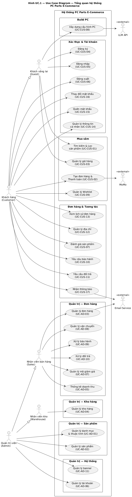
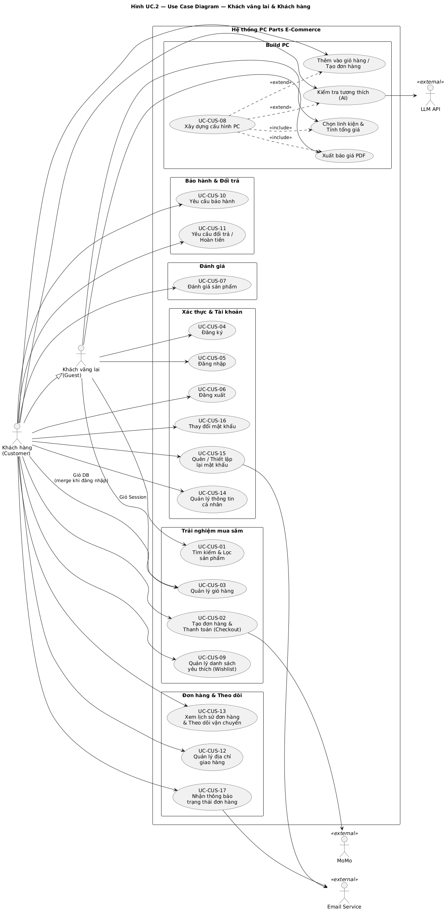
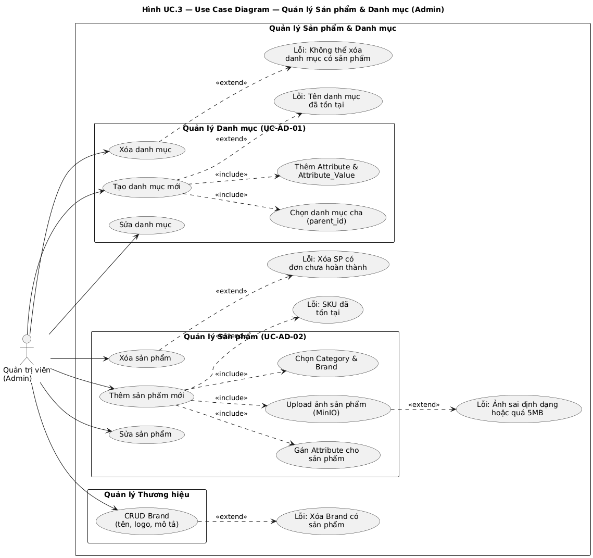
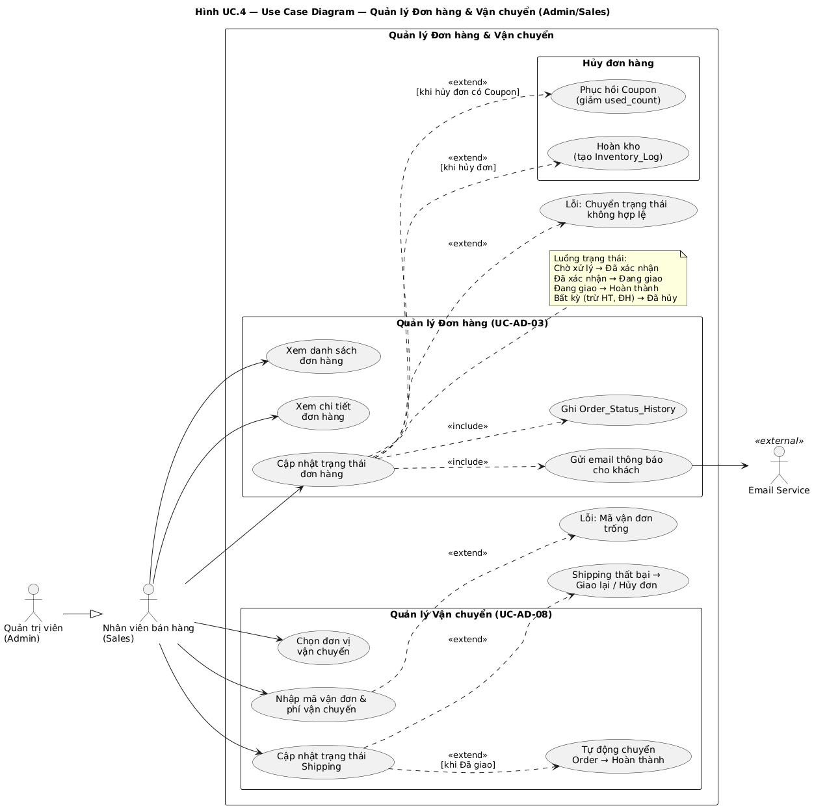
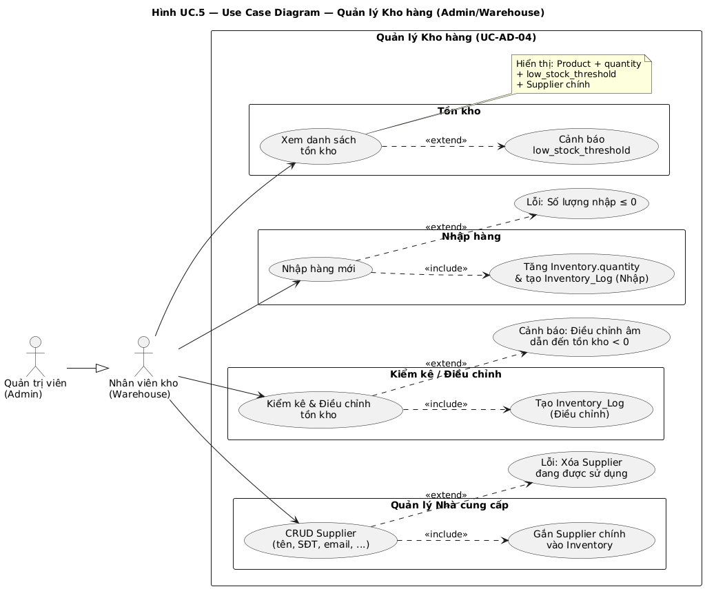
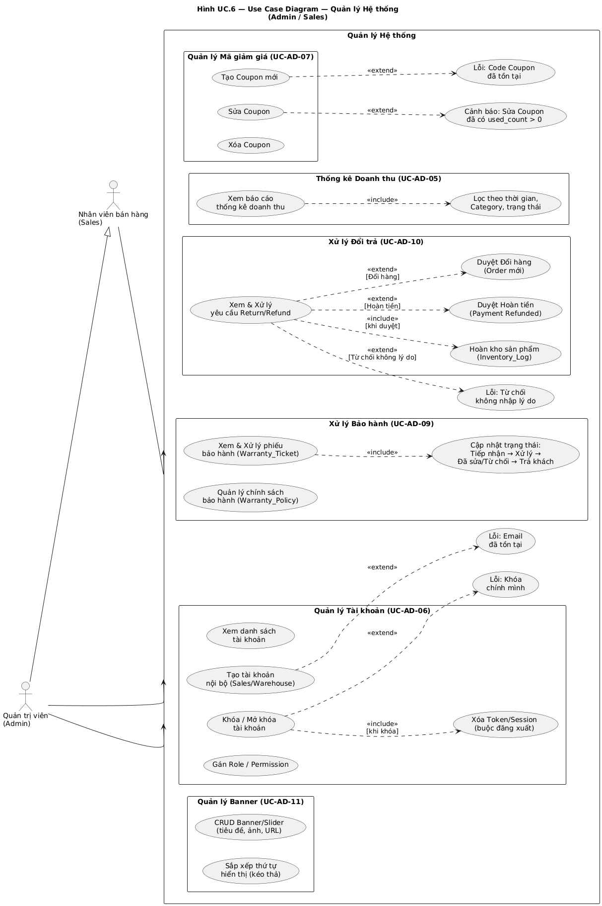

**I. Mô tả hệ thống**

**1\. Mô tả chung về hệ thống, lý do lựa chọn**

* **Mô tả chung (System Overview):**  
  * **Tên dự án:** Hệ thống Website thương mại điện tử phân phối linh kiện máy tính, PC lắp ráp và thiết bị công nghệ.  
  * **Mục tiêu cốt lõi:** Cung cấp nền tảng mua sắm trực tuyến tối ưu, tích hợp công cụ hỗ trợ người dùng tự xây dựng cấu hình (Build PC) với thuật toán kiểm tra tính tương thích, hệ thống tra cứu bảo hành minh bạch và thanh toán đa kênh.  
  * **Đối tượng người dùng (Target Audience):** Khách hàng cá nhân (Gamers, người dùng văn phòng, thiết kế đồ họa), Khách hàng doanh nghiệp (SME mua sắm thiết bị).  
  * **Đội ngũ vận hành:** Quản trị viên (Admin), Nhân viên bán hàng (Sales), Nhân viên kho (Warehouse).  
  * **Phạm vi hệ thống (In-scope):** Quản lý danh mục sản phẩm phức tạp (nhiều thuộc tính kỹ thuật), Quản lý đơn hàng/vận chuyển, Công cụ Build PC với AI, Quản lý khách hàng (CRM cơ bản), Cổng thanh toán đa phương thức, Hệ thống mã giảm giá (Coupon), Quản lý kho hàng và nhà cung cấp, Bảo hành và đổi trả.

* **Lý do lựa chọn (Business Case / Problem Statement):**  
  * **Bối cảnh:** Nhu cầu cá nhân hóa máy tính (tự chọn linh kiện) của người dùng công nghệ và game thủ đang tăng mạnh.  
  * **Vấn đề (Pain points):** Trên các website hiện tại, người dùng thiếu kinh nghiệm thường gặp khó khăn trong việc kiểm tra tính tương thích giữa các linh kiện (ví dụ: Mainboard có hỗ trợ dòng CPU không, kích thước VGA có vừa Case không, nguồn điện có đủ công suất không). Giao diện của nhiều bên còn cũ, tốc độ tải trang chậm và trải nghiệm Mobile chưa tốt.  
  * **Cơ hội/Giá trị mang lại:** Việc xây dựng hệ thống mới giải quyết triệt để các pain points trên (tối ưu UI/UX, thuật toán Build PC thông minh) sẽ giúp tăng trải nghiệm khách hàng, giảm thiểu thời gian tư vấn của nhân viên Sales và tăng tỷ lệ chuyển đổi (Conversion Rate).

**2\. Khảo sát hệ thống tương tự (Competitor Analysis)**

* **Hệ thống 1: HACOM (hacom.vn)**  
  * **Điểm mạnh:** Bộ lọc sản phẩm cực kỳ chi tiết theo từng thông số kỹ thuật ngách; dữ liệu sản phẩm phong phú; tính năng Build PC cho phép xuất file báo giá định dạng chuẩn.  
  * **Điểm yếu:** Giao diện (UI) khá cũ, nhồi nhét quá nhiều thông tin gây rối mắt; tốc độ tải trang đôi lúc chậm do xử lý nhiều banner quảng cáo; trải nghiệm trên thiết bị di động (Mobile Web) chưa được tối ưu tốt.  
* **Hệ thống 2: An Phát PC (anphatpc.com.vn)**  
  * **Điểm mạnh:** Thường xuyên chạy các chiến dịch Flash Sale, Combo PC có sẵn với giá cạnh tranh; luồng thanh toán (Checkout flow) tương đối ngắn gọn.  
  * **Điểm yếu:** Công cụ Build PC có giao diện chưa trực quan; phần tra cứu trạng thái đơn hàng cho khách hàng vãng lai còn nhiều bất tiện.  
* **Hệ thống 3: GearVN (gearvn.com)**  
  * **Điểm mạnh:** Giao diện hiện đại, định vị thương hiệu tốt với tệp khách hàng trẻ/Gamer; hình ảnh sản phẩm đồng nhất; hệ sinh thái nội dung (Blog, Youtube) liên kết mượt mà với trang bán hàng.  
  * **Điểm yếu:** Bộ lọc thông số kỹ thuật chưa sâu bằng HACOM; mức giá đôi khi cao hơn mặt bằng chung.  
* **Kết luận rút ra cho hệ thống (Key Takeaways & Competitive Advantage):**  
  * **Tính năng cốt lõi:** Tập trung phát triển **Công cụ Build PC thông minh** (LLM đề xuất, gợi ý).  
  * **Trải nghiệm người dùng:** Thiết kế theo phong cách hiện đại, tối giản thông tin thừa, ưu tiên tốc độ tải trang. Cho phép khách vãng lai thêm sản phẩm vào giỏ hàng mà không cần đăng nhập.  
  * **Quản lý chuyên nghiệp:** Phân quyền rõ ràng cho đội ngũ vận hành (Admin, Sales, Warehouse) giúp tối ưu quy trình nội bộ. Hệ thống bảo hành và đổi trả minh bạch.

**II. Thu thập yêu cầu**  
**1\. Bảng thuật ngữ**

1. Nhóm thuật ngữ về Thương mại điện tử & Bán hàng  
   

| Thuật ngữ | Viết tắt / Tiếng Anh | Định nghĩa |
| :---- | :---- | :---- |
| Mã quản lý kho | SKU (Stock Keeping Unit) | Mã định danh duy nhất cho từng phân loại sản phẩm để theo dõi chính xác lượng hàng tồn kho. |
| Thanh toán khi nhận hàng | COD (Cash On Delivery) | Phương thức thanh toán mà người mua sẽ trả tiền mặt cho nhân viên giao hàng khi nhận được linh kiện. |
| Mã giảm giá | Voucher / Coupon | Mã ký tự do cửa hàng phát hành để khách hàng nhập vào khi thanh toán nhằm được giảm giá. |
| Đơn vị vận chuyển | Shipping Provider | Các bên thứ ba chịu trách nhiệm giao hàng (ví dụ: GHTK, GHN, Viettel Post) được tích hợp vào hệ thống tính phí ship. |
| Nhà cung cấp | 	Supplier | Đối tác cung cấp nguồn linh kiện cho cửa hàng, được quản lý trong thực thể Supplier. |
| Thương hiệu | Brand | Hãng sản xuất linh kiện (Intel, AMD, ASUS...), mỗi Product thuộc một Brand duy nhất. |
| Danh sách yêu thích | Wishlist | Cho phép Customer lưu lại sản phẩm quan tâm để xem lại sau mà không cần thêm vào giỏ hàng. |

   

2. Nhóm thuật ngữ chuyên ngành Linh kiện máy tính  
   

| Thuật ngữ | Định nghĩa |
| :---- | :---- |
| Xây dựng cấu hình (Build PC) | Tính năng cốt lõi cho phép khách hàng tự chọn từng linh kiện (CPU, Main, RAM, VGA...) để ghép thành một bộ máy tính hoàn chỉnh. Hệ thống sẽ tự tính tổng giá. |
| Tính tương thích (Compatibility) | Khả năng hoạt động chung giữa các linh kiện. Hệ thống sử dụng AI (LLM) để phân tích và cảnh báo về khả năng tương thích. |
| Thông số kỹ thuật (Specs) | Các chỉ số chi tiết của linh kiện (Xung nhịp, Socket, Bus RAM, PCIe). Quản lý qua Attribute, Attribute\_Value và Product\_Attribute. |
| Hàng Box / Hàng Tray | Thuật ngữ chỉ tình trạng đóng gói (thường dùng cho CPU). Hàng Box có đầy đủ hộp, quạt tản nhiệt, bảo hành chính hãng. Hàng Tray thường chỉ có linh kiện trần, giá rẻ hơn. |
| Sản phẩm đã qua sử dụng (2nd hand) | Linh kiện cũ được cửa hàng thu mua và bán lại. Cần có cờ (flag) phân biệt rõ ràng với linh kiện mới 100% trên giao diện. |

3. Nhóm thuật ngữ Hệ thống & Phần mềm  
   

| Thuật ngữ | Định nghĩa |
| :---- | :---- |
| Hệ quản trị nội dung (CMS) | Giao diện dành riêng cho đội ngũ vận hành (Admin/Sales/Warehouse) để quản lý sản phẩm, đơn hàng, kho hàng và nội dung website. |
| Giao diện lập trình ứng dụng (API) | Cổng giao tiếp để hệ thống kết nối với hệ thống bên ngoài (cổng thanh toán VNPay, API LLM, tra cứu mã vận đơn). |
| Bộ lọc động (Dynamic Filter) | Chức năng lọc danh sách sản phẩm tự động thay đổi dựa trên danh mục. Ví dụ: Đang ở danh mục "Ổ cứng" thì hiển thị bộ lọc "Dung lượng 512GB/1TB", "Chuẩn SATA/NVMe". |
| Phiên làm việc (Session/Cookie) | Cơ chế lưu trữ tạm thời, giúp hệ thống nhớ Giỏ hàng của Khách vãng lai khi chưa đăng nhập. |
| Mã xác thực (Token/Session) | Chuỗi ký tự (refresh token, access token, OTP) để duy trì phiên đăng nhập và xác thực quyền truy cập API. |
| Tồn kho & Lịch sử kho | Inventory: lưu tồn kho hiện tại \+ ngưỡng cảnh báo. Inventory\_Log: ghi nhận mọi biến động (nhập, bán, hoàn trả, điều chỉnh). |
| Phân quyền (RBAC) | Role-Based Access Control. Phân quyền dựa trên Role và Permission, liên kết qua Role\_Permission. |
| Bảo hành | Warranty\_Policy (chính sách theo Category/Product) và Warranty\_Ticket (phiếu khi khách gửi yêu cầu). |
| Đổi trả | Return/Refund: Quản lý yêu cầu đổi hàng hoặc hoàn tiền, gắn với Order\_Detail cụ thể. |

   

   

**2\. Mô hình nghiệp vụ bằng ngôn ngữ tự nhiên**

1. #### **Mục tiêu và phạm vi hệ thống**

* *Mục tiêu*: Xây dựng một nền tảng thương mại điện tử chuyên biệt cho linh kiện máy tính, giúp khách hàng tìm kiếm, so sánh thông số kỹ thuật, và mua sắm dễ dàng. Tích hợp công cụ Build PC với AI đánh giá tương thích. Đồng thời, cung cấp công cụ phân quyền chi tiết (RBAC) cho đội ngũ vận hành (Admin, Sales, Warehouse) để quản lý kho hàng, đơn hàng, bảo hành, đổi trả và doanh thu một cách hiệu quả.  
* *Phạm vi*:  Hệ thống tập trung vào việc hiển thị danh mục linh kiện theo các thông số kỹ thuật chi tiết, quản lý giỏ hàng (bao gồm giỏ hàng khách vãng lai), thanh toán đa phương thức qua cổng thanh toán, theo dõi vận chuyển, công cụ Build PC, quản lý kho hàng và nhà cung cấp, mã giảm giá (Coupon), bảo hành/đổi trả và quản trị nội dung cửa hàng.

2. #### **Ai có thể sử dụng phần mềm?**

Hệ thống có 5 nhóm người dùng chính (Actors):

* *Khách vãng lai (Guest): Xem, tìm kiếm thông tin sản phẩm, thêm sản phẩm vào giỏ hàng tạm (lưu bằng Session) và sử dụng công cụ Build PC (chọn linh kiện, xem tổng giá, xuất báo giá). Không cần đăng nhập.*  
* *Khách hàng (Customer): Người dùng đã đăng nhập. Thực hiện các giao dịch mua bán, sử dụng AI kiểm tra tương thích trong Build PC, thêm cấu hình vào giỏ hàng/tạo đơn hàng, đánh giá sản phẩm, quản lý Wishlist, yêu cầu bảo hành và đổi trả*  
* *Quản trị viên (Admin): Có toàn quyền quản lý hệ thống, bao gồm phân quyền (gán Role, Permission) cho các tài khoản khác.*  
* *Nhân viên bán hàng (Sales): Quản lý đơn hàng, vận chuyển, xem thống kê doanh thu, thiết lập mã giảm giá, xử lý bảo hành và đổi trả.*  
* *Nhân viên kho (Warehouse): Quản lý tồn kho (nhập hàng, kiểm kê), cập nhật số lượng sản phẩm thông qua Inventory và Inventory\_Log.*

3. #### **Người dùng có những chức năng gì?**

* *Đối với Khách vãng lai (Guest):*  
  * Xem danh sách sản phẩm và chi tiết linh kiện.  
  * Tìm kiếm và lọc linh kiện theo bộ lọc thông minh (ví dụ: lọc RAM theo chuẩn DDR4/DDR5, lọc CPU theo Socket) dựa trên Attribute.  
  * Thêm sản phẩm vào giỏ hàng (lưu bằng Session/Cookie).  
  * Sử dụng công cụ Build PC: chọn linh kiện, xem tổng giá và xuất báo giá. Khi muốn kiểm tra tương thích AI, thêm vào giỏ hàng hoặc tạo đơn hàng → hệ thống yêu cầu đăng nhập.    
  * Đăng ký tài khoản mới và đăng nhập.  
* *Đối với Khách hàng (Customer):*  
  * *Tất cả các chức năng của Khách vãng lai.*  
  * *Khi đăng nhập, giỏ hàng tạm (Session) được tự động merge với giỏ hàng cũ trên tài khoản.*  
  * *Quản lý nhiều địa chỉ giao hàng (Address).*  
  * *Tiến hành thanh toán (Checkout) và đặt hàng.*  
  * *Theo dõi trạng thái đơn hàng và vận chuyển.*  
  * *Xem lịch sử mua hàng.*  
  * *Đánh giá sản phẩm đã mua (Review) kèm hình ảnh thực tế (Review\_Image).*  
  * *Quản lý danh sách yêu thích (Wishlist).*  
  * *Sử dụng AI kiểm tra tương thích trong Build PC, thêm cấu hình vào giỏ hàng (Cart) hoặc tạo đơn hàng trực tiếp.*  
  * *Gửi yêu cầu bảo hành (Warranty\_Ticket) và đổi trả (Return/Refund).*  
* *Đối với Quản trị viên*:  
  * Quản lý danh mục linh kiện (Category) và thuộc tính kỹ thuật (Attribute, Attribute\_Value).  
  * Quản lý sản phẩm (CRUD Product, Product\_Image), Thương hiệu (Brand) và Nhà cung cấp (Supplier).  
  * Quản lý tài khoản người dùng (tạo Account nội bộ, khóa/mở khóa, gán Role và Permission).  
  * Toàn bộ chức năng của Sales và Warehouse.  
* Đối với Nhân viên bán hàng (Sales):  
  * Quản lý đơn hàng (duyệt đơn, cập nhật trạng thái, xem chi tiết Payment).  
  * Quản lý vận chuyển (tạo Shipping, cập nhật tracking, trạng thái giao hàng).  
  * Thiết lập mã giảm giá (Coupon).  
  * Xem thống kê báo cáo doanh thu.  
  * Xử lý yêu cầu bảo hành (Warranty\_Ticket) và đổi trả (Return/Refund).  
* Đối với Nhân viên kho (Warehouse):  
  * Quản lý kho hàng: Xem tồn kho (Inventory), nhập hàng, kiểm kê, ghi nhận biến động qua Inventory\_Log.  
  * Xem tồn kho thực tế của từng Product.  
    

4. #### **Mỗi chức năng hoạt động ra sao?**

Lưu ý: Dưới đây là mô tả luồng hoạt động của một số chức năng cốt lõi nhất.

* *Chức năng Lọc và Tìm kiếm sản phẩm: Khách hàng (hoặc khách vãng lai) nhập từ khóa hoặc chọn các tiêu chí từ bộ lọc động (Giá, Brand, Thông số kỹ thuật theo Attribute). Hệ thống truy vấn cơ sở dữ liệu và trả về danh sách các linh kiện khớp với yêu cầu, cập nhật giao diện ngay lập tức.*  
* *Chức năng Giỏ hàng: Khách vãng lai thêm sản phẩm vào giỏ hàng tạm (lưu qua Session/Cookie). Khi khách đăng nhập, hệ thống tự động merge giỏ hàng tạm vào giỏ hàng database (Cart) của tài khoản đó. Nếu có sản phẩm trùng, hệ thống cộng dồn số lượng. Khi đăng xuất, giỏ hàng tạm (Session) được xóa trắng.*  
* *Chức năng Đặt hàng (Checkout): 1\. Khách hàng (đã đăng nhập) xem lại giỏ hàng và nhấn "Thanh toán". 2\. Hệ thống yêu cầu chọn Address giao hàng (hoặc thêm mới). 3\. Khách hàng chọn phương thức thanh toán (COD, VNPay, MoMo, Chuyển khoản) và nhập mã Coupon (nếu có). 4\. Hệ thống kiểm tra tồn kho qua Inventory, tạo Order, Order\_Detail, Payment (trạng thái "Pending") và Shipping, trừ kho qua Inventory\_Log, và gửi email xác nhận.*  
* *Chức năng Xử lý đơn hàng (Sales/Admin): Sales truy cập bảng điều khiển, xem danh sách đơn hàng. Sales kiểm tra và chuyển trạng thái đơn hàng (Chờ xử lý → Đang giao → Hoàn thành hoặc Đã hủy). Mỗi lần chuyển trạng thái, hệ thống ghi nhận vào Order\_Status\_History và gửi thông báo đến email khách hàng.*  
* *Chức năng Xây dựng cấu hình (Build PC): Người dùng (Guest hoặc Customer) chọn tuần tự các linh kiện vào form Build PC (Frontend). Giao diện hiển thị tổng giá. Người dùng có thể xuất báo giá PDF mà không cần đăng nhập. Khi nhấn "Kiểm tra tương thích (AI)", "Thêm vào giỏ hàng" hoặc "Tạo đơn hàng", nếu chưa đăng nhập → hệ thống yêu cầu đăng nhập trước.*  
* *Chức năng Bảo hành: Khách hàng tạo Warranty\_Ticket gắn với Product và Order đã mua. Hệ thống kiểm tra Warranty\_Policy (thời hạn, điều kiện). Sales/Admin xử lý phiếu và cập nhật trạng thái.*  
* *Chức năng Đổi trả: Khách hàng tạo yêu cầu Return/Refund gắn với Order\_Detail cụ thể. Sales/Admin duyệt, nếu hoàn tiền → tạo Payment với status Refunded. Nếu đổi hàng → tạo Order mới.*

5. #### **Những thông tin/đối tượng mà hệ thống cần xử lý?**

Hệ thống cần lưu trữ và xử lý 32 thực thể (Entities) chính, được nhóm theo nghiệp vụ:

* ***Nhóm Phân quyền:***  
  * Tài khoản (Account): *Email, mật khẩu mã hóa, trạng thái hoạt động, trạng thái xác minh, vai trò, lần đăng nhập cuối.*  
  * Người dùng (User/Profile): *Thông tin cá nhân (họ tên, SĐT, ảnh đại diện, ngày sinh, giới tính), liên kết 1-1 với Account.*  
  * Địa chỉ (Address): *Địa chỉ giao hàng (nhiều địa chỉ/user): nhãn, tên người nhận, SĐT, tỉnh/quận/phường/đường, cờ mặc định.*  
  * Vai trò (Role): *Admin, Sales, Warehouse, Customer.*  
  * Quyền hạn (Permission): *Các quyền cụ thể (VD: product.create, order.update).*  
  * Phân quyền (Role\_Permission): *Bảng trung gian gán Permission cho Role.*  
  * Token / Phiên (Session): *Refresh token, reset password token, OTP, thời gian hết hạn.*  
* ***Nhóm Sản phẩm:***  
  * Sản phẩm (Product): *Tên, SKU, slug, giá gốc, giá bán, mô tả, danh mục, thương hiệu, tình trạng (Condition: Mới/Box/Tray/2nd\_Hand), trạng thái (Active/Inactive/Discontinued).*  
  * Danh mục (Category): *Phân cấp đa tầng (parent\_id self-referencing), tên, mô tả, level.*  
  * Thương hiệu (Brand): *Tên, logo, mô tả.*  
  * Thuộc tính (Attribute): *Tên thuộc tính kỹ thuật gắn với Category (VD: Socket, Bus RAM).*  
  * Giá trị thuộc tính (Attribute\_Value): *Giá trị cụ thể của thuộc tính (VD: LGA 1700, DDR5).*  
  * Chi tiết thông số (Product\_Attribute): *Gắn kết Product ↔ Attribute ↔ Attribute\_Value.*  
  * Hình ảnh (Product\_Image): *Hình ảnh/video cho Product, cờ ảnh chính, thứ tự sắp xếp.*  
* ***Nhóm Kho hàng:***  
  * Kho hàng (Inventory): *Số lượng tồn kho hiện tại, ngưỡng cảnh báo, nhà cung cấp chính, liên kết 1-1 với Product.*  
  * Nhà cung cấp (Supplier): *Tên, người liên hệ, SĐT, email, địa chỉ.*  
  * Lịch sử kho (Inventory\_Log): *Loại biến động (Nhập/Bán/Hoàn trả/Điều chỉnh), số lượng thay đổi, người thực hiện, thời gian, ghi chú.*  
* ***Nhóm Mua sắm:***  
  * Giỏ hàng (Cart): *Mã giỏ, user\_id hoặc session\_id.*  
  * *Chi tiết giỏ hàng (Cart\_Item): Product, số lượng.*  
  * Yêu thích (Wishlist): *User ↔ Product (UNIQUE).*  
* ***Nhóm Đơn hàng & Thanh toán:***  
  * Đơn hàng (Order): *User, Address, tổng tiền hàng, tiền giảm, tổng thanh toán, trạng thái, ghi chú, Coupon.*  
  * Chi tiết đơn hàng (Order\_Detail): *Product, số lượng, đơn giá snapshot, thành tiền.*  
  * Thanh toán (Payment): *Phương thức (COD/VNPay/MoMo/Chuyển khoản), số tiền, trạng thái (Pending/Success/Failed/Refunded), mã giao dịch, thời gian.*  
  * Vận chuyển (Shipping): *Đơn vị vận chuyển, mã vận đơn, trạng thái, phí ship, ngày giao dự kiến/thực tế.*  
  * Khuyến mãi (Coupon): *Code, loại giảm (PERCENT/FIXED), giá trị, đơn tối thiểu, giảm tối đa, số lượt, ngày hiệu lực.*  
  * Lịch sử sử dụng mã (Coupon\_Usage): *User ↔ Coupon ↔ Order, thời gian sử dụng.*  
  * Lịch sử trạng thái đơn hàng (Order\_Status\_History): *Trạng thái cũ → mới, người thao tác, thời gian, ghi chú.*  
* ***Nhóm Tương tác:***  
  * Đánh giá (Review): *User, Product, Order, số sao (1-5), nội dung.*  
  * Ảnh đánh giá (Review\_Image): *Hình ảnh thực tế kèm Review.*  
  * *Nhóm Bảo hành & Đổi trả:*  
  * Chính sách bảo hành (Warranty\_Policy): *Gắn theo Category hoặc Product, thời hạn (tháng), điều kiện.*  
  * Phiếu bảo hành (Warranty\_Ticket): *User, Product, Order, Serial Number, mô tả lỗi, trạng thái xử lý, kết quả.*  
  * Đổi trả (Return/Refund): *Order, Order\_Detail, lý do, loại (đổi hàng/hoàn tiền), trạng thái, số tiền hoàn.*

  

6. #### **Quan hệ giữa các đối tượng?**

* ***Phân quyền:***  
  * Account \- Role: *Một Account có một Role duy nhất. Một Role gán cho nhiều Account (N-1).*  
  * Role \- Permission: *Quan hệ N-N qua bảng trung gian Role\_Permission.*  
  * Account \- User*: Quan hệ 1-1. Mỗi Account có đúng một User/Profile.*  
  * User \- Address: *Một User có nhiều Address (1-N). Một Address có cờ is\_default.*  
* ***Sản phẩm:***  
  * Category \- Category: *Self-referencing (parent\_id) hỗ trợ phân cấp đa tầng (1-N).*  
  * Category \- Product: *Một Category chứa nhiều Product, một Product thuộc một Category (1-N).*  
  * Category \- Attribute: *Một Category có nhiều Attribute riêng (1-N).*  
  * Brand \- Product: *Một Brand có nhiều Product, một Product thuộc một Brand (1-N).*  
  * Attribute \- Attribute\_Value*: Một Attribute có nhiều giá trị (1-N).*  
  * Product \- Attribute*: Quan hệ N-N qua Product\_Attribute (gắn kết với Attribute\_Value).*  
  * Product \- Product\_Image: *Một Product có nhiều hình ảnh (1-N).*  
* ***Kho hàng:***  
  * Product \- Inventory: *Quan hệ 1-1. Mỗi Product có đúng một bản ghi Inventory.*  
  * Supplier \- Inventory: *Một Supplier cung cấp cho nhiều Inventory (1-N).*  
  * Product \- Inventory\_Log: *Một Product có nhiều bản ghi lịch sử kho (1-N).*  
* ***Mua sắm:***  
  * User \- Cart: *Một User (hoặc Session) có một Cart. Cart chứa nhiều Cart\_Item (1-N).*  
  * Cart \- Product: *Quan hệ N-N qua Cart\_Item.*  
  * User \- Wishlist: *Một User có nhiều Wishlist entry (1-N). UNIQUE(user\_id, product\_id).*  
* ***Đơn hàng & Thanh toán:***  
  * User \- Order*: Một User tạo nhiều Order (1-N).*  
  * Address \- Order: *Một Address dùng cho nhiều Order (1-N).*  
  * Order \- Product: *Quan hệ N-N qua Order\_Detail (lưu giá snapshot).*  
  * Order \- Payment*: Một Order có nhiều Payment (1-N, cho phép thử lại khi thất bại hoặc hoàn tiền).*  
  * Order \- Shipping: *Một Order có một Shipping (1-1).*  
  * Coupon \- Order: *Một Coupon áp dụng cho nhiều Order (1-N, nullable).*  
  * Coupon \- Coupon\_Usage: *Một Coupon có nhiều bản ghi sử dụng (1-N). UNIQUE(coupon\_id, user\_id) nếu giới hạn 1 lần/người.*  
  * Order \- Order\_Status\_History: *Một Order có nhiều bản ghi lịch sử trạng thái (1-N).*  
* ***Tương tác:***  
  * User \- Review \- Product: *Một User đánh giá nhiều Product, một Product có nhiều Review (N-N qua Review). Ràng buộc: chỉ đánh giá khi Order chứa Product ở trạng thái "Hoàn thành".*  
  * Review \- Review\_Image: *Một Review có nhiều ảnh (1-N).*  
* ***Bảo hành & Đổi trả:***  
  * Category/Product \- Warranty\_Policy: *Gán chính sách theo Category (1-N) hoặc Product cụ thể (1-N). Ưu tiên Product.*  
  * User \- Warranty\_Ticket: *Một User tạo nhiều phiếu bảo hành (1-N).*  
  * Product \- Warranty\_Ticket: *Một Product có nhiều phiếu bảo hành (1-N).*  
  * Order \- Warranty\_Ticket: *Một Order liên quan nhiều phiếu (1-N).*  
  * User \- Return: *Một User tạo nhiều yêu cầu đổi trả (1-N).*  
  * Order \- Return: *Một Order có nhiều yêu cầu đổi trả (1-N).*  
  * Order\_Detail \- Return: *Một Order\_Detail có nhiều yêu cầu đổi trả (1-N).*

**3\. Mô hình nghiệp vụ bằng UML**

1. **Actor \- Guest (Khách vãng lai):**  
- Xem và tìm kiếm sản phẩm (theo Attribute)  
- Thêm sản phẩm vào giỏ hàng tạm (Session)  
- Sử dụng Build PC: chọn linh kiện, xem tổng giá, xuất báo giá (không cần đăng nhập)    
- Đăng ký tài khoản  
2. **Actor \- Customer (Khách hàng):**  
- Đăng nhập, đăng xuất (kèm merge/xóa giỏ hàng Session)  
- Tìm kiếm và lọc sản phẩm (theo Attribute)  
- Quản lý giỏ hàng (Cart, Cart\_Item)  
- Tạo đơn hàng và thanh toán (Order, Payment, Shipping)  
- Quản lý danh sách yêu thích (Wishlist)  
- Đánh giá sản phẩm (Review, Review\_Image)  
- Build PC: kiểm tra tương thích AI, thêm cấu hình vào Cart hoặc tạo Order (yêu cầu đăng nhập)    
- Quản lý địa chỉ giao hàng (Address)  
- Xem lịch sử đơn hàng và theo dõi vận chuyển (Order, Shipping, Order\_Status\_History)  
- Quản lý thông tin cá nhân (User/Profile, Account)  
- Yêu cầu bảo hành (Warranty\_Ticket)  
- Yêu cầu đổi trả (Return/Refund)  
3. **Actor \- Admin (Quản trị viên):**  
- Toàn quyền: bao gồm tất cả chức năng của Sales và Warehouse  
- CRUD danh mục và thuộc tính (Category, Attribute, Attribute\_Value)  
- CRUD sản phẩm (Product, Product\_Image, Brand)  
- Quản lý nhà cung cấp (Supplier)  
- Quản lý tài khoản (Account, User, Role, Permission)  
- Quản lý chính sách bảo hành (Warranty\_Policy)  
4. **Actor \- Sales (Nhân viên bán hàng):**  
- Quản lý đơn hàng (Order, Order\_Status\_History)  
- Quản lý vận chuyển (Shipping)  
- Thiết lập mã giảm giá (Coupon)  
- Xem thống kê doanh thu  
- Xử lý bảo hành (Warranty\_Ticket) và đổi trả (Return/Refund)  
5. **Actor \- Warehouse (Nhân viên kho):**  
- Quản lý kho (Inventory, Inventory\_Log): nhập hàng, kiểm kê, ghi nhận biến động  
- Xem tồn kho thực tế theo Product

**4\. Đặc tả Use Case**

   **4.1. Đăng ký**

1\.    Mã UC, tên UC: UC-CUS-04: Đăng ký

2\.    Actor: Khách vãng lai – Guest

3\.    Mô tả: Cho phép người dùng mới tạo tài khoản trên hệ thống.

4\.    Tiền điều kiện: Người dùng chưa có tài khoản (chưa đăng nhập).

5\.    Trigger: Người dùng nhấn nút "Đăng ký" trên trang chủ hoặc trang đăng nhập.

6\.    Luồng chính:

\-        Người dùng nhấn "Đăng ký", hệ thống hiển thị form: Họ tên, Email, SĐT, Mật khẩu, Xác nhận mật khẩu

\-        Hệ thống kiểm tra tính hợp lệ (định dạng email, độ dài mật khẩu, mật khẩu khớp)

\-        Hệ thống kiểm tra bảng Account xem Email đã tồn tại chưa, kiểm tra bảng User xem SĐT đã tồn tại chưa

\-        Nếu hợp lệ: tạo Account (password\_hash, Role \= Customer, is\_active \= true) và User/Profile (họ tên, SĐT)

\-        Hiển thị "Đăng ký thành công" và chuyển hướng trang đăng nhập

7\.    Luồng ngoại lệ:

\-        Trường bắt buộc để trống → Báo lỗi cụ thể

\-        Email/SĐT sai định dạng → Báo lỗi

\-        Mật khẩu xác nhận không khớp → Báo lỗi

\-        Email hoặc SĐT đã tồn tại → Báo lỗi "Email/SĐT đã được sử dụng"

8\.    Hậu điều kiện:

\-        Account mới (Role \= Customer) và User/Profile được tạo trong CSDL

   **4.2. Đăng nhập**

1\.    Mã UC, tên UC: UC-CUS-05: Đăng nhập

2\.    Actor: Khách vãng lai – Guest

3\.    Mô tả: Xác thực người dùng qua Email và Mật khẩu. Sinh Token/Session để duy trì phiên, merge giỏ hàng Session vào Cart database.

4\.    Tiền điều kiện: Người dùng đã có tài khoản (đã đăng ký).

5\.    Trigger: Người dùng nhấn nút "Đăng nhập" trên giao diện hệ thống.

6\.    Luồng chính:

\-        Người dùng nhập Email và Mật khẩu, nhấn "Đăng nhập"

\-        Hệ thống truy xuất Account, kiểm tra Email tồn tại và password\_hash khớp

\-        Kiểm tra is\_active \= true (chưa bị khóa)

\-        Sinh Token/Session (lưu vào bảng Token/Session) và trả về trình duyệt

\-        Merge giỏ hàng Session vào Cart database (theo UC-CUS-03)

\-        Chuyển hướng theo Role (Customer/Admin/Sales/Warehouse)

7\.    Luồng ngoại lệ:

\-        Email không tồn tại hoặc Mật khẩu sai → "Email hoặc mật khẩu không đúng"

\-        Tài khoản bị khóa (is\_active \= false) → "Tài khoản đã bị khóa. Liên hệ quản trị viên"

\-        Trường bắt buộc để trống → Báo lỗi

8\.    Hậu điều kiện:

\-        Token/Session mới được tạo trong CSDL

\-        Giỏ hàng Session được merge vào Cart database rồi xóa

\-        Phiên duy trì cho đến khi Token hết hạn hoặc đăng xuất

   **4.3. Đăng xuất**

1\.    Mã UC, tên UC: UC-CUS-06: Đăng xuất

2\.    Actor: Customer / Admin / Sales / Warehouse

3\.    Mô tả: Kết thúc phiên làm việc hiện tại.

4\.    Tiền điều kiện: Người dùng đang đăng nhập (có Token/Session hợp lệ).

5\.    Trigger: Người dùng nhấn nút "Đăng xuất" trên giao diện hệ thống.

6\.    Luồng chính:

\-        Người dùng nhấn "Đăng xuất"

\-        Hệ thống xóa Token/Session trong CSDL

\-        Xóa giỏ hàng Session trên trình duyệt

\-        Chuyển hướng về trang chủ (giao diện Guest)

7\.    Luồng ngoại lệ:

\-        Token đã hết hạn → Tự động chuyển về trang đăng nhập kèm thông báo

8\.    Hậu điều kiện:

\-        Token/Session bị xóa, giỏ hàng Session bị xóa, Cart database vẫn được lưu

   **4.4. Thay đổi mật khẩu**

1\.    Mã UC, tên UC: UC-CUS-16: Thay đổi mật khẩu

2\.    Actor: Khách hàng – Customer

3\.    Mô tả: Cho phép Customer đổi mật khẩu hiện tại sang mật khẩu mới khi đang đăng nhập.

4\.    Tiền điều kiện: Customer đã đăng nhập (có Token/Session hợp lệ).

5\.    Trigger: Customer truy cập "Tài khoản của tôi" và chọn "Đổi mật khẩu".

6\.    Luồng chính:

\-        Customer truy cập "Tài khoản của tôi" → "Đổi mật khẩu"

\-        Hệ thống hiển thị form: Mật khẩu hiện tại, Mật khẩu mới, Xác nhận mật khẩu mới

\-        Customer nhập đầy đủ thông tin và nhấn "Đổi mật khẩu"

\-        Hệ thống kiểm tra mật khẩu hiện tại khớp với Account.password\_hash

\-        Nếu đúng: cập nhật password\_hash mới

7\.    Luồng ngoại lệ:

\-        Mật khẩu hiện tại không đúng → Báo lỗi "Mật khẩu hiện tại không chính xác"

\-        Mật khẩu mới và xác nhận không khớp → Báo lỗi "Mật khẩu xác nhận không khớp"

\-        Mật khẩu mới trùng mật khẩu cũ → Báo lỗi "Mật khẩu mới phải khác mật khẩu cũ"

\-        Mật khẩu mới không đủ độ mạnh → Báo lỗi

8\.    Hậu điều kiện: Account.password\_hash được cập nhật
   **4.5. Quên / Thiết lập lại mật khẩu**

1\.    Mã UC, tên UC: UC-CUS-15: Quên / Thiết lập lại mật khẩu

2\.    Actor: Khách vãng lai (Guest) / Khách hàng (Customer)

3\.    Mô tả: Cho phép người dùng khôi phục quyền truy cập tài khoản khi quên mật khẩu, thông qua liên kết đặt lại mật khẩu gửi qua email.

4\.    Tiền điều kiện:

\-        Người dùng đã có tài khoản (đã đăng ký)

\-        Người dùng chưa đăng nhập

5\.    Trigger: Người dùng nhấn liên kết "Quên mật khẩu" trên trang đăng nhập.

6\.    Luồng chính:

\-        Người dùng nhấn "Quên mật khẩu" trên trang đăng nhập

\-        Hệ thống hiển thị form nhập Email

\-        Người dùng nhập Email đã đăng ký và nhấn "Gửi"

\-        Hệ thống kiểm tra Email tồn tại trong bảng Account

\-        Nếu tồn tại: tạo Reset Password Token (lưu vào bảng Token/Session với thời hạn hết hạn) và gửi email chứa liên kết đặt lại mật khẩu

\-        Người dùng nhấn liên kết trong email → hệ thống xác minh Token còn hiệu lực

\-        Hiển thị form: Mật khẩu mới, Xác nhận mật khẩu mới

\-        Người dùng nhập mật khẩu mới và nhấn "Đặt lại mật khẩu"

\-        Hệ thống cập nhật Account.password\_hash, xóa Reset Password Token, xóa toàn bộ Token/Session cũ (buộc đăng nhập lại với mật khẩu mới)

7\.    Luồng ngoại lệ:

\-        Email không tồn tại → Hệ thống vẫn hiển thị thông báo "Nếu email tồn tại, bạn sẽ nhận được liên kết đặt lại mật khẩu" (tránh lộ thông tin)

\-        Token hết hạn hoặc không hợp lệ → Báo "Liên kết đã hết hạn. Vui lòng yêu cầu lại"

\-        Mật khẩu mới và xác nhận không khớp → Báo lỗi

\-        Mật khẩu mới không đủ độ mạnh → Báo lỗi "Mật khẩu phải có ít nhất 8 ký tự, bao gồm chữ hoa, chữ thường và số"

8\.    Hậu điều kiện:

\-        Account.password\_hash được cập nhật. Reset Password Token bị xóa. Toàn bộ Token/Session cũ bị xóa
   **4.6. Quản lý thông tin cá nhân**

1\.    Mã UC, tên UC: UC-CUS-14: Quản lý thông tin cá nhân

2\.    Actor: Khách hàng – Customer

3\.    Mô tả: Cho phép Customer cập nhật thông tin cá nhân (User/Profile).

4\.    Tiền điều kiện: Customer đã đăng nhập.

5\.    Trigger: Customer truy cập "Tài khoản của tôi" → "Thông tin cá nhân".

6\.    Luồng chính:

\-        Customer truy cập "Tài khoản của tôi" → "Thông tin cá nhân"

\-        Hệ thống hiển thị form với dữ liệu hiện tại: Họ tên, ảnh đại diện, ngày sinh, giới tính

\-        Customer sửa thông tin, nhấn "Cập nhật". Hệ thống lưu vào bảng User

7\.    Luồng ngoại lệ:

\-        Dữ liệu không hợp lệ → Báo lỗi cụ thể

8\.    Hậu điều kiện: User/Profile được cập nhật

   **4.7. Tìm kiếm và lọc sản phẩm**

1\.    Mã UC, tên UC: UC-CUS-01: Tìm kiếm và lọc sản phẩm

2\.    Actor: Khách vãng lai (Guest) / Khách hàng (Customer)

3\.    Mô tả: Cho phép người dùng tìm kiếm linh kiện theo từ khóa hoặc lọc chi tiết theo các thuộc tính kỹ thuật động (Attribute) tương ứng với từng danh mục sản phẩm, giúp tiếp cận nhanh nhất sản phẩm phù hợp nhu cầu.

4\.    Tiền điều kiện: Không yêu cầu đăng nhập, chỉ cần truy cập trang web.

5\.    Trigger: Người dùng chọn danh mục từ menu điều hướng hoặc nhập từ khóa vào thanh tìm kiếm.

6\.    Luồng chính:

\-        Người dùng lựa chọn 1 danh mục (Category) từ menu điều hướng

\-        Hệ thống truy xuất bảng Attribute để hiển thị các bộ lọc tương ứng với danh mục đó (VD: Category RAM → bộ lọc Bus, Dung lượng, Loại DDR)

\-        Người dùng chọn tiêu chí lọc (Attribute\_Value) và/hoặc nhận từ khóa tìm kiếm, có thể lọc thêm theo Brand, sau đó nhấn nút Tìm kiếm

\-        Hệ thống truy xuất Product, Product\_Attribute và kiểm tra tồn kho qua Inventory để trả về danh sách kết quả. Sản phẩm nào có Inventory.quantity \= 0 sẽ bị làm mờ và gắn nhãn "Hết hàng"

\-        Hệ thống hiển thị kết quả lên giao diện kèm thông tin: tên, ảnh chính (Product\_Image), giá bán, Brand, tình trạng hàng (Condition)

7\.    Luồng ngoại lệ:

\-        Nếu không có kết quả nào khớp với bộ lọc → Hệ thống hiển thị thông báo "Không tìm thấy sản phẩm phù hợp" và gợi ý khách hàng xóa bớt bộ lọc

\-        Nếu không kết nối được với cơ sở dữ liệu → Hệ thống hiển thị thông báo lỗi "Không kết nối được với máy chủ"

8\.    Hậu điều kiện:

\-        Hệ thống hiển thị danh sách sản phẩm khớp với điều kiện tìm kiếm/lọc của người dùng trên giao diện

   **4.8. Quản lý giỏ hàng**

1\.    Mã UC, tên UC: UC-CUS-03: Quản lý giỏ hàng

2\.    Actor: Khách vãng lai (Guest) / Khách hàng (Customer)

3\.    Mô tả: Cho phép người dùng thêm, xem, sửa số lượng và xóa sản phẩm trong giỏ hàng. Guest dùng giỏ Session, Customer dùng giỏ database (Cart). Khi đăng nhập, merge giỏ Session vào Cart.

4\.    Tiền điều kiện: Người dùng đang truy cập hệ thống.

5\.    Trigger: Người dùng nhấn "Thêm vào giỏ" trên trang sản phẩm hoặc truy cập trang giỏ hàng.

6\.    Luồng chính:

\-        Thêm sản phẩm: Người dùng nhấn "Thêm vào giỏ" trên trang sản phẩm. Hệ thống kiểm tra Inventory.quantity, nếu đủ hàng thì thêm Cart\_Item vào Cart (database) hoặc Session

\-        Xem giỏ hàng: Hệ thống truy xuất Cart/Cart\_Item, join với Product và Product\_Image để hiển thị tên, ảnh, giá, số lượng, Condition và tổng tiền

\-        Sửa số lượng: Hệ thống kiểm tra Inventory, cập nhật Cart\_Item và tính lại tổng tiền

\-        Xóa sản phẩm: Hệ thống xóa Cart\_Item tương ứng

\-        Merge giỏ hàng khi đăng nhập: Merge giỏ Session vào Cart database. Nếu trùng Product, cộng dồn số lượng. Xóa giỏ Session sau merge

\-        Đăng xuất: Xóa giỏ Session, giữ nguyên Cart database

7\.    Luồng ngoại lệ:

\-        Giỏ hàng trống → Ẩn nút Thanh toán

\-        Số lượng vượt Inventory.quantity → Giới hạn ở mức tối đa

\-        Merge cộng dồn vượt Inventory → Giới hạn và thông báo

8\.    Hậu điều kiện:

\-        Cart\_Item được thêm/sửa/xóa trong CSDL hoặc Session. Tổng tiền được tính lại

   **4.9. Tạo đơn hàng và thanh toán**

1\.    Mã UC, tên UC: UC-CUS-02: Tạo đơn hàng và thanh toán

2\.    Actor: Khách hàng – Customer

3\.    Mô tả: Cho phép khách hàng tiến hành đặt hàng từ giỏ hàng, chọn Address giao hàng, áp dụng mã Coupon và chọn phương thức thanh toán. Hệ thống tạo Order, Order\_Detail, Payment và Shipping tương ứng.

4\.    Tiền điều kiện:

\-        Customer đã đăng nhập (có Token/Session hợp lệ)

\-        Giỏ hàng (Cart) không trống (phải có ít nhất 1 Cart\_Item)

5\.    Trigger: Customer nhấn nút "Thanh toán" từ trang giỏ hàng.

6\.    Luồng chính:

\-        Customer nhấn nút "Thanh toán" từ trang giỏ hàng

\-        Hệ thống hiển thị trang Checkout với danh sách sản phẩm, tổng tiền tạm tính

\-        Customer chọn Address giao hàng từ danh sách Address đã lưu, hoặc thêm Address mới

\-        Customer nhập mã Coupon (nếu có). Hệ thống kiểm tra tính hợp lệ (Code đúng, còn hạn, chưa vượt max\_uses, chưa dùng bởi User này qua Coupon\_Usage) và tính lại tổng tiền

\-        Customer chọn phương thức thanh toán (COD / VNPay / MoMo / Chuyển khoản)

\-        Customer nhấn "Xác nhận đặt hàng"

\-        Hệ thống kiểm tra tồn kho qua Inventory cho từng Cart\_Item. Nếu đủ hàng:

   \+ Tạo Order (trạng thái "Chờ xử lý") và các Order\_Detail với đơn giá snapshot

   \+ Tạo Payment (trạng thái "Pending") với phương thức đã chọn

   \+ Tạo Shipping (trạng thái "Chờ lấy hàng")

   \+ Tạo Order\_Status\_History (ghi nhận trạng thái "Chờ xử lý")

   \+ Nếu thanh toán online (VNPay/MoMo): chuyển hướng sang cổng thanh toán → cập nhật Payment.status và transaction\_id

   \+ Nếu COD: Payment giữ trạng thái Pending

\-        Hệ thống trừ kho: cập nhật Inventory.quantity và tạo Inventory\_Log (loại: Bán)

\-        Nếu có Coupon: tạo Coupon\_Usage và tăng Coupon.used\_count

\-        Hệ thống xóa các Cart\_Item đã thanh toán

\-        Hệ thống gửi email xác nhận đơn hàng

7\.    Luồng ngoại lệ:

\-        Mã Coupon không hợp lệ → Hệ thống báo lỗi cụ thể và giữ nguyên giá gốc

\-        Tồn kho không đủ (Inventory.quantity \< số lượng yêu cầu) → Hệ thống thông báo sản phẩm nào hết hàng

\-        Thanh toán trực tuyến thất bại (Payment.status \= Failed) → Hệ thống giữ Order, cho phép tạo Payment mới hoặc chuyển COD

8\.    Hậu điều kiện:

\-        Order, Order\_Detail, Payment, Shipping, Order\_Status\_History được tạo trong CSDL

\-        Inventory.quantity giảm, Inventory\_Log được ghi nhận

\-        Cart\_Item đã thanh toán bị xóa

\-        Coupon\_Usage được ghi nhận (nếu có)

   **4.10. Quản lý địa chỉ giao hàng**

1\.    Mã UC, tên UC: UC-CUS-12: Quản lý địa chỉ giao hàng

2\.    Actor: Khách hàng – Customer

3\.    Mô tả: Cho phép Customer thêm, sửa, xóa và đặt mặc định cho các địa chỉ giao hàng (Address).

4\.    Tiền điều kiện: Customer đã đăng nhập.

5\.    Trigger: Customer truy cập "Tài khoản của tôi" → "Sổ địa chỉ" hoặc thêm địa chỉ mới khi Checkout.

6\.    Luồng chính:

\-        Customer truy cập "Tài khoản của tôi" → "Sổ địa chỉ"

\-        Hệ thống hiển thị danh sách Address (label, tên người nhận, SĐT, tỉnh/quận/phường/đường, cờ mặc định)

\-        Thêm: Customer nhấn "Thêm địa chỉ mới", nhập đầy đủ thông tin, nhấn "Lưu"

\-        Sửa: Customer chọn Address → "Sửa" → cập nhật thông tin

\-        Xóa: Customer chọn Address → "Xóa" → xác nhận

\-        Đặt mặc định: Customer nhấn "Sử dụng làm mặc định" → hệ thống cập nhật is\_default

7\.    Luồng ngoại lệ:

\-        Thiếu trường bắt buộc → Báo lỗi cụ thể

\-        Xóa Address duy nhất (mặc định) → Cảnh báo "Bạn cần tạo địa chỉ mới trước khi xóa"

8\.    Hậu điều kiện: Address được tạo/sửa/xóa trong CSDL

   **4.11. Xem lịch sử đơn hàng và theo dõi vận chuyển**

1\.    Mã UC, tên UC: UC-CUS-13: Xem lịch sử đơn hàng và theo dõi vận chuyển

2\.    Actor: Khách hàng – Customer

3\.    Mô tả: Cho phép Customer xem danh sách đơn hàng đã đặt, xem chi tiết từng đơn và theo dõi trạng thái vận chuyển.

4\.    Tiền điều kiện: Customer đã đăng nhập.

5\.    Trigger: Customer truy cập mục "Lịch sử đơn hàng" trong trang tài khoản.

6\.    Luồng chính:

\-        Customer truy cập "Lịch sử đơn hàng"

\-        Hệ thống hiển thị danh sách Order (mã đơn, ngày đặt, tổng tiền, trạng thái). Có thể lọc theo trạng thái, khoảng thời gian

\-        Customer nhấn vào một Order → xem chi tiết: danh sách Order\_Detail (Product, số lượng, đơn giá), Address, Payment (phương thức, trạng thái, transaction\_id)

\-        Hệ thống hiển thị Shipping: đơn vị vận chuyển, mã vận đơn (tracking\_number), trạng thái, ngày giao dự kiến/thực tế

\-        Hệ thống hiển thị Order\_Status\_History: danh sách các lần đổi trạng thái (thời gian, trạng thái cũ → mới)

7\.    Luồng ngoại lệ:

\-        Không có đơn hàng nào → Hiển thị "Bạn chưa có đơn hàng nào"

8\.    Hậu điều kiện: Không thay đổi CSDL. Chỉ hiển thị thông tin

   **4.12. Yêu cầu đổi trả**

1\.    Mã UC, tên UC: UC-CUS-11: Yêu cầu đổi trả

2\.    Actor: Khách hàng – Customer

3\.    Mô tả: Cho phép Customer gửi yêu cầu đổi hàng hoặc hoàn tiền cho sản phẩm trong đơn hàng đã hoàn thành, gắn với Order\_Detail cụ thể.

4\.    Tiền điều kiện:

\-        Customer đã đăng nhập

\-        Order ở trạng thái "Hoàn thành"

\-        Thời gian yêu cầu nằm trong thời hạn đổi trả cho phép (theo chính sách cửa hàng)

5\.    Trigger: Customer nhấn "Yêu cầu đổi trả" trên trang chi tiết đơn hàng đã hoàn thành.

6\.    Luồng chính:

\-        Customer truy cập "Lịch sử đơn hàng", chọn Order → chọn sản phẩm cần đổi trả → nhấn "Yêu cầu đổi trả"

\-        Hệ thống hiển thị form: chọn loại (Đổi hàng / Hoàn tiền), nhập lý do, upload ảnh (tùy chọn)

\-        Customer nhấn "Gửi yêu cầu"

\-        Hệ thống tạo Return/Refund (trạng thái "Chờ duyệt") gắn với Order\_Detail

7\.    Luồng ngoại lệ:

\-        Quá thời hạn đổi trả → Báo "Đã quá thời hạn đổi trả cho đơn hàng này"

\-        Thiếu lý do → Báo lỗi "Vui lòng nhập lý do đổi trả"

8\.    Hậu điều kiện:

\-        Return/Refund được tạo trong CSDL với trạng thái "Chờ duyệt"

**4.13. Yêu cầu bảo hành**

1\.    Mã UC, tên UC: UC-CUS-10: Yêu cầu bảo hành

2\.    Actor: Khách hàng – Customer

3\.    Mô tả: Cho phép Customer tạo phiếu bảo hành (Warranty\_Ticket) cho sản phẩm đã mua, gắn với Order cụ thể. Hệ thống kiểm tra Warranty\_Policy trước khi tiếp nhận.

4\.    Tiền điều kiện:

\-        Customer đã đăng nhập

\-        Customer có Order ở trạng thái "Hoàn thành" chứa Product cần bảo hành

5\.    Trigger: Customer nhấn "Yêu cầu bảo hành" trên trang chi tiết đơn hàng.

6\.    Luồng chính:

\-        Customer truy cập "Lịch sử đơn hàng", chọn Order → chọn Product cần bảo hành → nhấn "Yêu cầu bảo hành"

\-        Hệ thống kiểm tra Warranty\_Policy (theo Product hoặc Category): thời hạn bảo hành còn hiệu lực không (so sánh Order.created\_at \+ duration\_months với ngày hiện tại)

\-        Nếu còn hạn: hiển thị form nhập Số Serial, Mô tả tình trạng lỗi

\-        Customer nhập thông tin và nhấn "Gửi yêu cầu"

\-        Hệ thống tạo Warranty\_Ticket (trạng thái "Tiếp nhận")

7\.    Luồng ngoại lệ:

\-        Sản phẩm hết hạn bảo hành → Báo "Sản phẩm đã hết hạn bảo hành"

\-        Sản phẩm không có Warranty\_Policy → Báo "Sản phẩm này không có chính sách bảo hành"

\-        Thiếu Số Serial → Báo lỗi "Vui lòng nhập Số Serial"

8\.    Hậu điều kiện:

\-        Warranty\_Ticket được tạo trong CSDL với trạng thái "Tiếp nhận"

   **4.14. Đánh giá sản phẩm**

1\.    Mã UC, tên UC: UC-CUS-07: Đánh giá sản phẩm

2\.    Actor: Khách hàng – Customer

3\.    Mô tả: Cho phép Customer viết đánh giá, chọn số sao và tải ảnh thực tế cho sản phẩm đã mua thành công.

4\.    Tiền điều kiện:

\-        Customer đã đăng nhập

\-        Customer có ít nhất một Order chứa Product này ở trạng thái "Hoàn thành"

5\.    Trigger: Customer nhấn "Viết đánh giá" trên trang chi tiết sản phẩm đã mua.

6\.    Luồng chính:

\-        Customer truy cập trang chi tiết sản phẩm, nhấn "Viết đánh giá"

\-        Hệ thống kiểm tra Order và Order\_Detail xác nhận Customer đã mua và đơn "Hoàn thành"

\-        Hiển thị form: số sao (1-5), nội dung bình luận, upload ảnh (tùy chọn)

\-        Customer nhập thông tin và nhấn "Gửi đánh giá"

\-        Hệ thống tạo Review (liên kết User, Product, Order) và Review\_Image (nếu có ảnh)

\-        Đánh giá hiển thị ngay trên trang chi tiết sản phẩm

7\.    Luồng ngoại lệ:

\-        Chưa mua sản phẩm → Ẩn nút "Viết đánh giá" hoặc báo "Bạn cần mua sản phẩm này để đánh giá"

\-        Chưa chọn số sao → Báo lỗi "Vui lòng chọn số sao"

\-        Ảnh sai định dạng (chỉ chấp nhận JPG, PNG, WEBP) → Báo lỗi "Chỉ chấp nhận ảnh JPG, PNG, WEBP"

\-        Ảnh quá dung lượng (tối đa 5MB/ảnh) → Báo lỗi "Ảnh tối đa 5MB"

\-        Vượt số lượng ảnh (tối đa 5 ảnh) → Báo lỗi "Tối đa 5 ảnh"

8\.    Hậu điều kiện:

\-        Review và Review\_Image được tạo trong CSDL

   **4.15. Quản lý danh sách yêu thích**

1\.    Mã UC, tên UC: UC-CUS-09: Quản lý danh sách yêu thích

2\.    Actor: Khách hàng – Customer

3\.    Mô tả: Cho phép Customer lưu sản phẩm quan tâm vào Wishlist để xem lại sau, và xóa khỏi Wishlist khi không còn quan tâm.

4\.    Tiền điều kiện: Customer đã đăng nhập.

5\.    Trigger: Customer nhấn biểu tượng "Yêu thích" trên sản phẩm hoặc truy cập trang "Danh sách yêu thích".

6\.    Luồng chính:

\-        Customer nhấn biểu tượng "Yêu thích" (trái tim) trên trang sản phẩm hoặc danh sách sản phẩm

\-        Hệ thống kiểm tra UNIQUE(user\_id, product\_id) trong Wishlist

\-        Nếu chưa có: tạo Wishlist entry mới

\-        Nếu đã có: xóa Wishlist entry (toggle yêu thích)

\-        Customer truy cập trang "Danh sách yêu thích" → Hệ thống hiển thị danh sách Product đã lưu kèm ảnh, giá, tình trạng Inventory

\-        Customer có thể nhấn "Thêm vào giỏ" trực tiếp từ Wishlist

7\.    Luồng ngoại lệ:

\-        Sản phẩm đã bị ngừng kinh doanh (status \= Discontinued) → Gắn nhãn "Ngừng kinh doanh" trong Wishlist

8\.    Hậu điều kiện:

\-        Wishlist entry được tạo hoặc xóa trong CSDL

   **4.16. Xây dựng cấu hình PC (Build PC)**

1\.    Mã UC, tên UC: UC-CUS-08: Xây dựng cấu hình PC (Build PC)

2\.    Actor: Khách vãng lai (Guest) / Khách hàng (Customer)

3\.    Mô tả: Cho phép người dùng (Guest hoặc Customer) chọn tuần tự các linh kiện để lắp thành bộ PC. Đây là form phía Frontend (không lưu DB). Hệ thống hiển thị tổng giá và xuất báo giá mà không cần đăng nhập. Khi muốn sử dụng AI kiểm tra tương thích, thêm vào giỏ hàng hoặc tạo đơn hàng, hệ thống yêu cầu đăng nhập.

4\.    Tiền điều kiện:

\-        Không yêu cầu đăng nhập để chọn linh kiện và xuất báo giá

\-        Yêu cầu đăng nhập để sử dụng AI và thêm vào giỏ hàng/tạo đơn hàng

\-        Hệ thống có sản phẩm thuộc các Category linh kiện PC

5\.    Trigger: Người dùng truy cập trang "Build PC" từ menu điều hướng.

6\.    Luồng chính:

\-        Người dùng truy cập trang "Build PC"

\-        Hệ thống hiển thị các slot: CPU, Mainboard, RAM, VGA, PSU, Case, SSD/HDD, Tản nhiệt

\-        Người dùng nhấn vào từng slot, hệ thống hiển thị danh sách Product thuộc Category tương ứng (có thể lọc theo Attribute, Brand)

\-        Người dùng chọn linh kiện. Hệ thống cập nhật tổng giá

\-        Người dùng nhấn "Xuất báo giá" → Hệ thống tạo file báo giá PDF (không cần đăng nhập)

\-        Người dùng nhấn "Kiểm tra tương thích (AI)" → Hệ thống kiểm tra đăng nhập. Nếu chưa đăng nhập → yêu cầu đăng nhập. Sau khi đăng nhập → gửi thông số kỹ thuật qua API LLM → LLM trả về phân tích và gợi ý

\-        Người dùng nhấn "Thêm vào giỏ hàng" hoặc "Tạo đơn hàng" → Hệ thống kiểm tra đăng nhập. Nếu chưa đăng nhập → chuyển hướng trang đăng nhập (lưu tạm cấu hình vào Session). Sau khi đăng nhập → thêm tất cả linh kiện vào Cart dưới dạng Cart\\\_Item riêng lẻ

7\.    Luồng ngoại lệ:

\-        Chưa chọn đủ linh kiện tối thiểu (CPU, Mainboard) → Báo "Vui lòng chọn ít nhất CPU và Mainboard"

\-        API LLM lỗi → "Dịch vụ AI tạm không khả dụng. Bạn vẫn có thể tiếp tục"

\-        Linh kiện hết hàng (Inventory.quantity \= 0\) → Đánh dấu "Hết hàng", yêu cầu chọn thay thế

\-	Chưa đăng nhập khi nhấn "Kiểm tra AI" / "Thêm vào giỏ hàng" / "Tạo đơn hàng" → Yêu cầu đăng nhập, lưu cấu hình vào Session

8\.    Hậu điều kiện:

- Nếu xuất báo giá: file PDF được tạo (không thay đổi CSDL  
- Nếu thêm vào giỏ: linh kiện được thêm vào Cart dưới dạng Cart\\\_Item riêng lẻ (yêu cầu đã đăng nhập)

   **4.17. Nhận thông báo trạng thái đơn hàng**

1\.    Mã UC, tên UC: UC-CUS-17: Nhận thông báo trạng thái đơn hàng

2\.    Actor: Khách hàng – Customer

3\.    Mô tả: Cho phép Customer nhận thông báo (email và in-app) khi trạng thái đơn hàng thay đổi, giúp theo dõi tiến trình xử lý đơn hàng.

4\.    Tiền điều kiện:

\-        Customer đã đăng nhập

\-        Customer có ít nhất một Order trong hệ thống

5\.    Trigger: Admin/Sales cập nhật trạng thái đơn hàng (Order.status thay đổi).

6\.    Luồng chính:

\-        Khi Admin/Sales cập nhật Order.status (VD: Chờ xử lý → Đang xử lý → Đang giao → Hoàn thành), hệ thống tự động tạo bản ghi Notification cho Customer

\-        Hệ thống gửi email thông báo đến Account.email của Customer với nội dung: mã đơn hàng, trạng thái mới, thời gian cập nhật

\-        Đồng thời, hệ thống tạo thông báo in-app (Notification) với trạng thái is\_read = false

\-        Customer truy cập hệ thống → biểu tượng thông báo hiển thị số lượng thông báo chưa đọc

\-        Customer nhấn vào thông báo → xem chi tiết và chuyển hướng đến trang chi tiết đơn hàng. Hệ thống cập nhật Notification.is\_read = true

7\.    Luồng ngoại lệ:

\-        Gửi email thất bại → Hệ thống ghi log lỗi, thông báo in-app vẫn được tạo bình thường

\-        Customer không có thông báo nào → Hiển thị "Bạn chưa có thông báo nào"

8\.    Hậu điều kiện: Notification được tạo trong CSDL. Email thông báo được gửi đến Customer

   **4.18. (Admin) Quản lý danh mục và thuộc tính**

1\.    Mã UC, tên UC: UC-AD-01: Quản lý danh mục và thuộc tính

2\.    Actor: Admin

3\.    Mô tả: Cho phép Admin tạo, sửa, xóa các danh mục (Category) với phân cấp đa tầng và định nghĩa các thuộc tính kỹ thuật (Attribute, Attribute\_Value) cho từng danh mục.

4\.    Tiền điều kiện: Đăng nhập với Role Admin, Token/Session hợp lệ.

5\.    Trigger: Admin truy cập mục "Quản lý danh mục" trên trang quản trị.

6\.    Luồng chính:

\-        Admin truy cập "Quản lý danh mục", nhấn "Thêm mới"

\-        Nhập tên danh mục, chọn danh mục cha (parent\_id, nếu có)

\-        Thêm Attribute cho danh mục (VD: "Bus", "Dung lượng") và các Attribute\_Value tương ứng (VD: "DDR4", "DDR5")

\-        Nhấn "Lưu". Hệ thống tạo Category, Attribute và Attribute\_Value

\-        Sửa/Xóa: Admin chọn Category → "Sửa" hoặc "Xóa"

7\.    Luồng ngoại lệ:

\-        Tên trùng → Báo lỗi "Danh mục đã tồn tại"

\-        Xóa Category đang có Product → Báo lỗi "Không thể xóa danh mục đang chứa sản phẩm"

8\.    Hậu điều kiện: Category, Attribute, Attribute\_Value được tạo/sửa/xóa trong CSDL

   **4.19. (Admin) Quản lý sản phẩm**

1\.    Mã UC, tên UC: UC-AD-02: Quản lý sản phẩm

2\.    Actor: Admin

3\.    Mô tả: Cho phép Admin thêm, sửa, xóa sản phẩm (Product), hình ảnh (Product\_Image), gán thông số kỹ thuật (Product\_Attribute) và quản lý thương hiệu (Brand).

4\.    Tiền điều kiện: Đăng nhập với Role Admin, Token/Session hợp lệ.

5\.    Trigger: Admin truy cập mục "Quản lý sản phẩm" trên trang quản trị.

6\.    Luồng chính:

   Thêm mới Product:

\-        Admin nhấn "Thêm sản phẩm", nhập: Tên, SKU, giá gốc, giá bán, mô tả

\-        Chọn Category, Brand, Condition (Mới/Box/Tray/2nd\_Hand)

\-        Gán Attribute: chọn giá trị Attribute\_Value cho từng Attribute của Category đó

\-        Upload Product\_Image (đánh dấu ảnh chính)

\-        Nhấn "Lưu": tạo Product, Product\_Attribute, Product\_Image và Inventory (quantity \= 0\)

   Sửa: Admin chọn Product → sửa thông tin → "Cập nhật"

   Xóa: Admin chọn Product → "Xóa" → xác nhận → kiểm tra Order chưa hoàn thành

   Quản lý Brand:

\-        Admin truy cập "Quản lý thương hiệu" → CRUD Brand (tên, logo, mô tả)

\-        Khi thêm Product, chọn Brand từ danh sách. Nếu chưa có → tạo Brand mới ngay tại form

7\.    Luồng ngoại lệ:

\-        Thiếu trường bắt buộc (Tên, SKU, Category) → Báo lỗi

\-        SKU trùng → Báo lỗi "Mã SKU đã tồn tại"

\-        Ảnh sai định dạng (chỉ chấp nhận JPG, PNG, WEBP) hoặc quá dung lượng (tối đa 5MB/ảnh) → Báo lỗi

\-        Xóa Product có Order chưa hoàn thành → Chặn xóa

\-        Xóa Brand đang có Product → Báo lỗi "Không thể xóa thương hiệu đang có sản phẩm"

8\.    Hậu điều kiện: Product, Product\_Attribute, Product\_Image, Inventory, Brand được tạo/sửa/xóa

   **4.20. (Admin/Sales) Quản lý đơn hàng**

1\.    Mã UC, tên UC: UC-AD-03: Quản lý đơn hàng

2\.    Actor: Admin / Sales

3\.    Mô tả: Cho phép xem danh sách đơn hàng, xem chi tiết và cập nhật trạng thái. Mỗi lần cập nhật ghi Order\_Status\_History và gửi thông báo cho khách.

4\.    Tiền điều kiện: Đăng nhập với Role Admin hoặc Sales.

5\.    Trigger: Admin/Sales truy cập mục "Quản lý đơn hàng" trên bảng điều khiển hoặc hệ thống nhận đơn hàng mới.

6\.    Luồng chính:

\-        Admin/Sales truy cập "Quản lý đơn hàng", lọc theo trạng thái, ngày, mã đơn

\-        Nhấn vào đơn → xem chi tiết: thông tin User, Address, Order\_Detail (tên Product, số lượng, đơn giá), Payment, Shipping

\-        Cập nhật trạng thái:

   \+ "Chờ xử lý" → "Đã xác nhận": xác nhận đơn hàng

   \+ "Đã xác nhận" → "Đang giao": đã bàn giao cho đơn vị vận chuyển

   \+ "Đang giao" → "Hoàn thành": khách đã nhận hàng

   \+ Bất kỳ (trừ Hoàn thành, Đã hủy) → "Đã hủy": hủy đơn

\-        Hệ thống tạo Order\_Status\_History (trạng thái cũ → mới, người thao tác, thời gian)

\-        Gửi email thông báo cho Customer

7\.    Luồng ngoại lệ:

\-        Chuyển trạng thái không hợp lệ (VD: "Hoàn thành" → "Đang giao") → Chặn

\-        Hủy đơn → tạo Inventory\_Log (Hoàn trả) để hoàn kho, cập nhật Inventory.quantity. Nếu có Coupon → giảm used\_count, xóa Coupon\_Usage

8\.    Hậu điều kiện: Order.status cập nhật, Order\_Status\_History ghi nhận, email gửi. Nếu hủy: kho hoàn, Coupon phục hồi

   **4.21. (Admin/Warehouse) Quản lý kho hàng**

1\.    Mã UC, tên UC: UC-AD-04: Quản lý kho hàng

2\.    Actor: Admin / Warehouse

3\.    Mô tả: Cho phép xem tồn kho (Inventory), nhập hàng mới, kiểm kê điều chỉnh, ghi nhận biến động qua Inventory\_Log và quản lý nhà cung cấp (Supplier).

4\.    Tiền điều kiện: Đăng nhập với Role Admin hoặc Warehouse.

5\.    Trigger: Admin/Warehouse truy cập mục "Quản lý kho hàng" hoặc hệ thống cảnh báo tồn kho thấp.

6\.    Luồng chính:

   Xem tồn kho: Hiển thị danh sách Product kèm Inventory.quantity, low\_stock\_threshold, Supplier chính. Cảnh báo khi quantity \<= low\_stock\_threshold

   Nhập hàng: Chọn Product, nhập số lượng, ghi chú. Hệ thống tăng Inventory.quantity và tạo Inventory\_Log (loại: Nhập)

   Kiểm kê/Điều chỉnh: Nhập số lượng điều chỉnh (+ hoặc \-), lý do. Hệ thống tạo Inventory\_Log (loại: Điều chỉnh)

   Quản lý Supplier:

\-        Admin truy cập "Quản lý nhà cung cấp" → CRUD Supplier (tên, người liên hệ, SĐT, email, địa chỉ)

\-        Gắn Supplier chính vào Inventory của từng Product

7\.    Luồng ngoại lệ:

\-        Số lượng nhập \<= 0 → Báo lỗi

\-        Điều chỉnh âm dẫn đến tồn kho \< 0 → Cảnh báo và yêu cầu xác nhận

\-        Xóa Supplier đang được gắn vào Inventory → Báo lỗi "Không thể xóa nhà cung cấp đang được sử dụng"

8\.    Hậu điều kiện: Inventory.quantity cập nhật, Inventory\_Log ghi nhận biến động, Supplier được tạo/sửa/xóa

   **4.22. (Admin/Sales) Quản lý vận chuyển**

1\.    Mã UC, tên UC: UC-AD-08: Quản lý vận chuyển

2\.    Actor: Admin / Sales

3\.    Mô tả: Cho phép quản lý thông tin vận chuyển (Shipping) cho từng đơn hàng: chọn đơn vị vận chuyển, nhập mã vận đơn, cập nhật trạng thái giao hàng.

4\.    Tiền điều kiện: Đăng nhập với Role Admin hoặc Sales. Order đang ở trạng thái "Đang giao" hoặc "Chờ xử lý".

5\.    Trigger: Admin/Sales cần cập nhật thông tin vận chuyển cho đơn hàng.

6\.    Luồng chính:

\-        Admin/Sales truy cập Shipping của một Order

\-        Chọn đơn vị vận chuyển (Shipping.provider): GHTK / GHN / Viettel Post...

\-        Nhập mã vận đơn (tracking\_number), phí vận chuyển (shipping\_fee), ngày giao dự kiến

\-        Cập nhật trạng thái Shipping: Chờ lấy hàng → Đang vận chuyển → Đã giao / Thất bại

\-        Khi Shipping chuyển "Đã giao" → hệ thống tự động chuyển Order.status \= "Hoàn thành" và ghi Order\_Status\_History

7\.    Luồng ngoại lệ:

\-        Shipping thất bại → Admin/Sales chọn giao lại hoặc hủy đơn

\-        Mã vận đơn để trống khi chuyển "Đang vận chuyển" → Báo lỗi

8\.    Hậu điều kiện: Shipping cập nhật. Nếu giao thành công: Order chuyển "Hoàn thành"

   **4.23. (Admin/Sales) Xử lý bảo hành**

1\.    Mã UC, tên UC: UC-AD-09: Xử lý bảo hành

2\.    Actor: Admin / Sales

3\.    Mô tả: Cho phép tạo/sửa chính sách bảo hành (Warranty\_Policy) và xem, xử lý phiếu bảo hành (Warranty\_Ticket) từ Customer.

4\.    Tiền điều kiện: Đăng nhập với Role Admin hoặc Sales.

5\.    Trigger: Admin/Sales truy cập "Quản lý bảo hành" hoặc nhận phiếu bảo hành mới từ Customer.

6\.    Luồng chính:

   Quản lý chính sách bảo hành (Warranty\_Policy):

\-        Admin truy cập "Chính sách bảo hành" → tạo/sửa/xóa Warranty\_Policy

\-        Gán theo Category (VD: tất cả CPU bảo hành 36 tháng) hoặc theo Product cụ thể

\-        Nhập thời hạn (duration\_months), điều kiện bảo hành (conditions), mô tả

   Xử lý phiếu bảo hành (Warranty\_Ticket):

\-        Truy cập "Quản lý bảo hành", xem danh sách Warranty\_Ticket (lọc theo trạng thái)

\-        Nhấn vào phiếu → xem chi tiết: User, Product, Serial, mô tả lỗi, Warranty\_Policy áp dụng

\-        Cập nhật trạng thái: Tiếp nhận → Đang xử lý → Đã sửa / Từ chối → Trả khách

\-        Nhập kết quả xử lý (resolution) và ngày hoàn tất (resolved\_at)

7\.    Luồng ngoại lệ:

\-        Phiếu đã ở trạng thái "Trả khách" → Không cho phép cập nhật thêm

\-        Từ chối bảo hành → Yêu cầu nhập lý do

\-        Xóa Warranty\_Policy đang có Warranty\_Ticket liên quan → Chặn xóa

8\.    Hậu điều kiện: Warranty\_Policy được tạo/sửa/xóa. Warranty\_Ticket.status và resolution cập nhật trong CSDL

   **4.24. (Admin/Sales) Xử lý đổi trả**

1\.    Mã UC, tên UC: UC-AD-10: Xử lý đổi trả

2\.    Actor: Admin / Sales

3\.    Mô tả: Cho phép xem và xử lý yêu cầu đổi trả (Return/Refund) từ Customer.

4\.    Tiền điều kiện: Đăng nhập với Role Admin hoặc Sales.

5\.    Trigger: Admin/Sales truy cập "Quản lý đổi trả" hoặc nhận yêu cầu đổi trả mới từ Customer.

6\.    Luồng chính:

\-        Truy cập "Quản lý đổi trả", xem danh sách Return/Refund (lọc theo trạng thái, loại)

\-        Nhấn vào yêu cầu → xem chi tiết: User, Order, Order\_Detail, lý do, loại (Đổi hàng/Hoàn tiền)

\-        Duyệt hoặc từ chối:

   \+ Nếu "Đã duyệt" \+ Hoàn tiền: cập nhật refund\_amount, tạo Payment (status: Refunded), tạo Inventory\_Log (Hoàn trả) để hoàn kho

   \+ Nếu "Đã duyệt" \+ Đổi hàng: hoàn kho sản phẩm cũ, tạo Order mới cho sản phẩm thay thế

   \+ Nếu "Từ chối": nhập lý do từ chối

\-        Cập nhật Return.status và resolved\_at

7\.    Luồng ngoại lệ:

\-        Từ chối không nhập lý do → Báo lỗi

\-        Sản phẩm thay thế hết hàng (khi đổi hàng) → Báo "Sản phẩm thay thế hiện hết hàng"

8\.    Hậu điều kiện: Return/Refund cập nhật. Nếu duyệt: kho hoàn, Payment Refunded hoặc Order mới được tạo

   **4.25. (Admin) Quản lý tài khoản**

1\.    Mã UC, tên UC: UC-AD-06: Quản lý tài khoản

2\.    Actor: Admin

3\.    Mô tả: Cho phép Admin xem danh sách tài khoản, tạo tài khoản nội bộ, khóa/mở khóa và gán Role/Permission.

4\.    Tiền điều kiện: Đăng nhập với Role Admin.

5\.    Trigger: Admin truy cập mục "Quản lý tài khoản" trên trang quản trị.

6\.    Luồng chính:

   Xem danh sách: Hiển thị Account \+ User (họ tên, email, SĐT, Role, trạng thái). Tìm kiếm/lọc theo Role

   Tạo tài khoản nội bộ: Nhập thông tin, chọn Role (Sales/Warehouse). Tạo Account \+ User

   Khóa/Mở khóa: Cập nhật is\_active. Nếu khóa → xóa toàn bộ Token/Session (buộc đăng xuất)

   Gán Role/Permission: Chọn tài khoản → đổi Role hoặc gán Permission cụ thể qua Role\_Permission

7\.    Luồng ngoại lệ:

\-        Khóa chính mình → Chặn

\-        Email trùng → Báo lỗi "Email đã tồn tại"

8\.    Hậu điều kiện: Account/User cập nhật. Nếu khóa: Token/Session bị xóa

   **4.26. (Admin/Sales) Quản lý mã giảm giá**

1\.    Mã UC, tên UC: UC-AD-07: Quản lý mã giảm giá

2\.    Actor: Admin / Sales

3\.    Mô tả: Cho phép tạo, sửa, xóa mã giảm giá (Coupon). Khách nhập mã khi Checkout để được giảm giá.

4\.    Tiền điều kiện: Đăng nhập với Role Admin hoặc Sales.

5\.    Trigger: Admin/Sales truy cập mục "Quản lý mã giảm giá" trên trang quản trị.

6\.    Luồng chính:

\-        Truy cập "Quản lý mã giảm giá", nhấn "Tạo mới"

\-        Nhập: Code, loại (PERCENT/FIXED), giá trị giảm, đơn tối thiểu, giảm tối đa, số lượt max, ngày bắt đầu/kết thúc

\-        Nhấn "Lưu" → tạo Coupon

\-        Sửa/Xóa: Chọn Coupon → "Sửa" hoặc "Xóa" (có xác nhận)

7\.    Luồng ngoại lệ:

\-        Code trùng → Báo lỗi "Mã giảm giá đã tồn tại"

\-        Ngày kết thúc \< ngày bắt đầu → Báo lỗi

\-        Sửa Coupon đã có used\_count \> 0 → Cảnh báo

\-        Xóa Coupon đang hiệu lực → Cảnh báo "Mã đang hoạt động. Xóa sẽ ngừng áp dụng"

8\.    Hậu điều kiện: Coupon được tạo/sửa/xóa trong CSDL

   **4.27. (Admin/Sales) Thống kê doanh thu**

1\.    Mã UC, tên UC: UC-AD-05: Thống kê doanh thu

2\.    Actor: Admin / Sales

3\.    Mô tả: Cho phép xem báo cáo thống kê doanh thu theo khoảng thời gian, danh mục, trạng thái đơn hàng.

4\.    Tiền điều kiện: Đăng nhập với Role Admin hoặc Sales.

5\.    Trigger: Admin/Sales truy cập mục "Thống kê doanh thu" trên bảng điều khiển.

6\.    Luồng chính:

\-        Truy cập "Thống kê doanh thu", chọn bộ lọc (thời gian, Category, trạng thái Order)

\-        Hệ thống truy xuất Order, Order\_Detail, Product, Category và tổng hợp

\-        Hiển thị: Tổng doanh thu, Số đơn hàng, Số sản phẩm bán, Top bán chạy, Doanh thu theo Category

7\.    Luồng ngoại lệ:

\-        Khoảng thời gian không hợp lệ → Báo lỗi

\-        Không có dữ liệu → Hiển thị thông báo

8\.    Hậu điều kiện: Báo cáo hiển thị trên giao diện. Không thay đổi CSDL

   **4.28. (Admin) Quản lý banner / slider trang chủ**

1\.    Mã UC, tên UC: UC-AD-11: Quản lý banner / slider trang chủ

2\.    Actor: Admin

3\.    Mô tả: Cho phép Admin tạo, sửa, xóa và sắp xếp các banner/slider hiển thị trên trang chủ, phục vụ quảng bá sản phẩm, chương trình khuyến mãi hoặc tin tức.

4\.    Tiền điều kiện: Đăng nhập với Role Admin, Token/Session hợp lệ.

5\.    Trigger: Admin truy cập "Quản lý nội dung" → "Banner / Slider" trên trang quản trị.

6\.    Luồng chính:

\-        Admin truy cập "Quản lý nội dung" → "Banner / Slider"

\-        Hệ thống hiển thị danh sách banner hiện có (tiêu đề, hình ảnh, trạng thái Active/Inactive, thứ tự hiển thị, ngày bắt đầu, ngày kết thúc)

   Thêm mới:

\-        Admin nhấn "Thêm banner", nhập: tiêu đề, upload hình ảnh (MinIO), URL liên kết (trang sản phẩm, danh mục, khuyến mãi), thứ tự hiển thị, ngày bắt đầu, ngày kết thúc, trạng thái Active/Inactive

\-        Nhấn "Lưu". Hệ thống lưu banner và upload hình ảnh lên MinIO

   Sửa:

\-        Admin chọn banner → "Sửa" → cập nhật thông tin

   Xóa:

\-        Admin chọn banner → "Xóa" → xác nhận

   Sắp xếp:

\-        Admin kéo thả để thay đổi thứ tự hiển thị các banner

7\.    Luồng ngoại lệ:

\-        Hình ảnh sai định dạng (chỉ chấp nhận JPG, PNG, WEBP) → Báo lỗi

\-        Hình ảnh quá dung lượng (tối đa 5MB) → Báo lỗi

\-        Thiếu trường bắt buộc (tiêu đề, hình ảnh) → Báo lỗi cụ thể

\-        Ngày kết thúc trước ngày bắt đầu → Báo lỗi "Ngày kết thúc phải sau ngày bắt đầu"

8\.    Hậu điều kiện: Banner được tạo/sửa/xóa trong CSDL. Hình ảnh được lưu trữ trên MinIO

**5\. Bảng yêu cầu người dùng**

| ID | Nhóm Nghiệp Vụ | Tên Yêu Cầu | Mô tả chi tiết (Gắn với Entity) | Độ Ưu Tiên |
| :---- | :---- | :---- | :---- | :---- |
| UR-AUTH-01 | Xác thực & Phân quyền | Đăng ký & Đăng nhập | Tạo Account \+ User/Profile. Đăng nhập sinh Token/Session. Merge giỏ hàng Session vào Cart. | Cao |
| UR-AUTH-02 | Xác thực & Phân quyền | Phân quyền (RBAC) | Phân quyền dựa trên Role \+ Permission qua Role\_Permission. | Cao |
| UR-PROF-01 | Quản lý Người dùng | Quản lý thông tin cá nhân | Customer sửa User/Profile (họ tên, SĐT, ảnh, ngày sinh) và đổi mật khẩu (Account.password\_hash). | Trung bình |
| UR-ADDR-01 | Quản lý Người dùng | Quản lý địa chỉ | Customer CRUD nhiều Address. Gợi ý Address mặc định khi Checkout. | Trung bình |
| UR-CAT-01 | Quản lý Sản phẩm | Quản lý danh mục | Admin CRUD Category phân cấp, định nghĩa Attribute \+ Attribute\_Value. | Cao |
| UR-PROD-01 | Quản lý Sản phẩm | Quản lý sản phẩm | Admin CRUD Product (SKU, Condition, Brand, Category), gán Product\_Attribute, upload Product\_Image. | Cao |
| UR-BRAND-01 | Quản lý Sản phẩm | Quản lý thương hiệu | Admin CRUD Brand (tên, logo). Mỗi Product thuộc một Brand. | Trung bình |
| UR-SHOP-01 | Trải nghiệm Mua sắm | Lọc sản phẩm thông minh | Guest/Customer lọc theo Attribute, Brand, giá. Product hết hàng gắn nhãn. | Cao |
| UR-SHOP-02 | Trải nghiệm Mua sắm | Quản lý Giỏ hàng | Guest dùng giỏ Session, Customer dùng Cart. Merge khi đăng nhập, xóa Session khi đăng xuất. | Cao |
| UR-WISH-01 | Trải nghiệm Mua sắm | Danh sách yêu thích | Customer toggle Wishlist, thêm vào Cart trực tiếp. | Thấp |
| UR-ORD-01 | Đơn hàng & Thanh toán | Tạo đơn hàng (Checkout) | Chọn Address, nhập Coupon. Tạo Order, Order\_Detail, Payment, Shipping. Trừ kho qua Inventory \+ Inventory\_Log. | Cao |
| UR-PAY-01 | Đơn hàng & Thanh toán | Thanh toán đa phương thức | COD/VNPay/MoMo/Chuyển khoản. Tạo Payment (Pending/Success/Failed/Refunded) \+ transaction\_id. | Cao |
| UR-ORD-02 | Đơn hàng & Thanh toán | Xử lý trạng thái đơn hàng | Admin/Sales cập nhật Order.status \+ ghi Order\_Status\_History. Hủy đơn hoàn kho. | Cao |
| UR-ORD-03 | Đơn hàng & Thanh toán | Xem lịch sử đơn hàng | Customer xem danh sách Order, chi tiết Order\_Detail, Payment, Shipping, Order\_Status\_History. | Cao |
| UR-SHIP-01 | Đơn hàng & Thanh toán | Quản lý vận chuyển | Admin/Sales quản lý Shipping: đơn vị, mã vận đơn, phí, trạng thái. Giao xong → Order "Hoàn thành". | Cao |
| UR-CPN-01 | Khuyến mãi | Mã giảm giá (Coupon) | Admin/Sales CRUD Coupon. Ghi Coupon\_Usage mỗi lần sử dụng. | Trung bình |
| UR-INV-01 | Quản lý Kho hàng | Tồn kho & Lịch sử | Inventory (quantity \+ cảnh báo) \+ Inventory\_Log (mọi biến động). | Rất Cao |
| UR-INV-02 | Quản lý Kho hàng | Nhập hàng & Kiểm kê | Admin/Warehouse nhập, kiểm kê, điều chỉnh qua Inventory\_Log. Cảnh báo low\_stock. | Cao |
| UR-SUP-01 | Quản lý Kho hàng | Quản lý nhà cung cấp | Admin CRUD Supplier. Gắn Supplier chính vào Inventory. | Trung bình |
| UR-REV-01 | Tương tác Người dùng | Đánh giá sản phẩm | Customer tạo Review (sao \+ bình luận \+ Review\_Image). Ràng buộc Order "Hoàn thành". | Thấp |
| UR-BLD-01 | Xây dựng Cấu hình | Build PC | Guest/Customer chọn linh kiện Frontend, tổng giá, xuất báo giá (không cần đăng nhập). AI tương thích, thêm Cart/tạo Order yêu cầu đăng nhập. | Cao |
| UR-AI-01 | AI & Tương thích | Đánh giá tương thích LLM | Gửi thông số qua API LLM, nhận phân tích và gợi ý thay thế. | Cao |
| UR-USR-01 | Quản lý Người dùng | Quản lý tài khoản | Admin CRUD Account/User, khóa/mở khóa, gán Role \+ Permission. | Cao |
| UR-WARPOL-01 | Bảo hành & Đổi trả | Chính sách bảo hành | Admin CRUD Warranty\_Policy (thời hạn, điều kiện) gán theo Category hoặc Product. | Trung bình |
| UR-WAR-01 | Bảo hành & Đổi trả | Bảo hành | Customer tạo Warranty\_Ticket. Admin/Sales xử lý phiếu. | Trung bình |
| UR-RET-01 | Bảo hành & Đổi trả | Đổi trả & Hoàn tiền | Customer tạo Return/Refund. Admin/Sales duyệt: Payment Refunded hoặc Order mới. Hoàn kho. | Trung bình |