**I. Mô tả hệ thống**

**1\. Mô tả chung về hệ thống, lý do lựa chọn**

* **Mô tả chung (System Overview):**  
  * **Tên dự án:** Hệ thống Website thương mại điện tử phân phối linh kiện máy tính, PC lắp ráp và thiết bị công nghệ.  
  * **Mục tiêu cốt lõi:** Cung cấp nền tảng mua sắm trực tuyến tối ưu, tích hợp công cụ hỗ trợ người dùng tự xây dựng cấu hình (Build PC) với thuật toán kiểm tra tính tương thích, hệ thống tra cứu bảo hành minh bạch và thanh toán đa kênh.  
  * **Đối tượng người dùng (Target Audience):** Khách hàng cá nhân (Gamers, người dùng văn phòng, thiết kế đồ họa), Khách hàng doanh nghiệp (SME mua sắm thiết bị).  
  * **Đội ngũ vận hành:** Quản trị viên (Admin), Nhân viên bán hàng (Sales), Nhân viên kho (Warehouse).  
  * **Phạm vi hệ thống (In-scope):** Quản lý danh mục sản phẩm phức tạp (nhiều thuộc tính kỹ thuật), Quản lý đơn hàng/vận chuyển, Công cụ Build PC với AI, Quản lý khách hàng (CRM cơ bản), Cổng thanh toán đa phương thức, Hệ thống mã giảm giá (Coupon), Quản lý kho hàng và nhà cung cấp, Bảo hành và đổi trả.

* **Lý do lựa chọn (Business Case / Problem Statement):**  
  * **Bối cảnh:** Nhu cầu cá nhân hóa máy tính (tự chọn linh kiện) của người dùng công nghệ và game thủ đang tăng mạnh.  
  * **Vấn đề (Pain points):** Trên các website hiện tại, người dùng thiếu kinh nghiệm thường gặp khó khăn trong việc kiểm tra tính tương thích giữa các linh kiện (ví dụ: Mainboard có hỗ trợ dòng CPU không, kích thước VGA có vừa Case không, nguồn điện có đủ công suất không). Giao diện của nhiều bên còn cũ, tốc độ tải trang chậm và trải nghiệm Mobile chưa tốt.  
  * **Cơ hội/Giá trị mang lại:** Việc xây dựng hệ thống mới giải quyết triệt để các pain points trên (tối ưu UI/UX, thuật toán Build PC thông minh) sẽ giúp tăng trải nghiệm khách hàng, giảm thiểu thời gian tư vấn của nhân viên Sales và tăng tỷ lệ chuyển đổi (Conversion Rate).

**2\. Khảo sát hệ thống tương tự (Competitor Analysis)**

* **Hệ thống 1: HACOM (hacom.vn)**  
  * **Điểm mạnh:** Bộ lọc sản phẩm cực kỳ chi tiết theo từng thông số kỹ thuật ngách; dữ liệu sản phẩm phong phú; tính năng Build PC cho phép xuất file báo giá định dạng chuẩn.  
  * **Điểm yếu:** Giao diện (UI) khá cũ, nhồi nhét quá nhiều thông tin gây rối mắt; tốc độ tải trang đôi lúc chậm do xử lý nhiều banner quảng cáo; trải nghiệm trên thiết bị di động (Mobile Web) chưa được tối ưu tốt.  
* **Hệ thống 2: An Phát PC (anphatpc.com.vn)**  
  * **Điểm mạnh:** Thường xuyên chạy các chiến dịch Flash Sale, Combo PC có sẵn với giá cạnh tranh; luồng thanh toán (Checkout flow) tương đối ngắn gọn.  
  * **Điểm yếu:** Công cụ Build PC có giao diện chưa trực quan; phần tra cứu trạng thái đơn hàng cho khách hàng vãng lai còn nhiều bất tiện.  
* **Hệ thống 3: GearVN (gearvn.com)**  
  * **Điểm mạnh:** Giao diện hiện đại, định vị thương hiệu tốt với tệp khách hàng trẻ/Gamer; hình ảnh sản phẩm đồng nhất; hệ sinh thái nội dung (Blog, Youtube) liên kết mượt mà với trang bán hàng.  
  * **Điểm yếu:** Bộ lọc thông số kỹ thuật chưa sâu bằng HACOM; mức giá đôi khi cao hơn mặt bằng chung.  
* **Kết luận rút ra cho hệ thống (Key Takeaways & Competitive Advantage):**  
  * **Tính năng cốt lõi:** Tập trung phát triển **Công cụ Build PC thông minh** (LLM đề xuất, gợi ý).  
  * **Trải nghiệm người dùng:** Thiết kế theo phong cách hiện đại, tối giản thông tin thừa, ưu tiên tốc độ tải trang. Cho phép khách vãng lai thêm sản phẩm vào giỏ hàng mà không cần đăng nhập.  
  * **Quản lý chuyên nghiệp:** Phân quyền rõ ràng cho đội ngũ vận hành (Admin, Sales, Warehouse) giúp tối ưu quy trình nội bộ. Hệ thống bảo hành và đổi trả minh bạch.

**II. Thu thập yêu cầu**  
**1\. Bảng thuật ngữ**

1. Nhóm thuật ngữ về Thương mại điện tử & Bán hàng  
   

| Thuật ngữ | Viết tắt / Tiếng Anh | Định nghĩa |
| :---- | :---- | :---- |
| Mã quản lý kho | SKU (Stock Keeping Unit) | Mã định danh duy nhất cho từng phân loại sản phẩm để theo dõi chính xác lượng hàng tồn kho. |
| Thanh toán khi nhận hàng | COD (Cash On Delivery) | Phương thức thanh toán mà người mua sẽ trả tiền mặt cho nhân viên giao hàng khi nhận được linh kiện. |
| Mã giảm giá | Voucher / Coupon | Mã ký tự do cửa hàng phát hành để khách hàng nhập vào khi thanh toán nhằm được giảm giá. |
| Đơn vị vận chuyển | Shipping Provider | Các bên thứ ba chịu trách nhiệm giao hàng (ví dụ: GHTK, GHN, Viettel Post) được tích hợp vào hệ thống tính phí ship. |
| Nhà cung cấp | 	Supplier | Đối tác cung cấp nguồn linh kiện cho cửa hàng, được quản lý trong thực thể Supplier. |
| Thương hiệu | Brand | Hãng sản xuất linh kiện (Intel, AMD, ASUS...), mỗi Product thuộc một Brand duy nhất. |
| Danh sách yêu thích | Wishlist | Cho phép Customer lưu lại sản phẩm quan tâm để xem lại sau mà không cần thêm vào giỏ hàng. |

   

2. Nhóm thuật ngữ chuyên ngành Linh kiện máy tính  
   

| Thuật ngữ | Định nghĩa |
| :---- | :---- |
| Xây dựng cấu hình (Build PC) | Tính năng cốt lõi cho phép khách hàng tự chọn từng linh kiện (CPU, Main, RAM, VGA...) để ghép thành một bộ máy tính hoàn chỉnh. Hệ thống sẽ tự tính tổng giá. |
| Tính tương thích (Compatibility) | Khả năng hoạt động chung giữa các linh kiện. Hệ thống sử dụng AI (LLM) để phân tích và cảnh báo về khả năng tương thích. |
| Thông số kỹ thuật (Specs) | Các chỉ số chi tiết của linh kiện (Xung nhịp, Socket, Bus RAM, PCIe). Quản lý qua Attribute, Attribute\_Value và Product\_Attribute. |
| Hàng Box / Hàng Tray | Thuật ngữ chỉ tình trạng đóng gói (thường dùng cho CPU). Hàng Box có đầy đủ hộp, quạt tản nhiệt, bảo hành chính hãng. Hàng Tray thường chỉ có linh kiện trần, giá rẻ hơn. |
| Sản phẩm đã qua sử dụng (2nd hand) | Linh kiện cũ được cửa hàng thu mua và bán lại. Cần có cờ (flag) phân biệt rõ ràng với linh kiện mới 100% trên giao diện. |

3. Nhóm thuật ngữ Hệ thống & Phần mềm  
   

| Thuật ngữ | Định nghĩa |
| :---- | :---- |
| Hệ quản trị nội dung (CMS) | Giao diện dành riêng cho đội ngũ vận hành (Admin/Sales/Warehouse) để quản lý sản phẩm, đơn hàng, kho hàng và nội dung website. |
| Giao diện lập trình ứng dụng (API) | Cổng giao tiếp để hệ thống kết nối với hệ thống bên ngoài (cổng thanh toán MoMo, API LLM, tra cứu mã vận đơn). |
| Bộ lọc động (Dynamic Filter) | Chức năng lọc danh sách sản phẩm tự động thay đổi dựa trên danh mục. Ví dụ: Đang ở danh mục "Ổ cứng" thì hiển thị bộ lọc "Dung lượng 512GB/1TB", "Chuẩn SATA/NVMe". |
| Phiên làm việc (Session/Cookie) | Cơ chế lưu trữ tạm thời, giúp hệ thống nhớ Giỏ hàng của Khách vãng lai khi chưa đăng nhập. |
| Mã xác thực (Token/Session) | Chuỗi ký tự (refresh token, access token, OTP) để duy trì phiên đăng nhập và xác thực quyền truy cập API. |
| Tồn kho & Lịch sử kho | Inventory: lưu tồn kho hiện tại \+ ngưỡng cảnh báo. Inventory\_Log: ghi nhận mọi biến động (nhập, bán, hoàn trả, điều chỉnh). |
| Phân quyền (RBAC) | Role-Based Access Control. Phân quyền dựa trên Role và Permission, liên kết qua Role\_Permission. |
| Bảo hành | Warranty\_Policy (chính sách theo Category/Product) và Warranty\_Ticket (phiếu khi khách gửi yêu cầu). |
| Đổi trả | Return/Refund: Quản lý yêu cầu đổi hàng hoặc hoàn tiền, gắn với Order\_Detail cụ thể. |

   

   

**2\. Mô hình nghiệp vụ bằng ngôn ngữ tự nhiên**

1. #### **Mục tiêu và phạm vi hệ thống**

* *Mục tiêu*: Xây dựng một nền tảng thương mại điện tử chuyên biệt cho linh kiện máy tính, giúp khách hàng tìm kiếm, so sánh thông số kỹ thuật, và mua sắm dễ dàng. Tích hợp công cụ Build PC với AI đánh giá tương thích. Đồng thời, cung cấp công cụ phân quyền chi tiết (RBAC) cho đội ngũ vận hành (Admin, Sales, Warehouse) để quản lý kho hàng, đơn hàng, bảo hành, đổi trả và doanh thu một cách hiệu quả.  
* *Phạm vi*:  Hệ thống tập trung vào việc hiển thị danh mục linh kiện theo các thông số kỹ thuật chi tiết, quản lý giỏ hàng (bao gồm giỏ hàng khách vãng lai), thanh toán đa phương thức qua cổng thanh toán, theo dõi vận chuyển, công cụ Build PC, quản lý kho hàng và nhà cung cấp, mã giảm giá (Coupon), bảo hành/đổi trả và quản trị nội dung cửa hàng.

2. #### **Ai có thể sử dụng phần mềm?**

Hệ thống có 5 nhóm người dùng chính (Actors):

* *Khách vãng lai (Guest): Xem, tìm kiếm thông tin sản phẩm, thêm sản phẩm vào giỏ hàng tạm (lưu bằng Session) và sử dụng công cụ Build PC (chọn linh kiện, xem tổng giá, xuất báo giá). Không cần đăng nhập.*  
* *Khách hàng (Customer): Người dùng đã đăng nhập. Thực hiện các giao dịch mua bán, sử dụng AI kiểm tra tương thích trong Build PC, thêm cấu hình vào giỏ hàng/tạo đơn hàng, đánh giá sản phẩm, quản lý Wishlist, yêu cầu bảo hành và đổi trả*  
* *Quản trị viên (Admin): Có toàn quyền quản lý hệ thống, bao gồm phân quyền (gán Role, Permission) cho các tài khoản khác.*  
* *Nhân viên bán hàng (Sales): Quản lý đơn hàng, vận chuyển, xem thống kê doanh thu, thiết lập mã giảm giá, xử lý bảo hành và đổi trả.*  
* *Nhân viên kho (Warehouse): Quản lý tồn kho (nhập hàng, kiểm kê), cập nhật số lượng sản phẩm thông qua Inventory và Inventory\_Log.*

3. #### **Người dùng có những chức năng gì?**

* *Đối với Khách vãng lai (Guest):*  
  * Xem danh sách sản phẩm và chi tiết linh kiện.  
  * Tìm kiếm và lọc linh kiện theo bộ lọc thông minh (ví dụ: lọc RAM theo chuẩn DDR4/DDR5, lọc CPU theo Socket) dựa trên Attribute.  
  * Thêm sản phẩm vào giỏ hàng (lưu bằng Session/Cookie).  
  * Sử dụng công cụ Build PC: chọn linh kiện, xem tổng giá và xuất báo giá. Khi muốn kiểm tra tương thích AI, thêm vào giỏ hàng hoặc tạo đơn hàng → hệ thống yêu cầu đăng nhập.    
  * Đăng ký tài khoản mới và đăng nhập.  
* *Đối với Khách hàng (Customer):*  
  * *Tất cả các chức năng của Khách vãng lai.*  
  * *Khi đăng nhập, giỏ hàng tạm (Session) được tự động merge với giỏ hàng cũ trên tài khoản.*  
  * *Quản lý nhiều địa chỉ giao hàng (Address).*  
  * *Tiến hành thanh toán (Checkout) và đặt hàng.*  
  * *Theo dõi trạng thái đơn hàng và vận chuyển.*  
  * *Xem lịch sử mua hàng.*  
  * *Đánh giá sản phẩm đã mua (Review) kèm hình ảnh thực tế (Review\_Image).*  
  * *Quản lý danh sách yêu thích (Wishlist).*  
  * *Sử dụng AI kiểm tra tương thích trong Build PC, thêm cấu hình vào giỏ hàng (Cart) hoặc tạo đơn hàng trực tiếp.*  
  * *Gửi yêu cầu bảo hành (Warranty\_Ticket) và đổi trả (Return/Refund).*  
* *Đối với Quản trị viên*:  
  * Quản lý danh mục linh kiện (Category) và thuộc tính kỹ thuật (Attribute, Attribute\_Value).  
  * Quản lý sản phẩm (CRUD Product, Product\_Image), Thương hiệu (Brand) và Nhà cung cấp (Supplier).  
  * Quản lý tài khoản người dùng (tạo Account nội bộ, khóa/mở khóa, gán Role và Permission).  
  * Toàn bộ chức năng của Sales và Warehouse.  
* Đối với Nhân viên bán hàng (Sales):  
  * Quản lý đơn hàng (duyệt đơn, cập nhật trạng thái, xem chi tiết Payment).  
  * Quản lý vận chuyển (tạo Shipping, cập nhật tracking, trạng thái giao hàng).  
  * Thiết lập mã giảm giá (Coupon).  
  * Xem thống kê báo cáo doanh thu.  
  * Xử lý yêu cầu bảo hành (Warranty\_Ticket) và đổi trả (Return/Refund).  
* Đối với Nhân viên kho (Warehouse):  
  * Quản lý kho hàng: Xem tồn kho (Inventory), nhập hàng, kiểm kê, ghi nhận biến động qua Inventory\_Log.  
  * Xem tồn kho thực tế của từng Product.  
    

4. #### **Mỗi chức năng hoạt động ra sao?**

Lưu ý: Dưới đây là mô tả luồng hoạt động của một số chức năng cốt lõi nhất.

* *Chức năng Lọc và Tìm kiếm sản phẩm: Khách hàng (hoặc khách vãng lai) nhập từ khóa hoặc chọn các tiêu chí từ bộ lọc động (Giá, Brand, Thông số kỹ thuật theo Attribute). Hệ thống truy vấn cơ sở dữ liệu và trả về danh sách các linh kiện khớp với yêu cầu, cập nhật giao diện ngay lập tức.*  
* *Chức năng Giỏ hàng: Khách vãng lai thêm sản phẩm vào giỏ hàng tạm (lưu qua Session/Cookie). Khi khách đăng nhập, hệ thống tự động merge giỏ hàng tạm vào giỏ hàng database (Cart) của tài khoản đó. Nếu có sản phẩm trùng, hệ thống cộng dồn số lượng. Khi đăng xuất, giỏ hàng tạm (Session) được xóa trắng.*  
* *Chức năng Đặt hàng (Checkout): 1\. Khách hàng (đã đăng nhập) xem lại giỏ hàng và nhấn "Thanh toán". 2\. Hệ thống yêu cầu chọn Address giao hàng (hoặc thêm mới). 3\. Khách hàng chọn phương thức thanh toán (COD, MoMo) và nhập mã Coupon (nếu có). 4\. Hệ thống kiểm tra tồn kho qua Inventory, tạo Order, Order\_Detail, Payment (trạng thái "Pending") và Shipping, trừ kho qua Inventory\_Log, và gửi email xác nhận.*  
* *Chức năng Xử lý đơn hàng (Sales/Admin): Sales truy cập bảng điều khiển, xem danh sách đơn hàng. Sales kiểm tra và chuyển trạng thái đơn hàng (Chờ xử lý → Đang giao → Hoàn thành hoặc Đã hủy). Mỗi lần chuyển trạng thái, hệ thống ghi nhận vào Order\_Status\_History và gửi thông báo đến email khách hàng.*  
* *Chức năng Xây dựng cấu hình (Build PC): Người dùng (Guest hoặc Customer) chọn tuần tự các linh kiện vào form Build PC (Frontend). Giao diện hiển thị tổng giá. Người dùng có thể xuất báo giá PDF mà không cần đăng nhập. Khi nhấn "Kiểm tra tương thích (AI)", "Thêm vào giỏ hàng" hoặc "Tạo đơn hàng", nếu chưa đăng nhập → hệ thống yêu cầu đăng nhập trước.*  
* *Chức năng Bảo hành: Khách hàng tạo Warranty\_Ticket gắn với Product và Order đã mua. Hệ thống kiểm tra Warranty\_Policy (thời hạn, điều kiện). Sales/Admin xử lý phiếu và cập nhật trạng thái.*  
* *Chức năng Đổi trả: Khách hàng tạo yêu cầu Return/Refund gắn với Order\_Detail cụ thể. Sales/Admin duyệt, nếu hoàn tiền → tạo Payment với status Refunded. Nếu đổi hàng → tạo Order mới.*

5. #### **Những thông tin/đối tượng mà hệ thống cần xử lý?**

Hệ thống cần lưu trữ và xử lý 33 thực thể (Entities) chính đã triển khai, cùng 1 thực thể kế hoạch (Banner), được nhóm theo nghiệp vụ:

* ***Nhóm Phân quyền:***  
  * Tài khoản (Account): *Email, mật khẩu mã hóa, trạng thái hoạt động, trạng thái xác minh, vai trò, lần đăng nhập cuối.*  
  * Người dùng (User/Profile): *Thông tin cá nhân (họ tên, SĐT, ảnh đại diện, ngày sinh, giới tính), liên kết 1-1 với Account.*  
  * Địa chỉ (Address): *Địa chỉ giao hàng (nhiều địa chỉ/user): nhãn, tên người nhận, SĐT, tỉnh/quận/phường/đường, cờ mặc định.*  
  * Vai trò (Role): *Admin, Sales, Warehouse, Customer.*  
  * Quyền hạn (Permission): *Các quyền cụ thể (VD: product.create, order.update).*  
  * Phân quyền (Role\_Permission): *Bảng trung gian gán Permission cho Role.*  
  * Token / Phiên (Session): *Refresh token, reset password token, OTP, thời gian hết hạn.*  
* ***Nhóm Sản phẩm:***  
  * Sản phẩm (Product): *Tên, SKU, slug, giá gốc, giá bán, mô tả, danh mục, thương hiệu, tình trạng (Condition: Mới/Box/Tray/2nd\_Hand), trạng thái (Active/Inactive/Discontinued).*  
  * Danh mục (Category): *Phân cấp đa tầng (parent\_id self-referencing), tên, mô tả, level.*  
  * Thương hiệu (Brand): *Tên, logo, mô tả.*  
  * Thuộc tính (Attribute): *Tên thuộc tính kỹ thuật gắn với Category (VD: Socket, Bus RAM).*  
  * Giá trị thuộc tính (Attribute\_Value): *Giá trị cụ thể của thuộc tính (VD: LGA 1700, DDR5).*  
  * Chi tiết thông số (Product\_Attribute): *Gắn kết Product ↔ Attribute ↔ Attribute\_Value.*  
  * Hình ảnh (Product\_Image): *Hình ảnh/video cho Product, cờ ảnh chính, thứ tự sắp xếp.*  
* ***Nhóm Kho hàng:***  
  * Kho hàng (Inventory): *Số lượng tồn kho hiện tại, ngưỡng cảnh báo, nhà cung cấp chính, liên kết 1-1 với Product.*  
  * Nhà cung cấp (Supplier): *Tên, người liên hệ, SĐT, email, địa chỉ.*  
  * Lịch sử kho (Inventory\_Log): *Loại biến động (Nhập/Bán/Hoàn trả/Điều chỉnh), số lượng thay đổi, người thực hiện, thời gian, ghi chú.*  
* ***Nhóm Mua sắm:***  
  * Giỏ hàng (Cart): *Mã giỏ, user\_id hoặc session\_id.*  
  * *Chi tiết giỏ hàng (Cart\_Item): Product, số lượng.*  
  * Yêu thích (Wishlist): *User ↔ Product (UNIQUE).*  
* ***Nhóm Đơn hàng & Thanh toán:***  
  * Đơn hàng (Order): *User, Address, tổng tiền hàng, tiền giảm, tổng thanh toán, trạng thái, ghi chú, Coupon.*  
  * Chi tiết đơn hàng (Order\_Detail): *Product, số lượng, đơn giá snapshot, thành tiền.*  
  * Thanh toán (Payment): *Phương thức (COD/MoMo), số tiền, trạng thái (Pending/Success/Failed/Refunded), mã giao dịch, thời gian.*  
  * Vận chuyển (Shipping): *Đơn vị vận chuyển, mã vận đơn, trạng thái, phí ship, ngày giao dự kiến/thực tế.*  
  * Khuyến mãi (Coupon): *Code, loại giảm (PERCENTAGE/FIXED), giá trị, đơn tối thiểu, giảm tối đa, số lượt, ngày hiệu lực.*  
  * Lịch sử sử dụng mã (Coupon\_Usage): *User ↔ Coupon ↔ Order, thời gian sử dụng.*  
  * Lịch sử trạng thái đơn hàng (Order\_Status\_History): *Trạng thái cũ → mới, người thao tác, thời gian, ghi chú.*  
* ***Nhóm Tương tác:***  
  * Đánh giá (Review): *User, Product, Order, số sao (1-5), nội dung.*  
  * Ảnh đánh giá (Review\_Image): *Hình ảnh thực tế kèm Review.*  
* ***Nhóm Bảo hành & Đổi trả:***
  * Chính sách bảo hành (Warranty\_Policy): *Gắn theo Category hoặc Product, thời hạn (tháng), điều kiện.*  
  * Phiếu bảo hành (Warranty\_Ticket): *User, Product, Order, Serial Number, mô tả lỗi, trạng thái xử lý, kết quả.*  
  * Đổi trả (Return/Refund): *Order, Order\_Detail, lý do, loại (đổi hàng/hoàn tiền), trạng thái, số tiền hoàn.*
* ***Nhóm Thông báo:***  
  * Thông báo (Notification): *User, tiêu đề, nội dung, loại (ORDER\_STATUS/PAYMENT/PROMOTION/WARRANTY/SYSTEM), trạng thái đã đọc, thời gian tạo.*
* ***Nhóm Nội dung:***  
* Banner / Slider (Banner): *Tiêu đề, hình ảnh (MinIO), URL liên kết, vị trí hiển thị (placement), thứ tự hiển thị, ngày bắt đầu, ngày kết thúc, trạng thái (Active/Inactive).*

6. #### **Quan hệ giữa các đối tượng?**

* ***Phân quyền:***  
  * Account \- Role: *Một Account có một Role duy nhất. Một Role gán cho nhiều Account (N-1).*  
  * Role \- Permission: *Quan hệ N-N qua bảng trung gian Role\_Permission.*  
  * Account \- User*: Quan hệ 1-1. Mỗi Account có đúng một User/Profile.*  
  * User \- Address: *Một User có nhiều Address (1-N). Một Address có cờ is\_default.*  
* ***Sản phẩm:***  
  * Category \- Category: *Self-referencing (parent\_id) hỗ trợ phân cấp đa tầng (1-N).*  
  * Category \- Product: *Một Category chứa nhiều Product, một Product thuộc một Category (1-N).*  
  * Category \- Attribute: *Một Category có nhiều Attribute riêng (1-N).*  
  * Brand \- Product: *Một Brand có nhiều Product, một Product thuộc một Brand (1-N).*  
  * Attribute \- Attribute\_Value*: Một Attribute có nhiều giá trị (1-N).*  
  * Product \- Attribute*: Quan hệ N-N qua Product\_Attribute (gắn kết với Attribute\_Value).*  
  * Product \- Product\_Image: *Một Product có nhiều hình ảnh (1-N).*  
* ***Kho hàng:***  
  * Product \- Inventory: *Quan hệ 1-1. Mỗi Product có đúng một bản ghi Inventory.*  
  * Supplier \- Inventory: *Một Supplier cung cấp cho nhiều Inventory (1-N).*  
  * Product \- Inventory\_Log: *Một Product có nhiều bản ghi lịch sử kho (1-N).*  
* ***Mua sắm:***  
  * User \- Cart: *Một User (hoặc Session) có một Cart. Cart chứa nhiều Cart\_Item (1-N).*  
  * Cart \- Product: *Quan hệ N-N qua Cart\_Item.*  
  * User \- Wishlist: *Một User có nhiều Wishlist entry (1-N). UNIQUE(user\_id, product\_id).*  
* ***Đơn hàng & Thanh toán:***  
  * User \- Order*: Một User tạo nhiều Order (1-N).*  
  * Address \- Order: *Một Address dùng cho nhiều Order (1-N).*  
  * Order \- Product: *Quan hệ N-N qua Order\_Detail (lưu giá snapshot).*  
  * Order \- Payment*: Một Order có nhiều Payment (1-N, cho phép thử lại khi thất bại hoặc hoàn tiền).*  
  * Order \- Shipping: *Một Order có một Shipping (1-1).*  
  * Coupon \- Order: *Một Coupon áp dụng cho nhiều Order (1-N, nullable).*  
  * Coupon \- Coupon\_Usage: *Một Coupon có nhiều bản ghi sử dụng (1-N). UNIQUE(coupon\_id, user\_id) nếu giới hạn 1 lần/người.*  
  * Order \- Order\_Status\_History: *Một Order có nhiều bản ghi lịch sử trạng thái (1-N).*  
* ***Tương tác:***  
  * User \- Review \- Product: *Một User đánh giá nhiều Product, một Product có nhiều Review (N-N qua Review). Ràng buộc: chỉ đánh giá khi Order chứa Product ở trạng thái "Hoàn thành".*  
  * Review \- Review\_Image: *Một Review có nhiều ảnh (1-N).*  
* ***Bảo hành & Đổi trả:***  
  * Category/Product \- Warranty\_Policy: *Gán chính sách theo Category (1-N) hoặc Product cụ thể (1-N). Ưu tiên Product.*  
  * User \- Warranty\_Ticket: *Một User tạo nhiều phiếu bảo hành (1-N).*  
  * Product \- Warranty\_Ticket: *Một Product có nhiều phiếu bảo hành (1-N).*  
  * Order \- Warranty\_Ticket: *Một Order liên quan nhiều phiếu (1-N).*  
  * User \- Return: *Một User tạo nhiều yêu cầu đổi trả (1-N).*  
  * Order \- Return: *Một Order có nhiều yêu cầu đổi trả (1-N).*  
  * Order\_Detail \- Return: *Một Order\_Detail có nhiều yêu cầu đổi trả (1-N).*

**3\. Mô hình nghiệp vụ bằng UML**

1. **Actor \- Guest (Khách vãng lai):**  
- Xem và tìm kiếm sản phẩm (theo Attribute)  
- Thêm sản phẩm vào giỏ hàng tạm (Session)  
- Sử dụng Build PC: chọn linh kiện, xem tổng giá, xuất báo giá (không cần đăng nhập)    
- Đăng ký tài khoản  
2. **Actor \- Customer (Khách hàng):**  
- Đăng nhập, đăng xuất (kèm merge/xóa giỏ hàng Session)  
- Tìm kiếm và lọc sản phẩm (theo Attribute)  
- Quản lý giỏ hàng (Cart, Cart\_Item)  
- Tạo đơn hàng và thanh toán (Order, Payment, Shipping)  
- Quản lý danh sách yêu thích (Wishlist)  
- Đánh giá sản phẩm (Review, Review\_Image)  
- Build PC: kiểm tra tương thích AI, thêm cấu hình vào Cart hoặc tạo Order (yêu cầu đăng nhập)    
- Quản lý địa chỉ giao hàng (Address)  
- Xem lịch sử đơn hàng và theo dõi vận chuyển (Order, Shipping, Order\_Status\_History)  
- Quản lý thông tin cá nhân (User/Profile, Account)  
- Yêu cầu bảo hành (Warranty\_Ticket)  
- Yêu cầu đổi trả (Return/Refund)  
3. **Actor \- Admin (Quản trị viên):**  
- Toàn quyền: bao gồm tất cả chức năng của Sales và Warehouse  
- CRUD danh mục và thuộc tính (Category, Attribute, Attribute\_Value)  
- CRUD sản phẩm (Product, Product\_Image, Brand)  
- Quản lý nhà cung cấp (Supplier)  
- Quản lý tài khoản (Account, User, Role, Permission)  
- Quản lý chính sách bảo hành (Warranty\_Policy)  
4. **Actor \- Sales (Nhân viên bán hàng):**  
- Quản lý đơn hàng (Order, Order\_Status\_History)  
- Quản lý vận chuyển (Shipping)  
- Thiết lập mã giảm giá (Coupon)  
- Xem thống kê doanh thu  
- Xử lý bảo hành (Warranty\_Ticket) và đổi trả (Return/Refund)  
5. **Actor \- Warehouse (Nhân viên kho):**  
- Quản lý kho (Inventory, Inventory\_Log): nhập hàng, kiểm kê, ghi nhận biến động  
- Xem tồn kho thực tế theo Product

**4\. Đặc tả Use Case**

   **4.1. Đăng ký**

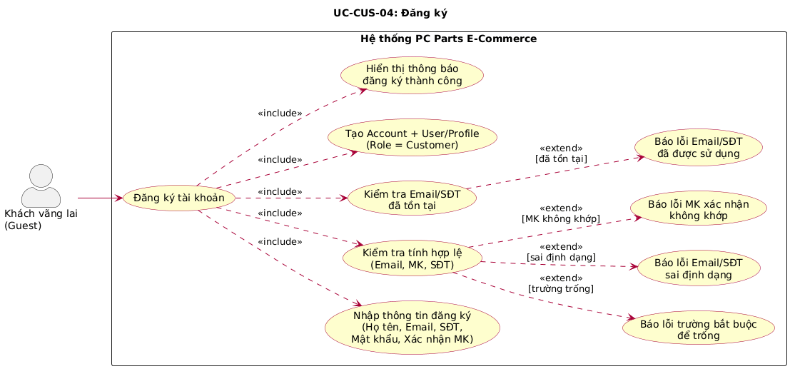

1) Summary
- Use Case Name: Đăng ký
- Use Case ID: UC-CUS-04
- Use Case Description: Cho phép người dùng mới tạo tài khoản trên hệ thống.
- Actor: Khách vãng lai – Guest
- Priority: Chưa xác định (cần thống nhất với bảng yêu cầu người dùng).
- Trigger: Người dùng nhấn nút "Đăng ký" trên trang chủ hoặc trang đăng nhập.
- Pre-Condition: Người dùng chưa có tài khoản (chưa đăng nhập).
- Post-Condition: Account mới (Role = Customer) và User/Profile được tạo trong CSDL.

2) Flow
- Basic Flow: Người dùng nhấn "Đăng ký", hệ thống hiển thị form gồm Họ tên, Email, SĐT, Mật khẩu và Xác nhận mật khẩu; hệ thống kiểm tra tính hợp lệ dữ liệu (định dạng email, độ dài mật khẩu, mật khẩu khớp) và kiểm tra trùng Email/SĐT trong Account/User; nếu hợp lệ thì tạo Account (password_hash, Role = Customer, is_active = true) và User/Profile, sau đó hiển thị thông báo đăng ký thành công và chuyển hướng sang trang đăng nhập.
- Alternative Flow: Không có luồng thay thế được đặc tả trong phiên bản hiện tại.
- Exception Flow: Nếu thiếu trường bắt buộc thì hệ thống báo lỗi cụ thể; nếu Email/SĐT sai định dạng thì báo lỗi; nếu mật khẩu xác nhận không khớp thì báo lỗi; nếu Email hoặc SĐT đã tồn tại thì báo "Email/SĐT đã được sử dụng".

3) Additional Information
- Business Rule: Tuân thủ các ràng buộc nghiệp vụ đã nêu trong Basic Flow/Exception Flow và các thực thể liên quan.
- Non-Funtional Requirement: Áp dụng các yêu cầu phi chức năng tại Mục III (hiệu năng, bảo mật, khả dụng, dữ liệu, UX).

   **4.2. Đăng nhập**

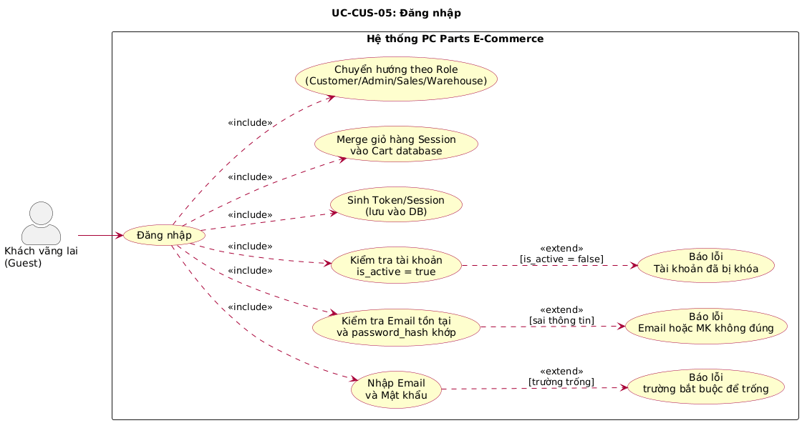

1) Summary
- Use Case Name: Đăng nhập
- Use Case ID: UC-CUS-05
- Use Case Description: Xác thực người dùng qua Email và Mật khẩu; sinh Token/Session để duy trì phiên và merge giỏ hàng Session vào Cart database.
- Actor: Khách vãng lai – Guest
- Priority: Chưa xác định (cần thống nhất với bảng yêu cầu người dùng).
- Trigger: Người dùng nhấn nút "Đăng nhập" trên giao diện hệ thống.
- Pre-Condition: Người dùng đã có tài khoản (đã đăng ký).
- Post-Condition: Token/Session mới được tạo trong CSDL; giỏ hàng Session được merge vào Cart database rồi xóa; phiên duy trì cho đến khi Token hết hạn hoặc đăng xuất.

2) Flow
- Basic Flow: Người dùng nhập Email và Mật khẩu rồi nhấn "Đăng nhập"; hệ thống truy xuất Account để kiểm tra Email tồn tại, password_hash khớp và is_active = true; hệ thống sinh Token/Session lưu vào bảng Token/Session và trả về trình duyệt; sau đó merge giỏ hàng Session vào Cart database (theo UC-CUS-03) và chuyển hướng theo Role (Customer/Admin/Sales/Warehouse).
- Alternative Flow: Không có luồng thay thế được đặc tả trong phiên bản hiện tại.
- Exception Flow: Nếu Email không tồn tại hoặc mật khẩu sai thì hiển thị "Email hoặc mật khẩu không đúng"; nếu tài khoản bị khóa (is_active = false) thì hiển thị "Tài khoản đã bị khóa. Liên hệ quản trị viên"; nếu thiếu trường bắt buộc thì báo lỗi.

3) Additional Information
- Business Rule: Tuân thủ các ràng buộc nghiệp vụ đã nêu trong Basic Flow/Exception Flow và các thực thể liên quan.
- Non-Funtional Requirement: Áp dụng các yêu cầu phi chức năng tại Mục III (hiệu năng, bảo mật, khả dụng, dữ liệu, UX).

   **4.3. Đăng xuất**

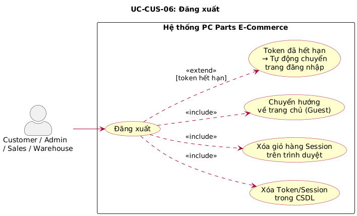

1) Summary
- Use Case Name: Đăng xuất
- Use Case ID: UC-CUS-06
- Use Case Description: Kết thúc phiên làm việc hiện tại.
- Actor: Customer / Admin / Sales / Warehouse
- Priority: Chưa xác định (cần thống nhất với bảng yêu cầu người dùng).
- Trigger: Người dùng nhấn nút "Đăng xuất" trên giao diện hệ thống.
- Pre-Condition: Người dùng đang đăng nhập (có Token/Session hợp lệ).
- Post-Condition: Token/Session bị xóa, giỏ hàng Session bị xóa, Cart database vẫn được lưu.

2) Flow
- Basic Flow: Người dùng nhấn "Đăng xuất"; hệ thống xóa Token/Session trong CSDL, xóa giỏ hàng Session trên trình duyệt và chuyển hướng về trang chủ ở giao diện Guest.
- Alternative Flow: Không có luồng thay thế được đặc tả trong phiên bản hiện tại.
- Exception Flow: Nếu Token đã hết hạn thì hệ thống tự động chuyển về trang đăng nhập kèm thông báo.

3) Additional Information
- Business Rule: Tuân thủ các ràng buộc nghiệp vụ đã nêu trong Basic Flow/Exception Flow và các thực thể liên quan.
- Non-Funtional Requirement: Áp dụng các yêu cầu phi chức năng tại Mục III (hiệu năng, bảo mật, khả dụng, dữ liệu, UX).

   **4.4. Thay đổi mật khẩu**

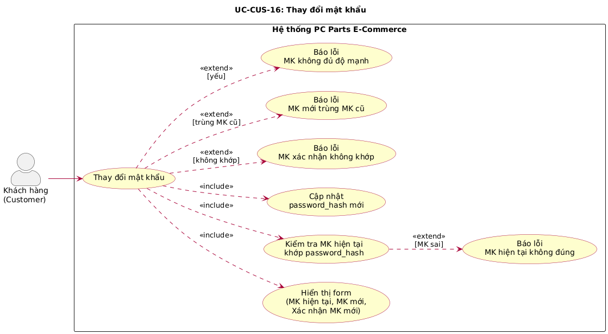

1) Summary
- Use Case Name: Thay đổi mật khẩu
- Use Case ID: UC-CUS-16
- Use Case Description: Cho phép Customer đổi mật khẩu hiện tại sang mật khẩu mới khi đang đăng nhập.
- Actor: Khách hàng – Customer
- Priority: Chưa xác định (cần thống nhất với bảng yêu cầu người dùng).
- Trigger: Customer truy cập "Tài khoản của tôi" và chọn "Đổi mật khẩu".
- Pre-Condition: Customer đã đăng nhập (có Token/Session hợp lệ).
- Post-Condition: Account.password_hash được cập nhật.

2) Flow
- Basic Flow: Customer truy cập "Tài khoản của tôi" → "Đổi mật khẩu"; hệ thống hiển thị form gồm mật khẩu hiện tại, mật khẩu mới và xác nhận mật khẩu mới; Customer nhập đầy đủ thông tin và nhấn "Đổi mật khẩu"; hệ thống kiểm tra mật khẩu hiện tại khớp với Account.password_hash rồi cập nhật password_hash mới.
- Alternative Flow: Không có luồng thay thế được đặc tả trong phiên bản hiện tại.
- Exception Flow: Nếu mật khẩu hiện tại không đúng thì báo "Mật khẩu hiện tại không chính xác"; nếu mật khẩu mới và xác nhận không khớp thì báo "Mật khẩu xác nhận không khớp"; nếu mật khẩu mới trùng mật khẩu cũ thì báo "Mật khẩu mới phải khác mật khẩu cũ"; nếu mật khẩu mới không đủ độ mạnh thì báo lỗi.

3) Additional Information
- Business Rule: Tuân thủ các ràng buộc nghiệp vụ đã nêu trong Basic Flow/Exception Flow và các thực thể liên quan.
- Non-Funtional Requirement: Áp dụng các yêu cầu phi chức năng tại Mục III (hiệu năng, bảo mật, khả dụng, dữ liệu, UX).

   **4.5. Quên / Thiết lập lại mật khẩu**

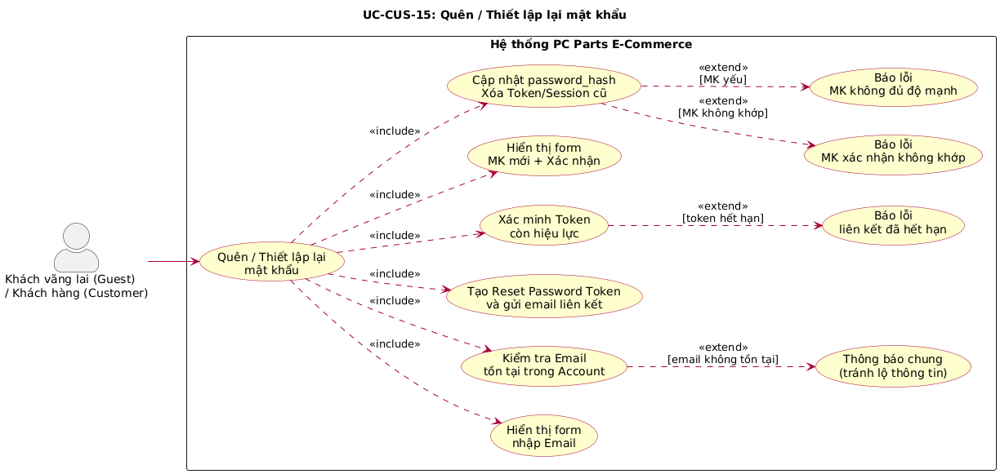

1) Summary
- Use Case Name: Quên / Thiết lập lại mật khẩu
- Use Case ID: UC-CUS-15
- Use Case Description: Cho phép người dùng khôi phục quyền truy cập tài khoản khi quên mật khẩu thông qua liên kết đặt lại mật khẩu gửi qua email.
- Actor: Khách vãng lai (Guest) / Khách hàng (Customer)
- Priority: Chưa xác định (cần thống nhất với bảng yêu cầu người dùng).
- Trigger: Người dùng nhấn liên kết "Quên mật khẩu" trên trang đăng nhập.
- Pre-Condition: Người dùng đã có tài khoản (đã đăng ký) và chưa đăng nhập.
- Post-Condition: Account.password_hash được cập nhật; Reset Password Token bị xóa; toàn bộ Token/Session cũ bị xóa.

2) Flow
- Basic Flow: Người dùng nhấn "Quên mật khẩu" trên trang đăng nhập; hệ thống hiển thị form nhập Email; người dùng nhập Email đã đăng ký và nhấn "Gửi"; hệ thống kiểm tra Email trong Account, nếu tồn tại thì tạo Reset Password Token trong bảng Token/Session kèm thời hạn và gửi email chứa liên kết đặt lại mật khẩu; người dùng nhấn liên kết trong email để hệ thống xác minh Token còn hiệu lực; hệ thống hiển thị form mật khẩu mới/xác nhận; người dùng nhập mật khẩu mới và nhấn "Đặt lại mật khẩu"; hệ thống cập nhật Account.password_hash, xóa Reset Password Token và xóa toàn bộ Token/Session cũ.
- Alternative Flow: Không có luồng thay thế được đặc tả trong phiên bản hiện tại.
- Exception Flow: Nếu Email không tồn tại thì hệ thống vẫn hiển thị thông báo "Nếu email tồn tại, bạn sẽ nhận được liên kết đặt lại mật khẩu" để tránh lộ thông tin; nếu Token hết hạn hoặc không hợp lệ thì báo "Liên kết đã hết hạn. Vui lòng yêu cầu lại"; nếu mật khẩu mới và xác nhận không khớp thì báo lỗi; nếu mật khẩu mới không đủ độ mạnh thì báo "Mật khẩu phải có ít nhất 8 ký tự, bao gồm chữ hoa, chữ thường và số".

3) Additional Information
- Business Rule: Tuân thủ các ràng buộc nghiệp vụ đã nêu trong Basic Flow/Exception Flow và các thực thể liên quan.
- Non-Funtional Requirement: Áp dụng các yêu cầu phi chức năng tại Mục III (hiệu năng, bảo mật, khả dụng, dữ liệu, UX).
   **4.6. Quản lý thông tin cá nhân**

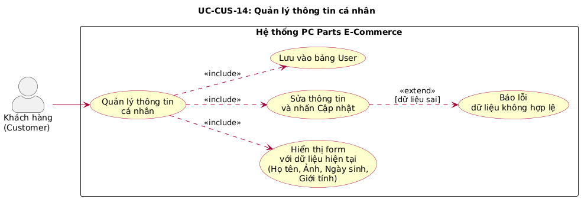

1) Summary
- Use Case Name: Quản lý thông tin cá nhân
- Use Case ID: UC-CUS-14
- Use Case Description: Cho phép Customer cập nhật thông tin cá nhân (User/Profile).
- Actor: Khách hàng – Customer
- Priority: Chưa xác định (cần thống nhất với bảng yêu cầu người dùng).
- Trigger: Customer truy cập "Tài khoản của tôi" → "Thông tin cá nhân".
- Pre-Condition: Customer đã đăng nhập.
- Post-Condition: User/Profile được cập nhật.

2) Flow
- Basic Flow: Customer truy cập "Tài khoản của tôi" → "Thông tin cá nhân"; hệ thống hiển thị form với dữ liệu hiện tại gồm Họ tên, SĐT, ảnh đại diện, ngày sinh và giới tính; Customer chỉnh sửa thông tin, nhấn "Cập nhật" và hệ thống lưu vào bảng User.
- Alternative Flow: Không có luồng thay thế được đặc tả trong phiên bản hiện tại.
- Exception Flow: Nếu dữ liệu không hợp lệ thì hệ thống báo lỗi cụ thể.

3) Additional Information
- Business Rule: Tuân thủ các ràng buộc nghiệp vụ đã nêu trong Basic Flow/Exception Flow và các thực thể liên quan.
- Non-Funtional Requirement: Áp dụng các yêu cầu phi chức năng tại Mục III (hiệu năng, bảo mật, khả dụng, dữ liệu, UX).

   **4.7. Tìm kiếm và lọc sản phẩm**

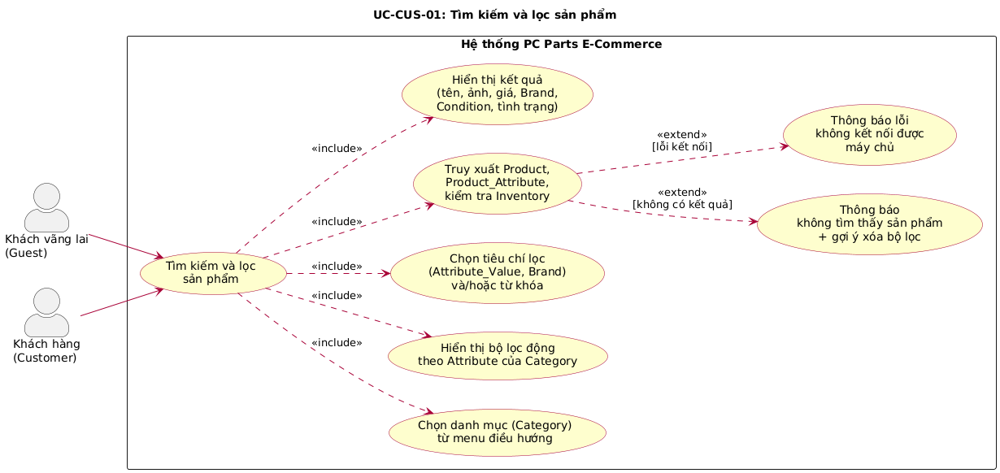

1) Summary
- Use Case Name: Tìm kiếm và lọc sản phẩm
- Use Case ID: UC-CUS-01
- Use Case Description: Cho phép người dùng tìm kiếm linh kiện theo từ khóa hoặc lọc chi tiết theo các thuộc tính kỹ thuật động (Attribute) tương ứng với từng danh mục sản phẩm để nhanh chóng tiếp cận sản phẩm phù hợp nhu cầu.
- Actor: Khách vãng lai (Guest) / Khách hàng (Customer)
- Priority: Chưa xác định (cần thống nhất với bảng yêu cầu người dùng).
- Trigger: Người dùng chọn danh mục từ menu điều hướng hoặc nhập từ khóa vào thanh tìm kiếm.
- Pre-Condition: Không yêu cầu đăng nhập, chỉ cần truy cập trang web.
- Post-Condition: Hệ thống hiển thị danh sách sản phẩm khớp với điều kiện tìm kiếm/lọc của người dùng trên giao diện.

2) Flow
- Basic Flow: Người dùng chọn danh mục (Category) từ menu điều hướng; hệ thống truy xuất Attribute để hiển thị bộ lọc phù hợp danh mục (ví dụ RAM thì có Bus, Dung lượng, Loại DDR); người dùng chọn tiêu chí lọc (Attribute_Value), nhập từ khóa và có thể lọc thêm theo Brand rồi nhấn tìm kiếm; hệ thống truy xuất Product và Product_Attribute, kiểm tra tồn kho qua Inventory để trả về kết quả, làm mờ và gắn nhãn "Hết hàng" với sản phẩm có Inventory.quantity = 0; hệ thống hiển thị tên, ảnh chính (Product_Image), giá bán, Brand và Condition.
- Alternative Flow: Không có luồng thay thế được đặc tả trong phiên bản hiện tại.
- Exception Flow: Nếu không có kết quả phù hợp thì hệ thống thông báo "Không tìm thấy sản phẩm phù hợp" và gợi ý xóa bớt bộ lọc; nếu không kết nối được CSDL thì hệ thống hiển thị lỗi "Không kết nối được với máy chủ".

3) Additional Information
- Business Rule: Tuân thủ các ràng buộc nghiệp vụ đã nêu trong Basic Flow/Exception Flow và các thực thể liên quan.
- Non-Funtional Requirement: Áp dụng các yêu cầu phi chức năng tại Mục III (hiệu năng, bảo mật, khả dụng, dữ liệu, UX).

   **4.8. Quản lý giỏ hàng**

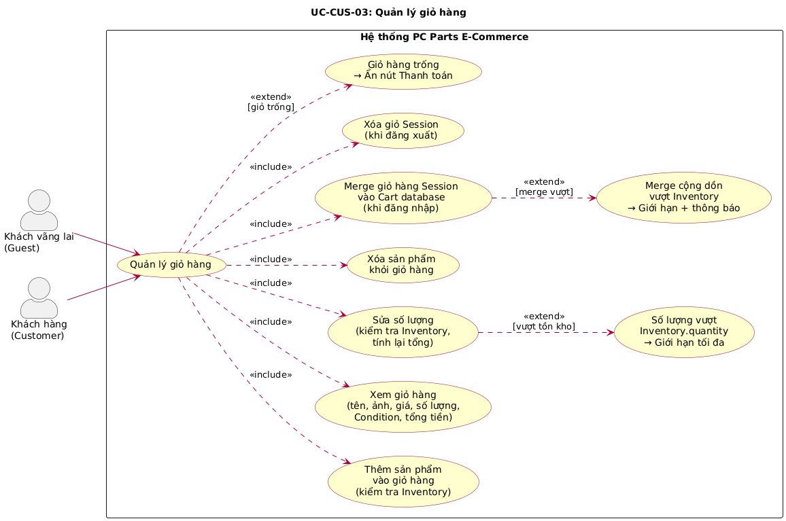

1) Summary
- Use Case Name: Quản lý giỏ hàng
- Use Case ID: UC-CUS-03
- Use Case Description: Cho phép người dùng thêm, xem, sửa số lượng và xóa sản phẩm trong giỏ hàng; Guest dùng giỏ Session, Customer dùng giỏ database (Cart), và khi đăng nhập thì merge giỏ Session vào Cart.
- Actor: Khách vãng lai (Guest) / Khách hàng (Customer)
- Priority: Chưa xác định (cần thống nhất với bảng yêu cầu người dùng).
- Trigger: Người dùng nhấn "Thêm vào giỏ" trên trang sản phẩm hoặc truy cập trang giỏ hàng.
- Pre-Condition: Người dùng đang truy cập hệ thống.
- Post-Condition: Cart_Item được thêm/sửa/xóa trong CSDL hoặc Session và tổng tiền được tính lại.

2) Flow
- Basic Flow: Người dùng có thể thêm sản phẩm vào giỏ từ trang sản phẩm, hệ thống kiểm tra Inventory.quantity rồi thêm Cart_Item vào Cart (database) hoặc Session; khi xem giỏ, hệ thống truy xuất Cart/Cart_Item và join Product, Product_Image để hiển thị tên, ảnh, giá, số lượng, Condition và tổng tiền; khi sửa số lượng, hệ thống kiểm tra Inventory rồi cập nhật Cart_Item và tổng tiền; khi xóa, hệ thống xóa Cart_Item tương ứng; khi đăng nhập, giỏ Session được merge vào Cart database, sản phẩm trùng thì cộng dồn số lượng và xóa giỏ Session sau merge; khi đăng xuất, giỏ Session bị xóa còn Cart database được giữ.
- Alternative Flow: Không có luồng thay thế được đặc tả trong phiên bản hiện tại.
- Exception Flow: Nếu giỏ hàng trống thì ẩn nút Thanh toán; nếu số lượng vượt Inventory.quantity thì giới hạn mức tối đa; nếu cộng dồn khi merge vượt Inventory thì giới hạn và thông báo.

3) Additional Information
- Business Rule: Tuân thủ các ràng buộc nghiệp vụ đã nêu trong Basic Flow/Exception Flow và các thực thể liên quan.
- Non-Funtional Requirement: Áp dụng các yêu cầu phi chức năng tại Mục III (hiệu năng, bảo mật, khả dụng, dữ liệu, UX).

   **4.9. Tạo đơn hàng và thanh toán**

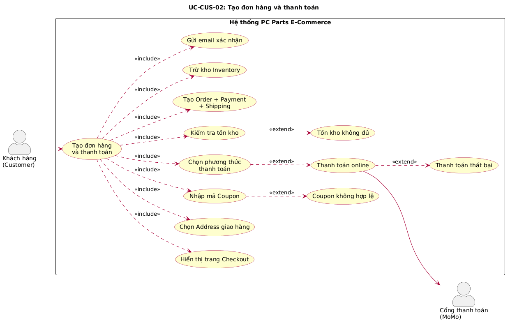

1) Summary
- Use Case Name: Tạo đơn hàng và thanh toán
- Use Case ID: UC-CUS-02
- Use Case Description: Cho phép khách hàng đặt hàng từ giỏ hàng, chọn Address giao hàng, áp dụng Coupon và chọn phương thức thanh toán; hệ thống tạo Order, Order_Detail, Payment và Shipping tương ứng.
- Actor: Khách hàng – Customer
- Priority: Chưa xác định (cần thống nhất với bảng yêu cầu người dùng).
- Trigger: Customer nhấn nút "Thanh toán" từ trang giỏ hàng.
- Pre-Condition: Customer đã đăng nhập (có Token/Session hợp lệ) và giỏ hàng (Cart) không trống (ít nhất 1 Cart_Item).
- Post-Condition: Order, Order_Detail, Payment, Shipping, Order_Status_History được tạo trong CSDL; Inventory.quantity giảm và Inventory_Log được ghi nhận; Cart_Item đã thanh toán bị xóa; Coupon_Usage được ghi nhận nếu có.

2) Flow
- Basic Flow: Customer nhấn "Thanh toán" từ giỏ hàng; hệ thống hiển thị trang Checkout với danh sách sản phẩm và tổng tiền tạm tính; Customer chọn Address đã lưu hoặc thêm mới; Customer nhập Coupon (nếu có) để hệ thống kiểm tra hợp lệ (code đúng, còn hạn, chưa vượt max_uses, chưa dùng bởi User qua Coupon_Usage) và tính lại tổng tiền; Customer chọn COD hoặc MoMo rồi nhấn "Xác nhận đặt hàng"; hệ thống kiểm tra tồn kho cho từng Cart_Item, nếu đủ thì tạo Order trạng thái "Chờ xử lý", tạo Order_Detail với đơn giá snapshot, tạo Payment trạng thái "Pending", tạo Shipping trạng thái "Chờ lấy hàng", tạo Order_Status_History; nếu MoMo thì chuyển hướng cổng thanh toán và cập nhật Payment.status/transaction_id, nếu COD thì Payment giữ Pending; hệ thống trừ kho qua Inventory và Inventory_Log (loại Bán), ghi Coupon_Usage và tăng Coupon.used_count nếu có, xóa Cart_Item đã thanh toán và gửi email xác nhận đơn hàng.
- Alternative Flow: Không có luồng thay thế được đặc tả trong phiên bản hiện tại.
- Exception Flow: Nếu Coupon không hợp lệ thì hệ thống báo lỗi cụ thể và giữ nguyên giá gốc; nếu tồn kho không đủ thì hệ thống thông báo sản phẩm hết hàng; nếu thanh toán trực tuyến thất bại (Payment.status = Failed) thì hệ thống giữ Order và cho phép tạo Payment mới hoặc chuyển COD.

3) Additional Information
- Business Rule: Tuân thủ các ràng buộc nghiệp vụ đã nêu trong Basic Flow/Exception Flow và các thực thể liên quan.
- Non-Funtional Requirement: Áp dụng các yêu cầu phi chức năng tại Mục III (hiệu năng, bảo mật, khả dụng, dữ liệu, UX).

   **4.10. Quản lý địa chỉ giao hàng**

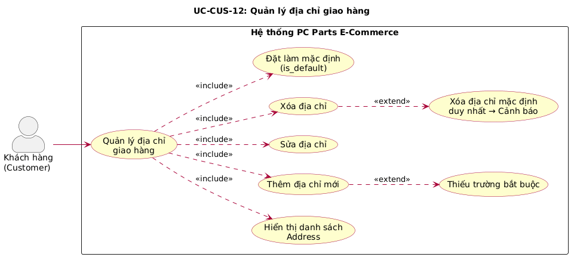

1) Summary
- Use Case Name: Quản lý địa chỉ giao hàng
- Use Case ID: UC-CUS-12
- Use Case Description: Cho phép Customer thêm, sửa, xóa và đặt mặc định cho các địa chỉ giao hàng (Address).
- Actor: Khách hàng – Customer
- Priority: Chưa xác định (cần thống nhất với bảng yêu cầu người dùng).
- Trigger: Customer truy cập "Tài khoản của tôi" → "Sổ địa chỉ" hoặc thêm địa chỉ mới khi Checkout.
- Pre-Condition: Customer đã đăng nhập.
- Post-Condition: Address được tạo/sửa/xóa trong CSDL.

2) Flow
- Basic Flow: Customer truy cập "Tài khoản của tôi" → "Sổ địa chỉ"; hệ thống hiển thị danh sách Address với label, người nhận, SĐT, tỉnh/quận/phường/đường và cờ mặc định; Customer có thể thêm địa chỉ mới rồi lưu, sửa địa chỉ hiện có, xóa địa chỉ hoặc đặt địa chỉ mặc định để hệ thống cập nhật is_default.
- Alternative Flow: Không có luồng thay thế được đặc tả trong phiên bản hiện tại.
- Exception Flow: Nếu thiếu trường bắt buộc thì hệ thống báo lỗi cụ thể; nếu xóa Address duy nhất (mặc định) thì cảnh báo "Bạn cần tạo địa chỉ mới trước khi xóa".

3) Additional Information
- Business Rule: Tuân thủ các ràng buộc nghiệp vụ đã nêu trong Basic Flow/Exception Flow và các thực thể liên quan.
- Non-Funtional Requirement: Áp dụng các yêu cầu phi chức năng tại Mục III (hiệu năng, bảo mật, khả dụng, dữ liệu, UX).

   **4.11. Xem lịch sử đơn hàng và theo dõi vận chuyển**

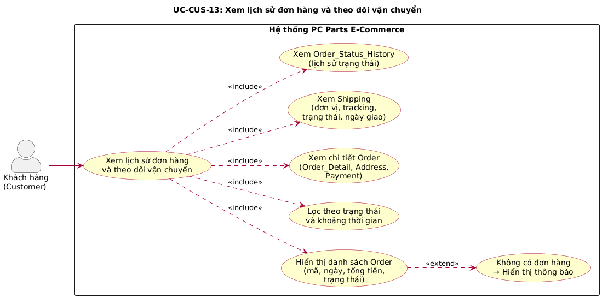

1) Summary
- Use Case Name: Xem lịch sử đơn hàng và theo dõi vận chuyển
- Use Case ID: UC-CUS-13
- Use Case Description: Cho phép Customer xem danh sách đơn hàng đã đặt, xem chi tiết từng đơn và theo dõi trạng thái vận chuyển.
- Actor: Khách hàng – Customer
- Priority: Chưa xác định (cần thống nhất với bảng yêu cầu người dùng).
- Trigger: Customer truy cập mục "Lịch sử đơn hàng" trong trang tài khoản.
- Pre-Condition: Customer đã đăng nhập.
- Post-Condition: Không thay đổi CSDL, hệ thống chỉ hiển thị thông tin.

2) Flow
- Basic Flow: Customer truy cập "Lịch sử đơn hàng"; hệ thống hiển thị danh sách Order gồm mã đơn, ngày đặt, tổng tiền và trạng thái, có thể lọc theo trạng thái hoặc khoảng thời gian; Customer chọn một Order để xem chi tiết Order_Detail, Address, Payment (phương thức, trạng thái, transaction_id); hệ thống hiển thị thông tin Shipping (đơn vị vận chuyển, tracking_number, trạng thái, ngày giao dự kiến/thực tế) và Order_Status_History (thời gian, trạng thái cũ → mới).
- Alternative Flow: Không có luồng thay thế được đặc tả trong phiên bản hiện tại.
- Exception Flow: Nếu không có đơn hàng nào thì hiển thị "Bạn chưa có đơn hàng nào".

3) Additional Information
- Business Rule: Tuân thủ các ràng buộc nghiệp vụ đã nêu trong Basic Flow/Exception Flow và các thực thể liên quan.
- Non-Funtional Requirement: Áp dụng các yêu cầu phi chức năng tại Mục III (hiệu năng, bảo mật, khả dụng, dữ liệu, UX).

   **4.12. Yêu cầu đổi trả**

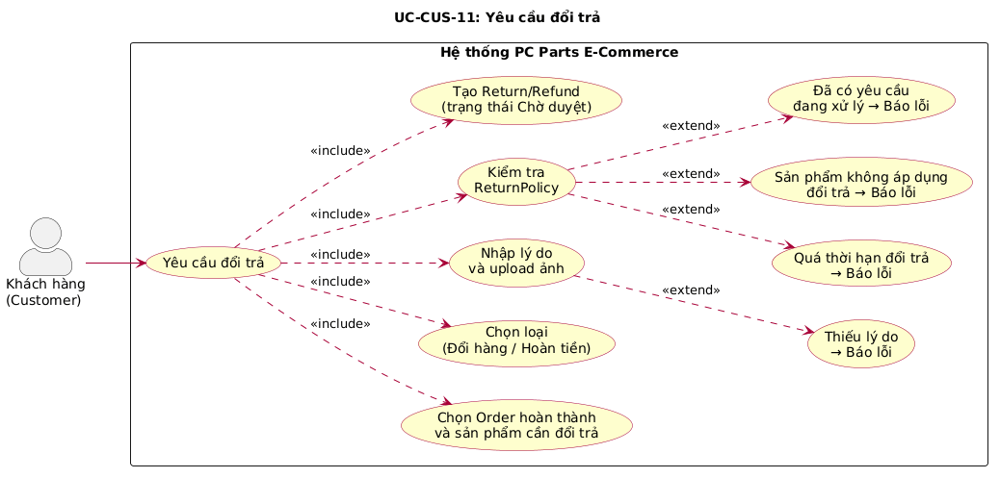

1) Summary
- Use Case Name: Yêu cầu đổi trả
- Use Case ID: UC-CUS-11
- Use Case Description: Cho phép Customer gửi yêu cầu đổi hàng hoặc hoàn tiền cho sản phẩm trong đơn hàng đã hoàn thành, gắn với Order_Detail cụ thể.
- Actor: Khách hàng – Customer
- Priority: Chưa xác định (cần thống nhất với bảng yêu cầu người dùng).
- Trigger: Customer nhấn "Yêu cầu đổi trả" trên trang chi tiết đơn hàng đã hoàn thành.
- Pre-Condition: Customer đã đăng nhập; Order ở trạng thái "Hoàn thành"; thời gian yêu cầu nằm trong hạn đổi trả theo chính sách cửa hàng.
- Post-Condition: Return/Refund được tạo trong CSDL với trạng thái "Chờ duyệt".

2) Flow
- Basic Flow: Customer truy cập "Lịch sử đơn hàng", chọn Order và sản phẩm cần đổi trả rồi nhấn "Yêu cầu đổi trả"; hệ thống hiển thị form để chọn loại (Đổi hàng/Hoàn tiền), nhập lý do và upload ảnh (tùy chọn); Customer gửi yêu cầu và hệ thống tạo Return/Refund trạng thái "Chờ duyệt" gắn với Order_Detail.
- Alternative Flow: Không có luồng thay thế được đặc tả trong phiên bản hiện tại.
- Exception Flow: Nếu quá thời hạn đổi trả thì báo "Đã quá thời hạn đổi trả cho đơn hàng này"; nếu thiếu lý do thì báo "Vui lòng nhập lý do đổi trả".

3) Additional Information
- Business Rule: Tuân thủ các ràng buộc nghiệp vụ đã nêu trong Basic Flow/Exception Flow và các thực thể liên quan.
- Non-Funtional Requirement: Áp dụng các yêu cầu phi chức năng tại Mục III (hiệu năng, bảo mật, khả dụng, dữ liệu, UX).

**4.13. Yêu cầu bảo hành**

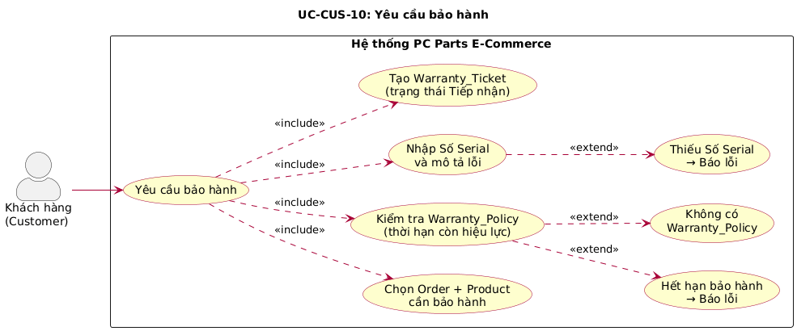

1) Summary
- Use Case Name: Yêu cầu bảo hành
- Use Case ID: UC-CUS-10
- Use Case Description: Cho phép Customer tạo phiếu bảo hành (Warranty_Ticket) cho sản phẩm đã mua gắn với Order cụ thể, và hệ thống kiểm tra Warranty_Policy trước khi tiếp nhận.
- Actor: Khách hàng – Customer
- Priority: Chưa xác định (cần thống nhất với bảng yêu cầu người dùng).
- Trigger: Customer nhấn "Yêu cầu bảo hành" trên trang chi tiết đơn hàng.
- Pre-Condition: Customer đã đăng nhập và có Order trạng thái "Hoàn thành" chứa Product cần bảo hành.
- Post-Condition: Warranty_Ticket được tạo trong CSDL với trạng thái "Tiếp nhận".

2) Flow
- Basic Flow: Customer truy cập "Lịch sử đơn hàng", chọn Order và Product cần bảo hành rồi nhấn "Yêu cầu bảo hành"; hệ thống kiểm tra Warranty_Policy theo Product/Category để xác định còn hạn (so sánh Order.created_at + duration_months với ngày hiện tại); nếu còn hạn thì hiển thị form nhập Số Serial và mô tả lỗi; Customer gửi yêu cầu và hệ thống tạo Warranty_Ticket trạng thái "Tiếp nhận".
- Alternative Flow: Không có luồng thay thế được đặc tả trong phiên bản hiện tại.
- Exception Flow: Nếu sản phẩm hết hạn bảo hành thì báo "Sản phẩm đã hết hạn bảo hành"; nếu sản phẩm không có Warranty_Policy thì báo "Sản phẩm này không có chính sách bảo hành"; nếu thiếu Số Serial thì báo "Vui lòng nhập Số Serial".

3) Additional Information
- Business Rule: Tuân thủ các ràng buộc nghiệp vụ đã nêu trong Basic Flow/Exception Flow và các thực thể liên quan.
- Non-Funtional Requirement: Áp dụng các yêu cầu phi chức năng tại Mục III (hiệu năng, bảo mật, khả dụng, dữ liệu, UX).

   **4.14. Đánh giá sản phẩm**

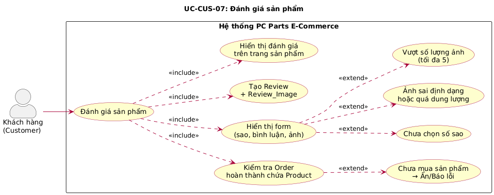

1) Summary
- Use Case Name: Đánh giá sản phẩm
- Use Case ID: UC-CUS-07
- Use Case Description: Cho phép Customer viết đánh giá, chọn số sao và tải ảnh thực tế cho sản phẩm đã mua thành công.
- Actor: Khách hàng – Customer
- Priority: Chưa xác định (cần thống nhất với bảng yêu cầu người dùng).
- Trigger: Customer nhấn "Viết đánh giá" trên trang chi tiết sản phẩm đã mua.
- Pre-Condition: Customer đã đăng nhập và có ít nhất một Order chứa Product này ở trạng thái "Hoàn thành".
- Post-Condition: Review và Review_Image được tạo trong CSDL.

2) Flow
- Basic Flow: Customer truy cập trang chi tiết sản phẩm và nhấn "Viết đánh giá"; hệ thống kiểm tra Order và Order_Detail để xác nhận Customer đã mua sản phẩm với đơn "Hoàn thành"; hệ thống hiển thị form số sao (1-5), nội dung bình luận và upload ảnh tùy chọn; Customer gửi đánh giá, hệ thống tạo Review liên kết User/Product/Order và Review_Image nếu có ảnh; đánh giá hiển thị ngay trên trang chi tiết sản phẩm.
- Alternative Flow: Không có luồng thay thế được đặc tả trong phiên bản hiện tại.
- Exception Flow: Nếu chưa mua sản phẩm thì ẩn nút "Viết đánh giá" hoặc báo "Bạn cần mua sản phẩm này để đánh giá"; nếu chưa chọn số sao thì báo "Vui lòng chọn số sao"; nếu ảnh sai định dạng thì báo "Chỉ chấp nhận ảnh JPG, PNG, WEBP"; nếu ảnh vượt 5MB thì báo "Ảnh tối đa 5MB"; nếu vượt quá 5 ảnh thì báo "Tối đa 5 ảnh".

3) Additional Information
- Business Rule: Tuân thủ các ràng buộc nghiệp vụ đã nêu trong Basic Flow/Exception Flow và các thực thể liên quan.
- Non-Funtional Requirement: Áp dụng các yêu cầu phi chức năng tại Mục III (hiệu năng, bảo mật, khả dụng, dữ liệu, UX).

   **4.15. Quản lý danh sách yêu thích**

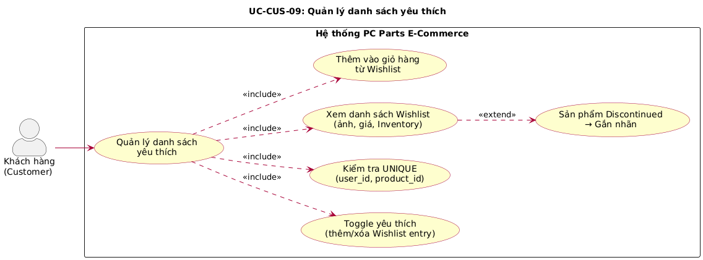

1) Summary
- Use Case Name: Quản lý danh sách yêu thích
- Use Case ID: UC-CUS-09
- Use Case Description: Cho phép Customer lưu sản phẩm quan tâm vào Wishlist để xem lại sau và xóa khỏi Wishlist khi không còn quan tâm.
- Actor: Khách hàng – Customer
- Priority: Chưa xác định (cần thống nhất với bảng yêu cầu người dùng).
- Trigger: Customer nhấn biểu tượng "Yêu thích" trên sản phẩm hoặc truy cập trang "Danh sách yêu thích".
- Pre-Condition: Customer đã đăng nhập.
- Post-Condition: Wishlist entry được tạo hoặc xóa trong CSDL.

2) Flow
- Basic Flow: Customer nhấn biểu tượng "Yêu thích" trên trang sản phẩm hoặc danh sách sản phẩm; hệ thống kiểm tra UNIQUE(user_id, product_id) trong Wishlist, nếu chưa có thì tạo entry mới, nếu đã có thì xóa entry (toggle yêu thích); Customer truy cập trang "Danh sách yêu thích" để xem Product đã lưu kèm ảnh, giá và tình trạng Inventory, đồng thời có thể nhấn "Thêm vào giỏ" trực tiếp từ Wishlist.
- Alternative Flow: Không có luồng thay thế được đặc tả trong phiên bản hiện tại.
- Exception Flow: Nếu sản phẩm đã ngừng kinh doanh (status = Discontinued) thì gắn nhãn "Ngừng kinh doanh" trong Wishlist.

3) Additional Information
- Business Rule: Tuân thủ các ràng buộc nghiệp vụ đã nêu trong Basic Flow/Exception Flow và các thực thể liên quan.
- Non-Funtional Requirement: Áp dụng các yêu cầu phi chức năng tại Mục III (hiệu năng, bảo mật, khả dụng, dữ liệu, UX).

   **4.16. Xây dựng cấu hình PC (Build PC)**

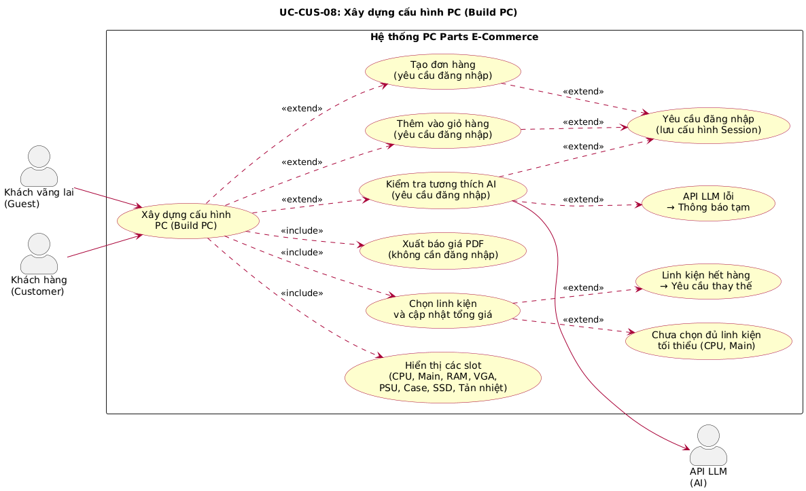

1) Summary
- Use Case Name: Xây dựng cấu hình PC (Build PC)
- Use Case ID: UC-CUS-08
- Use Case Description: Cho phép người dùng (Guest hoặc Customer) chọn tuần tự linh kiện để lắp bộ PC trên form Frontend (không lưu DB), hiển thị tổng giá và xuất báo giá không cần đăng nhập; các thao tác kiểm tra AI, thêm vào giỏ hoặc tạo đơn yêu cầu đăng nhập.
- Actor: Khách vãng lai (Guest) / Khách hàng (Customer)
- Priority: Chưa xác định (cần thống nhất với bảng yêu cầu người dùng).
- Trigger: Người dùng truy cập trang "Build PC" từ menu điều hướng.
- Pre-Condition: Không yêu cầu đăng nhập để chọn linh kiện và xuất báo giá; yêu cầu đăng nhập để dùng AI và thêm vào giỏ/tạo đơn; hệ thống có sản phẩm thuộc các Category linh kiện PC.
- Post-Condition: Nếu xuất báo giá thì file PDF được tạo (không thay đổi CSDL); nếu thêm vào giỏ thì linh kiện được thêm vào Cart dưới dạng Cart_Item riêng lẻ (yêu cầu đã đăng nhập).

2) Flow
- Basic Flow: Người dùng truy cập trang "Build PC"; hệ thống hiển thị các slot CPU, Mainboard, RAM, VGA, PSU, Case, SSD/HDD và Tản nhiệt; người dùng chọn từng slot để hệ thống hiển thị Product theo Category tương ứng (có thể lọc theo Attribute/Brand); người dùng chọn linh kiện và hệ thống cập nhật tổng giá; khi nhấn "Xuất báo giá", hệ thống tạo file PDF mà không cần đăng nhập; khi nhấn "Kiểm tra tương thích (AI)", hệ thống kiểm tra đăng nhập, nếu chưa đăng nhập thì yêu cầu đăng nhập, nếu đã đăng nhập thì gửi thông số qua API LLM để nhận phân tích/gợi ý; khi nhấn "Thêm vào giỏ hàng" hoặc "Tạo đơn hàng", hệ thống kiểm tra đăng nhập, nếu chưa đăng nhập thì chuyển hướng đăng nhập và lưu tạm cấu hình vào Session, sau đăng nhập thì thêm toàn bộ linh kiện vào Cart dưới dạng Cart_Item riêng lẻ.
- Alternative Flow: Không có luồng thay thế được đặc tả trong phiên bản hiện tại.
- Exception Flow: Nếu chưa chọn đủ linh kiện tối thiểu (CPU, Mainboard) thì báo "Vui lòng chọn ít nhất CPU và Mainboard"; nếu API LLM lỗi thì báo "Dịch vụ AI tạm không khả dụng. Bạn vẫn có thể tiếp tục"; nếu linh kiện hết hàng (Inventory.quantity = 0) thì đánh dấu "Hết hàng" và yêu cầu chọn thay thế; nếu chưa đăng nhập khi nhấn "Kiểm tra AI"/"Thêm vào giỏ hàng"/"Tạo đơn hàng" thì yêu cầu đăng nhập và lưu cấu hình vào Session.

3) Additional Information
- Business Rule: Tuân thủ các ràng buộc nghiệp vụ đã nêu trong Basic Flow/Exception Flow và các thực thể liên quan.
- Non-Funtional Requirement: Áp dụng các yêu cầu phi chức năng tại Mục III (hiệu năng, bảo mật, khả dụng, dữ liệu, UX).

   **4.17. Nhận thông báo trạng thái đơn hàng**

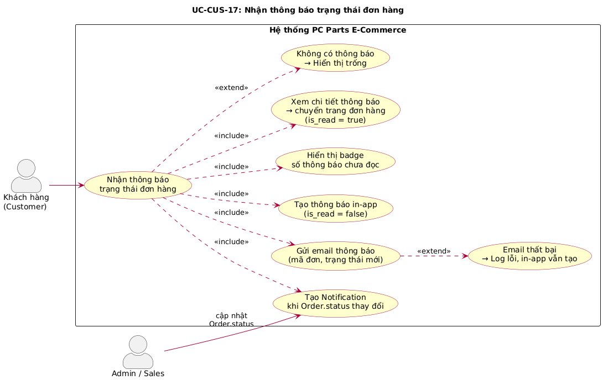

1) Summary
- Use Case Name: Nhận thông báo trạng thái đơn hàng
- Use Case ID: UC-CUS-17
- Use Case Description: Cho phép Customer nhận thông báo email và in-app khi trạng thái đơn hàng thay đổi để theo dõi tiến trình xử lý đơn hàng.
- Actor: Khách hàng – Customer
- Priority: Chưa xác định (cần thống nhất với bảng yêu cầu người dùng).
- Trigger: Admin/Sales cập nhật trạng thái đơn hàng (Order.status thay đổi).
- Pre-Condition: Customer đã đăng nhập và có ít nhất một Order trong hệ thống.
- Post-Condition: Notification được tạo trong CSDL và email thông báo được gửi đến Customer.

2) Flow
- Basic Flow: Khi Admin/Sales cập nhật Order.status (ví dụ Chờ xử lý → Đang xử lý → Đang giao → Hoàn thành), hệ thống tự động tạo Notification cho Customer; hệ thống gửi email đến Account.email với mã đơn, trạng thái mới và thời gian cập nhật; đồng thời tạo thông báo in-app có is_read = false; khi Customer truy cập hệ thống, biểu tượng thông báo hiển thị số chưa đọc; Customer mở thông báo để xem chi tiết và chuyển hướng đến trang chi tiết đơn hàng, hệ thống cập nhật Notification.is_read = true.
- Alternative Flow: Không có luồng thay thế được đặc tả trong phiên bản hiện tại.
- Exception Flow: Nếu gửi email thất bại thì hệ thống ghi log lỗi nhưng vẫn tạo thông báo in-app; nếu Customer không có thông báo thì hiển thị "Bạn chưa có thông báo nào".

3) Additional Information
- Business Rule: Tuân thủ các ràng buộc nghiệp vụ đã nêu trong Basic Flow/Exception Flow và các thực thể liên quan.
- Non-Funtional Requirement: Áp dụng các yêu cầu phi chức năng tại Mục III (hiệu năng, bảo mật, khả dụng, dữ liệu, UX).

   **4.18. Hủy đơn hàng (Customer)**

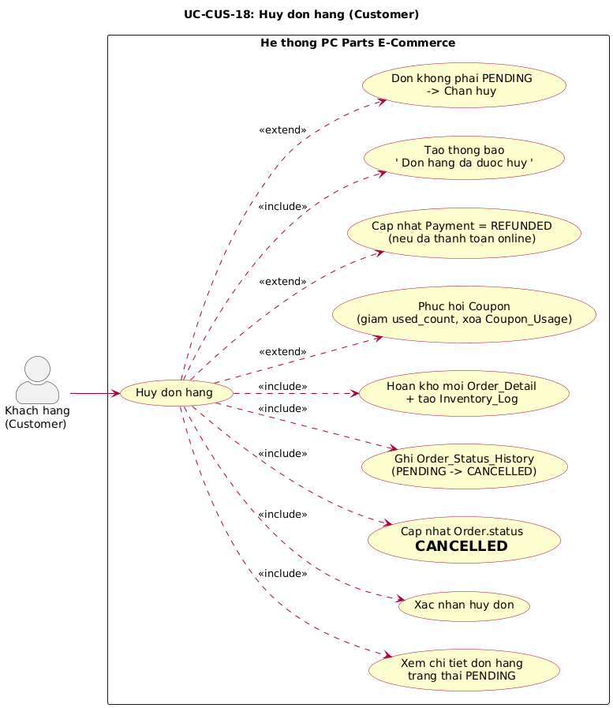

1) Summary
- Use Case Name: Hủy đơn hàng
- Use Case ID: UC-CUS-18
- Use Case Description: Cho phép Customer tự hủy đơn hàng ở trạng thái "Chờ xử lý" (PENDING); hệ thống hoàn kho, hoàn Coupon (nếu có) và ghi nhận lịch sử.
- Actor: Khách hàng – Customer
- Priority: Chưa xác định (cần thống nhất với bảng yêu cầu người dùng).
- Trigger: Customer nhấn "Hủy đơn hàng" trên trang chi tiết đơn hàng.
- Pre-Condition: Customer đã đăng nhập; Order thuộc về Customer và đang ở trạng thái "Chờ xử lý" (PENDING).
- Post-Condition: Order.status = CANCELLED và Order_Status_History được ghi nhận; Inventory được hoàn lại và Inventory_Log được ghi nhận; Coupon_Usage bị xóa và Coupon.used_count giảm nếu có; Payment online đã thanh toán được cập nhật REFUNDED khi áp dụng.

2) Flow
- Basic Flow: Customer truy cập "Lịch sử đơn hàng", chọn đơn trạng thái "Chờ xử lý" và nhấn "Hủy đơn hàng"; hệ thống hiển thị popup xác nhận, Customer xác nhận hủy; hệ thống cập nhật Order.status = "Đã hủy" (CANCELLED), tạo Order_Status_History; hệ thống hoàn kho bằng cách cập nhật Inventory.quantity và tạo Inventory_Log (Hoàn trả) cho từng Order_Detail; nếu có Coupon thì giảm Coupon.used_count và xóa Coupon_Usage; nếu có Payment online (MoMo) đã SUCCESS thì cập nhật Payment.status = REFUNDED; hệ thống gửi email thông báo hủy đơn cho Customer.
- Alternative Flow: Không có luồng thay thế được đặc tả trong phiên bản hiện tại.
- Exception Flow: Nếu đơn không ở trạng thái "Chờ xử lý" thì ẩn nút "Hủy đơn" hoặc báo "Không thể hủy đơn hàng ở trạng thái hiện tại"; nếu đơn không thuộc Customer hiện tại thì trả 403 Forbidden.

3) Additional Information
- Business Rule: Tuân thủ các ràng buộc nghiệp vụ đã nêu trong Basic Flow/Exception Flow và các thực thể liên quan.
- Non-Funtional Requirement: Áp dụng các yêu cầu phi chức năng tại Mục III (hiệu năng, bảo mật, khả dụng, dữ liệu, UX).

   **4.19. (Admin) Quản lý danh mục và thuộc tính**

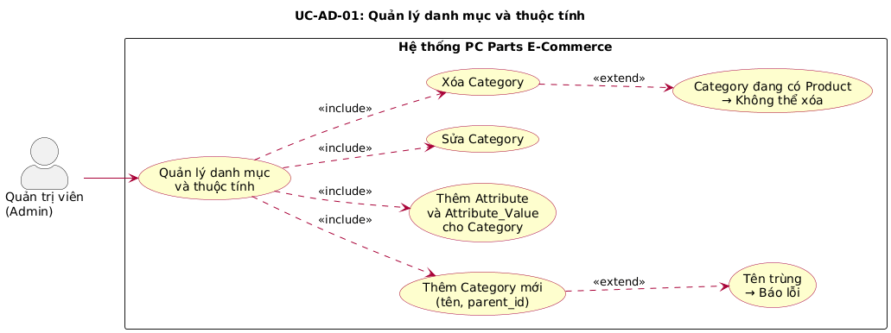

1) Summary
- Use Case Name: Quản lý danh mục và thuộc tính
- Use Case ID: UC-AD-01
- Use Case Description: Cho phép Admin tạo, sửa, xóa Category đa tầng và định nghĩa Attribute, Attribute_Value kỹ thuật cho từng danh mục.
- Actor: Admin
- Priority: Chưa xác định (cần thống nhất với bảng yêu cầu người dùng).
- Trigger: Admin truy cập mục "Quản lý danh mục" trên trang quản trị.
- Pre-Condition: Đăng nhập với Role Admin, Token/Session hợp lệ.
- Post-Condition: Category, Attribute, Attribute_Value được tạo/sửa/xóa trong CSDL.

2) Flow
- Basic Flow: Admin truy cập "Quản lý danh mục" và nhấn "Thêm mới"; nhập tên danh mục và danh mục cha (parent_id) nếu có; thêm các Attribute (ví dụ Bus, Dung lượng) và Attribute_Value tương ứng (ví dụ DDR4, DDR5); nhấn "Lưu" để hệ thống tạo Category, Attribute, Attribute_Value; Admin có thể chọn Category để sửa hoặc xóa.
- Alternative Flow: Không có luồng thay thế được đặc tả trong phiên bản hiện tại.
- Exception Flow: Nếu tên danh mục trùng thì báo "Danh mục đã tồn tại"; nếu xóa Category đang có Product thì báo "Không thể xóa danh mục đang chứa sản phẩm".

3) Additional Information
- Business Rule: Tuân thủ các ràng buộc nghiệp vụ đã nêu trong Basic Flow/Exception Flow và các thực thể liên quan.
- Non-Funtional Requirement: Áp dụng các yêu cầu phi chức năng tại Mục III (hiệu năng, bảo mật, khả dụng, dữ liệu, UX).

   **4.20. (Admin) Quản lý sản phẩm**

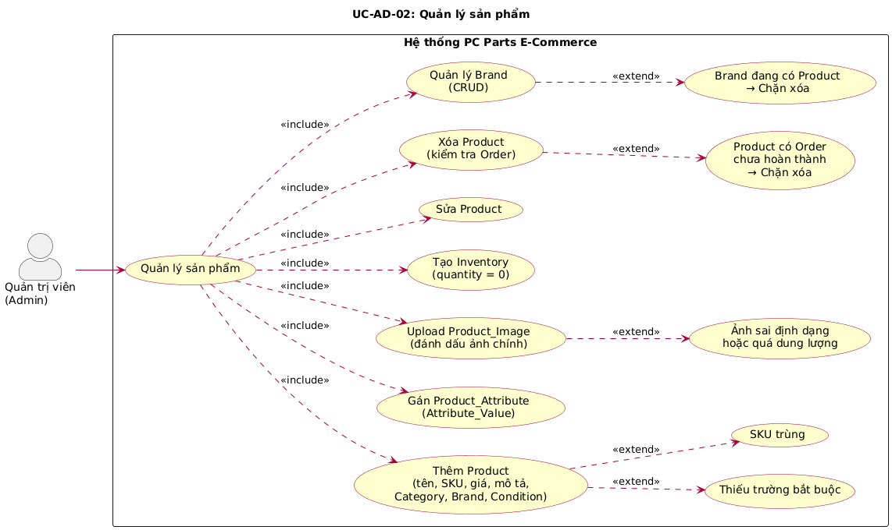

1) Summary
- Use Case Name: Quản lý sản phẩm
- Use Case ID: UC-AD-02
- Use Case Description: Cho phép Admin thêm, sửa, xóa Product, Product_Image, gán Product_Attribute và quản lý Brand.
- Actor: Admin
- Priority: Chưa xác định (cần thống nhất với bảng yêu cầu người dùng).
- Trigger: Admin truy cập mục "Quản lý sản phẩm" trên trang quản trị.
- Pre-Condition: Đăng nhập với Role Admin, Token/Session hợp lệ.
- Post-Condition: Product, Product_Attribute, Product_Image, Inventory, Brand được tạo/sửa/xóa.

2) Flow
- Basic Flow: Admin thêm Product bằng cách nhập Tên, SKU, giá gốc, giá bán, mô tả; chọn Category, Brand, Condition; gán Attribute_Value cho từng Attribute theo Category; upload Product_Image và đánh dấu ảnh chính; nhấn "Lưu" để tạo Product, Product_Attribute, Product_Image và Inventory (quantity = 0); Admin có thể sửa Product, xóa Product có kiểm tra điều kiện đơn hàng chưa hoàn thành; trong quản lý Brand, Admin CRUD Brand và có thể tạo Brand mới ngay trong form thêm Product.
- Alternative Flow: Không có luồng thay thế được đặc tả trong phiên bản hiện tại.
- Exception Flow: Nếu thiếu trường bắt buộc (Tên, SKU, Category) thì báo lỗi; nếu SKU trùng thì báo "Mã SKU đã tồn tại"; nếu ảnh sai định dạng hoặc quá dung lượng thì báo lỗi; nếu xóa Product có Order chưa hoàn thành thì chặn xóa; nếu xóa Brand đang có Product thì báo "Không thể xóa thương hiệu đang có sản phẩm".

3) Additional Information
- Business Rule: Tuân thủ các ràng buộc nghiệp vụ đã nêu trong Basic Flow/Exception Flow và các thực thể liên quan.
- Non-Funtional Requirement: Áp dụng các yêu cầu phi chức năng tại Mục III (hiệu năng, bảo mật, khả dụng, dữ liệu, UX).

   **4.21. (Admin/Sales) Quản lý đơn hàng**

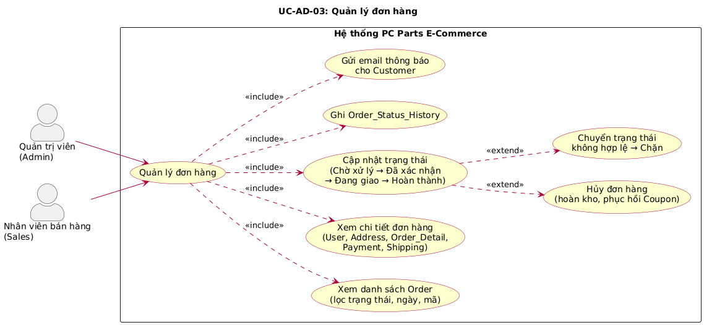

1) Summary
- Use Case Name: Quản lý đơn hàng
- Use Case ID: UC-AD-03
- Use Case Description: Cho phép xem danh sách đơn hàng, xem chi tiết và cập nhật trạng thái; mỗi lần cập nhật ghi Order_Status_History và gửi thông báo cho khách.
- Actor: Admin / Sales
- Priority: Chưa xác định (cần thống nhất với bảng yêu cầu người dùng).
- Trigger: Admin/Sales truy cập mục "Quản lý đơn hàng" trên bảng điều khiển hoặc hệ thống nhận đơn hàng mới.
- Pre-Condition: Đăng nhập với Role Admin hoặc Sales.
- Post-Condition: Order.status được cập nhật, Order_Status_History được ghi nhận, email được gửi; nếu hủy đơn thì kho hoàn và Coupon được phục hồi.

2) Flow
- Basic Flow: Admin/Sales truy cập "Quản lý đơn hàng", lọc theo trạng thái/ngày/mã đơn; chọn đơn để xem chi tiết User, Address, Order_Detail, Payment, Shipping; cập nhật trạng thái theo luồng "Chờ xử lý" → "Đã xác nhận", "Đã xác nhận" → "Đang giao", "Đang giao" → "Hoàn thành", hoặc từ trạng thái phù hợp sang "Đã hủy"; hệ thống tạo Order_Status_History (trạng thái cũ → mới, người thao tác, thời gian) và gửi email thông báo cho Customer.
- Alternative Flow: Không có luồng thay thế được đặc tả trong phiên bản hiện tại.
- Exception Flow: Nếu chuyển trạng thái không hợp lệ (ví dụ "Hoàn thành" → "Đang giao") thì chặn; khi hủy đơn, hệ thống tạo Inventory_Log (Hoàn trả), cập nhật Inventory.quantity và nếu có Coupon thì giảm used_count, xóa Coupon_Usage.

3) Additional Information
- Business Rule: Tuân thủ các ràng buộc nghiệp vụ đã nêu trong Basic Flow/Exception Flow và các thực thể liên quan.
- Non-Funtional Requirement: Áp dụng các yêu cầu phi chức năng tại Mục III (hiệu năng, bảo mật, khả dụng, dữ liệu, UX).

   **4.22. (Admin/Warehouse) Quản lý kho hàng**

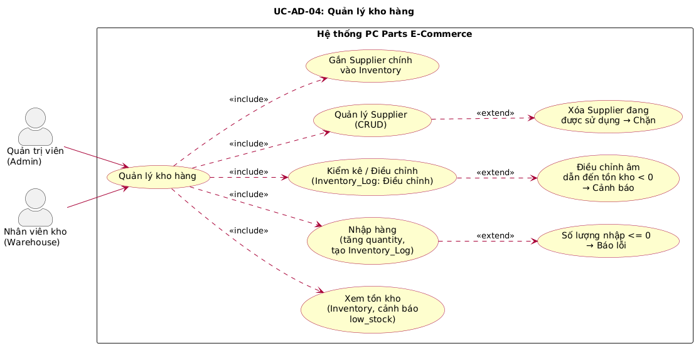

1) Summary
- Use Case Name: Quản lý kho hàng
- Use Case ID: UC-AD-04
- Use Case Description: Cho phép xem tồn kho (Inventory), nhập hàng mới, kiểm kê điều chỉnh, ghi nhận biến động qua Inventory_Log và quản lý Supplier.
- Actor: Admin / Warehouse
- Priority: Chưa xác định (cần thống nhất với bảng yêu cầu người dùng).
- Trigger: Admin/Warehouse truy cập mục "Quản lý kho hàng" hoặc hệ thống cảnh báo tồn kho thấp.
- Pre-Condition: Đăng nhập với Role Admin hoặc Warehouse.
- Post-Condition: Inventory.quantity được cập nhật, Inventory_Log ghi nhận biến động và Supplier được tạo/sửa/xóa.

2) Flow
- Basic Flow: Người dùng xem tồn kho qua danh sách Product kèm Inventory.quantity, low_stock_threshold, Supplier chính và cảnh báo khi quantity <= low_stock_threshold; nhập hàng bằng cách chọn Product, nhập số lượng/ghi chú để hệ thống tăng Inventory.quantity và tạo Inventory_Log loại Nhập; kiểm kê/điều chỉnh bằng cách nhập số lượng +/- và lý do để tạo Inventory_Log loại Điều chỉnh; Admin quản lý Supplier qua CRUD và gắn Supplier chính vào Inventory của từng Product.
- Alternative Flow: Không có luồng thay thế được đặc tả trong phiên bản hiện tại.
- Exception Flow: Nếu số lượng nhập <= 0 thì báo lỗi; nếu điều chỉnh âm làm tồn kho < 0 thì cảnh báo và yêu cầu xác nhận; nếu xóa Supplier đang được gắn vào Inventory thì báo "Không thể xóa nhà cung cấp đang được sử dụng".

3) Additional Information
- Business Rule: Tuân thủ các ràng buộc nghiệp vụ đã nêu trong Basic Flow/Exception Flow và các thực thể liên quan.
- Non-Funtional Requirement: Áp dụng các yêu cầu phi chức năng tại Mục III (hiệu năng, bảo mật, khả dụng, dữ liệu, UX).

   **4.23. (Admin/Sales) Quản lý vận chuyển**

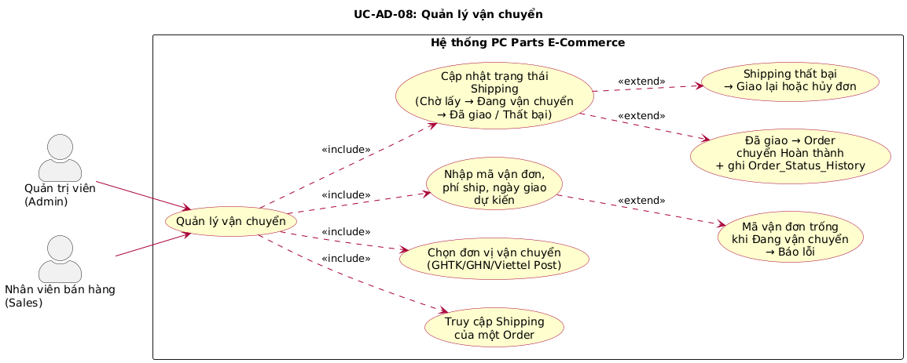

1) Summary
- Use Case Name: Quản lý vận chuyển
- Use Case ID: UC-AD-08
- Use Case Description: Cho phép quản lý thông tin Shipping cho từng đơn hàng, bao gồm chọn đơn vị vận chuyển, nhập mã vận đơn và cập nhật trạng thái giao hàng.
- Actor: Admin / Sales
- Priority: Chưa xác định (cần thống nhất với bảng yêu cầu người dùng).
- Trigger: Admin/Sales cần cập nhật thông tin vận chuyển cho đơn hàng.
- Pre-Condition: Đăng nhập với Role Admin hoặc Sales; Order đang ở trạng thái "Đang giao" hoặc "Chờ xử lý".
- Post-Condition: Shipping được cập nhật; nếu giao thành công thì Order chuyển "Hoàn thành".

2) Flow
- Basic Flow: Admin/Sales truy cập Shipping của một Order; chọn đơn vị vận chuyển (Shipping.provider); nhập tracking_number, shipping_fee và ngày giao dự kiến; cập nhật trạng thái Shipping theo luồng Chờ lấy hàng → Đang vận chuyển → Đã giao/Thất bại; khi Shipping chuyển "Đã giao", hệ thống tự động cập nhật Order.status = "Hoàn thành" và ghi Order_Status_History.
- Alternative Flow: Không có luồng thay thế được đặc tả trong phiên bản hiện tại.
- Exception Flow: Nếu Shipping thất bại thì Admin/Sales chọn giao lại hoặc hủy đơn; nếu để trống mã vận đơn khi chuyển "Đang vận chuyển" thì báo lỗi.

3) Additional Information
- Business Rule: Tuân thủ các ràng buộc nghiệp vụ đã nêu trong Basic Flow/Exception Flow và các thực thể liên quan.
- Non-Funtional Requirement: Áp dụng các yêu cầu phi chức năng tại Mục III (hiệu năng, bảo mật, khả dụng, dữ liệu, UX).

   **4.24. (Admin/Sales) Xử lý bảo hành**

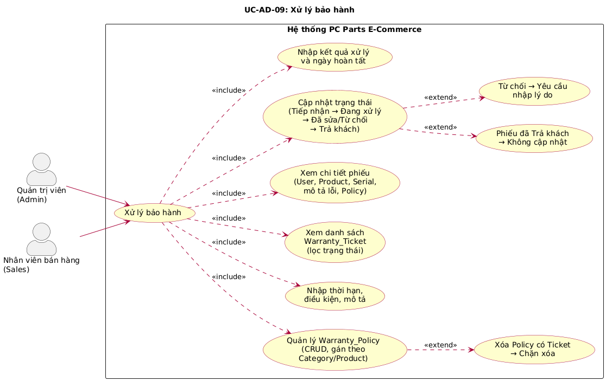

1) Summary
- Use Case Name: Xử lý bảo hành
- Use Case ID: UC-AD-09
- Use Case Description: Cho phép tạo/sửa chính sách bảo hành (Warranty_Policy) và xem, xử lý phiếu bảo hành (Warranty_Ticket) từ Customer.
- Actor: Admin / Sales
- Priority: Chưa xác định (cần thống nhất với bảng yêu cầu người dùng).
- Trigger: Admin/Sales truy cập "Quản lý bảo hành" hoặc nhận phiếu bảo hành mới từ Customer.
- Pre-Condition: Đăng nhập với Role Admin hoặc Sales.
- Post-Condition: Warranty_Policy được tạo/sửa/xóa; Warranty_Ticket.status và resolution được cập nhật trong CSDL.

2) Flow
- Basic Flow: Với Warranty_Policy, Admin truy cập "Chính sách bảo hành" để tạo/sửa/xóa, gán theo Category hoặc Product, nhập duration_months, conditions và mô tả; với Warranty_Ticket, Admin/Sales truy cập "Quản lý bảo hành", lọc danh sách phiếu, mở phiếu để xem User/Product/Serial/mô tả lỗi/chính sách áp dụng, cập nhật trạng thái Tiếp nhận → Đang xử lý → Đã sửa/Từ chối → Trả khách, và nhập kết quả xử lý (resolution) cùng resolved_at.
- Alternative Flow: Không có luồng thay thế được đặc tả trong phiên bản hiện tại.
- Exception Flow: Nếu phiếu đã ở trạng thái "Trả khách" thì không cho cập nhật thêm; nếu từ chối bảo hành thì bắt buộc nhập lý do; nếu xóa Warranty_Policy đang có Warranty_Ticket liên quan thì bị chặn.

3) Additional Information
- Business Rule: Tuân thủ các ràng buộc nghiệp vụ đã nêu trong Basic Flow/Exception Flow và các thực thể liên quan.
- Non-Funtional Requirement: Áp dụng các yêu cầu phi chức năng tại Mục III (hiệu năng, bảo mật, khả dụng, dữ liệu, UX).

   **4.25. (Admin/Sales) Xử lý đổi trả**

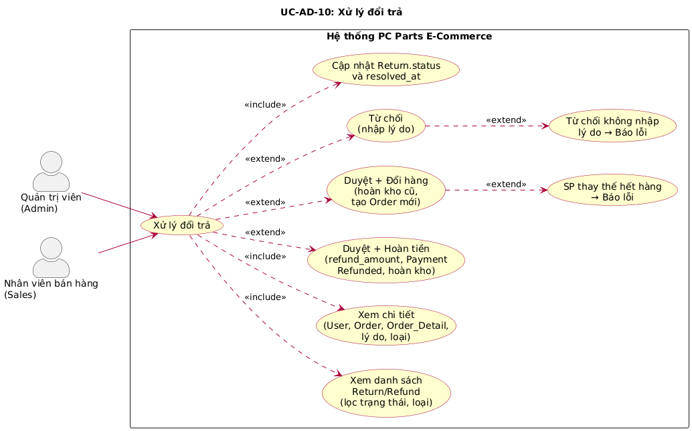

1) Summary
- Use Case Name: Xử lý đổi trả
- Use Case ID: UC-AD-10
- Use Case Description: Cho phép xem và xử lý yêu cầu đổi trả (Return/Refund) từ Customer.
- Actor: Admin / Sales
- Priority: Chưa xác định (cần thống nhất với bảng yêu cầu người dùng).
- Trigger: Admin/Sales truy cập "Quản lý đổi trả" hoặc nhận yêu cầu đổi trả mới từ Customer.
- Pre-Condition: Đăng nhập với Role Admin hoặc Sales.
- Post-Condition: Return/Refund được cập nhật; nếu duyệt thì kho được hoàn, Payment chuyển Refunded hoặc Order mới được tạo.

2) Flow
- Basic Flow: Admin/Sales truy cập "Quản lý đổi trả", xem danh sách Return/Refund theo bộ lọc trạng thái/loại, mở yêu cầu để xem User, Order, Order_Detail, lý do và loại; thực hiện duyệt hoặc từ chối: nếu duyệt hoàn tiền thì cập nhật refund_amount, tạo Payment status Refunded và Inventory_Log hoàn kho; nếu duyệt đổi hàng thì hoàn kho sản phẩm cũ và tạo Order mới cho sản phẩm thay thế; nếu từ chối thì nhập lý do; cuối cùng cập nhật Return.status và resolved_at.
- Alternative Flow: Không có luồng thay thế được đặc tả trong phiên bản hiện tại.
- Exception Flow: Nếu từ chối mà không nhập lý do thì báo lỗi; nếu sản phẩm thay thế hết hàng khi đổi hàng thì báo "Sản phẩm thay thế hiện hết hàng".

3) Additional Information
- Business Rule: Tuân thủ các ràng buộc nghiệp vụ đã nêu trong Basic Flow/Exception Flow và các thực thể liên quan.
- Non-Funtional Requirement: Áp dụng các yêu cầu phi chức năng tại Mục III (hiệu năng, bảo mật, khả dụng, dữ liệu, UX).

   **4.26. (Admin) Quản lý tài khoản**

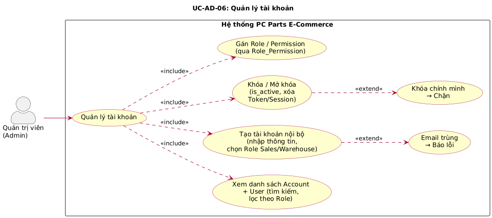

1) Summary
- Use Case Name: Quản lý tài khoản
- Use Case ID: UC-AD-06
- Use Case Description: Cho phép Admin xem danh sách tài khoản, tạo tài khoản nội bộ, khóa/mở khóa và gán Role/Permission.
- Actor: Admin
- Priority: Chưa xác định (cần thống nhất với bảng yêu cầu người dùng).
- Trigger: Admin truy cập mục "Quản lý tài khoản" trên trang quản trị.
- Pre-Condition: Đăng nhập với Role Admin.
- Post-Condition: Account/User được cập nhật; nếu khóa tài khoản thì Token/Session bị xóa.

2) Flow
- Basic Flow: Admin xem danh sách Account + User (họ tên, email, SĐT, Role, trạng thái) và lọc theo Role; tạo tài khoản nội bộ bằng cách nhập thông tin, chọn Role (Sales/Warehouse) để tạo Account + User; thực hiện khóa/mở khóa qua is_active, nếu khóa thì xóa toàn bộ Token/Session để buộc đăng xuất; gán Role/Permission bằng cách chọn tài khoản và đổi Role hoặc gán permission qua Role_Permission.
- Alternative Flow: Không có luồng thay thế được đặc tả trong phiên bản hiện tại.
- Exception Flow: Nếu Admin cố khóa chính mình thì hệ thống chặn; nếu email trùng thì báo "Email đã tồn tại".

3) Additional Information
- Business Rule: Tuân thủ các ràng buộc nghiệp vụ đã nêu trong Basic Flow/Exception Flow và các thực thể liên quan.
- Non-Funtional Requirement: Áp dụng các yêu cầu phi chức năng tại Mục III (hiệu năng, bảo mật, khả dụng, dữ liệu, UX).

   **4.27. (Admin/Sales) Quản lý mã giảm giá**

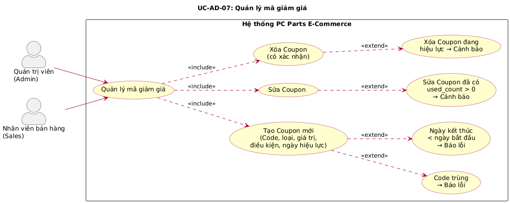

1) Summary
- Use Case Name: Quản lý mã giảm giá
- Use Case ID: UC-AD-07
- Use Case Description: Cho phép tạo, sửa, xóa mã giảm giá (Coupon) để khách nhập khi Checkout.
- Actor: Admin / Sales
- Priority: Chưa xác định (cần thống nhất với bảng yêu cầu người dùng).
- Trigger: Admin/Sales truy cập mục "Quản lý mã giảm giá" trên trang quản trị.
- Pre-Condition: Đăng nhập với Role Admin hoặc Sales.
- Post-Condition: Coupon được tạo/sửa/xóa trong CSDL.

2) Flow
- Basic Flow: Admin/Sales truy cập "Quản lý mã giảm giá" và nhấn "Tạo mới"; nhập Code, loại (PERCENT/FIXED), giá trị giảm, đơn tối thiểu, giảm tối đa, số lượt max, ngày bắt đầu/kết thúc; nhấn "Lưu" để tạo Coupon; có thể chọn Coupon để sửa hoặc xóa (có xác nhận).
- Alternative Flow: Không có luồng thay thế được đặc tả trong phiên bản hiện tại.
- Exception Flow: Nếu code trùng thì báo "Mã giảm giá đã tồn tại"; nếu ngày kết thúc nhỏ hơn ngày bắt đầu thì báo lỗi; nếu sửa Coupon đã có used_count > 0 thì cảnh báo; nếu xóa Coupon đang hiệu lực thì cảnh báo "Mã đang hoạt động. Xóa sẽ ngừng áp dụng".

3) Additional Information
- Business Rule: Tuân thủ các ràng buộc nghiệp vụ đã nêu trong Basic Flow/Exception Flow và các thực thể liên quan.
- Non-Funtional Requirement: Áp dụng các yêu cầu phi chức năng tại Mục III (hiệu năng, bảo mật, khả dụng, dữ liệu, UX).

   **4.28. (Admin/Sales) Thống kê doanh thu**

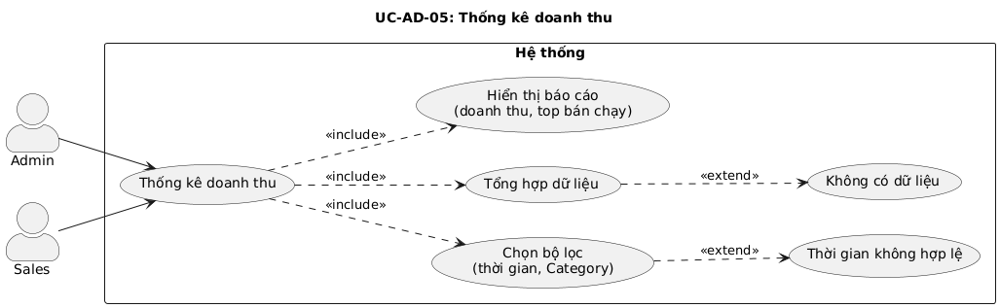

1) Summary
- Use Case Name: Thống kê doanh thu
- Use Case ID: UC-AD-05
- Use Case Description: Cho phép xem báo cáo thống kê doanh thu theo khoảng thời gian, danh mục và trạng thái đơn hàng.
- Actor: Admin / Sales
- Priority: Chưa xác định (cần thống nhất với bảng yêu cầu người dùng).
- Trigger: Admin/Sales truy cập mục "Thống kê doanh thu" trên bảng điều khiển.
- Pre-Condition: Đăng nhập với Role Admin hoặc Sales.
- Post-Condition: Báo cáo hiển thị trên giao diện; không thay đổi CSDL.

2) Flow
- Basic Flow: Admin/Sales truy cập "Thống kê doanh thu", chọn bộ lọc theo thời gian, Category và trạng thái Order; hệ thống truy xuất Order, Order_Detail, Product, Category để tổng hợp; hệ thống hiển thị tổng doanh thu, số đơn hàng, số sản phẩm bán, top bán chạy và doanh thu theo Category.
- Alternative Flow: Không có luồng thay thế được đặc tả trong phiên bản hiện tại.
- Exception Flow: Nếu khoảng thời gian không hợp lệ thì báo lỗi; nếu không có dữ liệu thì hiển thị thông báo.

3) Additional Information
- Business Rule: Tuân thủ các ràng buộc nghiệp vụ đã nêu trong Basic Flow/Exception Flow và các thực thể liên quan.
- Non-Funtional Requirement: Áp dụng các yêu cầu phi chức năng tại Mục III (hiệu năng, bảo mật, khả dụng, dữ liệu, UX).

   **4.29. (Admin) Quản lý banner / slider trang chủ**

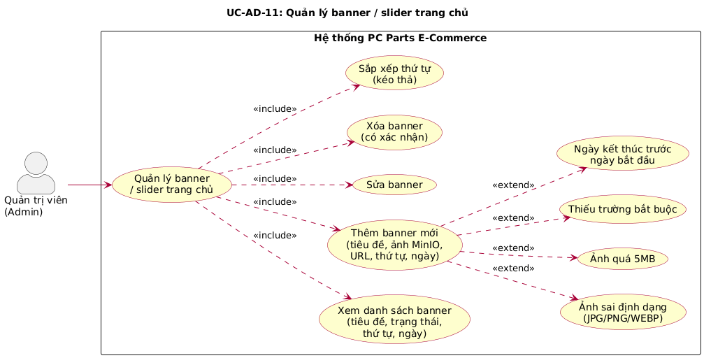

1) Summary
- Use Case Name: Quản lý banner / slider trang chủ
- Use Case ID: UC-AD-11
- Use Case Description: Cho phép Admin tạo, sửa, xóa và sắp xếp banner/slider trang chủ để quảng bá sản phẩm, khuyến mãi hoặc tin tức.
- Actor: Admin
- Priority: Chưa xác định (cần thống nhất với bảng yêu cầu người dùng).
- Trigger: Admin truy cập "Quản lý nội dung" → "Banner / Slider" trên trang quản trị.
- Pre-Condition: Đăng nhập với Role Admin, Token/Session hợp lệ.
- Post-Condition: Banner được tạo/sửa/xóa trong CSDL và hình ảnh được lưu trên MinIO.

2) Flow
- Basic Flow: Admin truy cập "Quản lý nội dung" → "Banner / Slider"; hệ thống hiển thị danh sách banner hiện có (tiêu đề, hình ảnh, trạng thái Active/Inactive, thứ tự hiển thị, ngày bắt đầu/kết thúc); Admin thêm mới banner bằng cách nhập tiêu đề, upload ảnh (MinIO), nhập URL liên kết, thứ tự hiển thị, ngày bắt đầu/kết thúc, trạng thái rồi lưu để hệ thống lưu banner và upload ảnh; Admin có thể sửa banner, xóa banner có xác nhận và kéo thả để sắp xếp thứ tự hiển thị.
- Alternative Flow: Không có luồng thay thế được đặc tả trong phiên bản hiện tại.
- Exception Flow: Nếu ảnh sai định dạng thì báo lỗi; nếu ảnh quá dung lượng 5MB thì báo lỗi; nếu thiếu trường bắt buộc (tiêu đề, hình ảnh) thì báo lỗi cụ thể; nếu ngày kết thúc trước ngày bắt đầu thì báo "Ngày kết thúc phải sau ngày bắt đầu".

3) Additional Information
- Business Rule: Tuân thủ các ràng buộc nghiệp vụ đã nêu trong Basic Flow/Exception Flow và các thực thể liên quan.
- Non-Funtional Requirement: Áp dụng các yêu cầu phi chức năng tại Mục III (hiệu năng, bảo mật, khả dụng, dữ liệu, UX).

**5\. Bảng yêu cầu người dùng**

| ID | Nhóm Nghiệp Vụ | Tên Yêu Cầu | Mô tả chi tiết (Gắn với Entity) | Độ Ưu Tiên |
| :---- | :---- | :---- | :---- | :---- |
| UR-AUTH-01 | Xác thực & Phân quyền | Đăng ký & Đăng nhập | Tạo Account \+ User/Profile. Đăng nhập sinh Token/Session. Merge giỏ hàng Session vào Cart. | Cao |
| UR-AUTH-02 | Xác thực & Phân quyền | Phân quyền (RBAC) | Phân quyền dựa trên Role \+ Permission qua Role\_Permission. | Cao |
| UR-AUTH-03 | Xác thực & Phân quyền | Quên / Thiết lập lại mật khẩu | Tạo reset token (Token.type=RESET\_PASSWORD), gửi email reset, cập nhật Account.password\_hash, xóa reset token và toàn bộ Token/Session cũ. | Cao |
| UR-PROF-01 | Quản lý Người dùng | Quản lý thông tin cá nhân | Customer sửa User/Profile (họ tên, SĐT, ảnh, ngày sinh) và đổi mật khẩu (Account.password\_hash). | Trung bình |
| UR-ADDR-01 | Quản lý Người dùng | Quản lý địa chỉ | Customer CRUD nhiều Address. Gợi ý Address mặc định khi Checkout. | Trung bình |
| UR-CAT-01 | Quản lý Sản phẩm | Quản lý danh mục | Admin CRUD Category phân cấp, định nghĩa Attribute \+ Attribute\_Value. | Cao |
| UR-PROD-01 | Quản lý Sản phẩm | Quản lý sản phẩm | Admin CRUD Product (SKU, Condition, Brand, Category), gán Product\_Attribute, upload Product\_Image. | Cao |
| UR-BRAND-01 | Quản lý Sản phẩm | Quản lý thương hiệu | Admin CRUD Brand (tên, logo). Mỗi Product thuộc một Brand. | Trung bình |
| UR-SHOP-01 | Trải nghiệm Mua sắm | Lọc sản phẩm thông minh | Guest/Customer lọc theo Attribute, Brand, giá. Product hết hàng gắn nhãn. | Cao |
| UR-SHOP-02 | Trải nghiệm Mua sắm | Quản lý Giỏ hàng | Guest dùng giỏ Session, Customer dùng Cart. Merge khi đăng nhập, xóa Session khi đăng xuất. | Cao |
| UR-WISH-01 | Trải nghiệm Mua sắm | Danh sách yêu thích | Customer toggle Wishlist, thêm vào Cart trực tiếp. | Thấp |
| UR-ORD-01 | Đơn hàng & Thanh toán | Tạo đơn hàng (Checkout) | Chọn Address, nhập Coupon. Tạo Order, Order\_Detail, Payment, Shipping. Trừ kho qua Inventory \+ Inventory\_Log. | Cao |
| UR-PAY-01 | Đơn hàng & Thanh toán | Thanh toán đa phương thức | COD/MoMo. Tạo Payment (Pending/Success/Failed/Refunded) \+ transaction\_id. | Cao |
| UR-ORD-02 | Đơn hàng & Thanh toán | Xử lý trạng thái đơn hàng | Admin/Sales cập nhật Order.status \+ ghi Order\_Status\_History. Hủy đơn hoàn kho. | Cao |
| UR-ORD-03 | Đơn hàng & Thanh toán | Xem lịch sử đơn hàng | Customer xem danh sách Order, chi tiết Order\_Detail, Payment, Shipping, Order\_Status\_History. | Cao |
| UR-ORD-04 | Đơn hàng & Thanh toán | Hủy đơn hàng (Customer) | Customer hủy đơn PENDING. Hoàn kho, hoàn Coupon, ghi Order\_Status\_History. | Cao |
| UR-SHIP-01 | Đơn hàng & Thanh toán | Quản lý vận chuyển | Admin/Sales quản lý Shipping: đơn vị, mã vận đơn, phí, trạng thái. Giao xong → Order "Hoàn thành". | Cao |
| UR-CPN-01 | Khuyến mãi | Mã giảm giá (Coupon) | Admin/Sales CRUD Coupon. Ghi Coupon\_Usage mỗi lần sử dụng. | Trung bình |
| UR-INV-01 | Quản lý Kho hàng | Tồn kho & Lịch sử | Inventory (quantity \+ cảnh báo) \+ Inventory\_Log (mọi biến động). | Rất Cao |
| UR-INV-02 | Quản lý Kho hàng | Nhập hàng & Kiểm kê | Admin/Warehouse nhập, kiểm kê, điều chỉnh qua Inventory\_Log. Cảnh báo low\_stock. | Cao |
| UR-SUP-01 | Quản lý Kho hàng | Quản lý nhà cung cấp | Admin CRUD Supplier. Gắn Supplier chính vào Inventory. | Trung bình |
| UR-REV-01 | Tương tác Người dùng | Đánh giá sản phẩm | Customer tạo Review (sao \+ bình luận \+ Review\_Image). Ràng buộc Order "Hoàn thành". | Thấp |
| UR-BLD-01 | Xây dựng Cấu hình | Build PC | Guest/Customer chọn linh kiện Frontend, tổng giá, xuất báo giá (không cần đăng nhập). AI tương thích, thêm Cart/tạo Order yêu cầu đăng nhập. | Cao |
| UR-AI-01 | AI & Tương thích | Đánh giá tương thích LLM | Gửi thông số qua API LLM, nhận phân tích và gợi ý thay thế. | Cao |
| UR-USR-01 | Quản lý Người dùng | Quản lý tài khoản | Admin CRUD Account/User, khóa/mở khóa, gán Role \+ Permission. | Cao |
| UR-NTF-01 | Thông báo | Nhận thông báo | Customer nhận thông báo email/in-app khi trạng thái đơn hàng thay đổi. | Trung bình |
| UR-BANNER-01 | Nội dung | Quản lý banner | Admin CRUD Banner/Slider trang chủ. Upload hình ảnh MinIO, sắp xếp thứ tự. | Thấp |
| UR-WARPOL-01 | Bảo hành & Đổi trả | Chính sách bảo hành | Admin CRUD Warranty\_Policy (thời hạn, điều kiện) gán theo Category hoặc Product. | Trung bình |
| UR-WAR-01 | Bảo hành & Đổi trả | Bảo hành | Customer tạo Warranty\_Ticket. Admin/Sales xử lý phiếu. | Trung bình |
| UR-RET-01 | Bảo hành & Đổi trả | Đổi trả & Hoàn tiền | Customer tạo Return/Refund. Admin/Sales duyệt: Payment Refunded hoặc Order mới. Hoàn kho. | Trung bình |

**6\. Quy tắc mật khẩu (Password Policy)**

Áp dụng thống nhất cho tất cả các chức năng liên quan đến mật khẩu (Đăng ký UC-CUS-04, Đổi mật khẩu UC-CUS-16, Quên mật khẩu UC-CUS-15):

* Mật khẩu phải có ít nhất **8 ký tự**
* Bao gồm ít nhất **1 chữ hoa**, **1 chữ thường** và **1 số**
* Mật khẩu mới không được trùng mật khẩu cũ (áp dụng cho UC-CUS-16)
* Mật khẩu xác nhận phải khớp với mật khẩu mới

**III. Yêu cầu phi chức năng (Non-Functional Requirements)**

| ID | Nhóm | Yêu cầu | Mô tả chi tiết | Độ ưu tiên |
| :---- | :---- | :---- | :---- | :---- |
| NFR-PERF-01 | Hiệu năng | Thời gian phản hồi API | API phản hồi trong ≤ 500ms cho các thao tác CRUD thông thường. Tìm kiếm/lọc sản phẩm ≤ 1s. | Cao |
| NFR-PERF-02 | Hiệu năng | Tải trang | Trang chủ và danh sách sản phẩm phải tải xong (First Contentful Paint) trong ≤ 2s trên kết nối 4G. | Cao |
| NFR-SEC-01 | Bảo mật | Xác thực & Token | JWT Access Token (thời hạn ngắn) + Refresh Token (thời hạn dài). Token lưu an toàn (HttpOnly cookie hoặc secure storage). | Rất Cao |
| NFR-SEC-02 | Bảo mật | Mã hóa mật khẩu | Password hash bằng BCrypt. Không lưu plain-text password. | Rất Cao |
| NFR-SEC-03 | Bảo mật | Phòng chống tấn công | Rate limiting trên các API nhạy cảm (login, forgot-password). Chống brute force bằng giới hạn số lần thử sai. CORS cấu hình chỉ cho phép domain hợp lệ. | Cao |
| NFR-SEC-04 | Bảo mật | HTTPS | Toàn bộ giao tiếp Client ↔ Server phải qua HTTPS (SSL/TLS) trong môi trường production. | Rất Cao |
| NFR-SCALE-01 | Khả năng mở rộng | Concurrent users | Hệ thống hỗ trợ ≥ 500 người dùng đồng thời trong giai đoạn MVP. | Trung bình |
| NFR-AVAIL-01 | Khả dụng | Uptime | Mục tiêu uptime ≥ 99% trong giờ hoạt động (8:00-23:00 GMT+7). | Trung bình |
| NFR-DATA-01 | Dữ liệu | Backup & Recovery | Database backup tự động hàng ngày. Point-in-time recovery trong 7 ngày gần nhất. | Cao |
| NFR-DATA-02 | Dữ liệu | Audit Trail | Mọi biến động kho ghi Inventory\_Log. Mọi thay đổi trạng thái đơn hàng ghi Order\_Status\_History. Log hệ thống lưu tối thiểu 30 ngày. | Cao |
| NFR-UX-01 | Trải nghiệm | Responsive Design | Giao diện hỗ trợ Desktop (≥ 1024px), Tablet (768-1023px) và Mobile (≤ 767px). | Cao |
| NFR-UX-02 | Trải nghiệm | Hình ảnh sản phẩm | Ảnh upload tối đa 5MB/ảnh, chấp nhận JPG/PNG/WEBP. Hệ thống tự tạo thumbnail cho danh sách sản phẩm. | Trung bình |
