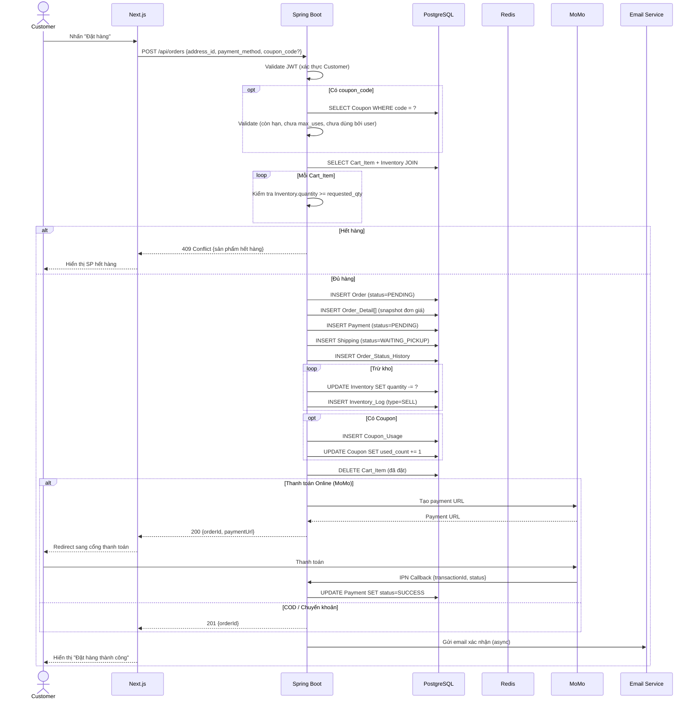
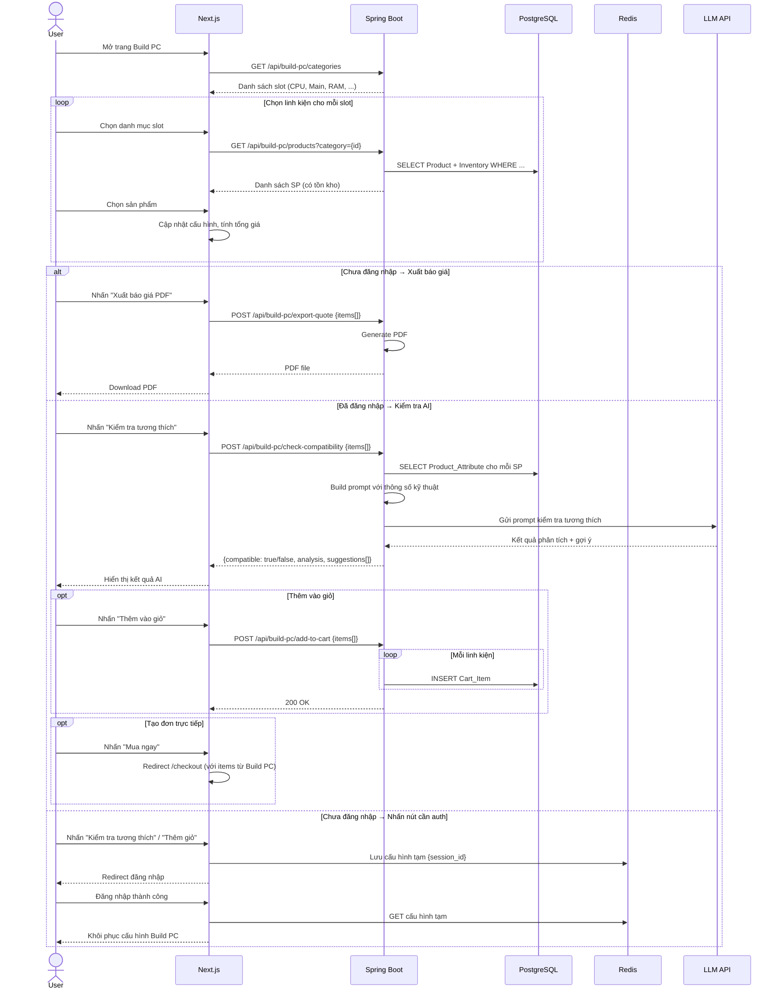
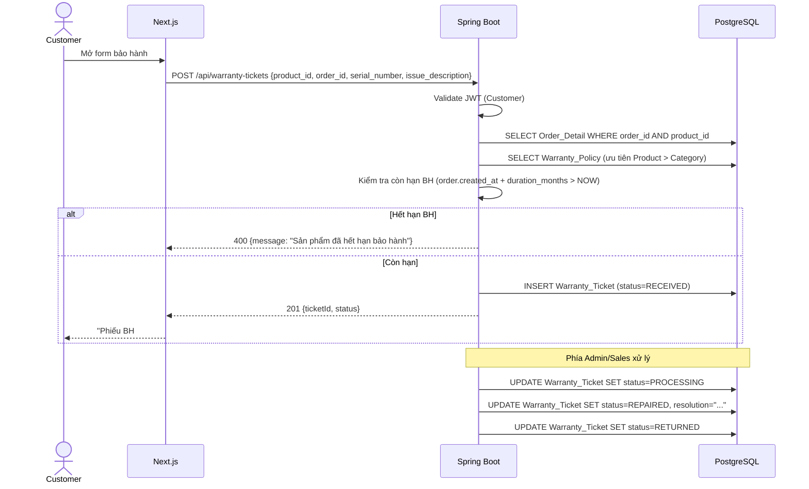
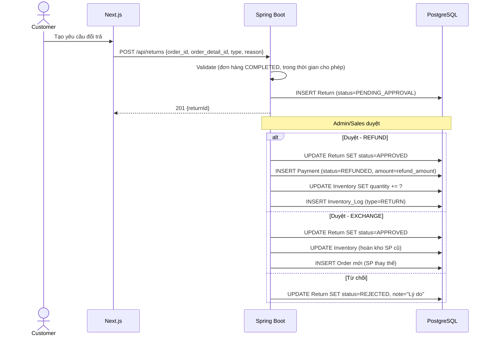
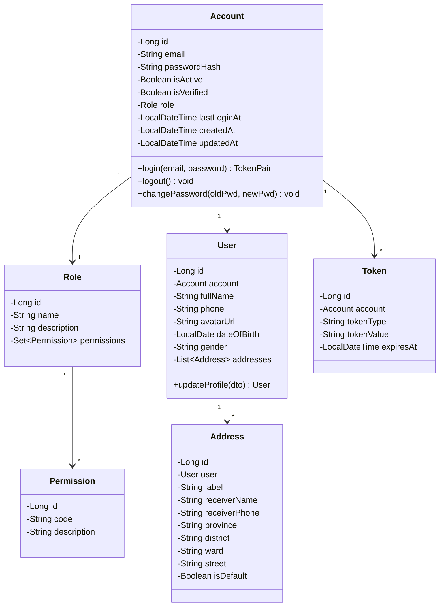
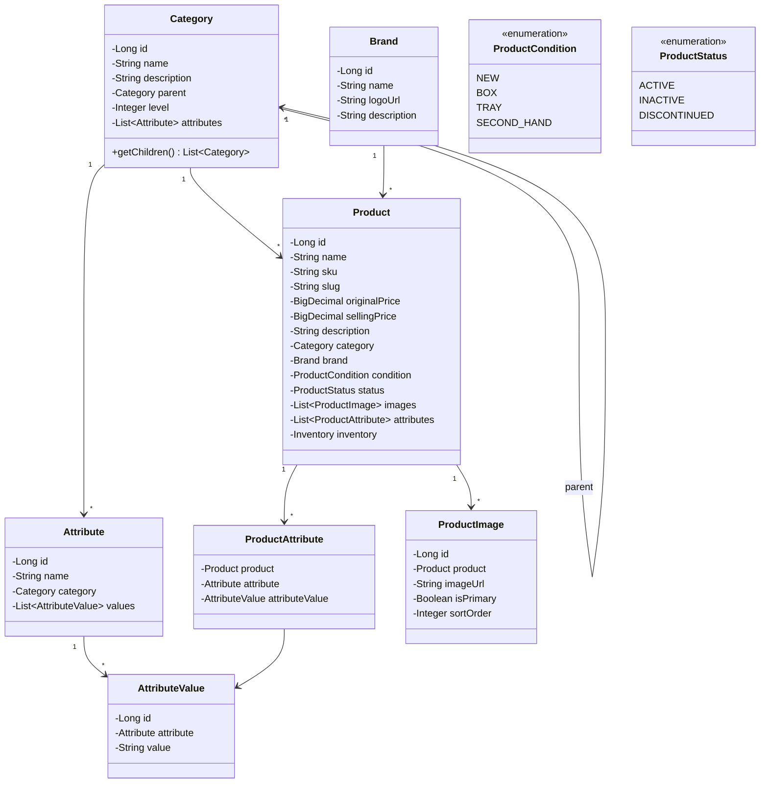
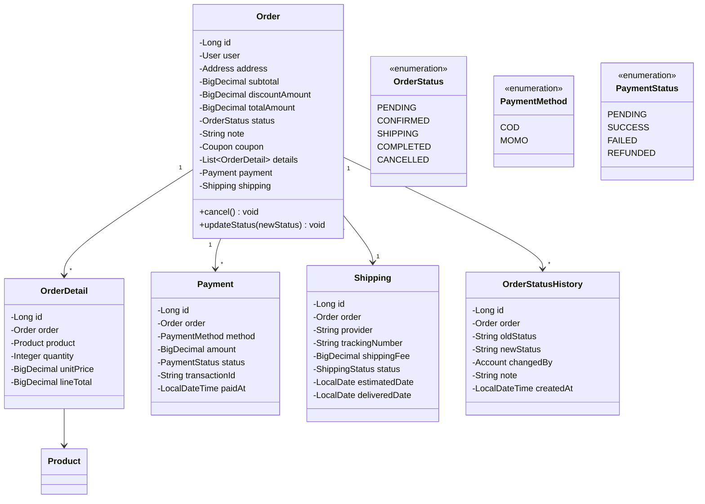

# TÀI LIỆU THIẾT KẾ PHẦN MỀM (Software Design Document - SDD)

**Dự án:** Hệ thống Website Thương mại Điện tử Phân phối Linh kiện Máy tính  
**Phiên bản:** 1.0  
**Ngày tạo:** 2026-03-25  
**Trạng thái:** Bản nháp (Draft)  

---

## Lịch sử thay đổi tài liệu

| Phiên bản | Ngày | Tác giả | Mô tả thay đổi |
|:----------|:-----|:--------|:----------------|
| 1.0 | 2026-03-25 | — | Tạo mới tài liệu |

---

## Mục lục

1. [Giới thiệu](#1-giới-thiệu)
2. [Kiến trúc tổng thể hệ thống](#2-kiến-trúc-tổng-thể-hệ-thống)
3. [Thiết kế dữ liệu](#3-thiết-kế-dữ-liệu)
4. [Thiết kế giao diện hệ thống](#4-thiết-kế-giao-diện-hệ-thống)
5. [Thiết kế thành phần chi tiết](#5-thiết-kế-thành-phần-chi-tiết)
6. [Thiết kế bảo mật](#6-thiết-kế-bảo-mật)
7. [Yêu cầu phi chức năng](#7-yêu-cầu-phi-chức-năng)
8. [Ma trận truy xuất yêu cầu](#8-ma-trận-truy-xuất-yêu-cầu)
9. [Biểu đồ tuần tự](#9-biểu-đồ-tuần-tự)
10. [Biểu đồ lớp](#10-biểu-đồ-lớp)
11. [API Contracts chi tiết](#11-api-contracts-chi-tiết)
12. [Phụ lục](#12-phụ-lục)

---

## 1. Giới thiệu

### 1.1. Mục đích tài liệu (Purpose)

Tài liệu thiết kế phần mềm (SDD) này mô tả kiến trúc, thiết kế chi tiết và các quyết định kỹ thuật cho **Hệ thống Website Thương mại Điện tử Phân phối Linh kiện Máy tính, PC Lắp ráp và Thiết bị Công nghệ**. Tài liệu được xây dựng dựa trên tài liệu phân tích yêu cầu (SRS) đã được phê duyệt, nhằm cung cấp cái nhìn tổng quan và chi tiết về cách hệ thống sẽ được triển khai.

**Đối tượng đọc:** Đội ngũ phát triển (Developer), Kiến trúc sư phần mềm (Architect), Quản lý dự án (PM), Đội ngũ kiểm thử (QA/QC), và các bên liên quan kỹ thuật.

### 1.2. Phạm vi hệ thống (Scope)

Hệ thống bao gồm các module chức năng chính sau:

| STT | Module | Mô tả ngắn |
|:----|:-------|:------------|
| M01 | Xác thực & Phân quyền | Đăng ký, Đăng nhập, RBAC (Role-Based Access Control) |
| M02 | Quản lý Sản phẩm | CRUD Product, Category, Brand, Attribute, Product\_Image |
| M03 | Trải nghiệm Mua sắm | Tìm kiếm/Lọc, Giỏ hàng (Guest + Customer), Wishlist |
| M04 | Đơn hàng & Thanh toán | Checkout, Payment (COD/MoMo), Shipping |
| M05 | Xây dựng Cấu hình PC | Build PC, AI (LLM) kiểm tra tương thích |
| M06 | Quản lý Kho hàng | Inventory, Inventory\_Log, Supplier |
| M07 | Khuyến mãi | Coupon, Coupon\_Usage |
| M08 | Tương tác Người dùng | Review, Review\_Image |
| M09 | Bảo hành & Đổi trả | Warranty\_Policy, Warranty\_Ticket, Return/Refund |
| M10 | Thông báo | Notification (Email & In-app) |
| M11 | Quản trị Hệ thống | Quản lý tài khoản, Thống kê doanh thu |

### 1.3. Tài liệu tham chiếu (References)

| Mã tài liệu | Tên tài liệu | Phiên bản |
|:-------------|:--------------|:----------|
| SRS-v1.0 | Tài liệu Phân tích Yêu cầu (requirement\_analysis.md) | 1.0 |
| IEEE 1016-2009 | IEEE Standard for Information Technology — Software Design Descriptions | — |

### 1.4. Thuật ngữ & Viết tắt (Glossary)

| Thuật ngữ | Định nghĩa |
|:----------|:-----------|
| SDD | Software Design Document — Tài liệu thiết kế phần mềm |
| SRS | Software Requirements Specification — Đặc tả yêu cầu phần mềm |
| RBAC | Role-Based Access Control — Phân quyền dựa trên vai trò |
| API | Application Programming Interface — Giao diện lập trình ứng dụng |
| REST | Representational State Transfer — Kiến trúc API phổ biến |
| JWT | JSON Web Token — Chuẩn token xác thực |
| LLM | Large Language Model — Mô hình ngôn ngữ lớn (AI) |
| CRUD | Create, Read, Update, Delete — Các thao tác cơ bản |
| SKU | Stock Keeping Unit — Mã quản lý kho |
| COD | Cash On Delivery — Thanh toán khi nhận hàng |
| CMS | Content Management System — Hệ quản trị nội dung |
| ER / ERD | Entity-Relationship (Diagram) — Sơ đồ quan hệ thực thể |
| DTO | Data Transfer Object — Đối tượng truyền dữ liệu |

---

## 2. Kiến trúc tổng thể hệ thống (System Architecture)

### 2.1. Kiểu kiến trúc (Architectural Style)

Hệ thống được thiết kế theo kiến trúc **Monolithic phân lớp (Layered Monolithic Architecture)** với khả năng mở rộng theo hướng **Modular Monolith**, giúp dễ dàng tách module thành microservice khi cần thiết trong tương lai.

**Lý do lựa chọn:**
- Phù hợp với quy mô đội ngũ phát triển nhỏ/vừa.
- Giảm complexity về vận hành (deployment, monitoring) so với microservice.
- Vẫn đảm bảo tính module hóa, dễ bảo trì, dễ test.

### 2.2. Sơ đồ kiến trúc tổng quan (High-Level Architecture Diagram)

```
┌──────────────────────────────────────────────────────────────────┐
│                     CLIENT LAYER (Lớp Trình bày)                 │
│  ┌─────────────────────┐     ┌──────────────────────────────┐   │
│  │  Customer Web App   │     │  Admin CMS Web App           │   │
│  │  (Next.js App Router)│     │  (Next.js App Router)        │   │
│  │  - Hiển thị SP      │     │  - Quản lý SP, Đơn hàng     │   │
│  │  - Giỏ hàng Guest   │     │  - Quản lý Kho, Tài khoản   │   │
│  │  - Build PC         │     │  - Thống kê Doanh thu        │   │
│  │  - Checkout         │     │  - Bảo hành, Đổi trả        │   │
│  └────────┬────────────┘     └──────────────┬───────────────┘   │
│           │            HTTPS / REST API       │                  │
└───────────┼──────────────────────────────────┼──────────────────┘
            │                                  │
┌───────────┼──────────────────────────────────┼──────────────────┐
│           ▼          API GATEWAY LAYER        ▼                  │
│  ┌──────────────────────────────────────────────────────────┐   │
│  │  API Gateway / Reverse Proxy (Nginx)                     │   │
│  │  - Routing, Rate Limiting, CORS, SSL Termination         │   │
│  └──────────────────────┬───────────────────────────────────┘   │
└─────────────────────────┼──────────────────────────────────────┘
                          │
┌─────────────────────────┼──────────────────────────────────────┐
│                         ▼                                       │
│              APPLICATION LAYER (Lớp Ứng dụng)                   │
│  ┌──────────────────────────────────────────────────────────┐   │
│  │  Backend Application Server                              │   │
│  │                                                          │   │
│  │  ┌──────────┐ ┌──────────┐ ┌──────────┐ ┌──────────┐   │   │
│  │  │Controller│ │Controller│ │Controller│ │Controller│   │   │
│  │  │  Auth    │ │ Product  │ │  Order   │ │Notification│  │   │
│  │  └────┬─────┘ └────┬─────┘ └────┬─────┘ └────┬─────┘   │   │
│  │       │             │            │             │         │   │
│  │  ┌────┴─────────────┴────────────┴─────────────┴─────┐   │   │
│  │  │              SERVICE LAYER (Business Logic)       │   │   │
│  │  │  AuthService, ProductService, OrderService,       │   │   │
│  │  │  CartService, NotificationService, InventoryService,│   │   │
│  │  │  CouponService, ReviewService, WarrantyService,   │   │   │
│  │  │  ShippingService, PaymentService, ReportService   │   │   │
│  │  └────────────────────────┬──────────────────────────┘   │   │
│  │                           │                              │   │
│  │  ┌────────────────────────┴──────────────────────────┐   │   │
│  │  │          REPOSITORY / DATA ACCESS LAYER           │   │   │
│  │  │  AccountRepo, ProductRepo, OrderRepo, CartRepo,  │   │   │
│  │  │  InventoryRepo, CouponRepo, ReviewRepo, ...      │   │   │
│  │  └────────────────────────┬──────────────────────────┘   │   │
│  └───────────────────────────┼──────────────────────────────┘   │
└──────────────────────────────┼──────────────────────────────────┘
                               │
┌──────────────────────────────┼──────────────────────────────────┐
│                              ▼                                   │
│                    DATA LAYER (Lớp Dữ liệu)                     │
│   ┌──────────────┐   ┌──────────────┐   ┌──────────────┐       │
│   │  PostgreSQL   │   │    Redis     │   │    MinIO     │       │
│   │ (Primary DB)  │   │  (Cache &    │   │  (Images,    │       │
│   │               │   │   Session)   │   │   PDF, ...)  │       │
│   └──────────────┘   └──────────────┘   └──────────────┘       │
└─────────────────────────────────────────────────────────────────┘
                               │
┌──────────────────────────────┼──────────────────────────────────┐
│              EXTERNAL SERVICES (Dịch vụ bên ngoài)               │
│   ┌──────────────┐   ┌──────────────┐   ┌──────────────┐       │
│   │  MoMo        │   │  LLM API     │   │  Email       │       │
│   │  MoMo API    │   │  (AI tương   │   │  Service     │       │
│   │  (Thanh toán)│   │   thích)     │   │  (SMTP)      │       │
│   └──────────────┘   └──────────────┘   └──────────────┘       │
└─────────────────────────────────────────────────────────────────┘
```

### 2.3. Phân lớp kiến trúc (Architectural Layers)

| Lớp | Trách nhiệm | Công nghệ đề xuất |
|:----|:-------------|:-------------------|
| **Presentation Layer** | Giao diện người dùng (Customer, Admin/Sales/Warehouse) | Next.js (App Router) + TypeScript + Tailwind CSS + shadcn/ui |
| **API Gateway** | Routing, Rate Limiting, CORS, SSL, Load Balancing | Nginx / Spring Cloud Gateway |
| **Controller Layer** | Nhận request, validate input, trả response (REST API) | Spring Boot (REST Controller) |
| **Service Layer** | Business Logic, Transaction Management | Spring Service + @Transactional |
| **Repository Layer** | Truy xuất dữ liệu, DAO Pattern | Spring Data JPA / Hibernate |
| **Data Layer** | Lưu trữ dữ liệu chính | PostgreSQL |
| **Cache Layer** | Session (Guest Cart), Caching dữ liệu hot | Redis |
| **File Storage** | Hình ảnh sản phẩm, Review, PDF báo giá | MinIO |
| **External Integration** | Cổng thanh toán, AI (LLM), Email | MoMo SDK, LLM API (không cố định nhà cung cấp), SMTP |

### 2.4. Nguyên tắc thiết kế (Design Principles)

1. **Separation of Concerns (SoC):** Mỗi lớp chỉ đảm nhận một trách nhiệm duy nhất.
2. **Dependency Inversion:** Các lớp trên phụ thuộc abstraction (interface), không phụ thuộc implementation.
3. **Single Responsibility Principle:** Mỗi Service/Repository xử lý một nhóm nghiệp vụ cụ thể.
4. **DRY (Don't Repeat Yourself):** Tái sử dụng logic chung qua base class hoặc utility.
5. **Fail-Fast:** Validate input sớm ở Controller, trả lỗi rõ ràng.
6. **Stateless API:** Backend không lưu trạng thái phiên (session) — sử dụng JWT + Redis.

---

## 3. Thiết kế dữ liệu (Data Design)

### 3.1. Tổng quan mô hình dữ liệu

Hệ thống quản lý **33 thực thể (Entity)** chính, được nhóm thành **8 nhóm nghiệp vụ** như mô tả trong tài liệu SRS. Dưới đây là thiết kế lược đồ cơ sở dữ liệu chi tiết cho từng nhóm.

### 3.2. Nhóm Phân quyền (Authentication & Authorization)

#### 3.2.1. Account (Tài khoản)

| Cột | Kiểu dữ liệu | Ràng buộc | Mô tả |
|:----|:--------------|:----------|:------|
| id | BIGINT | PK, AUTO\_INCREMENT | Khóa chính |
| email | VARCHAR(255) | UNIQUE, NOT NULL | Email đăng nhập |
| password\_hash | VARCHAR(255) | NOT NULL | Mật khẩu mã hóa (BCrypt) |
| is\_active | BOOLEAN | DEFAULT TRUE | Trạng thái hoạt động |
| is\_verified | BOOLEAN | DEFAULT FALSE | Trạng thái xác minh email |
| role\_id | BIGINT | FK → Role(id), NOT NULL | Vai trò |
| last\_login\_at | TIMESTAMP | NULLABLE | Lần đăng nhập cuối |
| created\_at | TIMESTAMP | DEFAULT NOW() | Ngày tạo |
| updated\_at | TIMESTAMP | DEFAULT NOW() | Ngày cập nhật |

#### 3.2.2. User / Profile (Thông tin cá nhân)

| Cột | Kiểu dữ liệu | Ràng buộc | Mô tả |
|:----|:--------------|:----------|:------|
| id | BIGINT | PK, AUTO\_INCREMENT | Khóa chính |
| account\_id | BIGINT | FK → Account(id), UNIQUE, NOT NULL | Liên kết 1-1 với Account |
| full\_name | VARCHAR(255) | NOT NULL | Họ và tên |
| phone | VARCHAR(20) | UNIQUE, NOT NULL | Số điện thoại |
| avatar\_url | VARCHAR(500) | NULLABLE | URL ảnh đại diện |
| date\_of\_birth | DATE | NULLABLE | Ngày sinh |
| gender | VARCHAR(10) | NULLABLE | Giới tính |
| created\_at | TIMESTAMP | DEFAULT NOW() | Ngày tạo |
| updated\_at | TIMESTAMP | DEFAULT NOW() | Ngày cập nhật |

#### 3.2.3. Address (Địa chỉ giao hàng)

| Cột | Kiểu dữ liệu | Ràng buộc | Mô tả |
|:----|:--------------|:----------|:------|
| id | BIGINT | PK, AUTO\_INCREMENT | Khóa chính |
| user\_id | BIGINT | FK → User(id), NOT NULL | Người dùng sở hữu |
| label | VARCHAR(50) | NULLABLE | Nhãn (Nhà, Cơ quan, ...) |
| receiver\_name | VARCHAR(255) | NOT NULL | Tên người nhận |
| receiver\_phone | VARCHAR(20) | NOT NULL | SĐT người nhận |
| province | VARCHAR(100) | NOT NULL | Tỉnh/Thành phố |
| district | VARCHAR(100) | NOT NULL | Quận/Huyện |
| ward | VARCHAR(100) | NOT NULL | Phường/Xã |
| street | VARCHAR(255) | NOT NULL | Số nhà, đường |
| is\_default | BOOLEAN | DEFAULT FALSE | Địa chỉ mặc định |
| created\_at | TIMESTAMP | DEFAULT NOW() | Ngày tạo |
| updated\_at | TIMESTAMP | DEFAULT NOW() | Ngày cập nhật |

> **Giới hạn vùng giao hàng (Shipping Area Restriction):**
> Hiện tại hệ thống chỉ hỗ trợ giao hàng tại **Hà Nội**, bao gồm:
> - **12 Quận:** Ba Đình, Cầu Giấy, Đống Đa, Hai Bà Trưng, Hoàn Kiếm, Thanh Xuân, Hoàng Mai, Long Biên, Hà Đông, Tây Hồ, Nam Từ Liêm, Bắc Từ Liêm
> - **17 Huyện:** Thanh Trì, Ba Vì, Đan Phượng, Gia Lâm, Đông Anh, Thường Tín, Thanh Oai, Chương Mỹ, Hoài Đức, Mỹ Đức, Phúc Thọ, Thạch Thất, Quốc Oai, Phú Xuyên, Ứng Hòa, Mê Linh, Sóc Sơn
> - **1 Thị xã:** Sơn Tây

#### 3.2.4. Role (Vai trò)

| Cột | Kiểu dữ liệu | Ràng buộc | Mô tả |
|:----|:--------------|:----------|:------|
| id | BIGINT | PK, AUTO\_INCREMENT | Khóa chính |
| name | VARCHAR(50) | UNIQUE, NOT NULL | Tên vai trò (Admin, Sales, Warehouse, Customer) |
| description | VARCHAR(255) | NULLABLE | Mô tả |

#### 3.2.5. Permission (Quyền hạn)

| Cột | Kiểu dữ liệu | Ràng buộc | Mô tả |
|:----|:--------------|:----------|:------|
| id | BIGINT | PK, AUTO\_INCREMENT | Khóa chính |
| code | VARCHAR(100) | UNIQUE, NOT NULL | Mã quyền (VD: `product.create`, `order.update`) |
| description | VARCHAR(255) | NULLABLE | Mô tả quyền |

#### 3.2.6. Role\_Permission (Phân quyền)

| Cột | Kiểu dữ liệu | Ràng buộc | Mô tả |
|:----|:--------------|:----------|:------|
| role\_id | BIGINT | PK, FK → Role(id) | Vai trò |
| permission\_id | BIGINT | PK, FK → Permission(id) | Quyền |

#### 3.2.7. Token (Phiên xác thực)

| Cột | Kiểu dữ liệu | Ràng buộc | Mô tả |
|:----|:--------------|:----------|:------|
| id | BIGINT | PK, AUTO\_INCREMENT | Khóa chính |
| account\_id | BIGINT | FK → Account(id), NOT NULL | Tài khoản |
| token\_type | VARCHAR(20) | NOT NULL | Loại: REFRESH, RESET\_PASSWORD, OTP |
| token\_value | VARCHAR(500) | NOT NULL | Giá trị token |
| expires\_at | TIMESTAMP | NOT NULL | Thời gian hết hạn |
| created\_at | TIMESTAMP | DEFAULT NOW() | Ngày tạo |

### 3.3. Nhóm Sản phẩm (Product Catalog)

#### 3.3.1. Category (Danh mục)

| Cột | Kiểu dữ liệu | Ràng buộc | Mô tả |
|:----|:--------------|:----------|:------|
| id | BIGINT | PK, AUTO\_INCREMENT | Khóa chính |
| name | VARCHAR(255) | UNIQUE, NOT NULL | Tên danh mục |
| description | TEXT | NULLABLE | Mô tả |
| parent\_id | BIGINT | FK → Category(id), NULLABLE | Danh mục cha (self-referencing, phân cấp đa tầng) |
| level | INT | DEFAULT 0 | Cấp độ phân cấp |
| created\_at | TIMESTAMP | DEFAULT NOW() | Ngày tạo |
| updated\_at | TIMESTAMP | DEFAULT NOW() | Ngày cập nhật |

#### 3.3.2. Brand (Thương hiệu)

| Cột | Kiểu dữ liệu | Ràng buộc | Mô tả |
|:----|:--------------|:----------|:------|
| id | BIGINT | PK, AUTO\_INCREMENT | Khóa chính |
| name | VARCHAR(255) | UNIQUE, NOT NULL | Tên thương hiệu |
| logo\_url | VARCHAR(500) | NULLABLE | Logo |
| description | TEXT | NULLABLE | Mô tả |

#### 3.3.3. Product (Sản phẩm)

| Cột | Kiểu dữ liệu | Ràng buộc | Mô tả |
|:----|:--------------|:----------|:------|
| id | BIGINT | PK, AUTO\_INCREMENT | Khóa chính |
| name | VARCHAR(255) | NOT NULL | Tên sản phẩm |
| sku | VARCHAR(100) | UNIQUE, NOT NULL | Mã SKU |
| slug | VARCHAR(255) | UNIQUE, NOT NULL | Slug cho URL thân thiện |
| original\_price | DECIMAL(15,2) | NOT NULL | Giá gốc |
| selling\_price | DECIMAL(15,2) | NOT NULL | Giá bán |
| description | TEXT | NULLABLE | Mô tả chi tiết |
| category\_id | BIGINT | FK → Category(id), NOT NULL | Danh mục |
| brand\_id | BIGINT | FK → Brand(id), NOT NULL | Thương hiệu |
| condition | VARCHAR(20) | NOT NULL | Tình trạng: NEW, BOX, TRAY, SECOND\_HAND |
| status | VARCHAR(20) | DEFAULT 'ACTIVE' | Trạng thái: ACTIVE, INACTIVE, DISCONTINUED |
| created\_at | TIMESTAMP | DEFAULT NOW() | Ngày tạo |
| updated\_at | TIMESTAMP | DEFAULT NOW() | Ngày cập nhật |

#### 3.3.4. Attribute (Thuộc tính kỹ thuật)

| Cột | Kiểu dữ liệu | Ràng buộc | Mô tả |
|:----|:--------------|:----------|:------|
| id | BIGINT | PK, AUTO\_INCREMENT | Khóa chính |
| name | VARCHAR(100) | NOT NULL | Tên thuộc tính (VD: Socket, Bus RAM) |
| category\_id | BIGINT | FK → Category(id), NOT NULL | Danh mục sở hữu |

#### 3.3.5. Attribute\_Value (Giá trị thuộc tính)

| Cột | Kiểu dữ liệu | Ràng buộc | Mô tả |
|:----|:--------------|:----------|:------|
| id | BIGINT | PK, AUTO\_INCREMENT | Khóa chính |
| attribute\_id | BIGINT | FK → Attribute(id), NOT NULL | Thuộc tính cha |
| value | VARCHAR(255) | NOT NULL | Giá trị (VD: LGA 1700, DDR5) |

#### 3.3.6. Product\_Attribute (Chi tiết thông số)

| Cột | Kiểu dữ liệu | Ràng buộc | Mô tả |
|:----|:--------------|:----------|:------|
| product\_id | BIGINT | PK, FK → Product(id) | Sản phẩm |
| attribute\_id | BIGINT | PK, FK → Attribute(id) | Thuộc tính |
| attribute\_value\_id | BIGINT | FK → Attribute\_Value(id), NOT NULL | Giá trị |

#### 3.3.7. Product\_Image (Hình ảnh sản phẩm)

| Cột | Kiểu dữ liệu | Ràng buộc | Mô tả |
|:----|:--------------|:----------|:------|
| id | BIGINT | PK, AUTO\_INCREMENT | Khóa chính |
| product\_id | BIGINT | FK → Product(id), NOT NULL | Sản phẩm |
| image\_url | VARCHAR(500) | NOT NULL | URL hình ảnh |
| is\_primary | BOOLEAN | DEFAULT FALSE | Ảnh chính |
| sort\_order | INT | DEFAULT 0 | Thứ tự sắp xếp |

### 3.4. Nhóm Kho hàng (Inventory)

#### 3.4.1. Supplier (Nhà cung cấp)

| Cột | Kiểu dữ liệu | Ràng buộc | Mô tả |
|:----|:--------------|:----------|:------|
| id | BIGINT | PK, AUTO\_INCREMENT | Khóa chính |
| name | VARCHAR(255) | NOT NULL | Tên nhà cung cấp |
| contact\_person | VARCHAR(255) | NULLABLE | Người liên hệ |
| phone | VARCHAR(20) | NULLABLE | SĐT |
| email | VARCHAR(255) | NULLABLE | Email |
| address | TEXT | NULLABLE | Địa chỉ |

#### 3.4.2. Inventory (Kho hàng)

| Cột | Kiểu dữ liệu | Ràng buộc | Mô tả |
|:----|:--------------|:----------|:------|
| id | BIGINT | PK, AUTO\_INCREMENT | Khóa chính |
| product\_id | BIGINT | FK → Product(id), UNIQUE, NOT NULL | Liên kết 1-1 với Product |
| quantity | INT | DEFAULT 0 | Số lượng tồn kho |
| low\_stock\_threshold | INT | DEFAULT 10 | Ngưỡng cảnh báo hết hàng |
| supplier\_id | BIGINT | FK → Supplier(id), NULLABLE | Nhà cung cấp chính |
| updated\_at | TIMESTAMP | DEFAULT NOW() | Cập nhật lần cuối |

#### 3.4.3. Inventory\_Log (Lịch sử kho)

| Cột | Kiểu dữ liệu | Ràng buộc | Mô tả |
|:----|:--------------|:----------|:------|
| id | BIGINT | PK, AUTO\_INCREMENT | Khóa chính |
| product\_id | BIGINT | FK → Product(id), NOT NULL | Sản phẩm |
| type | VARCHAR(20) | NOT NULL | Loại: IMPORT, SALE, RETURN, ADJUSTMENT |
| quantity\_change | INT | NOT NULL | Số lượng thay đổi (có dấu +/-) |
| performed\_by | BIGINT | FK → Account(id), NULLABLE | Người thực hiện |
| note | TEXT | NULLABLE | Ghi chú |
| created\_at | TIMESTAMP | DEFAULT NOW() | Thời gian |

### 3.5. Nhóm Mua sắm (Shopping)

#### 3.5.1. Cart (Giỏ hàng)

| Cột | Kiểu dữ liệu | Ràng buộc | Mô tả |
|:----|:--------------|:----------|:------|
| id | BIGINT | PK, AUTO\_INCREMENT | Khóa chính |
| user\_id | BIGINT | FK → User(id), NULLABLE | NULL nếu Guest |
| session\_id | VARCHAR(255) | NULLABLE | Session ID cho Guest |
| created\_at | TIMESTAMP | DEFAULT NOW() | Ngày tạo |
| updated\_at | TIMESTAMP | DEFAULT NOW() | Ngày cập nhật |

> **Ghi chú thiết kế:** Cart sử dụng `user_id` cho Customer đã đăng nhập và `session_id` cho Guest. Khi Guest đăng nhập, thực hiện logic **merge** giỏ hàng Session vào giỏ hàng database.

#### 3.5.2. Cart\_Item (Chi tiết giỏ hàng)

| Cột | Kiểu dữ liệu | Ràng buộc | Mô tả |
|:----|:--------------|:----------|:------|
| id | BIGINT | PK, AUTO\_INCREMENT | Khóa chính |
| cart\_id | BIGINT | FK → Cart(id), NOT NULL | Giỏ hàng |
| product\_id | BIGINT | FK → Product(id), NOT NULL | Sản phẩm |
| quantity | INT | NOT NULL, CHECK > 0 | Số lượng |

#### 3.5.3. Wishlist (Danh sách yêu thích)

| Cột | Kiểu dữ liệu | Ràng buộc | Mô tả |
|:----|:--------------|:----------|:------|
| id | BIGINT | PK, AUTO\_INCREMENT | Khóa chính |
| user\_id | BIGINT | FK → User(id), NOT NULL | Người dùng |
| product\_id | BIGINT | FK → Product(id), NOT NULL | Sản phẩm |
| created\_at | TIMESTAMP | DEFAULT NOW() | Ngày thêm |

> **Constraint:** UNIQUE(user\_id, product\_id)

### 3.6. Nhóm Đơn hàng & Thanh toán (Order & Payment)

#### 3.6.1. Coupon (Mã giảm giá)

| Cột | Kiểu dữ liệu | Ràng buộc | Mô tả |
|:----|:--------------|:----------|:------|
| id | BIGINT | PK, AUTO\_INCREMENT | Khóa chính |
| code | VARCHAR(50) | UNIQUE, NOT NULL | Mã giảm giá |
| discount\_type | VARCHAR(20) | NOT NULL | PERCENTAGE hoặc FIXED |
| discount\_value | DECIMAL(15,2) | NOT NULL | Giá trị giảm |
| min\_order\_value | DECIMAL(15,2) | DEFAULT 0 | Đơn tối thiểu |
| max\_discount | DECIMAL(15,2) | NULLABLE | Giảm tối đa (cho PERCENT) |
| max\_uses | INT | DEFAULT 0 | Số lượt sử dụng tối đa |
| used\_count | INT | DEFAULT 0 | Số lượt đã dùng |
| start\_date | TIMESTAMP | NOT NULL | Ngày có hiệu lực |
| end\_date | TIMESTAMP | NOT NULL | Ngày hết hạn |
| created\_at | TIMESTAMP | DEFAULT NOW() | Ngày tạo |

#### 3.6.2. Order (Đơn hàng)

| Cột | Kiểu dữ liệu | Ràng buộc | Mô tả |
|:----|:--------------|:----------|:------|
| id | BIGINT | PK, AUTO\_INCREMENT | Khóa chính |
| user\_id | BIGINT | FK → User(id), NOT NULL | Người đặt hàng |
| address\_id | BIGINT | FK → Address(id), NOT NULL | Địa chỉ giao hàng |
| subtotal | DECIMAL(15,2) | NOT NULL | Tổng tiền hàng |
| discount\_amount | DECIMAL(15,2) | DEFAULT 0 | Tiền giảm giá |
| total\_amount | DECIMAL(15,2) | NOT NULL | Tổng thanh toán |
| status | VARCHAR(20) | DEFAULT 'PENDING' | PENDING, CONFIRMED, SHIPPING, COMPLETED, CANCELLED |
| note | TEXT | NULLABLE | Ghi chú |
| coupon\_id | BIGINT | FK → Coupon(id), NULLABLE | Mã giảm giá đã áp dụng |
| created\_at | TIMESTAMP | DEFAULT NOW() | Ngày tạo |
| updated\_at | TIMESTAMP | DEFAULT NOW() | Ngày cập nhật |

#### 3.6.3. Order\_Detail (Chi tiết đơn hàng)

| Cột | Kiểu dữ liệu | Ràng buộc | Mô tả |
|:----|:--------------|:----------|:------|
| id | BIGINT | PK, AUTO\_INCREMENT | Khóa chính |
| order\_id | BIGINT | FK → Order(id), NOT NULL | Đơn hàng |
| product\_id | BIGINT | FK → Product(id), NOT NULL | Sản phẩm |
| quantity | INT | NOT NULL | Số lượng |
| unit\_price | DECIMAL(15,2) | NOT NULL | Đơn giá snapshot tại thời điểm đặt |
| line\_total | DECIMAL(15,2) | NOT NULL | Thành tiền |

#### 3.6.4. Payment (Thanh toán)

| Cột | Kiểu dữ liệu | Ràng buộc | Mô tả |
|:----|:--------------|:----------|:------|
| id | BIGINT | PK, AUTO\_INCREMENT | Khóa chính |
| order\_id | BIGINT | FK → Order(id), NOT NULL | Đơn hàng |
| method | VARCHAR(20) | NOT NULL | COD, MOMO |
| amount | DECIMAL(15,2) | NOT NULL | Số tiền |
| status | VARCHAR(20) | DEFAULT 'PENDING' | PENDING, SUCCESS, FAILED, REFUNDED |
| transaction\_id | VARCHAR(255) | NULLABLE | Mã giao dịch từ cổng thanh toán |
| paid\_at | TIMESTAMP | NULLABLE | Thời gian thanh toán |
| created\_at | TIMESTAMP | DEFAULT NOW() | Ngày tạo |

#### 3.6.5. Shipping (Vận chuyển)

| Cột | Kiểu dữ liệu | Ràng buộc | Mô tả |
|:----|:--------------|:----------|:------|
| id | BIGINT | PK, AUTO\_INCREMENT | Khóa chính |
| order\_id | BIGINT | FK → Order(id), UNIQUE, NOT NULL | Đơn hàng (1-1) |
| provider | VARCHAR(50) | NULLABLE | Đơn vị vận chuyển (GHN, GHTK, Viettel Post) |
| tracking\_number | VARCHAR(100) | NULLABLE | Mã vận đơn |
| shipping\_fee | DECIMAL(15,2) | DEFAULT 0 | Phí ship |
| status | VARCHAR(20) | DEFAULT 'WAITING\_PICKUP' | WAITING\_PICKUP, IN\_TRANSIT, DELIVERED, FAILED |
| estimated\_date | DATE | NULLABLE | Ngày giao dự kiến |
| delivered\_date | DATE | NULLABLE | Ngày giao thực tế |
| created\_at | TIMESTAMP | DEFAULT NOW() | Ngày tạo |
| updated\_at | TIMESTAMP | DEFAULT NOW() | Ngày cập nhật |

#### 3.6.6. Coupon\_Usage (Lịch sử sử dụng mã)

| Cột | Kiểu dữ liệu | Ràng buộc | Mô tả |
|:----|:--------------|:----------|:------|
| id | BIGINT | PK, AUTO\_INCREMENT | Khóa chính |
| coupon\_id | BIGINT | FK → Coupon(id), NOT NULL | Mã giảm giá |
| user\_id | BIGINT | FK → User(id), NOT NULL | Người dùng |
| order\_id | BIGINT | FK → Order(id), NOT NULL | Đơn hàng |
| used\_at | TIMESTAMP | DEFAULT NOW() | Thời gian sử dụng |

> **Constraint:** UNIQUE(coupon\_id, user\_id) — nếu áp dụng chính sách 1 lần/người.

#### 3.6.7. Order\_Status\_History (Lịch sử trạng thái)

| Cột | Kiểu dữ liệu | Ràng buộc | Mô tả |
|:----|:--------------|:----------|:------|
| id | BIGINT | PK, AUTO\_INCREMENT | Khóa chính |
| order\_id | BIGINT | FK → Order(id), NOT NULL | Đơn hàng |
| old\_status | VARCHAR(20) | NULLABLE | Trạng thái cũ |
| new\_status | VARCHAR(20) | NOT NULL | Trạng thái mới |
| changed\_by | BIGINT | FK → Account(id), NULLABLE | Người thao tác |
| note | TEXT | NULLABLE | Ghi chú |
| created\_at | TIMESTAMP | DEFAULT NOW() | Thời gian |

### 3.7. Nhóm Tương tác (Interaction)

#### 3.7.1. Review (Đánh giá)

| Cột | Kiểu dữ liệu | Ràng buộc | Mô tả |
|:----|:--------------|:----------|:------|
| id | BIGINT | PK, AUTO\_INCREMENT | Khóa chính |
| user\_id | BIGINT | FK → User(id), NOT NULL | Người đánh giá |
| product\_id | BIGINT | FK → Product(id), NOT NULL | Sản phẩm |
| order\_id | BIGINT | FK → Order(id), NOT NULL | Đơn hàng liên quan |
| rating | INT | NOT NULL, CHECK (1-5) | Số sao |
| content | TEXT | NULLABLE | Nội dung đánh giá |
| created\_at | TIMESTAMP | DEFAULT NOW() | Ngày đánh giá |

#### 3.7.2. Review\_Image (Ảnh đánh giá)

| Cột | Kiểu dữ liệu | Ràng buộc | Mô tả |
|:----|:--------------|:----------|:------|
| id | BIGINT | PK, AUTO\_INCREMENT | Khóa chính |
| review\_id | BIGINT | FK → Review(id), NOT NULL | Đánh giá |
| image\_url | VARCHAR(500) | NOT NULL | URL ảnh |

### 3.8. Nhóm Bảo hành & Đổi trả (Warranty & Return)

#### 3.8.1. Warranty\_Policy (Chính sách bảo hành)

| Cột | Kiểu dữ liệu | Ràng buộc | Mô tả |
|:----|:--------------|:----------|:------|
| id | BIGINT | PK, AUTO\_INCREMENT | Khóa chính |
| category\_id | BIGINT | FK → Category(id), NULLABLE | Danh mục áp dụng |
| product\_id | BIGINT | FK → Product(id), NULLABLE | Sản phẩm cụ thể (ưu tiên hơn Category) |
| duration\_months | INT | NOT NULL | Thời hạn bảo hành (tháng) |
| conditions | TEXT | NULLABLE | Điều kiện bảo hành |
| description | TEXT | NULLABLE | Mô tả chính sách |

#### 3.8.2. Warranty\_Ticket (Phiếu bảo hành)

| Cột | Kiểu dữ liệu | Ràng buộc | Mô tả |
|:----|:--------------|:----------|:------|
| id | BIGINT | PK, AUTO\_INCREMENT | Khóa chính |
| user\_id | BIGINT | FK → User(id), NOT NULL | Khách hàng |
| product\_id | BIGINT | FK → Product(id), NOT NULL | Sản phẩm |
| order\_id | BIGINT | FK → Order(id), NOT NULL | Đơn hàng |
| serial\_number | VARCHAR(100) | NULLABLE | Số Serial |
| issue\_description | TEXT | NOT NULL | Mô tả lỗi |
| status | VARCHAR(20) | DEFAULT 'RECEIVED' | RECEIVED, INSPECTING, RESOLVED, REJECTED |
| resolution | TEXT | NULLABLE | Kết quả xử lý |
| resolved\_at | TIMESTAMP | NULLABLE | Ngày hoàn tất |
| created\_at | TIMESTAMP | DEFAULT NOW() | Ngày tạo |
| updated\_at | TIMESTAMP | DEFAULT NOW() | Ngày cập nhật |

#### 3.8.3. Return (Đổi trả / Hoàn tiền)

| Cột | Kiểu dữ liệu | Ràng buộc | Mô tả |
|:----|:--------------|:----------|:------|
| id | BIGINT | PK, AUTO\_INCREMENT | Khóa chính |
| user\_id | BIGINT | FK → User(id), NOT NULL | Khách hàng |
| order\_id | BIGINT | FK → Order(id), NOT NULL | Đơn hàng |
| order\_detail\_id | BIGINT | FK → Order\_Detail(id), NOT NULL | Chi tiết đơn hàng |
| type | VARCHAR(20) | NOT NULL | EXCHANGE hoặc REFUND |
| reason | TEXT | NOT NULL | Lý do |
| status | VARCHAR(20) | DEFAULT 'PENDING\_APPROVAL' | PENDING\_APPROVAL, APPROVED, REJECTED, COMPLETED |
| refund\_amount | DECIMAL(15,2) | NULLABLE | Số tiền hoàn (nếu REFUND) |
| resolved\_at | TIMESTAMP | NULLABLE | Ngày giải quyết |
| created\_at | TIMESTAMP | DEFAULT NOW() | Ngày tạo |
| updated\_at | TIMESTAMP | DEFAULT NOW() | Ngày cập nhật |

### 3.9. Nhóm Thông báo (Notification)

#### 3.9.1. Notification (Thông báo)

| Cột | Kiểu dữ liệu | Ràng buộc | Mô tả |
|:----|:--------------|:----------|:------|
| id | BIGINT | PK, AUTO\_INCREMENT | Khóa chính |
| user\_id | BIGINT | FK → User(id), NOT NULL | Người nhận |
| title | VARCHAR(255) | NOT NULL | Tiêu đề thông báo |
| message | TEXT | NOT NULL | Nội dung thông báo |
| type | VARCHAR(50) | DEFAULT 'SYSTEM' | Loại: SYSTEM, ORDER, PROMOTION |
| is\_read | BOOLEAN | DEFAULT FALSE | Trạng thái đã đọc |
| created\_at | TIMESTAMP | DEFAULT NOW() | Ngày tạo |

### 3.10. Tổng hợp quan hệ giữa các thực thể (Entity Relationships Summary)

| Quan hệ | Loại | Mô tả |
|:---------|:-----|:------|
| Account ↔ Role | N-1 | Mỗi Account có 1 Role; 1 Role gán cho nhiều Account |
| Role ↔ Permission | N-N | Qua bảng trung gian Role\_Permission |
| Account ↔ User | 1-1 | Mỗi Account có đúng 1 User/Profile |
| User ↔ Address | 1-N | Một User có nhiều Address |
| Category ↔ Category | 1-N (self) | Phân cấp đa tầng qua parent\_id |
| Category ↔ Product | 1-N | Một Category chứa nhiều Product |
| Category ↔ Attribute | 1-N | Mỗi Category có tập Attribute riêng |
| Brand ↔ Product | 1-N | Một Brand có nhiều Product |
| Attribute ↔ Attribute\_Value | 1-N | Một Attribute có nhiều giá trị |
| Product ↔ Attribute | N-N | Qua Product\_Attribute (gắn Attribute\_Value) |
| Product ↔ Product\_Image | 1-N | Một Product có nhiều ảnh |
| Product ↔ Inventory | 1-1 | Mỗi Product có 1 Inventory |
| Supplier ↔ Inventory | 1-N | Một Supplier → nhiều Inventory |
| Product ↔ Inventory\_Log | 1-N | Lịch sử biến động kho |
| User ↔ Cart | 1-1 | Mỗi User/Session có 1 Cart |
| Cart ↔ Product | N-N | Qua Cart\_Item |
| User ↔ Wishlist ↔ Product | N-N | UNIQUE(user\_id, product\_id) |
| User ↔ Order | 1-N | Một User nhiều Order |
| Order ↔ Product | N-N | Qua Order\_Detail (snapshot giá) |
| Order ↔ Payment | 1-N | Cho phép retry thanh toán |
| Order ↔ Shipping | 1-1 | Mỗi Order có 1 Shipping |
| Coupon ↔ Order | 1-N | 1 Coupon nhiều Order |
| Order ↔ Order\_Status\_History | 1-N | Lịch sử trạng thái |
| User ↔ Review ↔ Product | N-N | Qua Review; chỉ khi Order "Hoàn thành" |
| Review ↔ Review\_Image | 1-N | Ảnh đính kèm |
| Category/Product ↔ Warranty\_Policy | 1-N | Ưu tiên Product |
| User ↔ Warranty\_Ticket | 1-N | Phiếu bảo hành |
| User ↔ Return | 1-N | Yêu cầu đổi trả |
| Order\_Detail ↔ Return | 1-N | Đổi trả theo sản phẩm cụ thể |
| User ↔ Notification | 1-N | Một User nhận nhiều Notification |

---

## 4. Thiết kế giao diện hệ thống (Interface Design)

### 4.1. API Design Convention

Hệ thống sử dụng **RESTful API** với các quy ước sau:

| Quy ước | Chi tiết |
|:--------|:---------|
| Base URL | `https://api.domain.com/v1` |
| Format | JSON |
| Authentication | Bearer Token (JWT) trong Header `Authorization` |
| Versioning | URL Path versioning (`/v1/`, `/v2/`) |
| Naming | Sử dụng danh từ số nhiều cho resource: `/products`, `/orders` |
| HTTP Methods | GET (đọc), POST (tạo), PUT (cập nhật toàn bộ), PATCH (cập nhật 1 phần), DELETE (xóa) |
| Error Format | `{ "status": 400, "error": "BAD_REQUEST", "message": "..." }` |
| Pagination | `?page=1&size=20&sort=createdAt,desc` |
| Status Codes | 200 OK, 201 Created, 204 No Content, 400 Bad Request, 401 Unauthorized, 403 Forbidden, 404 Not Found, 409 Conflict, 500 Internal Server Error |

### 4.2. Bảng tổng hợp API Endpoints

#### 4.2.1. Module Xác thực (M01 - Auth)

| Method | Endpoint | Mô tả | Actor |
|:-------|:---------|:------|:------|
| POST | `/auth/register` | Đăng ký tài khoản | Guest |
| POST | `/auth/login` | Đăng nhập, sinh JWT, merge giỏ hàng | Guest |
| POST | `/auth/logout` | Đăng xuất, xóa Token | All authenticated |
| POST | `/auth/refresh-token` | Làm mới Access Token | All authenticated |
| POST | `/auth/forgot-password` | Yêu cầu đặt lại mật khẩu | Guest |
| POST | `/auth/reset-password` | Đặt lại mật khẩu bằng token | Guest |

#### 4.2.2. Module Sản phẩm (M02 - Product)

| Method | Endpoint | Mô tả | Actor |
|:-------|:---------|:------|:------|
| GET | `/products` | Danh sách SP (có filter, pagination) | Public |
| GET | `/products/{slug}` | Chi tiết sản phẩm | Public |
| POST | `/admin/products` | Tạo sản phẩm | Admin |
| PUT | `/admin/products/{id}` | Cập nhật sản phẩm | Admin |
| DELETE | `/admin/products/{id}` | Xóa sản phẩm | Admin |
| GET | `/categories` | Danh sách danh mục (phân cấp) | Public |
| POST | `/admin/categories` | Tạo danh mục | Admin |
| PUT | `/admin/categories/{id}` | Cập nhật danh mục | Admin |
| DELETE | `/admin/categories/{id}` | Xóa danh mục | Admin |
| GET | `/brands` | Danh sách thương hiệu | Public |
| POST | `/admin/brands` | Tạo thương hiệu | Admin |
| PUT | `/admin/brands/{id}` | Cập nhật thương hiệu | Admin |
| DELETE | `/admin/brands/{id}` | Xóa thương hiệu | Admin |

#### 4.2.3. Module Mua sắm (M03 - Shopping)

| Method | Endpoint | Mô tả | Actor |
|:-------|:---------|:------|:------|
| GET | `/cart` | Xem giỏ hàng | Guest/Customer |
| POST | `/cart/items` | Thêm sản phẩm vào giỏ | Guest/Customer |
| PATCH | `/cart/items/{id}` | Sửa số lượng | Guest/Customer |
| DELETE | `/cart/items/{id}` | Xóa sản phẩm khỏi giỏ | Guest/Customer |
| GET | `/wishlist` | Danh sách yêu thích | Customer |
| POST | `/wishlist` | Thêm/xóa yêu thích (toggle) | Customer |

#### 4.2.4. Module Đơn hàng & Thanh toán (M04 - Order)

| Method | Endpoint | Mô tả | Actor |
|:-------|:---------|:------|:------|
| POST | `/orders` | Tạo đơn hàng (Checkout) | Customer |
| GET | `/orders` | Danh sách đơn hàng người dùng | Customer |
| GET | `/orders/{id}` | Chi tiết đơn hàng | Customer |
| GET | `/admin/orders` | Danh sách đơn hàng (Admin/Sales) | Admin/Sales |
| PATCH | `/admin/orders/{id}/status` | Cập nhật trạng thái đơn hàng | Admin/Sales |
| POST | `/payments/callback` | Callback từ cổng thanh toán | System |
| GET | `/admin/orders/{id}/shipping` | Xem thông tin shipping | Admin/Sales |
| PUT | `/admin/orders/{id}/shipping` | Cập nhật shipping | Admin/Sales |

#### 4.2.5. Module Build PC (M05)

> **Ghi chú kiến trúc:** Module Build PC **không lưu trữ cấu hình vào database** — trạng thái chọn linh kiện được quản lý tại Frontend (Zustand state). Backend đóng vai trò **tầng trung gian (middleware)** cho tính năng kiểm tra tương thích AI: nhận request từ Frontend, xây dựng prompt từ thông số kỹ thuật sản phẩm, gọi LLM API và trả kết quả phân tích. Việc đặt LLM API key tại Backend đảm bảo **không lộ credentials ra phía Client**.

| Method | Endpoint | Mô tả | Actor |
|:-------|:---------|:------|:------|
| POST | `/products/check-compatibility` | Kiểm tra tương thích AI — Backend nhận danh sách product IDs, truy vấn thông số kỹ thuật, xây dựng prompt, gọi LLM API, trả kết quả phân tích | Customer |

> Các thao tác UI (chọn linh kiện, tính tổng giá, xuất báo giá PDF) được xử lý tại Frontend (Zustand state + PDF export lib). Backend không persist cấu hình Build PC mà chỉ cung cấp dữ liệu sản phẩm (qua API Product Catalog) và xử lý logic AI (qua endpoint trên). Khi người dùng muốn đặt hàng từ Build PC, Frontend gọi API tạo đơn hàng tiêu chuẩn (`POST /orders`).

#### 4.2.6. Module Kho hàng (M06 - Inventory)

| Method | Endpoint | Mô tả | Actor |
|:-------|:---------|:------|:------|
| GET | `/admin/inventory` | Danh sách tồn kho | Admin/Warehouse |
| POST | `/admin/inventory/import` | Nhập hàng | Admin/Warehouse |
| POST | `/admin/inventory/adjust` | Kiểm kê / điều chỉnh | Admin/Warehouse |
| GET | `/admin/suppliers` | Danh sách NCC | Admin |
| POST | `/admin/suppliers` | Tạo NCC | Admin |
| PUT | `/admin/suppliers/{id}` | Cập nhật NCC | Admin |
| DELETE | `/admin/suppliers/{id}` | Xóa NCC | Admin |

#### 4.2.7. Module Khuyến mãi (M07 - Coupon)

| Method | Endpoint | Mô tả | Actor |
|:-------|:---------|:------|:------|
| GET | `/admin/coupons` | Danh sách mã giảm giá | Admin/Sales |
| POST | `/admin/coupons` | Tạo mã giảm giá | Admin/Sales |
| PUT | `/admin/coupons/{id}` | Cập nhật | Admin/Sales |
| DELETE | `/admin/coupons/{id}` | Xóa | Admin/Sales |
| POST | `/coupons/validate` | Kiểm tra hợp lệ (khi Checkout) | Customer |

#### 4.2.8. Module Đánh giá (M08 - Review)

| Method | Endpoint | Mô tả | Actor |
|:-------|:---------|:------|:------|
| GET | `/products/{id}/reviews` | Danh sách đánh giá sản phẩm | Public |
| POST | `/products/{id}/reviews` | Gửi đánh giá | Customer |

#### 4.2.9. Module Bảo hành & Đổi trả (M09 - Warranty/Return)

| Method | Endpoint | Mô tả | Actor |
|:-------|:---------|:------|:------|
| POST | `/warranty-tickets` | Tạo phiếu bảo hành | Customer |
| GET | `/warranty-tickets` | Danh sách phiếu BH của user | Customer |
| GET | `/admin/warranty-tickets` | Quản lý phiếu BH | Admin/Sales |
| PATCH | `/admin/warranty-tickets/{id}` | Xử lý phiếu BH | Admin/Sales |
| GET | `/admin/warranty-policies` | Danh sách chính sách BH | Admin |
| POST | `/admin/warranty-policies` | Tạo chính sách BH | Admin |
| PUT | `/admin/warranty-policies/{id}` | Cập nhật chính sách BH | Admin |
| DELETE | `/admin/warranty-policies/{id}` | Xóa chính sách BH | Admin |
| POST | `/returns` | Tạo yêu cầu đổi trả | Customer |
| GET | `/returns` | Danh sách yêu cầu đổi trả (user) | Customer |
| GET | `/admin/returns` | Quản lý đổi trả | Admin/Sales |
| PATCH | `/admin/returns/{id}` | Duyệt/từ chối đổi trả | Admin/Sales |

#### 4.2.10. Module Thông báo (M10 - Notification)

| Method | Endpoint | Mô tả | Actor |
|:-------|:---------|:------|:------|
| GET | `/notifications` | Danh sách thông báo của user | Customer |
| PATCH | `/notifications/{id}/read` | Đánh dấu đã đọc | Customer |
| PATCH | `/notifications/read-all` | Đánh dấu tất cả đã đọc | Customer |
| GET | `/notifications/unread-count` | Đếm thông báo chưa đọc | Customer |

#### 4.2.11. Module Quản trị (M11 - Admin)

| Method | Endpoint | Mô tả | Actor |
|:-------|:---------|:------|:------|
| GET | `/admin/accounts` | Danh sách tài khoản | Admin |
| POST | `/admin/accounts` | Tạo tài khoản nội bộ | Admin |
| PATCH | `/admin/accounts/{id}/status` | Khóa/mở khóa | Admin |
| PATCH | `/admin/accounts/{id}/role` | Gán Role | Admin |
| GET | `/admin/reports/revenue` | Thống kê doanh thu | Admin/Sales |
| GET | `/users/profile` | Xem thông tin cá nhân | Customer |
| PUT | `/users/profile` | Cập nhật thông tin cá nhân | Customer |
| PUT | `/users/password` | Đổi mật khẩu | Customer |
| GET | `/users/addresses` | Danh sách địa chỉ | Customer |
| POST | `/users/addresses` | Thêm địa chỉ | Customer |
| PUT | `/users/addresses/{id}` | Sửa địa chỉ | Customer |
| DELETE | `/users/addresses/{id}` | Xóa địa chỉ | Customer |

### 4.3. Giao diện tích hợp bên ngoài (External Integration Interfaces)

| Hệ thống bên ngoài | Giao thức | Mục đích | Ghi chú |
|:--------------------|:----------|:---------|:--------|
| MoMo | HTTPS / Redirect | Thanh toán trực tuyến | Sử dụng MoMo SDK, IPN callback |
| LLM API | HTTPS / REST | Đánh giá tương thích linh kiện PC | Gửi thông số kỹ thuật dạng prompt; không cố định nhà cung cấp (OpenAI, Google Gemini, Anthropic, self-hosted, ...) — thiết kế qua abstraction layer để dễ thay đổi |
| Email Service | SMTP | Gửi email xác nhận đơn, thông báo | Có thể dùng SendGrid, SES |

---

## 5. Thiết kế thành phần chi tiết (Component Design)

### 5.1. AuthService — Xác thực & Phân quyền

**Trách nhiệm:** Đăng ký, đăng nhập, đăng xuất, quản lý JWT Token, RBAC.

**Luồng xử lý chính:**

- **Đăng ký:** Validate input → Kiểm tra trùng email/SĐT → Hash password (BCrypt) → Tạo Account (Role=Customer) + User → Trả 201 Created.
- **Đăng nhập:** Validate email/password → Kiểm tra is\_active → Sinh Access Token (JWT, 15 phút) + Refresh Token (30 ngày, lưu DB) → Merge giỏ hàng Session vào Cart DB → Trả token.
- **Đăng xuất:** Xóa Refresh Token trong DB → Xóa giỏ hàng Session (Redis) → Client xóa Access Token. *(Lưu ý: Cart DB được giữ nguyên cho lần đăng nhập sau, chỉ xóa giỏ tạm Session — xem thêm CartService mục 5.2)*
- **Quên mật khẩu:** Nhận email → luôn trả response trung tính để tránh lộ thông tin account → nếu email tồn tại thì tạo token `RESET_PASSWORD` có thời hạn, lưu DB và gửi email chứa link reset.
- **Thiết lập lại mật khẩu:** Validate reset token còn hiệu lực → validate mật khẩu mới theo policy → cập nhật `Account.password_hash` → xóa reset token và thu hồi toàn bộ token/session cũ để buộc đăng nhập lại.
- **Authorization:** Middleware/Filter kiểm tra JWT → Trích xuất Role → Kiểm tra Permission qua Role\_Permission → Cho phép hoặc từ chối (403).

### 5.2. CartService — Giỏ hàng

**Trách nhiệm:** Quản lý giỏ hàng Guest (Session/Redis) và Customer (Database).

**Quy tắc nghiệp vụ quan trọng:**

1. **Guest thêm SP:** Lưu vào Redis với key = session\_id. Kiểm tra `Inventory.quantity` trước khi thêm.
2. **Đăng nhập (Merge):** Đọc giỏ từ Redis (session\_id) → Với mỗi item: nếu trùng product\_id trong Cart DB thì cộng dồn quantity; nếu mới thì tạo Cart\_Item → Xóa giỏ Redis.
3. **Đăng xuất:** Xóa giỏ Session (Redis). Cart DB được giữ nguyên cho lần đăng nhập sau.
4. **Sửa số lượng:** Kiểm tra `quantity ≤ Inventory.quantity`. Nếu vượt → giới hạn ở mức tối đa và trả thông báo.

### 5.3. OrderService — Đơn hàng & Checkout

**Trách nhiệm:** Xử lý checkout, tạo Order, tích hợp Payment, quản lý trạng thái.

**Luồng Checkout:**

1. Nhận request: danh sách Cart\_Item, address\_id, payment\_method, coupon\_code (opt).
2. Validate Coupon (nếu có): code đúng, còn hạn, chưa vượt max\_uses, chưa sử dụng bởi user (Coupon\_Usage).
3. Kiểm tra tồn kho: với mỗi Cart\_Item, kiểm tra `Inventory.quantity ≥ requested_qty`. Nếu không đủ → trả lỗi chỉ rõ SP hết hàng.
4. Tạo Order (status=PENDING) + Order\_Detail (snapshot đơn giá) + Payment (status=PENDING) + Shipping (status=WAITING\_PICKUP) + Order\_Status\_History.
5. Trừ kho: `Inventory.quantity -= qty`, tạo Inventory\_Log (type=SALE).
6. Nếu có Coupon: tạo Coupon\_Usage, tăng Coupon.used\_count.
7. Xóa Cart\_Item đã thanh toán.
8. Nếu online payment (MoMo): redirect sang cổng → callback cập nhật Payment.status + transaction\_id.
9. Gửi email xác nhận.

**State Machine — Trạng thái đơn hàng:**

```
  PENDING ──► CONFIRMED ──► SHIPPING ──► COMPLETED
     │            │              │
     │            │              │
     └────────────┴──────────────┴───────► CANCELLED
```

**Quy tắc chuyển trạng thái:**
- `PENDING → CONFIRMED`: Sales/Admin xác nhận đơn hàng.
- `CONFIRMED → SHIPPING`: Đã bàn giao cho đơn vị vận chuyển.
- `SHIPPING → COMPLETED`: Shipping.status = DELIVERED → tự động chuyển.
- `PENDING/CONFIRMED/SHIPPING → CANCELLED`: Hoàn kho (Inventory\_Log type=RETURN), hoàn Coupon (giảm used\_count, xóa Coupon\_Usage).

### 5.4. BuildPCService — Xây dựng cấu hình PC

**Trách nhiệm:** Cung cấp dữ liệu linh kiện theo từng slot (Category), xử lý logic kiểm tra tương thích AI qua LLM, hỗ trợ thêm cấu hình vào giỏ hàng.

**Đặc điểm kiến trúc:**

- **Không persist cấu hình trong database** — trạng thái Build PC (danh sách linh kiện đã chọn, tổng giá) được quản lý hoàn toàn tại Frontend thông qua Zustand state management.
- **Backend đóng vai trò tầng trung gian (Backend-as-Proxy)** cho tính năng AI: nhận danh sách `product_id` từ Frontend → truy vấn `Product_Attribute` (thông số kỹ thuật) từ Database → xây dựng prompt → gọi LLM API → trả kết quả phân tích cho Frontend. Thiết kế này đảm bảo **API key của LLM provider không bị lộ ra phía Client**, đồng thời cho phép Backend kiểm soát nội dung prompt và format kết quả trả về.

**Quy tắc nghiệp vụ:**

- **Không cần đăng nhập:** Chọn linh kiện, xem tổng giá, xuất báo giá PDF.
- **Cần đăng nhập:** Kiểm tra tương thích AI, thêm vào giỏ hàng, tạo đơn hàng.
- **Khi chưa đăng nhập nhấn nút cần đăng nhập:** Lưu cấu hình vào Session (Redis) → Redirect đăng nhập → Sau đăng nhập, khôi phục cấu hình từ Session.
- **AI Compatibility Check:** Backend truy vấn `Product_Attribute` của các linh kiện → xây dựng structured prompt từ thông số kỹ thuật → gọi LLM API (qua abstraction layer, không phụ thuộc nhà cung cấp cụ thể) → parse kết quả → trả `{compatible, analysis, suggestions[]}` cho Frontend.
- **Thêm vào giỏ:** Mỗi linh kiện trong cấu hình → tạo 1 Cart\_Item riêng lẻ trong Cart.

### 5.5. InventoryService — Quản lý kho

**Trách nhiệm:** Theo dõi tồn kho, nhập hàng, kiểm kê, cảnh báo hết hàng.

**Quy tắc:**
- Mỗi thao tác thay đổi Inventory.quantity **bắt buộc** phải tạo Inventory\_Log tương ứng (audit trail).
- Cảnh báo khi `Inventory.quantity ≤ Inventory.low_stock_threshold`.
- Điều chỉnh âm dẫn đến tồn kho < 0 → yêu cầu xác nhận (confirmation flag trong request).

### 5.6. WarrantyService & ReturnService — Bảo hành & Đổi trả

**Trách nhiệm:** Quản lý chính sách bảo hành, phiếu bảo hành, yêu cầu đổi trả.

**Quy tắc bảo hành:**
- Kiểm tra Warranty\_Policy: ưu tiên Product > Category.
- Kiểm tra thời hạn: `Order.created_at + duration_months > NOW()`.
- State Machine phiếu BH: `RECEIVED → INSPECTING → RESOLVED/REJECTED`.

**Quy tắc đổi trả:**
- Duyệt + Hoàn tiền: Tạo Payment (status=REFUNDED), Inventory\_Log (type=RETURN).
- Duyệt + Đổi hàng: Hoàn kho SP cũ, tạo Order mới cho SP thay thế.
- Từ chối: Bắt buộc nhập lý do.

---

## 6. Thiết kế bảo mật (Security Design)

### 6.1. Xác thực (Authentication)

| Thành phần | Chi tiết |
|:-----------|:---------|
| Giao thức | HTTPS (TLS 1.3) cho mọi kết nối |
| Mã hóa mật khẩu | BCrypt (cost factor ≥ 12) |
| Chính sách mật khẩu | Tối thiểu 8 ký tự, bao gồm chữ hoa, chữ thường và số |
| Token xác thực | JWT (Access Token: 15 phút, Refresh Token: 30 ngày lưu DB) |
| Truyền token | Header `Authorization: Bearer <token>` |
| Refresh flow | Client dùng Refresh Token để lấy Access Token mới khi hết hạn |

### 6.2. Phân quyền (Authorization — RBAC)

| Role | Quyền truy cập |
|:-----|:---------------|
| **Guest** | Xem/tìm SP, Giỏ hàng tạm (Session), Build PC (chọn + xuất báo giá), Đăng ký |
| **Customer** | Tất cả Guest + Checkout, Order, Review, Wishlist, Warranty, Return, Build PC (AI + Cart) |
| **Sales** | Quản lý Order, Shipping, Coupon, Thống kê, Xử lý BH & Đổi trả |
| **Warehouse** | Quản lý Inventory (Nhập/Kiểm kê), xem tồn kho |
| **Admin** | Tất cả Sales + Warehouse + CRUD Category/Product/Brand/Supplier/Account/Warranty\_Policy |

**Cơ chế kiểm tra:**
- Middleware (Spring Security Filter) giải mã JWT → lấy `role_id` → truy vấn Role\_Permission → kiểm tra `permission.code` khớp với endpoint yêu cầu.
- Nếu không có quyền → trả HTTP 403 Forbidden.

### 6.3. Bảo mật dữ liệu

| Mối quan tâm | Giải pháp |
|:-------------|:----------|
| SQL Injection | Sử dụng Parameterized Queries / ORM (JPA) |
| XSS | Escape output, Content-Security-Policy header |
| CSRF | SameSite Cookie, CSRF Token cho form-based |
| Rate Limiting | Giới hạn requests/phút tại API Gateway (Nginx) |
| Input Validation | Validate tại Controller (Bean Validation / @Valid) |
| Sensitive Data | Không trả password\_hash trong response; Mask thông tin thanh toán |
| File Upload | Validate file type, kích thước; lưu ngoài web root |
| CORS | Chỉ cho phép origin của frontend |

---

## 7. Yêu cầu phi chức năng (Non-Functional Requirements)

### 7.1. Hiệu năng (Performance)

| Chỉ số | Mục tiêu |
|:-------|:---------|
| Thời gian phản hồi API (P95) | ≤ 500ms cho GET, ≤ 1000ms cho POST/PUT |
| Thời gian tải trang (Frontend) | ≤ 3 giây (First Contentful Paint) |
| Throughput | ≥ 100 requests/giây (concurrent) |
| Database query | ≤ 200ms cho các truy vấn phức tạp |

### 7.2. Khả năng mở rộng (Scalability)

| Chiến lược | Mô tả |
|:-----------|:------|
| Horizontal Scaling | Backend stateless → mở rộng ngang bằng Load Balancer |
| Database Read Replica | PostgreSQL Streaming Replication cho read-heavy queries |
| Caching | Redis cho Session, Product Listing cache, Category tree |
| CDN | Sử dụng CDN cho static assets (ảnh SP, JS, CSS) |

### 7.3. Khả dụng (Availability)

| Chỉ số | Mục tiêu |
|:-------|:---------|
| Uptime | ≥ 99.5% (tương đương ≤ 1.83 ngày downtime/năm) |
| Backup | Database backup hàng ngày, retention 30 ngày |
| Disaster Recovery | RTO ≤ 4 giờ, RPO ≤ 1 giờ |

### 7.4. Khả năng bảo trì (Maintainability)

| Yêu cầu | Mô tả |
|:---------|:------|
| Code Convention | Tuân thủ coding standard của ngôn ngữ/framework |
| Documentation | API Documentation tự động (Swagger/OpenAPI) |
| Logging | Structured logging (JSON format), tập trung qua ELK/Grafana |
| Monitoring | Health check endpoint, metrics (Prometheus + Grafana) |
| Testing | Unit Test coverage ≥ 70%, Integration Test cho các flow chính |
| CI/CD | Tự động build, test, deploy qua pipeline (GitHub Actions / GitLab CI) |

**Test trace bắt buộc cho Auth (M01):**
- Bộ test matrix tổng hợp: `docs/design.md` (mục 3.4.1).
- Bộ test spec chi tiết cho UC-CUS-15: `docs/test.md`.
- Các kịch bản `forgot-password`/`reset-password` phải bao phủ đầy đủ: email không tồn tại (response trung tính), token hết hạn/không hợp lệ, mật khẩu yếu, confirm password không khớp, và thu hồi token/session cũ sau reset thành công.

---

## 8. Ma trận truy xuất yêu cầu (Requirements Traceability Matrix)

Ma trận dưới đây liên kết từ **Yêu cầu người dùng (UR)** trong tài liệu SRS tới **Module thiết kế**, **Use Case** và **Thực thể dữ liệu** tương ứng trong SDD.

| ID Yêu cầu | Tên yêu cầu | Module | Use Case | Thực thể chính |
|:------------|:-------------|:-------|:---------|:---------------|
| UR-AUTH-01 | Đăng ký & Đăng nhập | M01 | UC-CUS-04, UC-CUS-05, UC-CUS-06 | Account, User, Token, Cart |
| UR-AUTH-02 | Phân quyền RBAC | M01 | — | Role, Permission, Role\_Permission |
| UR-AUTH-03 | Quên / Thiết lập lại mật khẩu | M01 | UC-CUS-15 | Account, Token, Email Queue |
| UR-PROF-01 | Quản lý thông tin cá nhân | M11 | UC-CUS-14, UC-CUS-16 | User, Account |
| UR-ADDR-01 | Quản lý địa chỉ | M11 | UC-CUS-12 | Address |
| UR-CAT-01 | Quản lý danh mục | M02 | UC-AD-01 | Category, Attribute, Attribute\_Value |
| UR-PROD-01 | Quản lý sản phẩm | M02 | UC-AD-02 | Product, Product\_Attribute, Product\_Image, Inventory |
| UR-BRAND-01 | Quản lý thương hiệu | M02 | UC-AD-02 | Brand |
| UR-SHOP-01 | Lọc sản phẩm thông minh | M03 | UC-CUS-01 | Product, Product\_Attribute, Attribute, Inventory |
| UR-SHOP-02 | Quản lý giỏ hàng | M03 | UC-CUS-03 | Cart, Cart\_Item |
| UR-WISH-01 | Danh sách yêu thích | M03 | UC-CUS-09 | Wishlist |
| UR-ORD-01 | Tạo đơn hàng (Checkout) | M04 | UC-CUS-02 | Order, Order\_Detail, Payment, Shipping, Inventory, Inventory\_Log |
| UR-PAY-01 | Thanh toán đa phương thức | M04 | UC-CUS-02 | Payment |
| UR-ORD-02 | Xử lý trạng thái đơn hàng | M04 | UC-AD-03 | Order, Order\_Status\_History |
| UR-ORD-03 | Xem lịch sử đơn hàng | M04 | UC-CUS-13 | Order, Order\_Detail, Payment, Shipping |
| UR-SHIP-01 | Quản lý vận chuyển | M04 | UC-AD-08 | Shipping |
| UR-CPN-01 | Mã giảm giá | M07 | UC-AD-07 | Coupon, Coupon\_Usage |
| UR-INV-01 | Tồn kho & Lịch sử | M06 | UC-AD-04 | Inventory, Inventory\_Log |
| UR-INV-02 | Nhập hàng & Kiểm kê | M06 | UC-AD-04 | Inventory, Inventory\_Log |
| UR-SUP-01 | Quản lý nhà cung cấp | M06 | UC-AD-04 | Supplier |
| UR-REV-01 | Đánh giá sản phẩm | M08 | UC-CUS-07 | Review, Review\_Image |
| UR-BLD-01 | Build PC | M05 | UC-CUS-08 | Product, Cart, Cart\_Item, Order, Order\_Detail |
| UR-AI-01 | Đánh giá tương thích LLM | M05 | UC-CUS-08 | Product\_Attribute (external: LLM API) |
| UR-USR-01 | Quản lý tài khoản | M11 | UC-AD-06 | Account, User, Role, Permission |
| UR-WARPOL-01 | Chính sách bảo hành | M09 | UC-AD-09 | Warranty\_Policy |
| UR-WAR-01 | Bảo hành | M09 | UC-CUS-10, UC-AD-09 | Warranty\_Ticket |
| UR-RET-01 | Đổi trả & Hoàn tiền | M09 | UC-CUS-11, UC-AD-10 | Return, Payment, Inventory\_Log |
| UR-AD-05 | Thống kê doanh thu | M11 | UC-AD-05 | Order, Order\_Detail, Product, Category |

---

## 9. Biểu đồ tuần tự (Sequence Diagrams)

### 9.1. Luồng Đăng nhập & Merge giỏ hàng

```mermaid
sequenceDiagram
    actor Customer
    participant FE as Next.js (Frontend)
    participant BE as Spring Boot (Backend)
    participant DB as PostgreSQL
    participant Cache as Redis

    Customer->>FE: Nhập email + password
    FE->>BE: POST /api/auth/login {email, password}
    BE->>DB: SELECT Account WHERE email = ?
    DB-->>BE: Account record
    BE->>BE: Verify BCrypt(password, hash)

    alt Sai mật khẩu
        BE-->>FE: 401 Unauthorized
        FE-->>Customer: Hiển thị lỗi
    else Đúng mật khẩu
        BE->>DB: INSERT Token (Refresh Token)
        BE->>BE: Sinh JWT Access Token (15 phút)

        Note over BE,Cache: Merge giỏ hàng Guest → DB
        BE->>Cache: GET cart:{session_id}
        Cache-->>BE: Guest cart items (hoặc empty)

        opt Có giỏ Guest
            BE->>DB: SELECT Cart WHERE user_id = ?
            loop Mỗi Guest Cart Item
                alt Trùng product_id → cộng dồn quantity
                    BE->>DB: UPDATE Cart_Item SET quantity += ?
                else Mới → tạo Cart_Item
                    BE->>DB: INSERT Cart_Item
                end
            end
            BE->>Cache: DEL cart:{session_id}
        end

        BE-->>FE: 200 {accessToken, refreshToken, user}
        FE->>FE: Lưu token, cập nhật Zustand store
        FE-->>Customer: Redirect về trang trước đó
    end
```



### 9.2. Luồng Checkout & Tạo đơn hàng



### 9.3. Luồng Build PC + Kiểm tra tương thích AI



### 9.4. Luồng Gửi yêu cầu bảo hành



### 9.5. Luồng Đổi trả & Hoàn tiền



---

## 10. Biểu đồ lớp (Class Diagrams)

### 10.1. Module Authentication & Authorization



### 10.2. Module Product Catalog



### 10.3. Module Order & Payment



---

## 11. API Contracts chi tiết (Request / Response)

### 11.1. Authentication

#### POST `/api/auth/register`

**Request Body:**
```json
{
  "email": "user@example.com",
  "password": "StrongP@ss123",
  "fullName": "Nguyễn Văn A",
  "phone": "0901234567"
}
```

**Response 201:**
```json
{
  "status": 201,
  "message": "Đăng ký thành công",
  "data": {
    "id": 1,
    "email": "user@example.com",
    "fullName": "Nguyễn Văn A"
  }
}
```

#### POST `/api/auth/login`

**Request Body:**
```json
{
  "email": "user@example.com",
  "password": "StrongP@ss123",
  "sessionId": "guest-session-uuid-xxx"
}
```

**Response 200:**
```json
{
  "status": 200,
  "data": {
    "accessToken": "eyJhbGciOi...",
    "refreshToken": "eyJhbGciOi...",
    "expiresIn": 900,
    "user": {
      "id": 1,
      "email": "user@example.com",
      "fullName": "Nguyễn Văn A",
      "role": "CUSTOMER",
      "avatarUrl": null
    },
    "cartMerged": true,
    "cartItemCount": 3
  }
}
```

#### POST `/api/auth/refresh-token`

**Request Body:**
```json
{
  "refreshToken": "eyJhbGciOi..."
}
```

**Response 200:**
```json
{
  "status": 200,
  "data": {
    "accessToken": "eyJhbGciOi...",
    "expiresIn": 900
  }
}
```

**Response 401 (token hết hạn/không hợp lệ):**
```json
{
  "status": 401,
  "error": "UNAUTHORIZED",
  "message": "Refresh token không hợp lệ hoặc đã hết hạn"
}
```

#### POST `/api/auth/logout`

**Request Body:**
```json
{
  "refreshToken": "eyJhbGciOi..."
}
```

**Response 200:**
```json
{
  "status": 200,
  "message": "Đăng xuất thành công"
}
```

#### POST `/api/auth/forgot-password`

**Request Body:**
```json
{
  "email": "user@example.com"
}
```

**Response 200 (trả về giống nhau cho mọi trường hợp email):**
```json
{
  "status": 200,
  "message": "Nếu email tồn tại, liên kết đặt lại mật khẩu đã được gửi"
}
```

> Ghi chú bảo mật: luôn trả cùng một thông điệp để tránh lộ thông tin email có tồn tại trong hệ thống.

#### POST `/api/auth/reset-password`

**Request Body:**
```json
{
  "token": "9c73c8dc-2ab1-4ca8-bd7d-8d31d6c4f9ba",
  "newPassword": "NewStrongP@ss123",
  "confirmPassword": "NewStrongP@ss123"
}
```

**Response 200:**
```json
{
  "status": 200,
  "message": "Đặt lại mật khẩu thành công"
}
```

**Response 400 (token hết hạn/không hợp lệ):**
```json
{
  "status": 400,
  "error": "BAD_REQUEST",
  "message": "Liên kết đã hết hạn. Vui lòng yêu cầu lại"
}
```

**Response 400 (mật khẩu xác nhận không khớp):**
```json
{
  "status": 400,
  "error": "BAD_REQUEST",
  "message": "Mật khẩu xác nhận không khớp"
}
```

**Response 400 (mật khẩu yếu):**
```json
{
  "status": 400,
  "error": "BAD_REQUEST",
  "message": "Mật khẩu phải có ít nhất 8 ký tự, bao gồm chữ hoa, chữ thường và số"
}
```

### 11.2. Product

#### GET `/api/products?category=5&brand=2&minPrice=1000000&maxPrice=5000000&sort=price,asc&page=0&size=20`

**Response 200:**
```json
{
  "status": 200,
  "data": {
    "content": [
      {
        "id": 101,
        "name": "CPU Intel Core i5-13600K",
        "slug": "cpu-intel-core-i5-13600k",
        "sku": "CPU-INTEL-I5-13600K",
        "originalPrice": 7990000,
        "sellingPrice": 6990000,
        "condition": "NEW",
        "status": "ACTIVE",
        "primaryImage": "https://minio.domain.com/products/i5-13600k.jpg",
        "category": { "id": 5, "name": "CPU" },
        "brand": { "id": 2, "name": "Intel" },
        "inStock": true,
        "averageRating": 4.5,
        "reviewCount": 23
      }
    ],
    "page": 0,
    "size": 20,
    "totalElements": 45,
    "totalPages": 3
  }
}
```

#### GET `/api/products/{slug}`

**Response 200:**
```json
{
  "status": 200,
  "data": {
    "id": 101,
    "name": "CPU Intel Core i5-13600K",
    "slug": "cpu-intel-core-i5-13600k",
    "sku": "CPU-INTEL-I5-13600K",
    "originalPrice": 7990000,
    "sellingPrice": 6990000,
    "description": "Mô tả chi tiết sản phẩm...",
    "condition": "NEW",
    "status": "ACTIVE",
    "category": { "id": 5, "name": "CPU", "parentName": "Linh kiện" },
    "brand": { "id": 2, "name": "Intel", "logoUrl": "..." },
    "images": [
      { "id": 1, "imageUrl": "...", "isPrimary": true, "sortOrder": 0 },
      { "id": 2, "imageUrl": "...", "isPrimary": false, "sortOrder": 1 }
    ],
    "attributes": [
      { "name": "Socket", "value": "LGA 1700" },
      { "name": "Cores", "value": "14 (6P + 8E)" },
      { "name": "Base Clock", "value": "3.5 GHz" },
      { "name": "TDP", "value": "125W" }
    ],
    "inventory": { "inStock": true, "quantity": 15 },
    "warranty": { "durationMonths": 36, "conditions": "Bảo hành chính hãng" },
    "averageRating": 4.5,
    "reviewCount": 23
  }
}
```

### 11.3. Cart

#### POST `/api/cart/items`

**Request Body:**
```json
{
  "productId": 101,
  "quantity": 2,
  "sessionId": "guest-session-uuid-xxx"
}
```

**Response 200:**
```json
{
  "status": 200,
  "message": "Đã thêm vào giỏ hàng",
  "data": {
    "cartItemId": 55,
    "productId": 101,
    "productName": "CPU Intel Core i5-13600K",
    "quantity": 2,
    "unitPrice": 6990000,
    "lineTotal": 13980000,
    "cartTotal": 25970000,
    "cartItemCount": 4
  }
}
```

### 11.4. Checkout / Order

#### POST `/api/orders`

**Request Body:**
```json
{
  "addressId": 3,
  "paymentMethod": "MOMO",
  "couponCode": "SALE2026",
  "note": "Giao giờ hành chính"
}
```

**Response 201 (Online Payment):**
```json
{
  "status": 201,
  "message": "Đơn hàng đã tạo, vui lòng thanh toán",
  "data": {
    "orderId": 1001,
    "subtotal": 25970000,
    "discountAmount": 500000,
    "shippingFee": 30000,
    "totalAmount": 25500000,
    "paymentMethod": "MOMO",
    "paymentUrl": "https://test-payment.momo.vn/v2/gateway/api/create?orderId=...",
    "status": "PENDING"
  }
}
```

### 11.5. Build PC

#### POST `/api/build-pc/check-compatibility`

**Request Body:**
```json
{
  "items": [
    { "categoryId": 5, "productId": 101, "productName": "Intel Core i5-13600K" },
    { "categoryId": 6, "productId": 202, "productName": "ASUS ROG Strix Z790-A" },
    { "categoryId": 7, "productId": 303, "productName": "G.Skill Trident Z5 DDR5 32GB" },
    { "categoryId": 8, "productId": 404, "productName": "Corsair RM850x" }
  ]
}
```

**Response 200:**
```json
{
  "status": 200,
  "data": {
    "compatible": true,
    "totalPrice": 28960000,
    "analysis": "Cấu hình tương thích tốt. CPU Intel Core i5-13600K sử dụng socket LGA 1700, phù hợp với mainboard ASUS Z790-A. RAM DDR5 được hỗ trợ bởi cả CPU và mainboard. PSU 850W đủ cho cấu hình này.",
    "warnings": [
      "Nên bổ sung thêm tản nhiệt CPU vì i5-13600K có TDP 125W"
    ],
    "suggestions": [
      {
        "slot": "CPU Cooler",
        "reason": "TDP 125W cần tản nhiệt tower hoặc AIO",
        "recommended": [
          { "productId": 505, "name": "Noctua NH-D15", "price": 2490000 }
        ]
      }
    ]
  }
}
```

### 11.6. Error Response (chuẩn chung)

```json
{
  "status": 400,
  "error": "BAD_REQUEST",
  "message": "Mô tả lỗi chi tiết",
  "traceId": "550e8400-e29b-41d4-a716-446655440000",
  "timestamp": "2026-03-25T11:00:00+07:00",
  "errors": [
    {
      "field": "email",
      "message": "Email không hợp lệ"
    }
  ]
}
```

---

## 12. Phụ lục (Appendix)

### 12.1. Danh sách Enum Values

| Enum | Giá trị |
|:-----|:--------|
| Product.condition | `NEW`, `BOX`, `TRAY`, `SECOND_HAND` |
| Product.status | `ACTIVE`, `INACTIVE`, `DISCONTINUED` |
| Order.status | `PENDING`, `CONFIRMED`, `SHIPPING`, `COMPLETED`, `CANCELLED` |
| Payment.method | `COD`, `MOMO` |
| Payment.status | `PENDING`, `SUCCESS`, `FAILED`, `REFUNDED` |
| Shipping.status | `WAITING_PICKUP`, `IN_TRANSIT`, `DELIVERED`, `FAILED` |
| Inventory\_Log.type | `IMPORT`, `SALE`, `RETURN`, `ADJUSTMENT` |
| Token.token\_type | `REFRESH`, `RESET_PASSWORD`, `OTP` |
| Warranty\_Ticket.status | `RECEIVED`, `INSPECTING`, `RESOLVED`, `REJECTED` |
| Return.type | `EXCHANGE`, `REFUND` |
| Return.status | `PENDING_APPROVAL`, `APPROVED`, `REJECTED`, `COMPLETED` |
| Coupon.discount\_type | `PERCENTAGE`, `FIXED` |
| Role.name | `ADMIN`, `SALES`, `WAREHOUSE`, `CUSTOMER` |

### 12.2. Công nghệ đề xuất (Technology Stack Summary)

| Layer | Công nghệ |
|:------|:----------|
| **Frontend Framework** | Next.js (App Router) |
| Frontend Language | TypeScript (bắt buộc) |
| UI / CSS | Tailwind CSS + shadcn/ui + Lucide Icons |
| Form Management | React Hook Form + Zod |
| Client State | Zustand (UI State) + TanStack Query (Client data phức tạp) |
| Server Data | React Server Components (fetch) |
| Loading UX | Skeleton Loading |
| **Backend** | Spring Boot (Java) |
| Database | PostgreSQL |
| Cache | Redis |
| API Documentation | Swagger / OpenAPI 3.0 |
| Authentication | Spring Security + JWT |
| File Storage | MinIO |
| CI/CD | GitHub Actions |
| Containerization | Docker + Docker Compose |
| Reverse Proxy | Nginx |
| Monitoring | Prometheus + Grafana |
| Logging | ELK Stack (Elasticsearch, Logstash, Kibana) |
| Email | SMTP (SendGrid / AWS SES) |
| Payment Gateway | MoMo SDK |
| AI Integration | LLM API (provider-agnostic: OpenAI, Google Gemini, Anthropic, self-hosted, ...) |

---

*Hết tài liệu — Software Design Document v1.0*

