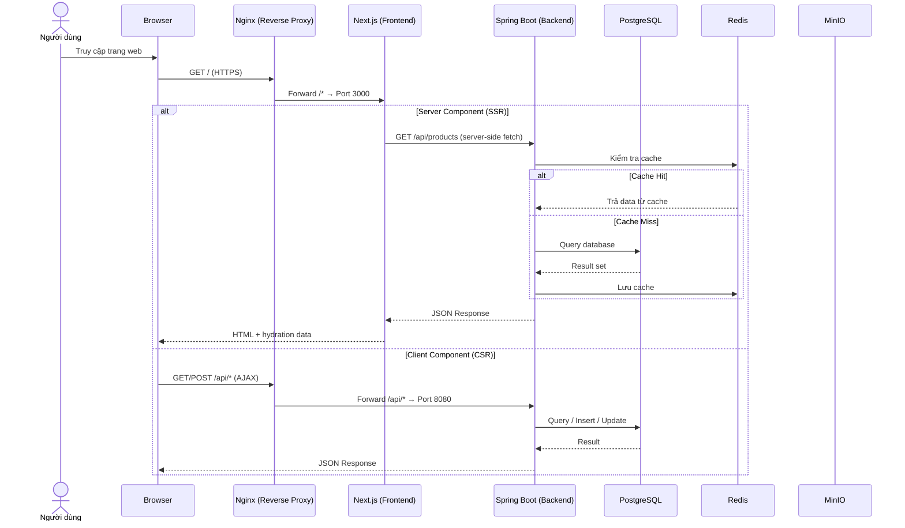
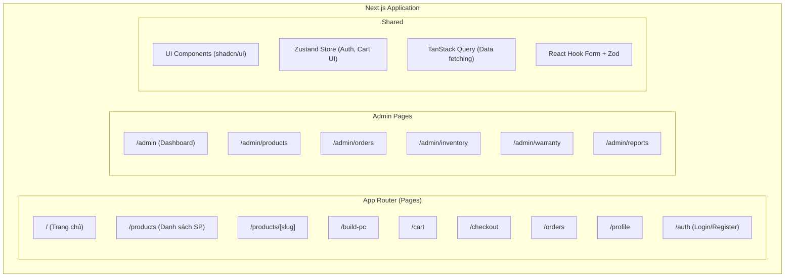
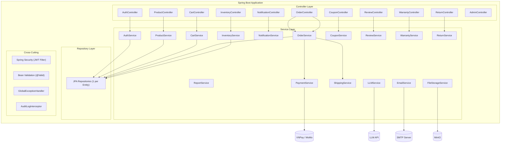
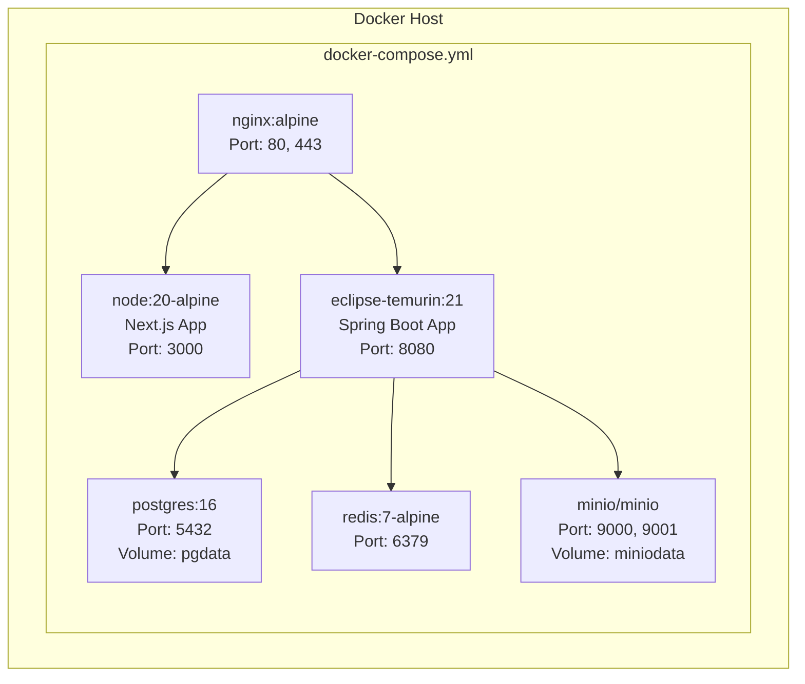
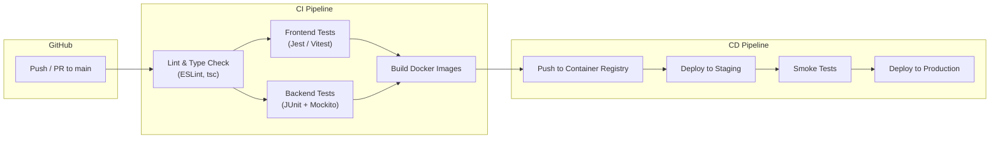
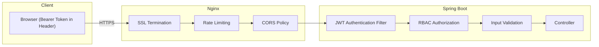

# TÀI LIỆU KIẾN TRÚC HỆ THỐNG (System Architecture Document - SAD)

**Dự án:** Hệ thống Website Thương mại Điện tử Phân phối Linh kiện Máy tính  
**Phiên bản:** 1.0  
**Ngày tạo:** 2026-03-25  
**Trạng thái:** Bản nháp (Draft)  

---

## Lịch sử thay đổi tài liệu

| Phiên bản | Ngày | Tác giả | Mô tả thay đổi |
|:----------|:-----|:--------|:----------------|
| 1.0 | 2026-03-25 | — | Tạo mới tài liệu |

---

## Mục lục

1. [Giới thiệu](#1-giới-thiệu)
2. [Mục tiêu kiến trúc](#2-mục-tiêu-kiến-trúc)
3. [Tổng quan kiến trúc hệ thống](#3-tổng-quan-kiến-trúc-hệ-thống)
4. [Sơ đồ thành phần và giao tiếp](#4-sơ-đồ-thành-phần-và-giao-tiếp)
5. [Kiến trúc triển khai](#5-kiến-trúc-triển-khai)
6. [Lý do lựa chọn công nghệ](#6-lý-do-lựa-chọn-công-nghệ)
7. [Cross-Cutting Concerns](#7-cross-cutting-concerns)
8. [Chiến lược mở rộng](#8-chiến-lược-mở-rộng)
9. [Bảo mật nâng cao & Data Governance](#9-bảo-mật-nâng-cao--data-governance)
10. [Architecture Decision Records](#10-architecture-decision-records)

---

## 1. Giới thiệu

### 1.1. Mục đích tài liệu

Tài liệu kiến trúc hệ thống (SAD) mô tả kiến trúc **cấp cao** của hệ thống Website Thương mại Điện tử Linh kiện Máy tính. SAD tập trung vào việc các thành phần lớn giao tiếp với nhau ra sao, cách triển khai và vận hành hệ thống, cũng như lý do đằng sau các quyết định kiến trúc.

**Phân biệt với SDD:** SDD đi sâu vào thiết kế chi tiết từng module (ERD, Sequence Diagram, Class Diagram, API Contract). SAD giữ ở tầm nhìn **bird's-eye view** để các stakeholder hiểu toàn cảnh hệ thống.

### 1.2. Tài liệu liên quan

| Mã tài liệu | Tên tài liệu |
|:-------------|:--------------|
| SRS-v1.0 | Tài liệu Phân tích Yêu cầu (requirement\_analysis.md) |
| SDD-v1.0 | Tài liệu Thiết kế Phần mềm (software\_design\_document.md) |
| UIUX-v1.0 | Tài liệu Thiết kế UI/UX (ui\_ux\_design.md) |

---

## 2. Mục tiêu kiến trúc (Architectural Goals)

| # | Mục tiêu | Mô tả | Ưu tiên |
|:--|:---------|:------|:--------|
| AG-01 | **Modularity** | Hệ thống được chia thành các module độc lập theo nghiệp vụ, dễ phát triển song song và bảo trì | Cao |
| AG-02 | **Scalability** | Khả năng mở rộng ngang (horizontal) khi lưu lượng tăng | Cao |
| AG-03 | **Security** | Bảo vệ dữ liệu người dùng, giao dịch thanh toán, chống tấn công phổ biến (OWASP Top 10) | Cao |
| AG-04 | **Performance** | Thời gian phản hồi API P95 ≤ 500ms, tải trang FCP ≤ 3s | Trung bình |
| AG-05 | **Maintainability** | Code dễ đọc, dễ test, có CI/CD tự động | Trung bình |
| AG-06 | **Extensibility** | Có khả năng chuyển sang Microservice trong tương lai nếu cần | Thấp |

---

## 3. Tổng quan kiến trúc hệ thống (System Overview)

### 3.1. Kiểu kiến trúc

Hệ thống áp dụng kiến trúc **Modular Monolith** (ứng dụng Backend) kết hợp với **Next.js SSR/ISR** (ứng dụng Frontend). Hai ứng dụng giao tiếp qua **RESTful API** thông qua Reverse Proxy (Nginx).

```
┌─────────────────────────────────────────────────────────────────────────┐
│                        INTERNET (Client Browser)                         │
│                                                                         │
│     Người dùng truy cập qua trình duyệt (Desktop / Mobile)             │
└────────────────────────────────┬────────────────────────────────────────┘
                                 │ HTTPS
                                 ▼
┌────────────────────────────────────────────────────────────────────────┐
│                         NGINX (Reverse Proxy)                          │
│                                                                        │
│  ┌──────────────────────────┐    ┌──────────────────────────────────┐  │
│  │  Route: /*               │    │  Route: /api/*                   │  │
│  │  → Next.js App (Port 3000)│    │  → Spring Boot API (Port 8080)  │  │
│  └──────────────────────────┘    └──────────────────────────────────┘  │
│                                                                        │
│  • SSL Termination (TLS 1.3)                                           │
│  • Rate Limiting                                                       │
│  • Gzip Compression                                                    │
│  • Static File Caching                                                 │
└──────────────┬─────────────────────────────────┬──────────────────────┘
               │                                 │
    ┌──────────▼──────────┐           ┌──────────▼──────────────┐
    │   FRONTEND APP      │           │   BACKEND API           │
    │   (Next.js)         │           │   (Spring Boot)         │
    │                     │  REST     │                         │
    │  • App Router       │ ──────►   │  • Auth Module          │
    │  • Server Components│ ◄──────   │  • Product Module       │
    │  • TypeScript       │  JSON     │  • Order Module         │
    │  • Tailwind + shadcn│           │  • Cart Module          │
    │  • Zustand          │           │  • Notification Module  │
    │  • TanStack Query   │           │  • Inventory Module     │
    │  • React Hook Form  │           │  • Coupon Module        │
    │  • Skeleton Loading │           │  • Review Module        │
    │                     │           │  • Warranty Module      │
    │  Port: 3000         │           │  • Return Module        │
    └─────────────────────┘           │  • Report Module        │
                                      │                         │
                                      │  Port: 8080             │
                                      └──────────┬──────────────┘
                                                  │
                   ┌──────────────────────────────┼─────────────────────┐
                   │                              │                     │
          ┌────────▼────────┐          ┌──────────▼──────┐    ┌────────▼────────┐
          │   PostgreSQL    │          │     Redis       │    │     MinIO       │
          │   (Database)    │          │     (Cache)     │    │  (File Storage) │
          │                 │          │                 │    │                 │
          │  • User data    │          │  • Session/Cart │    │  • Product imgs │
          │  • Products     │          │  • JWT blacklist│    │  • Review imgs  │
          │  • Orders       │          │  • Product cache│    │  • PDF quotes   │
          │  • Inventory    │          │  • Rate limiting│    │  • Avatars      │
          │                 │          │                 │    │                 │
          │  Port: 5432     │          │  Port: 6379     │    │  Port: 9000     │
          └─────────────────┘          └─────────────────┘    └─────────────────┘
                                                  │
                   ┌──────────────────────────────┼─────────────────────┐
                   │                              │                     │
          ┌────────▼────────┐          ┌──────────▼──────┐    ┌────────▼────────┐
          │  Payment APIs   │          │    LLM API      │    │  Email Service  │
          │  (VNPay, MoMo)  │          │  (AI tương thích)│    │  (SMTP)        │
          │                 │          │                 │    │                 │
          │  External       │          │  External       │    │  External       │
          └─────────────────┘          └─────────────────┘    └─────────────────┘
```

### 3.2. Luồng request tổng quát



---

## 4. Sơ đồ thành phần và giao tiếp (Component & Communication)

### 4.1. Frontend Components



### 4.2. Backend Modules



### 4.3. Giao tiếp giữa các thành phần

| Từ | Đến | Giao thức | Kiểu giao tiếp | Mô tả |
|:---|:----|:----------|:--------------|:------|
| Browser | Nginx | HTTPS | Đồng bộ | Mọi request từ client |
| Nginx | Next.js | HTTP | Đồng bộ | Proxy pass route `/` |
| Nginx | Spring Boot | HTTP | Đồng bộ | Proxy pass route `/api` |
| Next.js (Server) | Spring Boot | HTTP | Đồng bộ | Server-side fetch trong Server Components |
| Next.js (Client) | Spring Boot | HTTP | Đồng bộ | TanStack Query, React Hook Form submit |
| Spring Boot | PostgreSQL | TCP (JDBC) | Đồng bộ | JPA/Hibernate queries |
| Spring Boot | Redis | TCP | Đồng bộ | Cache read/write, session operations |
| Spring Boot | MinIO | HTTP (S3 API) | Đồng bộ | Upload/download files |
| Spring Boot | VNPay/MoMo | HTTPS | Đồng bộ + Callback | Tạo URL thanh toán, nhận IPN callback |
| Spring Boot | LLM API | HTTPS | Đồng bộ | Gửi prompt kiểm tra tương thích |
| Spring Boot | Email Queue (Redis) | Publish | Bất đồng bộ | Đẩy email job vào Redis queue |
| Email Worker | SMTP | SMTP/TLS | Bất đồng bộ (async) | Consumer xử lý email, retry 3 lần, DLQ cho failures |

---

## 5. Kiến trúc triển khai (Deployment Architecture)

### 5.1. Docker Compose (Development & Staging)



### 5.2. Cấu trúc Docker Services

| Service | Image | Ports | Volumes | Phụ thuộc |
|:--------|:------|:------|:--------|:----------|
| `nginx` | nginx:alpine | 80:80, 443:443 | ./nginx/conf.d:/etc/nginx/conf.d, ./ssl:/etc/ssl | frontend, backend |
| `frontend` | Node 20 (build) | 3000 | — | backend |
| `backend` | Eclipse Temurin 21 (build) | 8080 | — | postgres, redis, minio |
| `postgres` | postgres:16 | 5432 | pgdata:/var/lib/postgresql/data | — |
| `redis` | redis:7-alpine | 6379 | — | — |
| `minio` | minio/minio | 9000, 9001 | miniodata:/data | — |

### 5.3. CI/CD Pipeline (GitHub Actions)



**Pipeline stages:**

| Stage | Chi tiết | Trigger |
|:------|:---------|:--------|
| **Lint & Type Check** | ESLint + `tsc --noEmit` (Frontend), Checkstyle (Backend) | Mọi push/PR |
| **Unit Test** | Vitest (Frontend), JUnit 5 + Mockito (Backend) | Mọi push/PR |
| **Build** | `docker build` cho frontend + backend | Chỉ nhánh main |
| **Push Registry** | Push images lên GitHub Container Registry (GHCR) | Chỉ nhánh main |
| **Deploy Staging** | `docker-compose up` trên staging server | Chỉ nhánh main |
| **Smoke Test** | Kiểm tra API health, trang chủ load | Sau deploy staging |
| **Deploy Production** | Manual approval → deploy lên production | Tag release |

### 5.4. Environments

| Môi trường | Mục đích | URL gợi ý | Branch |
|:-----------|:---------|:----------|:-------|
| **Development** | Dev local, Docker Compose | `http://localhost` | feature/* |
| **Staging** | Testing, QA review | `https://staging.domain.com` | main |
| **Production** | Live cho người dùng | `https://domain.com` | release tags |

---

## 6. Lý do lựa chọn công nghệ (Technology Rationale)

### 6.1. Frontend — Next.js (App Router) + TypeScript

| Quyết định | Lý do |
|:-----------|:------|
| **Next.js App Router** thay vì SPA thuần (React CRA) | SSR/ISR cho SEO tốt hơn (trang sản phẩm, danh mục); Server Components giảm bundle size; Routing file-based dễ quản lý |
| **TypeScript** bắt buộc | Type safety giúp phát hiện lỗi compile-time; IntelliSense tốt hơn khi scale team; Refactor an toàn |
| **Tailwind CSS + shadcn/ui** thay vì CSS module / MUI | Utility-first nhanh hơn viết CSS; shadcn/ui cho component đẹp, customizable, không bị vendor lock-in (copy-paste, không cài package); Lucide Icons nhẹ và đồng bộ style |
| **React Hook Form + Zod** | Performance tốt (uncontrolled), Zod schema dùng chung FE + BE validation |
| **Zustand** thay vì Redux | API đơn giản hơn nhiều so với Redux Toolkit; đủ cho UI state (sidebar, modal, cart badge) |
| **TanStack Query** | Quản lý server state chuẩn (caching, refetching, optimistic updates); chỉ dùng cho Client Components phức tạp, tránh over-engineering |
| **Server Components (fetch)** | Fetch data ở server, không ship JS về client, trang load nhanh hơn; dùng cho danh sách sản phẩm, chi tiết SP |
| **Skeleton Loading** | UX tốt hơn spinner truyền thống; người dùng cảm nhận trang load nhanh hơn |

### 6.2. Backend — Spring Boot (Java)

| Quyết định | Lý do |
|:-----------|:------|
| **Spring Boot** thay vì NestJS / Express | Hệ sinh thái mature (Security, Data JPA, Validation); Hiệu năng cao với JVM (GraalVM optional); Phổ biến trong enterprise Việt Nam, dễ tuyển dụng |
| **Spring Data JPA / Hibernate** | ORM chuẩn công nghiệp; hỗ trợ migration tốt (Flyway/Liquibase) |
| **Spring Security + JWT** | Framework bảo mật toàn diện, tích hợp sẵn Filter chain cho RBAC |

### 6.3. Infrastructure

| Quyết định | Lý do |
|:-----------|:------|
| **PostgreSQL** | Robust, ACID, hỗ trợ JSON(B), full-text search, free; phổ biến nhất cho e-commerce |
| **Redis** | In-memory cache cực nhanh; dùng cho session (Guest Cart), JWT blacklist, product listing cache |
| **MinIO** thay vì AWS S3 | S3-compatible API → dễ migrate lên AWS/GCP sau; tự host = kiểm soát chi phí; không bị vendor lock-in |
| **Nginx** | Reverse proxy nhẹ, ổn định; hỗ trợ SSL, rate limiting, gzip, load balancing |
| **Docker + Docker Compose** | Đồng nhất môi trường Dev/Staging/Prod; dễ onboard developer mới |
| **GitHub Actions** thay vì Jenkins/GitLab CI | Tích hợp native với GitHub repo; YAML config dễ đọc; free tier đủ dùng |

---

## 7. Cross-Cutting Concerns

### 7.1. Logging

| Khía cạnh | Chi tiết |
|:-----------|:---------|
| Framework | SLF4J + Logback (Backend), `console.log` → structured (Frontend) |
| Format | JSON structured logging: timestamp, level, traceId, userId, message |
| Aggregation | ELK Stack (Elasticsearch + Logstash + Kibana) |
| Retention | 30 ngày trên Elasticsearch, archive S3 sau đó |
| TraceId | Mỗi request tạo UUID traceId, truyền qua header `X-Trace-Id` giữa Frontend → Backend |

### 7.2. Monitoring & Alerting

| Khía cạnh | Chi tiết |
|:-----------|:---------|
| Metrics | Prometheus (scrape `/actuator/prometheus` từ Spring Boot) |
| Dashboard | Grafana (CPU, RAM, request latency, error rate, DB pool) |
| Health Check | `GET /actuator/health` (Backend), `GET /api/health` (Frontend) |
| Alerting | Grafana alerts → Slack/Email khi: error rate > 1%, latency P95 > 2s, disk > 85% |

### 7.3. Error Handling

| Lớp | Chiến lược |
|:----|:-----------|
| **Frontend** | Error Boundary cho component crashes; TanStack Query retry (3 lần); Toast notification cho API errors |
| **Backend** | `@ControllerAdvice` + `GlobalExceptionHandler`; Custom exceptions (ResourceNotFoundException, BusinessException, ...) |
| **Format lỗi chuẩn** | `{ "status": 400, "error": "BAD_REQUEST", "message": "...", "traceId": "uuid", "timestamp": "ISO-8601" }` |

### 7.4. Caching Strategy

| Dữ liệu | Chiến lược | TTL | Invalidation |
|:---------|:-----------|:----|:------------|
| Product listing | Redis cache | 5 phút | Invalidate khi Admin CRUD product |
| Category tree | Redis cache | 30 phút | Invalidate khi Admin CRUD category |
| Product detail | Redis cache | 10 phút | Invalidate khi update product |
| Guest Cart | Redis hash | 7 ngày | Xóa khi merge hoặc hết hạn |
| Build PC session | Redis hash | 24 giờ | Xóa sau merge hoặc hết hạn |
| Static assets | Nginx cache + CDN | 1 năm | Cache busting via filename hash |

### 7.5. Security Architecture



**Luồng xác thực:**
1. Client gửi `POST /api/auth/login` với email + password.
2. Backend xác thực → trả Access Token (JWT, 15 phút) + Refresh Token (30 ngày, HttpOnly Cookie).
3. Mọi request tiếp theo kèm `Authorization: Bearer <access_token>`.
4. JWT Filter giải mã token → trích role → kiểm tra Permission.
5. Access Token hết hạn → Client dùng Refresh Token để lấy Access Token mới.
6. Logout → xóa Refresh Token trong DB, xóa giỏ hàng Session (Redis).

---

## 8. Chiến lược mở rộng (Scaling Strategy)

### 8.1. Giai đoạn 1 — Single Server (MVP, 0-1000 users/ngày)

```
1x Server: Nginx + Next.js + Spring Boot + PostgreSQL + Redis + MinIO
```
- Tất cả chạy trên Docker Compose, 1 máy chủ.
- Phù hợp giai đoạn đầu, chi phí thấp.

### 8.2. Giai đoạn 2 — Tách Database (1000-10,000 users/ngày)

```
Server 1: Nginx + Next.js + Spring Boot
Server 2: PostgreSQL (Master) + PostgreSQL (Read Replica)
Server 3: Redis + MinIO
```
- Tách DB ra máy riêng để tối ưu I/O.
- Thêm Read Replica cho query nặng (báo cáo, danh sách SP).

### 8.3. Giai đoạn 3 — Horizontal Scaling (>10,000 users/ngày)

```
Load Balancer (Nginx/HAProxy)
├── Server 1: Next.js Instance
├── Server 2: Next.js Instance
├── Server 3: Spring Boot Instance
├── Server 4: Spring Boot Instance
├── DB Cluster: PostgreSQL (Master + Replicas)
├── Redis Cluster: Redis Sentinel/Cluster
└── MinIO Cluster: Distributed mode
```
- Stateless backend → mở rộng ngang dễ dàng.
- Session lưu Redis → cân bằng tải không cần sticky sessions.

### 8.4. Giai đoạn tương lai — Microservice (nếu cần)

Kiến trúc Modular Monolith hiện tại cho phép tách module thành microservice theo ranh giới nghiệp vụ:

| Module có thể tách | Lý do |
|:-------------------|:------|
| **PaymentService** | Xử lý giao dịch tài chính; cần SLA, logging, và security riêng |
| **InventoryService** | Tải cao khi flash sale; cần scale độc lập |
| **BuildPCService + LLM** | Tải compute nặng (AI); có thể scale GPU riêng |
| **Notification (Email/SMS)** | Bất đồng bộ, không ảnh hưởng luồng chính |

---

## 9. Bảo mật nâng cao & Data Governance

### 9.1. Threat Model (Tóm tắt)

| Trust Boundary | Attack Surface | Threat | Biện pháp giảm thiểu |
|:---------------|:---------------|:-------|:--------------------|
| Internet → Nginx | Public endpoints | DDoS, Brute force login | Rate limiting (Nginx), Login throttle (5 lần/phút), Captcha sau 3 lần sai |
| Nginx → Backend | REST API | SQL Injection, XSS | Parameterized queries (JPA), Input validation (@Valid), Escape output |
| Browser → Backend | JWT Token | Stolen token, CSRF | Access Token ngắn (15 phút), Refresh Token HttpOnly Cookie (SameSite=Strict) |
| Backend → Database | JDBC connection | Data breach | Encrypted connection (SSL), Least privilege DB user, No wildcard SELECT |
| Backend → Payment Gateway | HTTPS callback | Callback forgery | Verify signature từ VNPay/MoMo, Whitelist IP (nếu có) |
| Backend → MinIO | S3 API | Unauthorized file access | Pre-signed URLs (expire 15 phút), Private buckets, Validate file type/size |
| Admin Panel | CMS endpoints | Privilege escalation | RBAC cấp Permission, Audit log mọi thao tác Admin |

### 9.2. Secrets Management

| Loại Secret | Lưu trữ | Rotation Policy |
|:------------|:-------|:----------------|
| DB password | Environment variable (Docker secrets / `.env` không commit) | 90 ngày |
| JWT signing key | Environment variable | 180 ngày (re-sign khi rotate) |
| VNPay/MoMo API key | Environment variable | Theo yêu cầu nhà cung cấp |
| LLM API key | Environment variable | 90 ngày |
| MinIO access/secret key | Environment variable | 90 ngày |
| Redis password | Environment variable | 90 ngày |
| SMTP credentials | Environment variable | 180 ngày |

**Nguyên tắc:** Không bao giờ hardcode secrets trong source code. Sử dụng `.env` (local) và GitHub Secrets (CI/CD). Production có thể migrate lên HashiCorp Vault hoặc AWS Secrets Manager khi scale.

### 9.3. Data Governance

| Phân loại | Dữ liệu | Mã hóa at-rest | Mã hóa in-transit | Retention | Purge Policy |
|:----------|:---------|:--------------|:-----------------|:----------|:-------------|
| **Nhạy cảm cao** | password\_hash, payment transaction, token | BCrypt (password), AES-256 (payment) | TLS 1.3 | Vĩnh viễn (password), 5 năm (payment) | Xóa khi user yêu cầu xóa tài khoản |
| **Nhạy cảm** | email, phone, address, đơn hàng | PostgreSQL TDE (optional) | TLS 1.3 | 5 năm | Anonymize sau 5 năm nếu inactive |
| **Nội bộ** | product data, inventory, category | Không bắt buộc | TLS 1.3 | Vĩnh viễn | Soft delete |
| **Công khai** | product name, price, images | Không | HTTPS | Vĩnh viễn | — |

### 9.4. SLO & Error Budget

| Chỉ số (SLI) | SLO Mục tiêu | Error Budget (30 ngày) | Hành động khi vượt |
|:-------------|:------------|:----------------------|:------------------|
| Availability (uptime) | ≥ 99.5% | 3.6 giờ downtime | Freeze deploy, focus fix |
| API Latency P95 | ≤ 500ms (GET), ≤ 1000ms (POST) | 5% requests vượt | Review query/cache |
| Error Rate (5xx) | ≤ 0.5% | 0.5% của total requests | Rollback, incident review |
| Checkout Success Rate | ≥ 98% | 2% failure | Priority bug fix |

**Incident Response (Tóm tắt):**
1. **Detect:** Grafana alert → Slack notification (on-call engineer).
2. **Triage:** Xác định severity (P1-Critical, P2-Major, P3-Minor).
3. **Mitigate:** Rollback deploy / scale up / hotfix.
4. **Resolve:** Root cause analysis, update runbook.
5. **Postmortem:** Viết blameless postmortem trong 48h, cập nhật ADR nếu có thay đổi kiến trúc.

---

## 10. Architecture Decision Records (ADR)

| ADR# | Ngày | Quyết định | Trạng thái | Lý do tóm tắt |
|:-----|:-----|:-----------|:-----------|:-------------|
| ADR-001 | 2026-03-25 | Chọn Modular Monolith thay vì Microservice | ✅ Chấp nhận | Đội nhỏ, giảm complexity vận hành, dễ tách sau |
| ADR-002 | 2026-03-25 | Chọn Next.js App Router thay vì SPA (Vite/React) | ✅ Chấp nhận | SEO cho trang SP, Server Components giảm bundle, ISR cho performance |
| ADR-003 | 2026-03-25 | Chọn MinIO thay vì AWS S3 | ✅ Chấp nhận | Tự host, không vendor lock-in, S3-compatible dễ migrate |
| ADR-004 | 2026-03-25 | JWT Bearer (header) + Refresh Token (HttpOnly Cookie) | ✅ Chấp nhận | Bearer cho API stateless, HttpOnly cookie chống XSS |
| ADR-005 | 2026-03-25 | Email gửi qua Redis task queue (async) | ✅ Chấp nhận | Không block luồng chính, retry + DLQ đảm bảo delivery |
| ADR-006 | 2026-03-25 | LLM provider-agnostic (abstraction layer) | ✅ Chấp nhận | Không cố định vendor, dễ đổi provider |

> **Ghi chú:** Mỗi ADR có thể được viết chi tiết hơn (Context, Decision, Consequences) trong file riêng `docs/adr/ADR-xxx.md` khi cần.

---

*Hết tài liệu — System Architecture Document v1.0*
