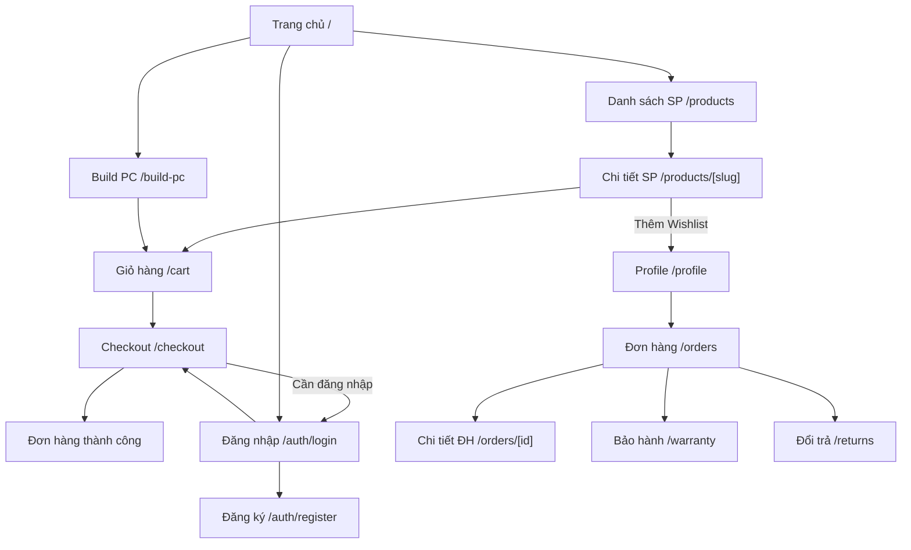

# TÀI LIỆU THIẾT KẾ UI/UX (UI/UX Design Specification)

**Dự án:** Hệ thống Website Thương mại Điện tử Phân phối Linh kiện Máy tính  
**Phiên bản:** 1.0  
**Ngày tạo:** 2026-03-25  
**Trạng thái:** Bản nháp (Draft)  
**Công cụ thiết kế:** Figma (tạo Wireframe chi tiết sau khi duyệt spec này)  

---

## Lịch sử thay đổi tài liệu

| Phiên bản | Ngày | Tác giả | Mô tả thay đổi |
|:----------|:-----|:--------|:----------------|
| 1.0 | 2026-03-25 | — | Tạo mới tài liệu |

---

## Mục lục

1. [Nguyên tắc thiết kế](#1-nguyên-tắc-thiết-kế)
2. [Design System](#2-design-system)
3. [Layout & Navigation](#3-layout--navigation)
4. [Wireframes mô tả — Customer](#4-wireframes-mô-tả--customer)
5. [Wireframes mô tả — Admin/CMS](#5-wireframes-mô-tả--admincms)
6. [Responsive Design](#6-responsive-design)
7. [Trạng thái & Loading Patterns](#7-trạng-thái--loading-patterns)
8. [Accessibility](#8-accessibility)
9. [Component States](#9-component-states)
10. [Planned Deliverables & Artifact Roadmap](#10-planned-deliverables--artifact-roadmap)

---

## 1. Nguyên tắc thiết kế (Design Principles)

### 1.1. Triết lý thiết kế

| # | Nguyên tắc | Mô tả |
|:--|:-----------|:------|
| DP-01 | **Simple & Clean** | Giao diện tối giản, tập trung vào sản phẩm. Tránh rối mắt. |
| DP-02 | **Consistency** | Đồng nhất style, spacing, typography, color trên toàn bộ ứng dụng. |
| DP-03 | **Performance First** | Skeleton loading, lazy load images, pagination thay vì infinite scroll (dễ quản lý kho lớn). |
| DP-04 | **Mobile Responsive** | Thiết kế mobile-first, breakpoints rõ ràng. |
| DP-05 | **Accessibility** | WCAG 2.1 AA — contrast đủ, keyboard navigation, alt text. |
| DP-06 | **Trust & Credibility** | UI truyền tải sự chuyên nghiệp cho khách hàng mua linh kiện (giá rõ ràng, BH rõ ràng, review có ảnh). |

### 1.2. User Personas tham chiếu

| Persona | Mục tiêu chính | Pain Points |
|:--------|:---------------|:------------|
| **Khách hàng cá nhân** (18-35) | Mua linh kiện đúng, giá tốt, BH rõ ràng | Sợ mua nhầm linh kiện không tương thích |
| **Game thủ** (16-30) | Build PC Gaming, so sánh cấu hình | Muốn tool Build PC nhanh, trực quan |
| **Khách doanh nghiệp** *(Giai đoạn 2 — ngoài scope MVP)* | Mua số lượng lớn, xuất hóa đơn | Cần báo giá PDF, liên hệ nhanh |
| **Admin/Sales** | Quản lý đơn hàng, kho hàng | Cần dashboard rõ ràng, thao tác nhanh |

> **Ghi chú B2B:** Persona "Khách doanh nghiệp" được liệt kê để định hướng dài hạn. Giai đoạn MVP chưa có flow B2B riêng (company account, VAT invoice, bulk cart). Tính năng xuất báo giá PDF đã có sẵn trong Build PC (public, không cần đăng nhập).

---

## 2. Design System

### 2.1. Color Palette

| Token | Hex | Mục đích sử dụng |
|:------|:----|:-----------------|
| `--primary` | `#2563EB` (Blue 600) | CTA chính, link, accent |
| `--primary-hover` | `#1D4ED8` (Blue 700) | Hover state |
| `--secondary` | `#64748B` (Slate 500) | Text phụ, icon |
| `--background` | `#FFFFFF` | Nền chính (Light mode) |
| `--background-dark` | `#0F172A` (Slate 900) | Nền chính (Dark mode) |
| `--card` | `#F8FAFC` (Slate 50) | Nền card (Light) |
| `--card-dark` | `#1E293B` (Slate 800) | Nền card (Dark) |
| `--destructive` | `#EF4444` (Red 500) | Lỗi, xóa, hết hàng |
| `--success` | `#22C55E` (Green 500) | Thành công, còn hàng |
| `--warning` | `#F59E0B` (Amber 500) | Cảnh báo, sắp hết hàng |
| `--border` | `#E2E8F0` (Slate 200) | Border, divider |
| `--sale-badge` | `#EF4444` (Red 500) | Badge giảm giá |

> **Dark mode:** Hỗ trợ Dark mode toggle. Dùng CSS variables + Tailwind `dark:` prefix. Lưu preference vào `localStorage`.

### 2.2. Typography

| Token | Font | Size | Weight | Use case |
|:------|:-----|:-----|:-------|:---------|
| `h1` | Inter | 30px / 1.875rem | 700 (Bold) | Tiêu đề trang |
| `h2` | Inter | 24px / 1.5rem | 600 (SemiBold) | Tiêu đề section |
| `h3` | Inter | 20px / 1.25rem | 600 | Tiêu đề card, sub-section |
| `body` | Inter | 16px / 1rem | 400 (Regular) | Nội dung chính |
| `body-sm` | Inter | 14px / 0.875rem | 400 | Mô tả phụ, caption |
| `caption` | Inter | 12px / 0.75rem | 400 | Label, badge, hint |
| `price` | Inter | 20px / 1.25rem | 700 | Giá bán |
| `price-original` | Inter | 14px / 0.875rem | 400 + line-through | Giá gốc (khi giảm) |

> **Font loading:** Google Fonts — `Inter` qua `next/font/google` (tự host, không request external).

### 2.3. Spacing & Grid

| Token | Value | Sử dụng |
|:------|:------|:--------|
| `--space-xs` | 4px | Khoảng cách giữa icon-text |
| `--space-sm` | 8px | Padding nhỏ, gap grid |
| `--space-md` | 16px | Padding card, gap giữa items |
| `--space-lg` | 24px | Section spacing |
| `--space-xl` | 32px | Page section gap |
| `--space-2xl` | 48px | Header/Footer margin |
| `--radius-sm` | 6px | Input, small button |
| `--radius-md` | 8px | Card |
| `--radius-lg` | 12px | Modal, dialog |
| **Grid** | 12 columns | Container max-width: 1280px, gap: 16px |

### 2.4. Component Library (shadcn/ui)

Các component chính sử dụng từ shadcn/ui:

| Component | Biến thể | Sử dụng trong |
|:----------|:---------|:--------------|
| `Button` | default, destructive, outline, ghost, link | CTA, form submit, actions |
| `Input` | text, password, search | Form fields |
| `Select` | single, searchable | Filter, dropdown |
| `Card` | default | Product card, order card |
| `Dialog` | default | Confirm delete, preview ảnh |
| `Sheet` | side (right) | Mobile menu, cart sidebar |
| `Table` | default + pagination | Admin data tables |
| `Badge` | default, destructive, outline | Status tags, sale badge |
| `Avatar` | default | User avatar |
| `Skeleton` | default | Loading states |
| `Toast` | success, error, warning | Notification messages |
| `Tabs` | default | Product tabs (Mô tả, Thông số, Đánh giá) |
| `Breadcrumb` | default | Navigation hierarchy |
| `Pagination` | default | Product listing, order list |
| `DropdownMenu` | default | User menu, action menu |
| `Accordion` | default | FAQ, filter sidebar (mobile) |
| `Separator` | horizontal | Section divider |

### 2.5. Icons

Sử dụng **Lucide Icons** — consistent, lightweight, MIT license.

| Icon | Sử dụng |
|:-----|:--------|
| `ShoppingCart` | Giỏ hàng |
| `Heart` | Wishlist |
| `Search` | Tìm kiếm |
| `User` | Tài khoản |
| `Package` | Đơn hàng |
| `Monitor` | Build PC |
| `Star` | Đánh giá |
| `Shield` | Bảo hành |
| `RotateCcw` | Đổi trả |
| `Sun` / `Moon` | Toggle Dark mode |
| `ChevronRight` | Breadcrumb, navigation |
| `Filter` | Mở panel bộ lọc |
| `Truck` | Vận chuyển |
| `CreditCard` | Thanh toán |

---

## 3. Layout & Navigation

### 3.1. Customer Layout

```
┌─────────────────────────────────────────────────────────────┐
│  HEADER (Sticky)                                             │
│  ┌───────┐  ┌──────────────────────────┐  ┌──┐ ┌──┐ ┌──┐  │
│  │ LOGO  │  │  🔍 Tìm kiếm sản phẩm...│  │🖥│ │❤️│ │🛒│  │
│  └───────┘  └──────────────────────────┘  │PC│ │  │ │3 │  │
│                                            └──┘ └──┘ └──┘  │
│  ┌──────────────────────────────────────────────────────┐   │
│  │  NAV: Trang chủ | Sản phẩm ▼ | Build PC | Khuyến mãi│   │
│  └──────────────────────────────────────────────────────┘   │
├─────────────────────────────────────────────────────────────┤
│                                                             │
│                      PAGE CONTENT                           │
│                   (Từng trang khác nhau)                     │
│                                                             │
├─────────────────────────────────────────────────────────────┤
│  FOOTER                                                     │
│  ┌────────────┐  ┌────────────┐  ┌────────────┐            │
│  │ Về chúng tôi│  │ Hỗ trợ KH  │  │ Chính sách │            │
│  │ Liên hệ    │  │ FAQ        │  │ BH & Đổi trả│            │
│  │ Tuyển dụng │  │ CSKH       │  │ Thanh toán  │            │
│  └────────────┘  └────────────┘  └────────────┘            │
│  © 2026 PC Parts Store. Hotline: 1900.xxxx                  │
└─────────────────────────────────────────────────────────────┘
```

**Header components:**
- **Logo:** Link về trang chủ.
- **Search bar:** Autocomplete, debounce 300ms, hiển thị gợi ý khi gõ ≥ 2 ký tự.
- **Build PC:** Button nổi bật (icon `Monitor`), link tới `/build-pc`.
- **Wishlist:** Icon `Heart` + badge số lượng (chỉ khi đã đăng nhập).
- **Cart:** Icon `ShoppingCart` + badge số lượng. Click mở `Sheet` (sidebar) preview giỏ.
- **User:** Avatar hoặc nút Đăng nhập/Đăng ký. Sau khi login: `DropdownMenu` (Profile, Đơn hàng, Bảo hành, Đăng xuất).

### 3.2. Admin Layout

```
┌──────────┬──────────────────────────────────────────────────┐
│          │  TOP BAR                                          │
│          │  ┌──────────────────────────┐  ┌────┐ ┌────────┐│
│ SIDEBAR  │  │  🔍 Tìm kiếm...          │  │🔔  │ │ Admin ▼││
│          │  └──────────────────────────┘  └────┘ └────────┘│
│ ┌──────┐ ├──────────────────────────────────────────────────┤
│ │📊 Dashboard│                                               │
│ │📦 Sản phẩm │               MAIN CONTENT                   │
│ │📁 Danh mục │            (Bảng, form, thống kê)             │
│ │🏷️ Thương hiệu│                                             │
│ │🛒 Đơn hàng │                                               │
│ │📋 Kho hàng │                                               │
│ │🏭 NCC      │                                               │
│ │🎫 Mã giảm giá│                                             │
│ │🛡️ Bảo hành │                                               │
│ │↩️ Đổi trả  │                                               │
│ │👥 Tài khoản │                                               │
│ │📈 Thống kê │                                               │
│ └──────┘ │                                               │
└──────────┴──────────────────────────────────────────────────┘
```

**Sidebar:** Collapsible (thu gọn thành icon trên mobile/tablet). Active item highlight.

### 3.3. Navigation Flow



---

## 4. Wireframes mô tả — Customer

### 4.1. Trang chủ (`/`)

```
┌─────────────────────────────────────────────────────────────┐
│  [HEADER]                                                    │
├─────────────────────────────────────────────────────────────┤
│                                                             │
│  ┌─────────────────────────────────────────────────────┐    │
│  │              HERO BANNER / CAROUSEL                  │    │
│  │        "Linh kiện chính hãng — Giá tốt nhất"        │    │
│  │              [Mua ngay]  [Build PC]                  │    │
│  └─────────────────────────────────────────────────────┘    │
│                                                             │
│  ── Danh mục nổi bật ──────────────────────────────────     │
│  ┌──────┐  ┌──────┐  ┌──────┐  ┌──────┐  ┌──────┐         │
│  │ CPU  │  │ Main │  │ RAM  │  │ GPU  │  │ SSD  │         │
│  │ 🔲   │  │ 🔲   │  │ 🔲   │  │ 🔲   │  │ 🔲   │         │                 
│  └──────┘  └──────┘  └──────┘  └──────┘  └──────┘         │
│                                                             │
│  ── Sản phẩm bán chạy ─────────────────────── [Xem tất cả]│
│  ┌─────────┐ ┌─────────┐ ┌─────────┐ ┌─────────┐          │
│  │  [IMG]  │ │  [IMG]  │ │  [IMG]  │ │  [IMG]  │          │
│  │ SP Name │ │ SP Name │ │ SP Name │ │ SP Name │          │
│  │ ★★★★☆  │ │ ★★★★★  │ │ ★★★★☆  │ │ ★★★☆☆  │          │
│  │ 6.990đ  │ │ 12.990đ │ │ 3.490đ  │ │ 8.990đ  │          │
│  │ 7.990đ  │ │         │ │ 4.990đ  │ │         │          │
│  │ [-13%]  │ │         │ │ [-30%]  │ │         │          │
│  │ [🛒]    │ │ [🛒]    │ │ [🛒]    │ │ [🛒]    │          │
│  └─────────┘ └─────────┘ └─────────┘ └─────────┘          │
│                                                             │
│  ── Sản phẩm mới ──────────────────────────── [Xem tất cả]│
│  (Tương tự grid 4 cột)                                      │
│                                                             │
│  ── Khuyến mãi đang diễn ra ────────────────────────────── │
│  ┌────────────────────────────────────────────────────┐     │
│  │  BANNER KHUYẾN MÃI (Countdown timer nếu có)       │     │
│  └────────────────────────────────────────────────────┘     │
│                                                             │
│  [FOOTER]                                                    │
└─────────────────────────────────────────────────────────────┘
```

**Chi tiết Product Card:**
- Ảnh chính (lazy load, aspect ratio 1:1)
- Tên sản phẩm (max 2 dòng, ellipsis)
- Rating (stars + số review)
- Giá bán (bold, màu primary) + Giá gốc (line-through, nếu giảm)
- Badge "Giảm X%" (nếu có)
- Nút thêm giỏ hàng (icon cart)
- Hover: hiển thị nút "Xem nhanh" + "Yêu thích ❤️"

### 4.2. Danh sách sản phẩm (`/products?category=cpu`)

```
┌────────────────────────────────────────────────────────────┐
│  [HEADER]                                                   │
│  Breadcrumb: Trang chủ > Linh kiện > CPU                    │
├──────────────┬─────────────────────────────────────────────┤
│              │                                             │
│  BỘ LỌC     │  Sắp xếp: [Mới nhất ▼]    Hiển thị: 45 SP  │
│  (Sidebar)   │                                             │
│              │  ┌────────┐ ┌────────┐ ┌────────┐ ┌────────┐│
│ ☐ AMD       │  │ Card 1 │ │ Card 2 │ │ Card 3 │ │ Card 4 ││
│ ☐ Intel     │  └────────┘ └────────┘ └────────┘ └────────┘│
│              │  ┌────────┐ ┌────────┐ ┌────────┐ ┌────────┐│
│ Giá         │  │ Card 5 │ │ Card 6 │ │ Card 7 │ │ Card 8 ││
│ [1tr]—[10tr]│  └────────┘ └────────┘ └────────┘ └────────┘│
│              │                                             │
│ Socket      │  ◀ 1  2  3 ... 6 ▶                          │
│ ☐ LGA 1700  │                                             │
│ ☐ AM5       │                                             │
│              │                                             │
│ Tình trạng  │                                             │
│ ☐ Mới       │                                             │
│ ☐ Like New  │                                             │
│              │                                             │
│ Tình trạng kho│                                            │
│ ☐ Còn hàng  │                                             │
│              │                                             │
│ [Xóa lọc]   │                                             │
├──────────────┴─────────────────────────────────────────────┤
│  [FOOTER]                                                   │
└────────────────────────────────────────────────────────────┘
```

**Bộ lọc:**
- Brand (checkbox, dynamic theo danh mục)
- Khoảng giá (range slider hoặc input min-max)
- Attribute động (socket, bus RAM, dung lượng, ... — lấy từ Attribute bảng DB theo category)
- Tình trạng (NEW, BOX, TRAY, SECOND_HAND)
- Tồn kho (Còn hàng / Tất cả)
- **Mobile:** Bộ lọc thu vào `Sheet` (slide from left), mở bằng nút "Bộ lọc 🔍"

### 4.3. Chi tiết sản phẩm (`/products/[slug]`)

```
┌────────────────────────────────────────────────────────────┐
│  Breadcrumb: Trang chủ > CPU > Intel Core i5-13600K        │
├────────────────────────┬───────────────────────────────────┤
│                        │                                   │
│   ┌────────────────┐   │  CPU Intel Core i5-13600K         │
│   │                │   │  ★★★★☆ (23 đánh giá)             │
│   │  PRODUCT IMAGE │   │                                   │
│   │  (Gallery)     │   │  Giá bán: 6.990.000đ              │
│   │                │   │  Giá gốc: 7.990.000đ  [-13%]     │
│   └────────────────┘   │                                   │
│   [thumb] [thumb] [thu]│  Tình trạng: ✅ Mới (NEW)         │
│                        │  Kho: Còn 15 sản phẩm             │
│                        │  Bảo hành: 36 tháng chính hãng    │
│                        │                                   │
│                        │  Số lượng: [- 1 +]                │
│                        │                                   │
│                        │  [🛒 Thêm vào giỏ]  [❤️ Yêu thích]│
│                        │  [⚡ Mua ngay]                     │
│                        │                                   │
├────────────────────────┴───────────────────────────────────┤
│  Tabs: [Mô tả] [Thông số kỹ thuật] [Đánh giá (23)]       │
│                                                            │
│  Tab Thông số:                                             │
│  ┌──────────────────┬─────────────────┐                    │
│  │ Socket           │ LGA 1700        │                    │
│  │ Cores            │ 14 (6P + 8E)    │                    │
│  │ Base Clock       │ 3.5 GHz         │                    │
│  │ Boost Clock      │ 5.1 GHz         │                    │
│  │ TDP              │ 125W            │                    │
│  │ Cache            │ 24MB L3         │                    │
│  └──────────────────┴─────────────────┘                    │
│                                                            │
│  Tab Đánh giá:                                             │
│  ┌───────────────────────────────────────────┐             │
│  │ ★★★★★  Nguyễn Văn A  — 2026-03-20        │             │
│  │ Sản phẩm chất lượng, đóng gói cẩn thận.  │             │
│  │ [ảnh1] [ảnh2]                              │             │
│  └───────────────────────────────────────────┘             │
│                                                            │
│  ── Sản phẩm liên quan ────────────────────────            │
│  (Grid 4 Product Cards)                                    │
│  [FOOTER]                                                  │
└────────────────────────────────────────────────────────────┘
```

### 4.4. Build PC (`/build-pc`)

```
┌────────────────────────────────────────────────────────────┐
│  [HEADER]                                                   │
│  Breadcrumb: Trang chủ > Build PC                           │
├────────────────────────────────────────────────────────────┤
│                                                            │
│  🖥️  XÂY DỰNG CẤU HÌNH PC                                  │
│  Chọn linh kiện — Kiểm tra tương thích — Đặt hàng          │
│                                                            │
│  ┌──────────┬────────────────────────────┬──────────┐      │
│  │ Slot     │ Sản phẩm đã chọn          │ Giá      │      │
│  ├──────────┼────────────────────────────┼──────────┤      │
│  │ CPU      │ Intel Core i5-13600K      │ 6.990.000│      │
│  │          │                    [Chọn ▼]│ [✕ Xóa]  │      │
│  ├──────────┼────────────────────────────┼──────────┤      │
│  │ Mainboard│ (Chưa chọn)               │    —     │      │
│  │          │                    [Chọn ▼]│          │      │
│  ├──────────┼────────────────────────────┼──────────┤      │
│  │ RAM      │ (Chưa chọn)               │    —     │      │
│  ├──────────┼────────────────────────────┼──────────┤      │
│  │ GPU      │ (Chưa chọn)               │    —     │      │
│  ├──────────┼────────────────────────────┼──────────┤      │
│  │ SSD      │ (Chưa chọn)               │    —     │      │
│  ├──────────┼────────────────────────────┼──────────┤      │
│  │ PSU      │ (Chưa chọn)               │    —     │      │
│  ├──────────┼────────────────────────────┼──────────┤      │
│  │ Case     │ (Chưa chọn)               │    —     │      │
│  ├──────────┼────────────────────────────┼──────────┤      │
│  │ Tản nhiệt│ (Chưa chọn)               │    —     │      │
│  ├──────────┴────────────────────────────┼──────────┤      │
│  │                        TỔNG GIÁ       │6.990.000đ│      │
│  └───────────────────────────────────────┴──────────┘      │
│                                                            │
│  ┌────────────────────────────────────────────────────┐    │
│  │  [🤖 Kiểm tra tương thích AI]  [📄 Xuất báo giá]  │    │
│  │  [🛒 Thêm tất cả vào giỏ]     [⚡ Mua ngay]       │    │
│  └────────────────────────────────────────────────────┘    │
│                                                            │
│  ── Kết quả AI (nếu đã check) ─────────────────────────── │
│  ┌────────────────────────────────────────────────────┐    │
│  │ ✅ Cấu hình tương thích!                            │    │
│  │ CPU LGA 1700 phù hợp với mainboard Z790.           │    │
│  │ ⚠️ Gợi ý: Thêm tản nhiệt CPU (TDP 125W)           │    │
│  │     → Noctua NH-D15 (2.490.000đ) [+ Thêm]         │    │
│  └────────────────────────────────────────────────────┘    │
│                                                            │
│  [FOOTER]                                                  │
└────────────────────────────────────────────────────────────┘
```

**Chọn linh kiện:** Click "Chọn ▼" → mở `Dialog` hoặc `Sheet` với danh sách SP của slot đó, có filter (thương hiệu, giá) và tìm kiếm. Chọn xong → đóng dialog, cập nhật bảng.

### 4.5. Giỏ hàng (`/cart`)

```
┌────────────────────────────────────────────────────────────┐
│  Giỏ hàng của bạn (3 sản phẩm)                             │
├────────────────────────────────────────┬───────────────────┤
│                                        │                   │
│  ┌───┬────────────────┬───┬────────┐   │  TÓM TẮT ĐƠN     │
│  │IMG│ Intel i5-13600K│[- 1 +]│6.990k│   │                   │
│  │   │ SKU: CPU-I5... │      │      │   │  Tạm tính: 20.97│
│  │   │        [🗑 Xóa]│      │      │   │  Giao hàng: TBD  │
│  ├───┼────────────────┼───┼────────┤   │                   │
│  │IMG│ ASUS Z790-A    │[- 1 +]│8.99k│   │  Mã giảm giá:    │
│  │   │ SKU: MB-ASUS...│      │      │   │  [________][Áp dụng]│
│  ├───┼────────────────┼───┼────────┤   │                   │
│  │IMG│ G.Skill DDR5   │[- 2 +]│4.98k│   │  TỔNG: 20.970.000│
│  │   │ SKU: RAM-GS... │      │      │   │                   │
│  └───┴────────────────┴───┴────────┘   │  [Thanh toán →]   │
│                                        │                   │
├────────────────────────────────────────┴───────────────────┤
│  [FOOTER]                                                   │
└────────────────────────────────────────────────────────────┘
```

### 4.6. Checkout (`/checkout`)

```
┌────────────────────────────────────────────────────────────┐
│  CHECKOUT                                                   │
├────────────────────────────────┬───────────────────────────┤
│                                │                           │
│  1️⃣ ĐỊA CHỈ GIAO HÀNG         │  TÓM TẮT ĐƠN HÀNG       │
│  ○ Nhà — Nguyễn Văn A          │                           │
│    123 Đường ABC, Q.1, HCM    │  Intel i5-13600K  x1      │
│  ○ Cơ quan — Nguyễn Văn A      │  6.990.000đ              │
│    456 Đường XYZ, Q.7, HCM    │  ASUS Z790-A      x1      │
│  [+ Thêm địa chỉ mới]         │  8.990.000đ              │
│                                │  G.Skill DDR5     x2      │
│  2️⃣ PHƯƠNG THỨC THANH TOÁN     │  4.980.000đ              │
│  ○ COD (Thanh toán khi nhận)   │                           │
│  ○ VNPay                       │  Tạm tính: 20.960.000   │
│  ○ MoMo                        │  Giảm giá:   -500.000   │
│  ○ Chuyển khoản ngân hàng      │  Ship:          30.000   │
│                                │  ────────────────────     │
│  3️⃣ GHI CHÚ                    │  TỔNG:    20.490.000đ    │
│  [Ghi chú cho người giao hàng] │                           │
│                                │  [✅ Đặt hàng]           │
├────────────────────────────────┴───────────────────────────┤
│  [FOOTER]                                                   │
└────────────────────────────────────────────────────────────┘
```

---

## 5. Wireframes mô tả — Admin/CMS

### 5.1. Dashboard (`/admin`)

```
┌──────────┬─────────────────────────────────────────────────┐
│ SIDEBAR  │  Dashboard                                       │
│          │                                                  │
│          │  ┌─────────┐ ┌─────────┐ ┌─────────┐ ┌────────┐│
│          │  │ Doanh thu│ │ Đơn hàng│ │ Sản phẩm│ │ Khách  ││
│          │  │ hôm nay │ │ mới     │ │ hết hàng│ │ mới    ││
│          │  │ 45.6tr  │ │   12    │ │    3    │ │   28   ││
│          │  │ ↑ 12%   │ │ ↑ 5%   │ │ ⚠️      │ │ ↑ 8%  ││
│          │  └─────────┘ └─────────┘ └─────────┘ └────────┘│
│          │                                                  │
│          │  ┌────────────────────────────────┐              │
│          │  │  📊 Biểu đồ doanh thu 7 ngày   │              │
│          │  │  (Line Chart)                   │              │
│          │  └────────────────────────────────┘              │
│          │                                                  │
│          │  ┌────────────────────────────────┐              │
│          │  │  📋 Đơn hàng mới nhất           │              │
│          │  │  #1001 | Nguyễn Văn A | 6.99tr │              │
│          │  │  #1000 | Trần Thị B | 12.49tr  │              │
│          │  │  ...                [Xem tất cả]│              │
│          │  └────────────────────────────────┘              │
└──────────┴─────────────────────────────────────────────────┘
```

### 5.2. Quản lý sản phẩm (`/admin/products`)

```
┌──────────┬─────────────────────────────────────────────────┐
│ SIDEBAR  │  Quản lý sản phẩm                [+ Thêm SP]   │
│          │                                                  │
│          │  Tìm kiếm: [_______________]  Danh mục: [All ▼] │
│          │                                                  │
│          │  ┌────┬────────────┬──────┬────────┬──────┬────┐│
│          │  │ ☐ │ Sản phẩm   │ SKU  │ Giá bán│ Kho  │ ⋮  ││
│          │  ├────┼────────────┼──────┼────────┼──────┼────┤│
│          │  │ ☐ │ i5-13600K  │ CPU..│ 6.990k │  15  │ ⋮  ││
│          │  │ ☐ │ RTX 4070   │ GPU..│ 14.99k │   8  │ ⋮  ││
│          │  │ ☐ │ DDR5 32GB  │ RAM..│ 2.490k │  42  │ ⋮  ││
│          │  │ ☐ │ Z790-A     │ MB.. │ 8.990k │   0  │ ⚠️ ││
│          │  └────┴────────────┴──────┴────────┴──────┴────┘│
│          │                                                  │
│          │  ◀ 1  2  3 ... 12 ▶   Hiển thị 1-20 / 235      │
└──────────┴─────────────────────────────────────────────────┘
```

**Actions (⋮ dropdown):** Sửa, Xem chi tiết, Xóa (confirm dialog).

### 5.3. Quản lý đơn hàng (`/admin/orders`)

```
┌──────────┬─────────────────────────────────────────────────┐
│ SIDEBAR  │  Quản lý đơn hàng                               │
│          │                                                  │
│          │  Tabs: [Tất cả] [Chờ xử lý] [Đang giao] [Hoàn thành]│
│          │                                                  │
│          │  ┌─────┬──────────┬───────────┬────────┬───────┐│
│          │  │ #ID │ Khách hàng│ Tổng tiền │ TT    │ Ngày  ││
│          │  ├─────┼──────────┼───────────┼────────┼───────┤│
│          │  │1001 │ NVA      │ 20.97tr   │🟡 PEND│ 25/03 ││
│          │  │1000 │ TTB      │ 12.49tr   │🟢 COMP│ 24/03 ││
│          │  │ 999 │ LVC      │  8.99tr   │🔵 DELI│ 24/03 ││
│          │  │ 998 │ PHD      │ 35.96tr   │🔴 CANC│ 23/03 ││
│          │  └─────┴──────────┴───────────┴────────┴───────┘│
│          │                                                  │
│          │  Click row → Chi tiết đơn hàng (sheet/page)     │
│          │  → Cập nhật trạng thái, xem Payment, Shipping   │
└──────────┴─────────────────────────────────────────────────┘
```

**Mapping mã tắt trạng thái đơn hàng (UI ↔ Backend Enum):**

| Ký hiệu UI | Backend Enum | Màu Badge | Ý nghĩa |
|:----------|:-------------|:----------|:-------|
| 🟡 PEND | `PENDING` | Yellow | Chờ xử lý |
| 🔵 DELI | `DELIVERING` | Blue | Đang giao |
| 🟢 COMP | `COMPLETED` | Green | Hoàn thành |
| 🔴 CANC | `CANCELLED` | Red | Đã hủy |

> Wireframe dùng mã tắt do giới hạn không gian cột. Khi implement, dùng `Badge` component với text đầy đủ tiếng Việt ("Chờ xử lý", "Đang giao", ...) và mapping từ enum backend.

---

## 6. Responsive Design

### 6.1. Breakpoints

| Breakpoint | Tailwind | Chiều rộng | Mô tả |
|:-----------|:---------|:----------|:------|
| Mobile | `sm` | < 640px | 1 cột product, hamburger menu, filter trong Sheet |
| Tablet | `md` | 640-1023px | 2-3 cột product, sidebar collapsed |
| Desktop | `lg` | 1024-1279px | 3-4 cột product, sidebar mở |
| Large Desktop | `xl` | ≥ 1280px | Full layout, 4 cột product |

### 6.2. Responsive Behaviors

| Thành phần | Mobile | Desktop |
|:-----------|:-------|:-------|
| **Header Nav** | Hamburger menu (Sheet) | Inline navigation |
| **Search** | Icon → expand to fullscreen | Inline search bar |
| **Product Grid** | 1-2 cột | 3-4 cột |
| **Product Detail** | Image trên, info dưới (stack) | Image trái, info phải (side-by-side) |
| **Filter** | Sheet (slide from left) | Sidebar cố định bên trái |
| **Cart** | Full page | Sidebar preview + full page |
| **Build PC** | Scroll vertical | Table layout |
| **Admin Sidebar** | Hidden (hamburger toggle) | Cố định bên trái (collapsible) |

---

## 7. Trạng thái & Loading Patterns

### 7.1. Skeleton Loading

Mọi data fetch (Server/Client) đều hiển thị **Skeleton** thay vì spinner:

| Thành phần | Skeleton Pattern |
|:-----------|:----------------|
| Product Card | Gray rectangle (image) + 3 gray lines (name, price, rating) |
| Product List | Grid of 8-12 Skeleton cards |
| Product Detail | Large image skeleton + text skeletons bên phải |
| Table (Admin) | 5 rows of horizontal bars |
| Dashboard Stats | 4 rectangular blocks |
| Cart | 3 rows with image + text skeletons |

### 7.2. Empty States

| Trang | Empty State |
|:------|:-----------|
| Giỏ hàng trống | Icon `ShoppingCart` + "Giỏ hàng trống" + [Mua sắm ngay] |
| Wishlist trống | Icon `Heart` + "Chưa có sản phẩm yêu thích" |
| Chưa có đơn hàng | Icon `Package` + "Chưa có đơn hàng nào" |
| Không tìm thấy SP | Icon `Search` + "Không tìm thấy sản phẩm" + gợi ý sửa filter |
| Chưa có đánh giá | "Chưa có đánh giá nào. Hãy là người đầu tiên!" |

### 7.3. Error States

| Tình huống | Hiển thị |
|:-----------|:---------|
| API Error (5xx) | Toast destructive: "Có lỗi xảy ra, vui lòng thử lại" |
| Validation Error (4xx) | Inline error dưới field (màu destructive) |
| Network Error | Banner trên cùng: "Mất kết nối mạng" + retry button |
| 404 Page | Illustration + "Trang không tồn tại" + [Về trang chủ] |

---

## 8. Accessibility

| Tiêu chí | Yêu cầu |
|:---------|:---------|
| Contrast Ratio | WCAG AA — tối thiểu 4.5:1 cho text, 3:1 cho large text |
| Keyboard Navigation | Tab order hợp lý, focus ring visible, Enter/Space để activate |
| Screen Reader | `aria-label` cho icon buttons; `alt` cho images; `role` cho custom components |
| Focus Management | Trap focus trong Dialog/Modal; restore focus khi đóng |
| Form Labels | Mọi input có `<label>` hoặc `aria-label`; error messages liên kết qua `aria-describedby` |
| Skip Navigation | Link "Skip to content" ẩn, hiện khi Tab |
| Motion | `prefers-reduced-motion` — tắt animation cho user nhạy cảm |

---

## 9. Component States (Acceptance Criteria)

Mọi component tương tác cần định nghĩa đủ các trạng thái sau:

| Component | Default | Hover | Focus | Active | Disabled | Loading | Error |
|:----------|:--------|:------|:------|:-------|:---------|:--------|:------|
| `Button` (primary) | bg-primary, text-white | bg-primary-hover | ring-2 ring-primary | scale-95 | opacity-50, cursor-not-allowed | Spinner icon, disable click | — |
| `Button` (destructive) | bg-destructive | bg-destructive/90 | ring-2 ring-destructive | scale-95 | opacity-50 | Spinner icon | — |
| `Input` | border-border | — | ring-2 ring-primary, border-primary | — | bg-muted, text-muted | — | border-destructive, text-destructive dưới field |
| `Select` | border-border | — | ring-2 ring-primary | dropdown open | opacity-50 | Skeleton | border-destructive |
| `Card` (Product) | shadow-sm | shadow-md, translate-y-[-2px] | ring-2 | — | — | Skeleton card | — |
| `Badge` (status) | variant color | — | — | — | — | — | — |
| `Toast` | slide-in animation | — | — | — | — | — | variant=destructive |
| `Table Row` | bg-background | bg-muted/50 | ring inset | bg-muted | — | Skeleton rows | — |

> **Acceptance Criteria:** Mỗi state cần đo được qua Storybook visual regression test hoặc Figma inspect.

---

## 10. Planned Deliverables & Artifact Roadmap

Tài liệu này là **UI/UX Specification (Level 1)** — định nghĩa cấu trúc, Design System, wireframe mô tả. Các artifact bàn giao tiếp theo theo lộ trình:

| # | Artifact | Công cụ | Trạng thái | Ghi chú |
|:--|:---------|:--------|:-----------|:-------|
| 1 | ✅ UI/UX Specification | Markdown | Hoàn thành | Tài liệu hiện tại |
| 2 | ⏳ Figma Hi-Fi Mockup | Figma | Chưa bắt đầu | Wireframe clickable cho tất cả trang; bắt đầu sau khi spec được duyệt |
| 3 | ⏳ Interactive Prototype | Figma Prototype | Chưa bắt đầu | Flow test: đăng nhập → duyệt SP → giỏ hàng → checkout |
| 4 | ⏳ Storybook Component Library | Storybook | Chưa bắt đầu | Document tất cả states (Default/Hover/Focus/Disabled/Error/Loading) |
| 5 | ⏳ Usability Testing Plan | Google Docs | Chưa bắt đầu | 5-8 participants, task-based testing, SUS score benchmark |
| 6 | ⏳ Content & Microcopy Guidelines | Markdown | Chưa bắt đầu | Tone of voice, CTA wording, error message templates, localization (vi-VN) |

> **Quy trình bàn giao:** Spec (hiện tại) → Figma Mockup → Review với stakeholder → Prototype + Usability Test → Storybook (song song với Frontend dev) → Content Guidelines.

---

*Hết tài liệu — UI/UX Design Specification v1.0*
