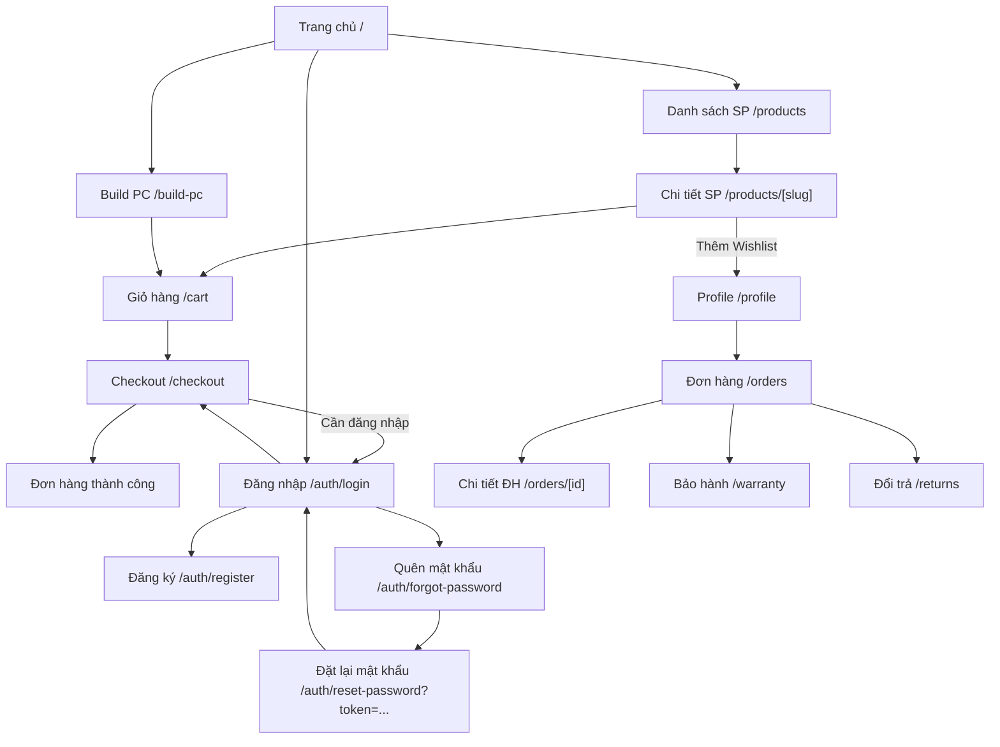

# TÀI LIỆU THIẾT KẾ UI/UX (UI/UX Design Specification)

**Dự án:** Hệ thống Website Thương mại Điện tử Phân phối Linh kiện Máy tính  
**Phiên bản:** 2.0  
**Ngày tạo:** 2026-03-25  
**Cập nhật:** 2026-03-25  
**Trạng thái:** Đã duyệt — Light Theme (An Phát PC Style)  
**Công cụ thiết kế:** Figma (tạo Wireframe chi tiết sau khi duyệt spec này)  

---

## Lịch sử thay đổi tài liệu

| Phiên bản | Ngày | Tác giả | Mô tả thay đổi |
|:----------|:-----|:--------|:----------------|
| 1.0 | 2026-03-25 | — | Tạo mới tài liệu |
| 2.0 | 2026-03-25 | — | Chuyển sang Light Theme, loại bỏ Dark mode, thiết kế theo phong cách An Phát PC |

---

## Mục lục

1. [Nguyên tắc thiết kế](#1-nguyên-tắc-thiết-kế)
2. [Design System](#2-design-system)
3. [Layout & Navigation](#3-layout--navigation)
4. [Wireframes mô tả — Customer](#4-wireframes-mô-tả--customer)
5. [Wireframes mô tả — Admin/CMS](#5-wireframes-mô-tả--admincms)
6. [Responsive Design](#6-responsive-design)
7. [Trạng thái & Loading Patterns](#7-trạng-thái--loading-patterns)
8. [Accessibility](#8-accessibility)
9. [Component States](#9-component-states)
10. [Planned Deliverables & Artifact Roadmap](#10-planned-deliverables--artifact-roadmap)

---

## 1. Nguyên tắc thiết kế (Design Principles)

### 1.1. Triết lý thiết kế

> **Phong cách tổng thể:** Lấy cảm hứng từ An Phát PC — NỀN SÁNG (trắng/xám nhạt), header xanh đậm, giá sale đỏ, typography đậm rõ ràng. **KHÔNG HỖ TRỢ DARK MODE.**

| # | Nguyên tắc | Mô tả |
|:--|:-----------|:------|
| DP-01 | **Sáng & Chuyên nghiệp** | Nền trắng sạch, header xanh đậm nổi bật, giá đỏ bắt mắt. Phong cách web bán linh kiện quen thuộc tại Việt Nam. |
| DP-02 | **Consistency** | Đồng nhất style, spacing, typography, color trên toàn bộ ứng dụng. |
| DP-03 | **Performance First** | Skeleton loading, lazy load images, pagination thay vì infinite scroll (dễ quản lý kho lớn). |
| DP-04 | **Mobile Responsive** | Thiết kế mobile-first, breakpoints rõ ràng. |
| DP-05 | **Accessibility** | WCAG 2.1 AA — contrast đủ, keyboard navigation, alt text. |
| DP-06 | **Trust & Credibility** | Giá rõ ràng (giá gốc gạch ngang, giá sale đỏ đậm), BH rõ ràng (số tháng), hotline nổi bật, badge "còn hàng" xanh lá. |
| DP-07 | **Tươi sáng & Tràn đầy năng lượng** | Dùng màu sắc tươi (đỏ, xanh, cam, vàng) cho banner/CTA. Tránh giao diện nhạt nhẽo. Hero banner, sale banner luôn có hình ảnh sản phẩm thực tế. |

### 1.2. User Personas tham chiếu

| Persona | Mục tiêu chính | Pain Points |
|:--------|:---------------|:------------|
| **Khách hàng cá nhân** (18-35) | Mua linh kiện đúng, giá tốt, BH rõ ràng | Sợ mua nhầm linh kiện không tương thích |
| **Game thủ** (16-30) | Build PC Gaming, so sánh cấu hình | Muốn tool Build PC nhanh, trực quan |
| **Khách doanh nghiệp** *(Giai đoạn 2 — ngoài scope MVP)* | Mua số lượng lớn, xuất hóa đơn | Cần báo giá PDF, liên hệ nhanh |
| **Admin/Sales** | Quản lý đơn hàng, kho hàng | Cần dashboard rõ ràng, thao tác nhanh |

> **Ghi chú B2B:** Persona "Khách doanh nghiệp" được liệt kê để định hướng dài hạn. Giai đoạn MVP chưa có flow B2B riêng (company account, VAT invoice, bulk cart). Tính năng xuất báo giá PDF đã có sẵn trong Build PC (public, không cần đăng nhập).

---

## 2. Design System

### 2.1. Color Palette

> **CHỈ HỖ TRỢ LIGHT MODE.** Không có Dark mode toggle.

#### Màu chủ đạo

| Token | Hex | Tailwind | Mục đích sử dụng |
|:------|:----|:---------|:-----------------|
| `--header-bg` | `#1A4B9C` | `bg-[#1A4B9C]` | Header chính, nền navigation bar |
| `--header-top` | `#0D2B5E` | `bg-[#0D2B5E]` | Thanh thông tin trên cùng (hotline, showroom) |
| `--primary` | `#2563EB` (Blue 600) | `bg-blue-600` | CTA phụ, link, active state |
| `--primary-hover` | `#1D4ED8` (Blue 700) | `bg-blue-700` | Hover state |

#### Màu accent (Sale, CTA)

| Token | Hex | Tailwind | Mục đích sử dụng |
|:------|:----|:---------|:-----------------|
| `--sale-price` | `#E31837` | `text-[#E31837]` | **Giá bán** (luôn dùng màu đỏ đậm cho giá) |
| `--sale-badge` | `#EF4444` (Red 500) | `bg-red-500` | Badge giảm giá (-13%), flash sale |
| `--cta-buy` | `#E31837` | `bg-[#E31837]` | Button "ĐẶT MUA NGAY", "Mua ngay" |
| `--cta-cart` | `#2563EB` | `bg-blue-600` | Button "CHO VÀO GIỎ" |
| `--highlight` | `#FBBF24` (Amber 400) | `bg-amber-400` | Banner highlight, flash sale accent |

#### Màu nền & Text

| Token | Hex | Tailwind | Mục đích sử dụng |
|:------|:----|:---------|:-----------------|
| `--background` | `#FFFFFF` | `bg-white` | Nền chính trang |
| `--background-alt` | `#F3F4F6` (Gray 100) | `bg-gray-100` | Nền phụ (section, page background) |
| `--card` | `#FFFFFF` | `bg-white` | Nền card sản phẩm |
| `--text-primary` | `#111827` (Gray 900) | `text-gray-900` | Text chính |
| `--text-secondary` | `#6B7280` (Gray 500) | `text-gray-500` | Text phụ, caption |
| `--text-muted` | `#9CA3AF` (Gray 400) | `text-gray-400` | Text rất nhạt (giá gốc gạch ngang) |

#### Màu trạng thái

| Token | Hex | Tailwind | Mục đích sử dụng |
|:------|:----|:---------|:-----------------|
| `--success` | `#22C55E` (Green 500) | `bg-green-500` | Còn hàng, thành công |
| `--warning` | `#F59E0B` (Amber 500) | `bg-amber-500` | Cảnh báo, sắp hết hàng |
| `--destructive` | `#EF4444` (Red 500) | `bg-red-500` | Lỗi, xóa, hết hàng |
| `--border` | `#E5E7EB` (Gray 200) | `border-gray-200` | Border, divider |
| `--border-strong` | `#D1D5DB` (Gray 300) | `border-gray-300` | Border nổi bật hơn |

#### Footer

| Token | Hex | Tailwind | Mục đích sử dụng |
|:------|:----|:---------|:-----------------|
| `--footer-bg` | `#1E293B` (Slate 800) | `bg-slate-800` | Nền footer xanh đậm tối |
| `--footer-text` | `#E2E8F0` (Slate 200) | `text-slate-200` | Text footer |

### 2.2. Typography

| Token | Font | Size | Weight | Use case |
|:------|:-----|:-----|:-------|:---------|
| `h1` | Inter | 30px / 1.875rem | 700 (Bold) | Tiêu đề trang |
| `h2` | Inter | 24px / 1.5rem | 600 (SemiBold) | Tiêu đề section |
| `h3` | Inter | 20px / 1.25rem | 600 | Tiêu đề card, sub-section |
| `body` | Inter | 16px / 1rem | 400 (Regular) | Nội dung chính |
| `body-sm` | Inter | 14px / 0.875rem | 400 | Mô tả phụ, caption |
| `caption` | Inter | 12px / 0.75rem | 400 | Label, badge, hint |
| `price` | Inter | 20px / 1.25rem | 700 | Giá bán |
| `price-original` | Inter | 14px / 0.875rem | 400 + line-through | Giá gốc (khi giảm) |

> **Font loading:** Google Fonts — `Inter` qua `next/font/google` (tự host, không request external).

### 2.3. Spacing & Grid

| Token | Value | Sử dụng |
|:------|:------|:--------|
| `--space-xs` | 4px | Khoảng cách giữa icon-text |
| `--space-sm` | 8px | Padding nhỏ, gap grid |
| `--space-md` | 16px | Padding card, gap giữa items |
| `--space-lg` | 24px | Section spacing |
| `--space-xl` | 32px | Page section gap |
| `--space-2xl` | 48px | Header/Footer margin |
| `--radius-sm` | 6px | Input, small button |
| `--radius-md` | 8px | Card |
| `--radius-lg` | 12px | Modal, dialog |
| **Grid** | 12 columns | Container max-width: 1280px, gap: 16px |

### 2.4. Component Library (shadcn/ui)

Các component chính sử dụng từ shadcn/ui:

| Component | Biến thể | Sử dụng trong |
|:----------|:---------|:--------------|
| `Button` | default, destructive, outline, ghost, link | CTA, form submit, actions |
| `Input` | text, password, search | Form fields |
| `Select` | single, searchable | Filter, dropdown |
| `Card` | default | Product card, order card |
| `Dialog` | default | Confirm delete, preview ảnh |
| `Sheet` | side (right) | Mobile menu, cart sidebar |
| `Table` | default + pagination | Admin data tables |
| `Badge` | default, destructive, outline | Status tags, sale badge |
| `Avatar` | default | User avatar |
| `Skeleton` | default | Loading states |
| `Toast` | success, error, warning | Notification messages |
| `Tabs` | default | Product tabs (Mô tả, Thông số, Đánh giá) |
| `Breadcrumb` | default | Navigation hierarchy |
| `Pagination` | default | Product listing, order list |
| `DropdownMenu` | default | User menu, action menu |
| `Accordion` | default | FAQ, filter sidebar (mobile) |
| `Separator` | horizontal | Section divider |

### 2.5. Icons

Sử dụng **Lucide Icons** — consistent, lightweight, MIT license.

| Icon | Sử dụng |
|:-----|:--------|
| `ShoppingCart` | Giỏ hàng |
| `Heart` | Wishlist |
| `Search` | Tìm kiếm |
| `User` | Tài khoản |
| `Package` | Đơn hàng |
| `Monitor` | Build PC |
| `Star` | Đánh giá |
| `Shield` | Bảo hành |
| `RotateCcw` | Đổi trả |
| `Phone` | Hotline (header top bar) |
| `MapPin` | Showroom (header top bar) |
| `ChevronRight` | Breadcrumb, navigation |
| `Filter` | Mở panel bộ lọc |
| `Truck` | Vận chuyển |
| `CreditCard` | Thanh toán |
| `Cpu` | Logo / PC Parts brand icon |

---

## 3. Layout & Navigation

### 3.1. Customer Layout

```
┌─────────────────────────────────────────────────────────────┐
│  TOP BAR (bg: #0D2B5E, text: trắng nhỏ)                     │
│  📞 1900.XXXX  |  📍 Hệ thống Showroom  |  🎁 Khuyến mãi   │
├─────────────────────────────────────────────────────────────┤
│  HEADER CHÍNH (Sticky, bg: #1A4B9C, text: trắng)            │
│  ┌───────┐  ┌──────────────────────────┐  ┌──┐ ┌──┐ ┌──┐  │
│  │ LOGO  │  │  🔍 Tìm kiếm sản phẩm...│  │🖥│ │❤️│ │🛒│  │
│  │PC PARTS│  │  (nền trắng, viền xám)  │  │PC│ │  │ │3 │  │
│  └───────┘  └──────────────────────────┘  └──┘ └──┘ └──┘  │
│  ┌──────────────────────────────────────────────────────┐   │
│  │  NAV: Trang chủ | Sản phẩm ▼ | Build PC | Khuyến mãi│   │
│  │  (text trắng trên nền xanh, hover: vàng #FBBF24)    │   │
│  └──────────────────────────────────────────────────────┘   │
├─────────────────────────────────────────────────────────────┤
│                                                             │
│                 PAGE CONTENT (bg: #F3F4F6)                  │
│                   (Từng trang khác nhau)                     │
│                                                             │
├─────────────────────────────────────────────────────────────┤
│  FOOTER (bg: #1E293B, text: trắng/xám nhạt)                 │
│  ┌────────────┐  ┌────────────┐  ┌────────────┐            │
│  │ Về chúng tôi│  │ Hỗ trợ KH  │  │ Chính sách │            │
│  │ Liên hệ    │  │ FAQ        │  │ BH & Đổi trả│            │
│  │ Tuyển dụng │  │ CSKH       │  │ Thanh toán  │            │
│  └────────────┘  └────────────┘  └────────────┘            │
│  © 2026 PC Parts Store. Hotline: 1900.XXXX                  │
└─────────────────────────────────────────────────────────────┘
```

**Top Bar (thanh thông tin trên cùng):**
- Nền xanh rất đậm (`#0D2B5E`), text trắng nhỏ (12px)
- Hiển thị: Hotline, Hệ thống showroom, Link khuyến mãi

**Header chính (Sticky):**
- Nền xanh đậm (`#1A4B9C`), text trắng
- **Logo:** Icon Cpu + "PC Parts" — text trắng bold, link về trang chủ
- **Search bar:** Input nền trắng, viền xám, bo góc — giữa header. Autocomplete debounce 300ms, hiển thị gợi ý khi gõ ≥ 2 ký tự.
- **Build PC:** Button nổi bật (icon `Monitor`), link tới `/build-pc`.
- **Wishlist:** Icon `Heart` trắng + badge đỏ số lượng (chỉ khi đã đăng nhập).
- **Cart:** Icon `ShoppingCart` trắng + badge đỏ số lượng.
- **User:** Nút "Đăng nhập / Đăng ký" (nền trắng, text xanh). Sau khi login: `DropdownMenu` (nền trắng, text đen) — Profile, Đơn hàng, Bảo hành, Đăng xuất.

**Navigation bar (nằm trong header hoặc ngay dưới):**
- Links: "Trang chủ", "Sản phẩm ▼", "Build PC", "Khuyến mãi"
- Text trắng trên nền xanh, hover: chuyển sang vàng (#FBBF24)

### 3.2. Admin Layout

```
┌──────────┬──────────────────────────────────────────────────┐
│          │  TOP BAR                                          │
│          │  ┌──────────────────────────┐  ┌────┐ ┌────────┐│
│ SIDEBAR  │  │  🔍 Tìm kiếm...          │  │🔔  │ │ Admin ▼││
│          │  └──────────────────────────┘  └────┘ └────────┘│
│ ┌──────┐ ├──────────────────────────────────────────────────┤
│ │📊 Dashboard│                                               │
│ │📦 Sản phẩm │               MAIN CONTENT                   │
│ │📁 Danh mục │            (Bảng, form, thống kê)             │
│ │🏷️ Thương hiệu│                                             │
│ │🛒 Đơn hàng │                                               │
│ │📋 Kho hàng │                                               │
│ │🏭 NCC      │                                               │
│ │🎫 Mã giảm giá│                                             │
│ │🛡️ Bảo hành │                                               │
│ │↩️ Đổi trả  │                                               │
│ │👥 Tài khoản │                                               │
│ │📈 Thống kê │                                               │
│ └──────┘ │                                               │
└──────────┴──────────────────────────────────────────────────┘
```

**Sidebar:** Collapsible (thu gọn thành icon trên mobile/tablet). Active item highlight.

### 3.3. Navigation Flow



---

## 4. Wireframes mô tả — Customer

### 4.1. Trang chủ (`/`)

```
┌─────────────────────────────────────────────────────────────┐
│  [TOP BAR + HEADER xanh đậm]                                 │
├─────────────────────────────────────────────────────────────┤
│                                                             │
│  ┌──────────────────────────┬──────────────────────────┐    │
│  │  HERO BANNER / CAROUSEL  │  PROMO CARDS (2 nhỏ)     │    │
│  │  (chiếm 2/3 chiều rộng) │  ┌──────────────────┐    │    │
│  │  Hình sản phẩm thực tế  │  │ BUILD PC CAP      │    │    │
│  │  + Text promo + CTA đỏ  │  │ Giảm lên đến 30tr │    │    │
│  │  [MUA NGAY] (btn đỏ)    │  │ [img sản phẩm]    │    │    │
│  │                          │  └──────────────────┘    │    │
│  │                          │  ┌──────────────────┐    │    │
│  │                          │  │ LAPTOP Giảm Thêm  │    │    │
│  │                          │  │ 1 Triệu           │    │    │
│  │                          │  └──────────────────┘    │    │
│  └──────────────────────────┴──────────────────────────┘    │
│                                                             │
│  ── Danh mục nổi bật ──────────────────────── (bg: trắng)  │
│  ┌──────┐  ┌──────┐  ┌──────┐  ┌──────┐  ┌──────┐         │
│  │ CPU  │  │ Main │  │ RAM  │  │ GPU  │  │ SSD  │         │
│  │ 🔲   │  │ 🔲   │  │ 🔲   │  │ 🔲   │  │ 🔲   │         │
│  └──────┘  └──────┘  └──────┘  └──────┘  └──────┘         │
│                                                             │
│  ── BRAND LOGOS BAR ── (nền trắng, logo grayscale)          │
│  [intel] [AMD] [WesternDigital] [ASUS] [Lenovo] [LG]       │
│  [GIGABYTE] [msi] [DELL] [CORSAIR] [logitech] [TP-LINK]    │
│                                                             │
│  ── PROMO BANNERS ────────── (3 cards ngang, nhiều màu)    │
│  ┌─────────────┐ ┌─────────────┐ ┌─────────────┐           │
│  │ TBVP Giảm   │ │ MÀN HÌNH    │ │ GEAR Giảm   │           │
│  │    32%      │ │ Giảm 1 Triệu│ │    50%      │           │
│  │ (bg cam/đỏ) │ │ (bg xanh)   │ │ (bg tím)    │           │
│  └─────────────┘ └─────────────┘ └─────────────┘           │
│                                                             │
│  ── TOP SẢN PHẨM BÁN CHẠY ─────── (bg trắng, viền dưới)  │
│  Tabs: [BÁN CHẠY] [PC GAMING] [LAPTOP] [MÀN HÌNH GAMING]  │
│  ┌─────────┐ ┌─────────┐ ┌─────────┐ ┌─────────┐ ┌────────┐│
│  │  [IMG]  │ │  [IMG]  │ │  [IMG]  │ │  [IMG]  │ │ [IMG]  ││
│  │ SP Name │ │ SP Name │ │ SP Name │ │ SP Name │ │SP Name ││
│  │ ★★★★☆  │ │ ★★★★★  │ │ ★★★★☆  │ │ ★★★☆☆  │ │★★★★★  ││
│  │ Mã SP:  │ │ Mã SP:  │ │ Mã SP:  │ │ Mã SP:  │ │Mã SP:  ││
│  │7.990.000│ │         │ │4.990.000│ │         │ │        ││
│  │6.990.000│ │12.990.0 │ │3.490.000│ │8.990.000│ │43.990. ││
│  │ (đỏ đậm)│ │ (đỏ đậm)│ │ [-30%]  │ │(đỏ đậm) │ │(đỏ đậm)││
│  │☑ So sánh│ │☑ So sánh│ │☑ So sánh│ │☑ So sánh│ │☑Sosánh ││
│  │✓Còn hàng│ │✓Còn hàng│ │✓Còn hàng│ │✓Còn hàng│ │✓Còn hg ││
│  │ [🛒]    │ │ [🛒]    │ │ [🛒]    │ │ [🛒]    │ │ [🛒]   ││
│  └─────────┘ └─────────┘ └─────────┘ └─────────┘ └────────┘│
│                                                             │
│  ── LAPTOP - TABLET - MOBILE ───── (section riêng biệt)    │
│  Brand Tabs: [ASUS] [LENOVO] [HP] [MSI] [DELL] [ACER]      │
│  (Grid 6 cột product cards, tương tự trên)    [XEM TẤT CẢ »]│
│                                                             │
│  ── MÁY TÍNH ĐỒNG BỘ ──────────── (section riêng biệt)    │
│  (Grid product cards)                          [XEM TẤT CẢ »]│
│                                                             │
│  [FOOTER]                                                    │
└─────────────────────────────────────────────────────────────┘
```

**Chi tiết Product Card (Light theme):**
- Nền **trắng**, viền xám nhạt (`border-gray-200`), shadow nhẹ
- Ảnh chính (lazy load, aspect ratio 1:1, nền trắng)
- Badge `NEW` (xanh lá) hoặc `-X%` (đỏ) — góc trên phải
- Tên sản phẩm (text đen, max 2 dòng, ellipsis)
- Mã SP (caption, text xám)
- Rating (stars vàng + số review, text xám)
- **Giá gốc** (line-through, text xám nhạt) — nếu giảm giá
- **Giá bán** (bold, **MÀU ĐỎ ĐẬM `#E31837`**, cỡ to)
- Hover: shadow lớn hơn, nút "So sánh" + "Yêu thích ❤️" xuất hiện
- Nút icon giỏ hàng nhỏ (góc dưới phải), badge "Còn hàng" xanh lá

### 4.2. Danh sách sản phẩm (`/products?category=cpu`)

```
┌────────────────────────────────────────────────────────────┐
│  [HEADER]                                                   │
│  Breadcrumb: Trang chủ > Linh kiện > CPU                    │
├──────────────┬─────────────────────────────────────────────┤
│              │                                             │
│  BỘ LỌC     │  Sắp xếp: [Mới nhất ▼]    Hiển thị: 45 SP  │
│  (Sidebar)   │                                             │
│              │  ┌────────┐ ┌────────┐ ┌────────┐ ┌────────┐│
│ ☐ AMD       │  │ Card 1 │ │ Card 2 │ │ Card 3 │ │ Card 4 ││
│ ☐ Intel     │  └────────┘ └────────┘ └────────┘ └────────┘│
│              │  ┌────────┐ ┌────────┐ ┌────────┐ ┌────────┐│
│ Giá         │  │ Card 5 │ │ Card 6 │ │ Card 7 │ │ Card 8 ││
│ [1tr]—[10tr]│  └────────┘ └────────┘ └────────┘ └────────┘│
│              │                                             │
│ Socket      │  ◀ 1  2  3 ... 6 ▶                          │
│ ☐ LGA 1700  │                                             │
│ ☐ AM5       │                                             │
│              │                                             │
│ Tình trạng  │                                             │
│ ☐ Mới       │                                             │
│ ☐ Like New  │                                             │
│              │                                             │
│ Tình trạng kho│                                            │
│ ☐ Còn hàng  │                                             │
│              │                                             │
│ [Xóa lọc]   │                                             │
├──────────────┴─────────────────────────────────────────────┤
│  [FOOTER]                                                   │
└────────────────────────────────────────────────────────────┘
```

**Bộ lọc:**
- Brand (checkbox, dynamic theo danh mục)
- Khoảng giá (range slider hoặc input min-max)
- Attribute động (socket, bus RAM, dung lượng, ... — lấy từ Attribute bảng DB theo category)
- Tình trạng (NEW, BOX, TRAY, SECOND_HAND)
- Tồn kho (Còn hàng / Tất cả)
- **Mobile:** Bộ lọc thu vào `Sheet` (slide from left), mở bằng nút "Bộ lọc 🔍"

### 4.3. Chi tiết sản phẩm (`/products/[slug]`)

```
┌────────────────────────────────────────────────────────────────────────┐
│  [TOP BAR + HEADER xanh đậm]                                          │
│  Breadcrumb: Trang chủ > CPU > Intel Core i5-13600K  (bg: trắng)      │
├──────────────────────────┬──────────────────────┬──────────────────────┤
│                          │                      │                      │
│   ┌──────────────────┐   │  TÊN SẢN PHẨM (h1)  │  MUA HÀNG ONLINE     │
│   │                  │   │  (text đen, bold)    │  TOÀN QUỐC            │
│   │  PRODUCT IMAGE   │   │  Mã SP: CPU-I5...    │  (Hotline: 1900.xxx) │
│   │  (bg trắng,      │   │  ★★★★☆ 23 đánh giá  │  ───────────────      │
│   │   viền xám nhạt) │   │  Lượt xem: 2.188    │  HIỆN ĐANG CÓ        │
│   │                  │   │                      │  TẠI SHOWROOM:        │
│   └──────────────────┘   │  • Công suất: 750W   │  📍 49 Thái Hà, HN   │
│   [thumb] [thumb] [thumb]│  • Form: ATX 12V...  │  📞 0918.557.006      │
│                          │  • PFC: Active       │  📍 63 Trần Thái T.   │
│   Tabs: [Hình SP] [TSKT]│                      │  📞 0862.136.488      │
│                          │  Xem thêm >          │                      │
│                          │                      │  ── TRỢ GIÚP ──       │
│                          │  Giá niêm yết:       │  • Hướng dẫn mua     │
│                          │  7.990.000 đ         │  • Chính sách BH     │
│                          │  (text xám, gạch)    │  • Chính sách đổi trả│
│                          │                      │                      │
│                          │  Giá khuyến mãi:     │                      │
│                          │  6.990.000 đ         │                      │
│                          │  (ĐỎ ĐẬM, BOLD, TO) │                      │
│                          │  (đã bao gồm VAT)   │                      │
│                          │                      │                      │
│                          │  Bảo hành: 36 tháng  │                      │
│                          │                      │                      │
│                          │  ┌────────────────┐  │                      │
│                          │  │  ĐẶT MUA NGAY  │  │                      │
│                          │  │  (btn ĐỎ, lớn) │  │                      │
│                          │  └────────────────┘  │                      │
│                          │  ┌───────┐┌────────┐ │                      │
│                          │  │MUA TRẢ││CHO VÀO │ │                      │
│                          │  │  GÓP  ││  GIỎ   │ │                      │
│                          │  │(viền) ││(xanh)  │ │                      │
│                          │  └───────┘└────────┘ │                      │
├──────────────────────────┴──────────────────────┴──────────────────────┤
│                                                                        │
│  Tab Thông số:  (nền trắng, zebra stripes xám/trắng)                  │
│  ┌──────────────────┬─────────────────┐                                │
│  │ Socket           │ LGA 1700        │  (bg trắng)                    │
│  │ Cores            │ 14 (6P + 8E)    │  (bg xám nhạt)                 │
│  │ Base Clock       │ 3.5 GHz         │  (bg trắng)                    │
│  │ Boost Clock      │ 5.1 GHz         │  (bg xám nhạt)                 │
│  │ TDP              │ 125W            │  (bg trắng)                    │
│  │ Cache            │ 24MB L3         │  (bg xám nhạt)                 │
│  └──────────────────┴─────────────────┘                                │
│                                                                        │
│  Tab Đánh giá:  (nền trắng)                                           │
│  ┌─────────────────────────────────────────────┐                       │
│  │ ★★★★★  Nguyễn Văn A  — 2026-03-20          │                       │
│  │ Sản phẩm chất lượng, đóng gói cẩn thận.    │                       │
│  └─────────────────────────────────────────────┘                       │
│                                                                        │
│  ── Sản phẩm liên quan ────────────────────────                        │
│  (Grid 4-5 Product Cards, nền trắng)                                   │
│  [FOOTER]                                                              │
└────────────────────────────────────────────────────────────────────────┘
```

**Bố cục 3 cột (desktop):**
- **Cột trái (40%):** Image gallery, thumbnail tabs
- **Cột giữa (35%):** Thông tin SP, giá, buttons CTA
- **Cột phải (25%):** Sidebar: hotline, showroom, trợ giúp

**Nền trang:** `bg-gray-100` (xám rất nhạt)  
**Card sản phẩm:** `bg-white` với shadow nhẹ  
**Layout giá:**
- Giá gốc: text xám, gạch ngang, cỡ nhỏ
- Giá sale: **text đỏ đậm (#E31837)**, bold, cỡ lớn (24px+)
- Button "ĐẶT MUA NGAY": full width, **nền đỏ (#E31837)**, text trắng, cỡ to
- Button "MUA TRẢ GÓP": viền xám, half width
- Button "CHO VÀO GIỎ": **nền xanh (blue-600)**, text trắng, half width

### 4.4. Build PC (`/build-pc`)

> **Tham chiếu:** `anphatpc.com.vn/buildpc` — Danh sách slot đánh số, nút xanh "+ Chọn", thanh đỏ chi phí dự tính, 6 nút hành động.

```
┌────────────────────────────────────────────────────────────┐
│  [TOP BAR + HEADER xanh đậm]                                │
│  Breadcrumb: Trang chủ > Build PC     (bg: trắng)           │
├────────────────────────────────────────────────────────────┤
│                                                            │
│  "Vui lòng chọn linh kiện bạn cần để xây dựng             │
│   cấu hình máy tính riêng cho bạn"                         │
│                                                            │
│  ┌──────────────────────────────────────────────────────┐  │
│  │  Chi phí dự tính                          0 VNĐ     │  │
│  │  (nền ĐỎ, text trắng, full width, sticky khi cuộn)  │  │
│  └──────────────────────────────────────────────────────┘  │
│                                                            │
│  ┌──────────────────────┬──────────────────────────────┐   │
│  │ 1. BỘ VI XỬ LÝ      │ [+ Chọn Bộ vi xử lý]  (xanh)│   │
│  ├──────────────────────┼──────────────────────────────┤   │
│  │ 2. BO MẠCH CHỦ      │ [+ Chọn Bo mạch chủ]  (xanh)│   │
│  ├──────────────────────┼──────────────────────────────┤   │
│  │ 3. RAM               │ [+ Chọn RAM]          (xanh)│   │
│  ├──────────────────────┼──────────────────────────────┤   │
│  │ 4. SSD 1             │ [+ Chọn SSD 1]        (xanh)│   │
│  ├──────────────────────┼──────────────────────────────┤   │
│  │ 5. SSD 2             │ [+ Chọn SSD 2]        (xanh)│   │
│  ├──────────────────────┼──────────────────────────────┤   │
│  │ 6. HDD               │ [+ Chọn HDD]          (xanh)│   │
│  ├──────────────────────┼──────────────────────────────┤   │
│  │ 7. VGA               │ [+ Chọn VGA]          (xanh)│   │
│  ├──────────────────────┼──────────────────────────────┤   │
│  │ 8. NGUỒN             │ [+ Chọn Nguồn]        (xanh)│   │
│  ├──────────────────────┼──────────────────────────────┤   │
│  │ 9. VỎ CASE           │ [+ Chọn Vỏ Case]      (xanh)│   │
│  ├──────────────────────┼──────────────────────────────┤   │
│  │ 10. TẢN NHIỆT KHÍ   │ [+ Chọn Tản nhiệt khí](xanh)│   │
│  ├──────────────────────┼──────────────────────────────┤   │
│  │ 11. TẢN NHIỆT NƯỚC  │ [+ Chọn Tản nhiệt nước](xanh)│  │
│  ├──────────────────────┼──────────────────────────────┤   │
│  │ 12. QUẠT TẢN NHIỆT  │ [+ Chọn Quạt]         (xanh)│   │
│  ├──────────────────────┼──────────────────────────────┤   │
│  │ ... (thêm slots)     │                              │   │
│  └──────────────────────┴──────────────────────────────┘   │
│                                                            │
│  ┌──────────────────────────────────────────────────────┐  │
│  │  Chi phí dự tính                          0 VNĐ     │  │
│  │  (nền ĐỎ, text trắng — lặp lại ở cuối bảng)        │  │
│  └──────────────────────────────────────────────────────┘  │
│                                                            │
│  ── ACTION BUTTONS (6 nút ngang hàng) ──────────────────── │
│  ┌──────────┐┌──────────┐┌──────────┐┌──────────┐┌───────┐│
│  │LƯU CẤU  ││TẢI ẢNH   ││CHIA SẺ   ││TẢI EXCEL ││XEM &  ││
│  │HÌNH 💾   ││CẤU HÌNH 📸││CẤU HÌNH ➡││CẤU HÌNH 📊││IN 🖨️  ││
│  │(xanh)    ││(xanh)    ││(xanh)    ││(xanh)    ││(xanh) ││
│  └──────────┘└──────────┘└──────────┘└──────────┘└───────┘│
│  ┌────────────────────────────────────────────────────────┐│
│  │         THÊM VÀO GIỎ HÀNG 🛒                          ││
│  │         (nút lớn, nền trắng, viền xám, full width)    ││
│  └────────────────────────────────────────────────────────┘│
│                                                            │
│  ── Kết quả AI kiểm tra tương thích (nếu có) ──────────── │
│  ┌────────────────────────────────────────────────────┐    │
│  │ ✅ Cấu hình tương thích!                            │    │
│  │ CPU LGA 1700 phù hợp với mainboard Z790.           │    │
│  │ ⚠️ Gợi ý: Thêm tản nhiệt CPU (TDP 125W)           │    │
│  │     → Noctua NH-D15 (2.490.000đ) [+ Thêm]         │    │
│  └────────────────────────────────────────────────────┘    │
│                                                            │
│  [FOOTER]                                                  │
└────────────────────────────────────────────────────────────┘
```

**Khi đã chọn linh kiện cho 1 slot:** Hiển thị tên SP, giá, nút [✕ Xóa] trong hàng đó.  
**Click "+ Chọn"** → mở `Dialog` hoặc `Sheet` với danh sách SP của slot đó, có filter (thương hiệu, giá) và tìm kiếm. Chọn xong → đóng dialog, cập nhật bảng.  
**Cost bar đỏ:** Sticky ở trên khi cuộn, luôn hiển thị tổng chi phí dự tính.

### 4.5. Giỏ hàng (`/cart`)

> **Tham chiếu:** `anphatpc.com.vn/cart` — Danh sách SP + khuyến mãi + BH tùy chọn + mã giảm giá + tổng tiền đỏ + 2 nút hành động.

```
┌────────────────────────────────────────────────────────────────────┐
│  [TOP BAR + HEADER xanh đậm]                                       │
├────────────────────────────────────────────────────────────────────┤
│                                                                    │
│  ── DANH SÁCH SẢN PHẨM ───────────────────────────────────────── │
│  ┌─────┬──────────────────────────────────────┬──────┬─────────┐  │
│  │[IMG]│ Màn hình Gaming 4K IPS 27 inch...    │      │         │  │
│  │     │ Mã sản phẩm: MOSS0148                │      │7.189.000│  │
│  │ [🗑]│ Bảo hành: 24 tháng                   │[- 1 +]│Tổng:    │  │
│  │     │                                      │      │7.189.000│  │
│  │     │                                      │      │(đỏ đậm) │  │
│  │     │ ── Khuyến mãi ──────────────────     │      │         │  │
│  │     │ • Ưu đãi giảm 200K mua kèm Win      │      │         │  │
│  │     │ • Ưu đãi giảm 1tr mua máy in         │      │         │  │
│  │     │                                      │      │         │  │
│  │     │ ── Dịch vụ bảo hành (tùy chọn) ──   │      │         │  │
│  │     │ ☐ Thêm 2 năm BH (+679.000đ)         │      │         │  │
│  │     │ ☐ Thêm 1 năm BH (+539.000đ)         │      │         │  │
│  └─────┴──────────────────────────────────────┴──────┴─────────┘  │
│                                                                    │
│  ── MÃ GIẢM GIÁ / QUÀ TẶNG ─── (bên trái)                       │
│  ┌────────────────────┐ ┌──────────┐                              │
│  │ Nhập mã giảm giá   │ │ Áp dụng  │ (btn xanh)                  │
│  └────────────────────┘ └──────────┘                              │
│                                                                    │
│  ── TỔNG KẾT ──────────────── (bên phải, căn phải)                │
│                                    Phí vận chuyển:        0 đ     │
│                                    Phí thu hộ:            0 đ     │
│                                    Tổng cộng:    20.579.000 đ     │
│                                    Giảm giá:              0 đ     │
│                                    Thanh toán:   20.579.000 đ     │
│                                    (ĐỎ ĐẬM, BOLD)                │
│                                    (Giá chưa bao gồm phí VC      │
│                                     chuyển ngoại tỉnh)            │
│                                                                    │
│                         [📄 In báo giá]  [📊 Tải file excel]       │
│                                                                    │
│  ┌─────────────────────────────┐ ┌─────────────────────────────┐  │
│  │        ĐẶT HÀNG            │ │       MUA TRẢ GÓP           │  │
│  │   (btn xanh đậm, lớn)      │ │   (btn ĐỎ/CAM, lớn)        │  │
│  └─────────────────────────────┘ └─────────────────────────────┘  │
│                                                                    │
│  [FOOTER]                                                          │
└────────────────────────────────────────────────────────────────────┘
```

**Đặc điểm Cart (theo An Phát PC):**
- Mỗi SP hiển thị: ảnh, tên, mã SP, thời gian BH, khuyến mãi đi kèm, dịch vụ BH tùy chọn (checkbox)
- Quantity control `[- 1 +]` bên phải
- Giá từng SP và tổng từng SP bên phải (text đỏ đậm)
- Phần tổng kết căn phải: phí VC, phí thu hộ, tổng, giảm, thanh toán
- **Thanh toán** (text đỏ đậm lớn nhất)
- 2 nút lớn: "ĐẶT HÀNG" (xanh đậm) + "MUA TRẢ GÓP" (đỏ/cam)

### 4.6. Checkout (`/checkout`)

```
┌────────────────────────────────────────────────────────────┐
│  CHECKOUT                                                   │
├────────────────────────────────┬───────────────────────────┤
│                                │                           │
│  1️⃣ ĐỊA CHỈ GIAO HÀNG         │  TÓM TẮT ĐƠN HÀNG       │
│  ○ Nhà — Nguyễn Văn A          │                           │
│    123 Đường ABC, Q.1, HCM    │  Intel i5-13600K  x1      │
│  ○ Cơ quan — Nguyễn Văn A      │  6.990.000đ              │
│    456 Đường XYZ, Q.7, HCM    │  ASUS Z790-A      x1      │
│  [+ Thêm địa chỉ mới]         │  8.990.000đ              │
│                                │  G.Skill DDR5     x2      │
│  2️⃣ PHƯƠNG THỨC THANH TOÁN     │  4.980.000đ              │
│  ○ COD (Thanh toán khi nhận)   │                           │
│  ○ VNPay                       │  Tạm tính: 20.960.000   │
│  ○ MoMo                        │  Giảm giá:   -500.000   │
│  ○ Chuyển khoản ngân hàng      │  Ship:          30.000   │
│                                │  ────────────────────     │
│  3️⃣ GHI CHÚ                    │  TỔNG:    20.490.000đ    │
│  [Ghi chú cho người giao hàng] │                           │
│                                │  [✅ Đặt hàng]           │
├────────────────────────────────┴───────────────────────────┤
│  [FOOTER]                                                   │
└────────────────────────────────────────────────────────────┘
```

### 4.7. Quên / Thiết lập lại mật khẩu

#### 4.7.1. Quên mật khẩu (`/auth/forgot-password`)

```
┌────────────────────────────────────────────────────────────┐
│ [HEADER LIGHT]                                             │
├────────────────────────────────────────────────────────────┤
│                                                            │
│                    QUÊN MẬT KHẨU                           │
│         Nhập email để nhận liên kết đặt lại mật khẩu      │
│                                                            │
│  Email                                                     │
│  [ user@example.com____________________________ ]          │
│                                                            │
│  [ GỬI LIÊN KẾT ĐẶT LẠI ] (btn primary)                    │
│                                                            │
│  < Quay lại đăng nhập                                      │
│                                                            │
└────────────────────────────────────────────────────────────┘
```

**Form fields:**
- Email (required, validate định dạng email).

**API mapping:**
- Submit gọi `POST /auth/forgot-password`.
- Luôn hiển thị message trung tính: **"Nếu email tồn tại, liên kết đặt lại mật khẩu đã được gửi"**.

#### 4.7.2. Thiết lập lại mật khẩu (`/auth/reset-password?token=...`)

```
┌────────────────────────────────────────────────────────────┐
│ [HEADER LIGHT]                                             │
├────────────────────────────────────────────────────────────┤
│                                                            │
│                  THIẾT LẬP LẠI MẬT KHẨU                    │
│                                                            │
│  Mật khẩu mới                                              │
│  [ ******************** ] [👁]                             │
│                                                            │
│  Xác nhận mật khẩu mới                                     │
│  [ ******************** ] [👁]                             │
│                                                            │
│  Rule: >= 8 ký tự, gồm chữ hoa, chữ thường và số          │
│                                                            │
│  [ ĐẶT LẠI MẬT KHẨU ] (btn primary)                        │
│                                                            │
└────────────────────────────────────────────────────────────┘
```

**Form fields:**
- `newPassword` (required, kiểm tra độ mạnh).
- `confirmPassword` (required, phải khớp `newPassword`).

**API mapping:**
- Submit gọi `POST /auth/reset-password` với `{token, newPassword, confirmPassword}`.

#### 4.7.3. Message & State Rules (UC-CUS-15)

| Tình huống | Hiển thị UI |
|:-----------|:------------|
| Forgot password submit thành công hoặc email không tồn tại | Toast/inline success: "Nếu email tồn tại, liên kết đặt lại mật khẩu đã được gửi" |
| Token reset hết hạn/không hợp lệ | Inline error/banner: "Liên kết đã hết hạn. Vui lòng yêu cầu lại" + CTA "Gửi lại liên kết" |
| Confirm password không khớp | Inline error dưới field: "Mật khẩu xác nhận không khớp" |
| Mật khẩu yếu | Inline error: "Mật khẩu phải có ít nhất 8 ký tự, bao gồm chữ hoa, chữ thường và số" |
| Reset thành công | Success message: "Đặt lại mật khẩu thành công" + redirect về `/auth/login` |

**Loading states:**
- Trong lúc submit: disable button + spinner.
- Không cho submit lặp khi request đang pending.

#### 4.7.4. Responsive behavior

| Thành phần | Mobile (<640px) | Desktop (>=1024px) |
|:-----------|:----------------|:-------------------|
| Auth card | Full width, padding 16px | Max-width 480px, căn giữa |
| Inputs | 100% width | 100% width |
| CTA button | Full width | Full width |
| Error/success message | Inline, font size 14px | Inline, font size 14px |

---

## 5. Wireframes mô tả — Admin/CMS

### 5.1. Dashboard (`/admin`)

```
┌──────────┬─────────────────────────────────────────────────┐
│ SIDEBAR  │  Dashboard                                       │
│          │                                                  │
│          │  ┌─────────┐ ┌─────────┐ ┌─────────┐ ┌────────┐│
│          │  │ Doanh thu│ │ Đơn hàng│ │ Sản phẩm│ │ Khách  ││
│          │  │ hôm nay │ │ mới     │ │ hết hàng│ │ mới    ││
│          │  │ 45.6tr  │ │   12    │ │    3    │ │   28   ││
│          │  │ ↑ 12%   │ │ ↑ 5%   │ │ ⚠️      │ │ ↑ 8%  ││
│          │  └─────────┘ └─────────┘ └─────────┘ └────────┘│
│          │                                                  │
│          │  ┌────────────────────────────────┐              │
│          │  │  📊 Biểu đồ doanh thu 7 ngày   │              │
│          │  │  (Line Chart)                   │              │
│          │  └────────────────────────────────┘              │
│          │                                                  │
│          │  ┌────────────────────────────────┐              │
│          │  │  📋 Đơn hàng mới nhất           │              │
│          │  │  #1001 | Nguyễn Văn A | 6.99tr │              │
│          │  │  #1000 | Trần Thị B | 12.49tr  │              │
│          │  │  ...                [Xem tất cả]│              │
│          │  └────────────────────────────────┘              │
└──────────┴─────────────────────────────────────────────────┘
```

### 5.2. Quản lý sản phẩm (`/admin/products`)

```
┌──────────┬─────────────────────────────────────────────────┐
│ SIDEBAR  │  Quản lý sản phẩm                [+ Thêm SP]   │
│          │                                                  │
│          │  Tìm kiếm: [_______________]  Danh mục: [All ▼] │
│          │                                                  │
│          │  ┌────┬────────────┬──────┬────────┬──────┬────┐│
│          │  │ ☐ │ Sản phẩm   │ SKU  │ Giá bán│ Kho  │ ⋮  ││
│          │  ├────┼────────────┼──────┼────────┼──────┼────┤│
│          │  │ ☐ │ i5-13600K  │ CPU..│ 6.990k │  15  │ ⋮  ││
│          │  │ ☐ │ RTX 4070   │ GPU..│ 14.99k │   8  │ ⋮  ││
│          │  │ ☐ │ DDR5 32GB  │ RAM..│ 2.490k │  42  │ ⋮  ││
│          │  │ ☐ │ Z790-A     │ MB.. │ 8.990k │   0  │ ⚠️ ││
│          │  └────┴────────────┴──────┴────────┴──────┴────┘│
│          │                                                  │
│          │  ◀ 1  2  3 ... 12 ▶   Hiển thị 1-20 / 235      │
└──────────┴─────────────────────────────────────────────────┘
```

**Actions (⋮ dropdown):** Sửa, Xem chi tiết, Xóa (confirm dialog).

### 5.3. Quản lý đơn hàng (`/admin/orders`)

```
┌──────────┬─────────────────────────────────────────────────┐
│ SIDEBAR  │  Quản lý đơn hàng                               │
│          │                                                  │
│          │  Tabs: [Tất cả] [Chờ xử lý] [Đang giao] [Hoàn thành]│
│          │                                                  │
│          │  ┌─────┬──────────┬───────────┬────────┬───────┐│
│          │  │ #ID │ Khách hàng│ Tổng tiền │ TT    │ Ngày  ││
│          │  ├─────┼──────────┼───────────┼────────┼───────┤│
│          │  │1001 │ NVA      │ 20.97tr   │🟡 PEND│ 25/03 ││
│          │  │1000 │ TTB      │ 12.49tr   │🟢 COMP│ 24/03 ││
│          │  │ 999 │ LVC      │  8.99tr   │🔵 DELI│ 24/03 ││
│          │  │ 998 │ PHD      │ 35.96tr   │🔴 CANC│ 23/03 ││
│          │  └─────┴──────────┴───────────┴────────┴───────┘│
│          │                                                  │
│          │  Click row → Chi tiết đơn hàng (sheet/page)     │
│          │  → Cập nhật trạng thái, xem Payment, Shipping   │
└──────────┴─────────────────────────────────────────────────┘
```

**Mapping mã tắt trạng thái đơn hàng (UI ↔ Backend Enum):**

| Ký hiệu UI | Backend Enum | Màu Badge | Ý nghĩa |
|:----------|:-------------|:----------|:-------|
| 🟡 PEND | `PENDING` | Yellow | Chờ xử lý |
| 🔵 DELI | `DELIVERING` | Blue | Đang giao |
| 🟢 COMP | `COMPLETED` | Green | Hoàn thành |
| 🔴 CANC | `CANCELLED` | Red | Đã hủy |

> Wireframe dùng mã tắt do giới hạn không gian cột. Khi implement, dùng `Badge` component với text đầy đủ tiếng Việt ("Chờ xử lý", "Đang giao", ...) và mapping từ enum backend.

### 5.4. Quản lý banner / slider (`/admin/banners`)

```
┌──────────┬─────────────────────────────────────────────────┐
│ SIDEBAR  │  Banner / Slider                    [+ Thêm]    │
│          │                                                  │
│          │  Tìm kiếm: [_______________]  Trạng thái: [All] │
│          │                                                  │
│          │  ┌────┬────────────┬────────┬──────┬──────┬───┐│
│          │  │ ☰  │ Banner     │ TT     │ Thứ tự│ Hiệu lực│⋮ ││
│          │  ├────┼────────────┼────────┼──────┼──────┼───┤│
│          │  │ ☰  │ Sale GPU   │ Active │  1   │ 01-31│⋮ ││
│          │  │ ☰  │ Build PC   │ Active │  2   │ —    │⋮ ││
│          │  │ ☰  │ Back2School│ Inactive│ 3   │ 08-09│⋮ ││
│          │  └────┴────────────┴────────┴──────┴──────┴───┘│
│          │                                                  │
│          │  Kéo thả hàng để đổi thứ tự hiển thị trang chủ  │
└──────────┴─────────────────────────────────────────────────┘
```

**Form thêm/sửa:** tiêu đề, ảnh banner (JPG/PNG/WEBP, tối đa 5MB), URL liên kết, thứ tự hiển thị, ngày bắt đầu, ngày kết thúc, trạng thái Active/Inactive. Khi tạo mới, ảnh là bắt buộc. Khi sửa, ảnh mới là tùy chọn.

---

## 6. Responsive Design

### 6.1. Breakpoints

| Breakpoint | Tailwind | Chiều rộng | Mô tả |
|:-----------|:---------|:----------|:------|
| Mobile | `sm` | < 640px | 1 cột product, hamburger menu, filter trong Sheet |
| Tablet | `md` | 640-1023px | 2-3 cột product, sidebar collapsed |
| Desktop | `lg` | 1024-1279px | 3-4 cột product, sidebar mở |
| Large Desktop | `xl` | ≥ 1280px | Full layout, 4 cột product |

### 6.2. Responsive Behaviors

| Thành phần | Mobile | Desktop |
|:-----------|:-------|:-------|
| **Header Nav** | Hamburger menu (Sheet) | Inline navigation |
| **Search** | Icon → expand to fullscreen | Inline search bar |
| **Product Grid** | 1-2 cột | 3-4 cột |
| **Product Detail** | Image trên, info dưới (stack) | Image trái, info phải (side-by-side) |
| **Filter** | Sheet (slide from left) | Sidebar cố định bên trái |
| **Cart** | Full page | Sidebar preview + full page |
| **Auth Forms** | Single-column card, full-width button | Centered card (max 480px) |
| **Build PC** | Scroll vertical | Table layout |
| **Admin Sidebar** | Hidden (hamburger toggle) | Cố định bên trái (collapsible) |

---

## 7. Trạng thái & Loading Patterns

### 7.1. Skeleton Loading

Mọi data fetch (Server/Client) đều hiển thị **Skeleton** thay vì spinner:

| Thành phần | Skeleton Pattern |
|:-----------|:----------------|
| Product Card | Gray rectangle (image) + 3 gray lines (name, price, rating) |
| Product List | Grid of 8-12 Skeleton cards |
| Product Detail | Large image skeleton + text skeletons bên phải |
| Table (Admin) | 5 rows of horizontal bars |
| Dashboard Stats | 4 rectangular blocks |
| Cart | 3 rows with image + text skeletons |

### 7.2. Empty States

| Trang | Empty State |
|:------|:-----------|
| Giỏ hàng trống | Icon `ShoppingCart` + "Giỏ hàng trống" + [Mua sắm ngay] |
| Wishlist trống | Icon `Heart` + "Chưa có sản phẩm yêu thích" |
| Chưa có đơn hàng | Icon `Package` + "Chưa có đơn hàng nào" |
| Không tìm thấy SP | Icon `Search` + "Không tìm thấy sản phẩm" + gợi ý sửa filter |
| Chưa có đánh giá | "Chưa có đánh giá nào. Hãy là người đầu tiên!" |

### 7.3. Error States

| Tình huống | Hiển thị |
|:-----------|:---------|
| API Error (5xx) | Toast destructive: "Có lỗi xảy ra, vui lòng thử lại" |
| Validation Error (4xx) | Inline error dưới field (màu destructive) |
| Network Error | Banner trên cùng: "Mất kết nối mạng" + retry button |
| 404 Page | Illustration + "Trang không tồn tại" + [Về trang chủ] |

---

## 8. Accessibility

| Tiêu chí | Yêu cầu |
|:---------|:---------|
| Contrast Ratio | WCAG AA — tối thiểu 4.5:1 cho text, 3:1 cho large text |
| Keyboard Navigation | Tab order hợp lý, focus ring visible, Enter/Space để activate |
| Screen Reader | `aria-label` cho icon buttons; `alt` cho images; `role` cho custom components |
| Focus Management | Trap focus trong Dialog/Modal; restore focus khi đóng |
| Form Labels | Mọi input có `<label>` hoặc `aria-label`; error messages liên kết qua `aria-describedby` |
| Skip Navigation | Link "Skip to content" ẩn, hiện khi Tab |
| Motion | `prefers-reduced-motion` — tắt animation cho user nhạy cảm |

---

## 9. Component States (Acceptance Criteria — Light Theme)

Mọi component tương tác cần định nghĩa đủ các trạng thái sau:

| Component | Default | Hover | Focus | Active | Disabled | Loading | Error |
|:----------|:--------|:------|:------|:-------|:---------|:--------|:------|
| `Button` (CTA mua) | bg-[#E31837], text-white | bg-red-700 | ring-2 ring-red-500 | scale-95 | opacity-50, cursor-not-allowed | Spinner icon | — |
| `Button` (cart) | bg-blue-600, text-white | bg-blue-700 | ring-2 ring-blue-500 | scale-95 | opacity-50 | Spinner icon | — |
| `Button` (outline) | bg-white, border-gray-300, text-gray-700 | bg-gray-50 | ring-2 ring-blue-500 | bg-gray-100 | opacity-50 | Spinner icon | — |
| `Input` | bg-white, border-gray-300, text-gray-900 | — | ring-2 ring-blue-500, border-blue-500 | — | bg-gray-100, text-gray-400 | — | border-red-500, text-red-500 dưới field |
| `Card` (Product) | bg-white, shadow-sm, border-gray-200 | shadow-md, translate-y-[-2px] | ring-2 ring-blue-500 | — | — | Skeleton card (bg-gray-200) | — |
| `Badge` (sale) | bg-red-500, text-white | — | — | — | — | — | — |
| `Badge` (stock) | bg-green-500, text-white | — | — | — | — | — | — |
| `Toast` | bg-white, border-gray-200, shadow-lg | — | — | — | — | — | border-red-500, text-red-600 |
| `Table Row` | bg-white | bg-gray-50 | ring inset | bg-blue-50 | — | Skeleton rows (bg-gray-200) | — |
| **Giá bán** | text-[#E31837], font-bold, text-xl | — | — | — | — | — | — |
| **Giá gốc** | text-gray-400, line-through, text-sm | — | — | — | — | — | — |

> **Acceptance Criteria:** Mỗi state cần đo được qua Storybook visual regression test hoặc Figma inspect.

---

## 10. Planned Deliverables & Artifact Roadmap

Tài liệu này là **UI/UX Specification (Level 1)** — định nghĩa cấu trúc, Design System, wireframe mô tả. Các artifact bàn giao tiếp theo theo lộ trình:

| # | Artifact | Công cụ | Trạng thái | Ghi chú |
|:--|:---------|:--------|:-----------|:-------|
| 1 | ✅ UI/UX Specification | Markdown | Hoàn thành | Tài liệu hiện tại |
| 2 | ⏳ Figma Hi-Fi Mockup | Figma | Chưa bắt đầu | Wireframe clickable cho tất cả trang; bắt đầu sau khi spec được duyệt |
| 3 | ⏳ Interactive Prototype | Figma Prototype | Chưa bắt đầu | Flow test: đăng nhập → duyệt SP → giỏ hàng → checkout |
| 4 | ⏳ Storybook Component Library | Storybook | Chưa bắt đầu | Document tất cả states (Default/Hover/Focus/Disabled/Error/Loading) |
| 5 | ⏳ Usability Testing Plan | Google Docs | Chưa bắt đầu | 5-8 participants, task-based testing, SUS score benchmark |
| 6 | ⏳ Content & Microcopy Guidelines | Markdown | Chưa bắt đầu | Tone of voice, CTA wording, error message templates, localization (vi-VN) |

> **Quy trình bàn giao:** Spec (hiện tại) → Figma Mockup → Review với stakeholder → Prototype + Usability Test → Storybook (song song với Frontend dev) → Content Guidelines.

---

*Hết tài liệu — UI/UX Design Specification v1.0*
